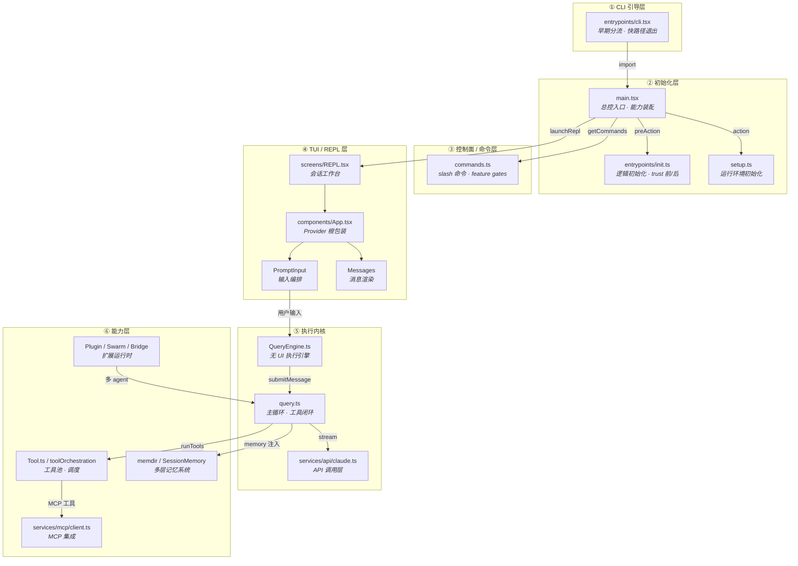

# 宏观：六层分层架构图（Mermaid）

## 层间职责

| 层 | 职责 | 关键特征 |
|----|------|----------|
| ① CLI 引导层 | 早期分流，快路径退出（`--version`、`--dump-system-prompt`） | 不加载 React/Ink/MCP，启动快 |
| ② 初始化层 | 逻辑初始化（`init.ts`）+ 运行环境初始化（`setup.ts`）+ 能力装配（`main.tsx`） | trust 前后分离，安全边界清晰 |
| ③ 控制面 / 命令层 | slash 命令注册、feature gates、内建/外部命令过滤 | 编译期 + 运行期双重开关 |
| ④ TUI / REPL 层 | 终端工作台：消息区 + 输入区 + 弹层 + 快捷键 | Ink/React 渲染，AppState 状态总线 |
| ⑤ 执行内核 | query 主循环：API 调用 → 工具执行 → 结果回流 → 循环 | 可被 SDK/Headless 形态复用 |
| ⑥ 能力层 | 工具池、记忆、MCP、插件、多 agent | 可扩展、可插拔、可独立开关 |
