# 中观：模块间文件依赖图（Mermaid）

```mermaid
graph LR
    %% ==========================================
    %% 启动组
    %% ==========================================
    subgraph Startup["🚀 启动组"]
        cli["entrypoints/cli.tsx"]
        main["main.tsx"]
        init["entrypoints/init.ts"]
        setup["setup.ts"]
        replLauncher["replLauncher.tsx"]
    end

    %% ==========================================
    %% 交互组
    %% ==========================================
    subgraph UI["🖥️ 交互组"]
        App["components/App.tsx"]
        REPL["screens/REPL.tsx"]
        PI["PromptInput/PromptInput.tsx"]
        MSG["components/Messages.tsx"]
        VML["VirtualMessageList.tsx"]
    end

    %% ==========================================
    %% 执行组
    %% ==========================================
    subgraph Exec["⚙️ 执行组"]
        QE["QueryEngine.ts"]
        query["query.ts"]
        claude["services/api/claude.ts"]
    end

    %% ==========================================
    %% 工具组
    %% ==========================================
    subgraph Tools["🔧 工具组"]
        Tool["Tool.ts"]
        toolOrch["services/tools/toolOrchestration.ts"]
        toolExec["services/tools/toolExecution.ts"]
    end

    %% ==========================================
    %% 记忆组
    %% ==========================================
    subgraph Memory["🧠 记忆组"]
        memdir["memdir/memdir.ts"]
        findRel["memdir/findRelevantMemories.ts"]
        sessMem["services/SessionMemory/sessionMemory.ts"]
        agentMem["tools/AgentTool/agentMemory.ts"]
    end

    %% ==========================================
    %% 扩展组
    %% ==========================================
    subgraph Ext["🔌 扩展组"]
        mcpClient["services/mcp/client.ts"]
        swarm["utils/swarm/backends/registry.ts"]
        plugins["plugins/bundled/index.ts"]
        skills["skills/bundled/index.ts"]
    end

    %% ==========================================
    %% 辅助模块
    %% ==========================================
    subgraph Helpers["📦 辅助"]
        cmds["commands.ts"]
        attachments["utils/attachments.ts"]
        sessionStorage["utils/sessionStorage.ts"]
        prompts["constants/prompts.ts"]
    end

    %% ==========================================
    %% 启动链调用边
    %% ==========================================
    cli -->|"import main"| main
    main -->|"preAction"| init
    main -->|"action"| setup
    main -->|"getCommands"| cmds
    main -->|"getMcpTools"| mcpClient
    main -->|"initBundledSkills"| skills
    main -->|"initBuiltinPlugins"| plugins
    main -->|"getAgentDefs"| agentMem
    main -->|"launchRepl"| replLauncher
    replLauncher -->|"动态加载"| App
    replLauncher -->|"动态加载"| REPL

    %% ==========================================
    %% 交互组调用边
    %% ==========================================
    App --> REPL
    REPL --> PI
    REPL --> MSG
    MSG --> VML
    PI -->|"用户输入提交"| QE

    %% ==========================================
    %% 执行组调用边
    %% ==========================================
    QE -->|"submitMessage"| query
    query -->|"queryModelWithStreaming"| claude
    query -->|"runTools"| toolOrch
    query -->|"getAttachmentMessages"| attachments
    query -->|"recordTranscript"| sessionStorage
    prompts -->|"loadMemoryPrompt"| memdir

    %% ==========================================
    %% 工具组调用边
    %% ==========================================
    toolOrch -->|"partitionToolCalls"| Tool
    toolOrch -->|"runToolUse"| toolExec
    toolExec -->|"findToolByName"| Tool
    toolExec -->|"tool.call"| Tool

    %% ==========================================
    %% 记忆组调用边
    %% ==========================================
    memdir -->|"findRelevantMemories"| findRel
    setup -->|"initSessionMemory"| sessMem
    agentMem -->|"buildMemoryPrompt"| memdir
    findRel -->|"prefetchMemories"| attachments

    %% ==========================================
    %% 扩展组调用边
    %% ==========================================
    mcpClient -->|"注册 MCP 工具"| Tool
    swarm -->|"spawnTeammate"| QE
```

## 核心枢纽文件

| 文件 | 入度 | 出度 | 角色 |
|------|------|------|------|
| `main.tsx` | 1 | 8+ | 总编排中心，连接所有层 |
| `query.ts` | 2 | 4 | 执行内核主循环 |
| `Tool.ts` | 4 | 0 | 工具接口定义，被多方依赖 |
| `memdir.ts` | 2 | 1 | 记忆系统底层存储 |
| `REPL.tsx` | 2 | 2 | TUI 工作台核心 |
