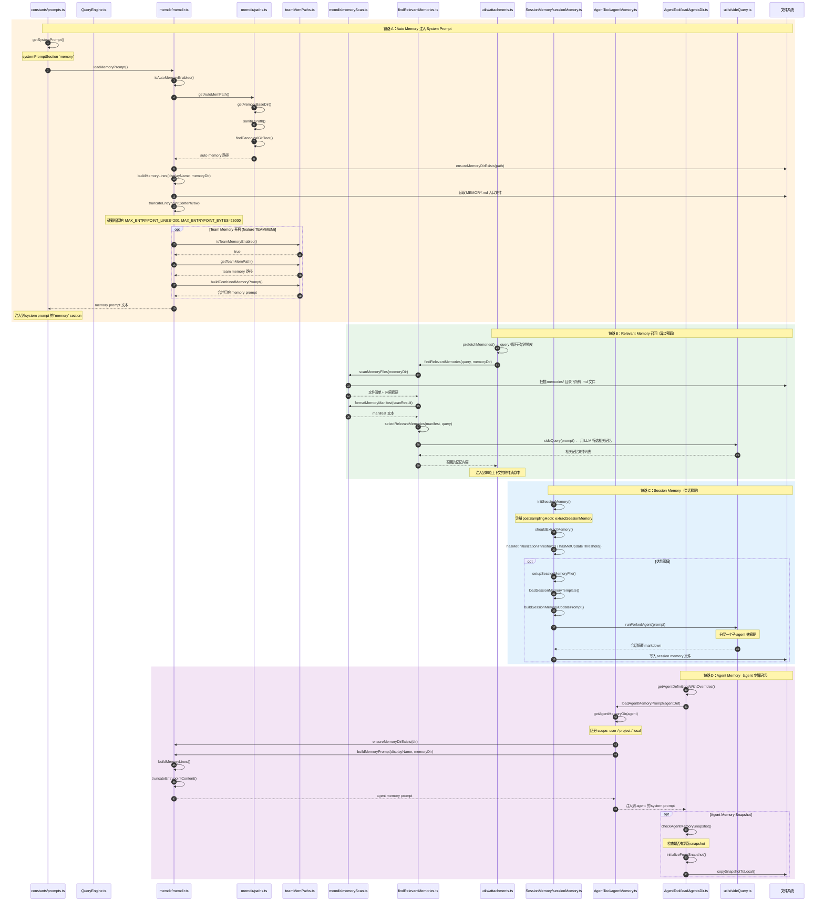

# 微观：Memory 注入链路时序图（Mermaid）

> 对应源码路径：`src/memdir/memdir.ts` / `src/memdir/findRelevantMemories.ts` / `src/services/SessionMemory/sessionMemory.ts` / `src/tools/AgentTool/agentMemory.ts`

## Memory 四层体系总结

| 层 | 存储位置 | 生命周期 | 注入方式 | 关键文件 |
|----|----------|----------|----------|----------|
| Auto Memory | `~/.claude/memory/` 或项目级 | 长期 | System Prompt section | `memdir.ts` |
| Relevant Memory | 同上 | 按轮召回 | 附件消息 | `findRelevantMemories.ts` |
| Session Memory | 会话目录 | 当前会话 | postSamplingHook | `sessionMemory.ts` |
| Agent Memory | agent 专属目录 | 按 agent scope | Agent System Prompt | `agentMemory.ts` |
| Team Memory | 团队同步目录 | 团队共享 | 合并到 Auto Memory prompt | `teamMemPaths.ts` |
