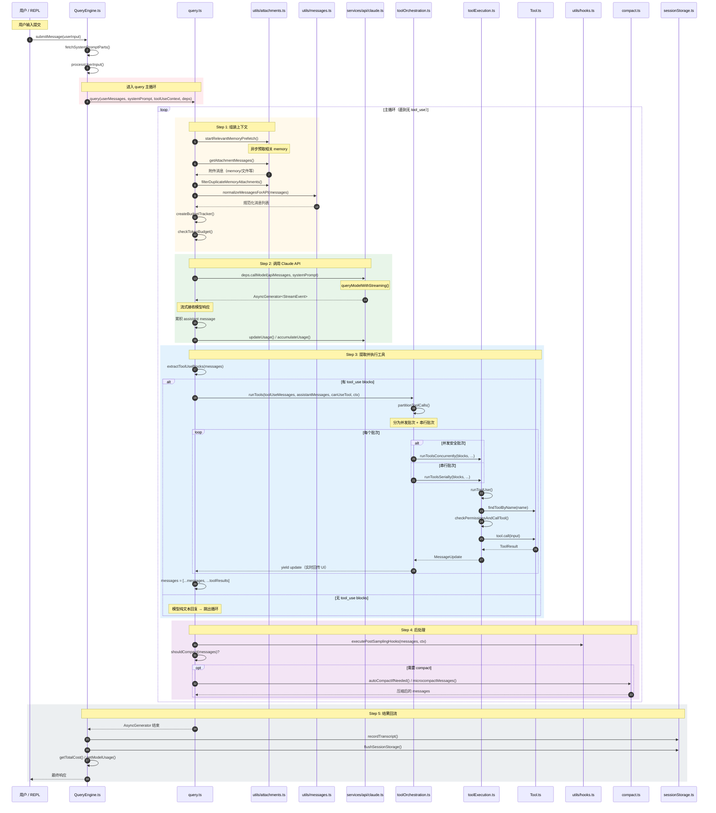

# 微观：Query 执行循环时序图（Mermaid）

> 对应源码路径：`src/QueryEngine.ts` → `src/query.ts` → `src/services/api/claude.ts` → `src/services/tools/toolOrchestration.ts`

## 循环终止条件

| 条件 | 说明 |
|------|------|
| 模型不输出 tool_use | 纯文本回复，自然结束 |
| Token 预算耗尽 | `checkTokenBudget()` 触发 |
| 用户中断 | `createUserInterruptionMessage()` |
| API 错误 | `createAssistantAPIErrorMessage()` |
| 最大轮次 | 循环保护上限 |
