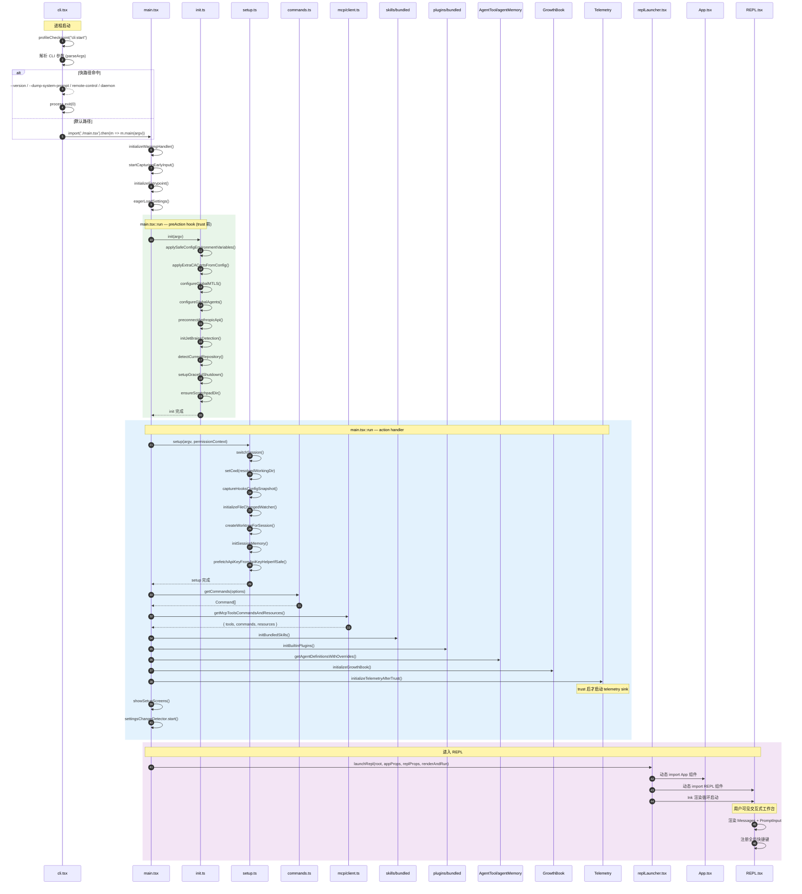

# 微观：启动链路时序图（Mermaid）

> 对应源码路径：`src/entrypoints/cli.tsx` → `src/main.tsx` → `src/entrypoints/init.ts` → `src/setup.ts` → `src/replLauncher.tsx`

## 关键设计点

| 阶段 | 设计意图 |
|------|----------|
| cli.tsx 快路径 | 简单命令不加载 React/Ink，启动速度快 |
| init.ts trust 前 | 只应用安全 env vars，防配置攻击 |
| setup.ts | 环境准备：CWD、hooks、memory、worktree |
| main.tsx 能力装配 | 集中装配 tools/mcp/skills/plugins/agents |
| initializeTelemetryAfterTrust | trust 建立后才启动 telemetry |
| launchRepl 动态加载 | App/REPL 组件延迟到最后一刻才 import |
