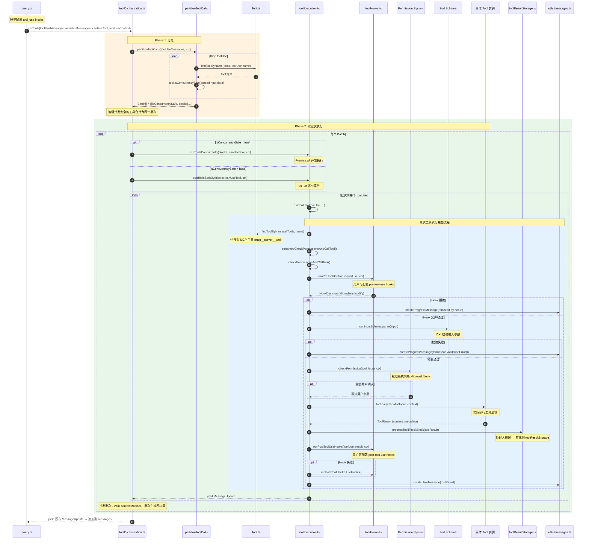

# 微观：Tool 执行链路时序图（Mermaid）

> 对应源码路径：`src/services/tools/toolOrchestration.ts` → `src/services/tools/toolExecution.ts` → `src/Tool.ts`



## Tool 接口关键字段

```typescript
interface Tool {
  name: string
  inputSchema: ZodSchema        // 输入参数校验
  isConcurrencySafe: (input) => boolean  // 是否可并发
  call: (input, context) => ToolResult   // 执行函数
  checkPermissions?: (input, ctx) => PermissionResult
  // ...
}
```

## 并发分组规则

| 情况 | 处理 |
|------|------|
| 连续多个 `isConcurrencySafe=true` | 合并为同一并发批次 |
| 中间出现 `isConcurrencySafe=false` | 断点，新开串行批次 |
| MCP 工具 | 默认 `isConcurrencySafe=true` |
