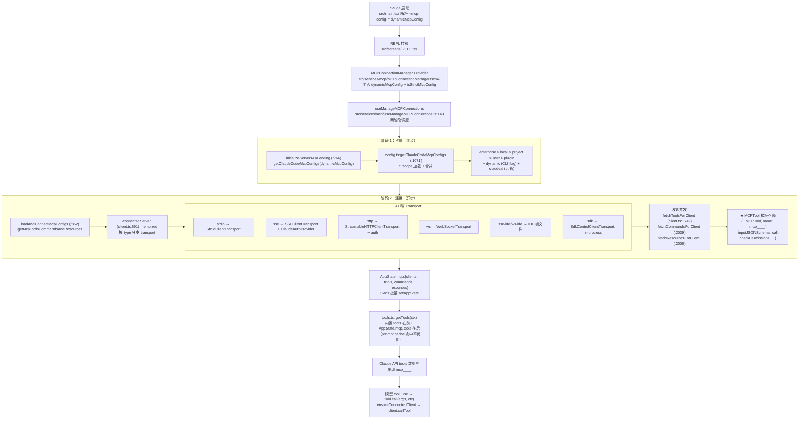
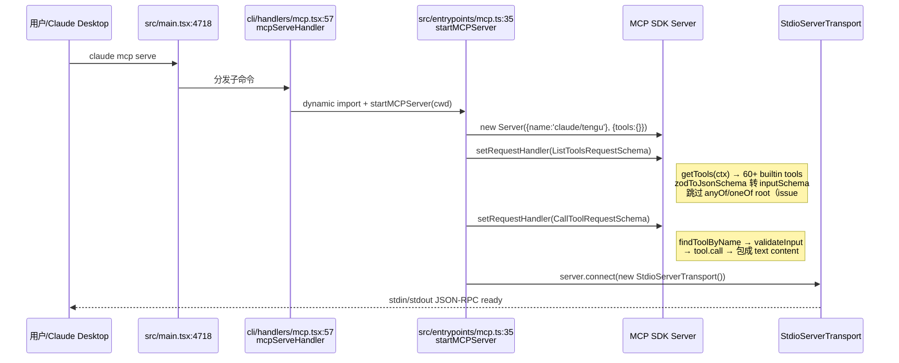

# MCP 协议知识总结

> 这是"总结学习"栏目的第六篇。目标：彻底理解 Claude Code 的 **MCP（Model Context Protocol）实现** —— 配置文件如何加载、连接是怎么建立的、MCP 工具如何被克隆成内置 Tool 接口并进入模型可见列表、OAuth/XAA 的认证流程，以及反向的"Claude Code 自己作为 MCP server"如何把 60+ 内置工具暴露给其他客户端。

---

## 一、MCP 协议全貌

### 双向能力：消费 + 暴露

Claude Code 既是 **MCP 客户端**（连接外部 server 拉工具）也是 **MCP 服务器**（`claude mcp serve` 把自己的 60+ 工具通过 stdio 协议暴露）。本篇覆盖两条链路。

### 正向链路：从配置到模型工具列表



### 反向链路：claude mcp serve（自我暴露）



---

## 二、必须掌握（核心 7 点）

### 1. 两层架构：协议层 vs 应用层

| 层 | 位置 | 职责 | 关键依赖 |
|---|---|---|---|
| **协议层** | `packages/mcp-client/` | 与宿主解耦的 MCP 协议客户端，不依赖 Claude Code 业务 | 通过 `McpClientDependencies` 接口（`interfaces.ts`）依赖注入 logger / auth / proxy / imageProcessor |
| **应用层** | `src/services/mcp/` | 应用侧封装，桥接协议层与 Claude Code 的 AppState / Tool 系统 / OAuth 存储 | 引入 `mcp-client`、`AppState`、`getTools`、`secureStorage` 等 |

**为什么分两层？** 协议层将来可以被其他产品（SDK / Agent）复用，因此严格不引入 Claude Code 特有依赖。**所有副作用（磁盘 IO、AppState 更新、OAuth 浏览器跳转）都在应用层。**

### 2. 连接是 memoized 的（`src/services/mcp/client.ts:591`）

`connectToServer(name, serverRef, stats)` 是 **memoized** 的。同一个 `(name, serverRef)` 重复调用直接返回缓存的连接，不会重连。这是为什么 React 重渲不会导致 MCP server 反复掉线重连。

按 `serverRef.type` 分支：
- `stdio` → `StdioClientTransport` + 注入 subprocessEnv
- `sse` → `SSEClientTransport` + `ClaudeAuthProvider`（OAuth）
- `http` → `StreamableHTTPClientTransport` + auth（推荐的现代 transport）
- `ws` → `WebSocketTransport`
- `sse-ide` / `ws-ide` → 通过 IDE 锁文件发现地址（VSCode 扩展专用）
- `sdk` → `SdkControlClientTransport` in-process 传输（Agent SDK 用）

**容错**：`installConnectionMonitor` 维护失败计数，`MAX_ERRORS_BEFORE_RECONNECT = 3`（`connection.ts:22`）触发重连；`DEFAULT_CONNECTION_TIMEOUT_MS = 30_000`（`connection.ts:16`）。

### 3. ★ MCPTool 模板克隆机制（`packages/builtin-tools/src/tools/MCPTool/MCPTool.ts`）

这是整篇最重要的概念。`MCPTool.ts` 仅 83 行，里面是一个**stub 模板**：

```ts
export const MCPTool = buildTool({
  name: 'mcp',                            // 占位
  description: '',                         // 空字符串
  prompt: '',                              // 空字符串
  call() { logError('not callable'); },    // 直接错误
  checkPermissions() {
    return { behavior: 'passthrough', message: 'MCPTool requires permission.' }
  },
  ...
})
```

**实际克隆点**：`src/services/mcp/client.ts:1749` `fetchToolsForClient` 中：

```ts
const tools = (await client.listTools()).tools.map(tool => ({
  ...MCPTool,                                          // 展开模板
  name: buildMcpToolName(serverName, tool.name),        // mcp__<server>__<tool>
  description: tool.description,                        // 来自服务器
  prompt: () => tool.description ?? '',
  inputJSONSchema: tool.inputSchema,                    // 来自服务器
  isReadOnly: tool.annotations?.readOnlyHint,
  isDestructive: tool.annotations?.destructiveHint,
  isOpenWorld: tool.annotations?.openWorldHint,
  call: (args, ctx) => callMCPToolWithUrlElicitationRetry(...),
  userFacingName: `${serverName} - ${tool.title} (MCP)`,
  mcpInfo: { serverName, capabilities, ... },
}))
```

**为什么 `checkPermissions` 返回 `passthrough`？** 因为 MCP 工具的权限不在工具自身定义。`passthrough` 告诉规则系统"我没意见，继续往下判断"——MCP 工具的最终权限由 `hasPermissionsToUseTool` 中的 settings 规则（如 `"mcp__github"` 匹配 `mcp__github__*`）决定，而非工具自己。

### 4. 5 scope 配置加载（`src/services/mcp/config.ts:1071`）

**配置来源 5 层**（按优先级合并，高优覆盖低优）：

```
enterprise  > local  > project  > user  > plugin
   ↑           ↑         ↑          ↑       ↑
managed     当前项目    .mcp.json  ~/.claude  各插件
MDM 强制    project    cwd 及父级  .json     manifest
```

| scope | 来源 | 解析位置 | 备注 |
|---|---|---|---|
| `enterprise` | `${managedFilePath}/managed-mcp.json` | `config.ts:996-1024` | 组织强制，最高优先级 |
| `local` | 当前项目 project-config 中 `mcpServers` 字段 | `config.ts:979-994` | 本地覆盖，未提交 git |
| `project` | `<cwd 及父目录>/.mcp.json` | `config.ts:909-961` | 沿目录树合并，深路径覆盖浅路径，**首次见到触发 trust dialog** |
| `user` | `~/.claude.json` 的 `mcpServers` 字段 | `config.ts:962-978` | 用户全局，无需 trust dialog |
| `plugin` | 各插件 manifest 中的 mcpServers | `getPluginMcpServers (:1115-1154)` | 配合 `dedupPluginMcpServers (:223)` |
| **dynamic** | CLI flag `--mcp-config` 或 SDK `setMcpServers` | 通过 `main.tsx` 注入 hook | 不属于 5 层，但参与合并 |
| **claudeai** | 远程拉取 | `claudeai.ts:fetchClaudeAIMcpConfigsIfEligible` | Claude.ai web 用户同步 |

**策略过滤**：`filterMcpServersByPolicy(:536)` 应用 `allowedMcpServers` / `deniedMcpServers` 策略；`dedupPluginMcpServers(:223)` 在 plugin 之间去重。

### 5. 工具发现：3 路并发（`client.ts:1749 / :2006 / :2039`）

连接建立后并发执行三种发现：

| 端点 | 应用层函数 | 注入位置 |
|---|---|---|
| `tools/list` | `fetchToolsForClient` | `AppState.mcp.tools` → 模型可见 |
| `prompts/list` | `fetchCommandsForClient` | `AppState.mcp.commands` → 斜杠命令 |
| `resources/list` | `fetchResourcesForClient` | `AppState.mcp.resources` → @ 引用 |

**工具名 namespace**：`buildMcpToolName(server, tool)` = `mcp__<server>__<tool>`（`packages/mcp-client/src/strings.ts`）。`getMcpPrefix(toolName)` 反向提取 server 名用于权限匹配。

### 6. OAuth 2.0/2.1 流程（`src/services/mcp/auth.ts`）

**`ClaudeAuthProvider`（`auth.ts:1376`）**实现 MCP SDK 的 `OAuthClientProvider` 接口。生命周期：

1. **探测**：连接 `sse` / `http` server 时，如果服务器响应 401 或 `.well-known/oauth-authorization-server` 元数据存在，进入 `needs-auth` 状态（`hasMcpDiscoveryButNoToken:349`）
2. **用户交互**：用户在 `/mcp` 菜单点 reconnect / authenticate → 触发 `performMCPOAuthFlow(:847)`
3. **PKCE 流程**：
   - `oauthPort.ts:findAvailablePort` 本地起 HTTP 服务接 `redirect_uri`
   - `openBrowser` 弹浏览器到授权页
   - 接到 callback → 用 code 换 token
4. **存储**：token 通过 `utils/secureStorage`（macOS Keychain / Linux libsecret / Windows DPAPI）持久化
5. **刷新**：`checkAndRefreshOAuthTokenIfNeeded` 在调用前自动续期
6. **Step-up 检测**：`wrapFetchWithStepUpDetection(:1354)` —— 收到 403 时触发 elicitation 让用户重新认证

**XAA（跨应用 token 交换，SEP-990）**：`xaa.ts` + `xaaIdpLogin.ts` —— 让 Claude Code 复用 Claude.ai 的登录态，避免重复授权（OAuth 2.0 Token Exchange RFC 8693）。

### 7. Elicitation：服务器反向回询用户（`elicitationHandler.ts`）

MCP 协议支持服务器在执行工具时反向向客户端要信息（如缺参数、需确认）。Claude Code 实现两种模式：

| 模式 | 用途 |
|---|---|
| **Form mode**（`elicitationHandler.ts:49`） | 服务器发 JSON Schema 让用户填表（如缺 ticket ID） |
| **URL mode** | 服务器发 URL 让用户打开外部页面（如 OAuth 二次授权） |

URL elicitation 还可触发"自动重试"：`callMCPToolWithUrlElicitationRetry(:2887)` 在用户完成 URL 操作后自动重试工具调用。

---

## 三、应该了解（次要 3 点）

### 1. KAIROS 频道权限（`channelPermissions.ts`）

允许用户通过 Telegram / iMessage 等 channel 远程批准权限请求：

- `PERMISSION_REPLY_RE = /^\s*(y|yes|n|no)\s+([a-km-z]{5})\s*$/i`（`:75`）—— 解析回复消息（`yes abcde` / `no abcde`，5 字母为请求 ID）
- `createChannelPermissionCallbacks(:209)` —— 将 channel 注入到权限决策树
- `isChannelPermissionRelayEnabled(:36)` —— feature gate
- `filterPermissionRelayClients(:177)` —— 仅特定 channel client 参与中继

### 2. In-Process Transport（`packages/mcp-client/src/transport/InProcessTransport.ts`）

`createLinkedTransportPair()` 创建一对内存中的双向 transport，无 IPC 开销。用途：

- **SDK 模式**：Agent SDK 把 MCP server 内嵌进进程，通过 in-process transport 调用，避免子进程
- `src/services/mcp/SdkControlTransport.ts` —— SDK control plane 的应用层封装

### 3. 工具发现缓存（`packages/mcp-client/src/discovery.ts:122`）

`createCachedToolDiscovery()` —— LRU 缓存（基于 `cache.ts:memoizeWithLRU`）。`tools/list` 结果在同 server 同会话内复用，避免重渲触发的发现风暴。

---

## 四、字段字典（用户视角配置 schema）

完整 schema 位于 `packages/mcp-client/src/types.ts`。下面按 transport 分类列字段。

### 通用字段（所有 transport 共有）

| 字段 | 类型 | 必填 | 说明 |
|---|---|---|---|
| `type` | `"stdio" \| "sse" \| "http" \| "ws" \| "sse-ide" \| "ws-ide" \| "sdk"` | 否（默认 stdio） | transport 类型 |

### `stdio` 类型（`McpStdioServerConfigSchema:45`）

| 字段 | 类型 | 必填 | 示例 / 说明 |
|---|---|---|---|
| `type` | `"stdio"` | 否 | 省略时也默认 stdio |
| `command` | `string` | **是** | 可执行命令路径，如 `"npx"` / `"node"` / `"/usr/bin/my-mcp"` |
| `args` | `string[]` | 否 | 命令行参数，如 `["-y", "@org/my-mcp"]` |
| `env` | `Record<string, string>` | 否 | 子进程环境变量，**支持 `${VAR}` 展开**（`envExpansion.ts`） |

### `sse` 类型（`McpSSEServerConfigSchema:65`）

| 字段 | 类型 | 必填 | 说明 |
|---|---|---|---|
| `type` | `"sse"` | **是** | 不可省略 |
| `url` | `string`（URL） | **是** | SSE 端点 |
| `headers` | `Record<string, string>` | 否 | 静态 HTTP 头 |
| `headersHelper` | `string` | 否 | 动态 headers 命令（输出 JSON 到 stdout），运行时合并到 headers |
| `oauth` | `object` | 否 | 见下方 oauth 字段表 |

### `http`（streamable HTTP）类型（`McpHTTPServerConfigSchema:88`）

| 字段 | 类型 | 必填 | 说明 |
|---|---|---|---|
| `type` | `"http"` | **是** | 推荐的现代 transport |
| `url` | `string` | **是** | MCP endpoint URL |
| `headers` | `Record<string, string>` | 否 | 静态 headers |
| `headersHelper` | `string` | 否 | 动态 headers 脚本路径 |
| `oauth` | `object` | 否 | 见下方 oauth 字段表 |

### `ws` 类型（`McpWebSocketServerConfigSchema:96`）

| 字段 | 类型 | 必填 |
|---|---|---|
| `type` | `"ws"` | **是** |
| `url` | `string`（`ws://` 或 `wss://`） | **是** |
| `headers` | `Record<string, string>` | 否 |
| `headersHelper` | `string` | 否 |

### `oauth` 子字段（sse / http 共用）

| 字段 | 类型 | 必填 | 说明 |
|---|---|---|---|
| `clientId` | `string` | 否 | 预注册的 OAuth client ID。若无，走 Dynamic Client Registration |
| `callbackPort` | `number` | 否 | 本地回调端口固定值。若无，`findAvailablePort` 动态选 |
| `authServerMetadataUrl` | `string` | 否 | 显式指定授权服务器元数据 URL（`.well-known/oauth-authorization-server`）。多数情况不需要 |
| `xaa` | `object` | 否 | XAA（跨应用 token 交换）配置 |

---

## 五、实例示例（完整可用）

### 5.1 stdio：`.mcp.json`（项目级，可提交 git）

```json
{
  "mcpServers": {
    "filesystem": {
      "type": "stdio",
      "command": "npx",
      "args": ["-y", "@modelcontextprotocol/server-filesystem", "/Users/me/projects"],
      "env": {
        "MCP_LOG_LEVEL": "info"
      }
    },
    "github": {
      "command": "npx",
      "args": ["-y", "@modelcontextprotocol/server-github"],
      "env": {
        "GITHUB_PERSONAL_ACCESS_TOKEN": "${GITHUB_TOKEN}"
      }
    }
  }
}
```

> 第二个 server `github` **省略了 `type`** —— 默认就是 stdio。`${GITHUB_TOKEN}` 在运行时从父进程环境变量展开。

### 5.2 sse + OAuth：`~/.claude.json` 中的 `mcpServers` 字段

```json
{
  "mcpServers": {
    "sentry": {
      "type": "sse",
      "url": "https://mcp.sentry.dev/mcp",
      "oauth": {
        "callbackPort": 33418
      }
    }
  }
}
```

> 不在 `.mcp.json`，而是嵌套在 `~/.claude.json` 内。字段格式相同，只是位置不同。**user scope 不需要 trust dialog**。

### 5.3 streamable_http + 静态 token：`.mcp.json`

```json
{
  "mcpServers": {
    "corridor": {
      "type": "http",
      "url": "https://app.corridor.dev/api/mcp",
      "headers": {
        "Authorization": "Bearer ${CORRIDOR_TOKEN}",
        "X-Workspace-Id": "team-42"
      }
    }
  }
}
```

### 5.4 dynamic headers 脚本

```json
{
  "mcpServers": {
    "internal-api": {
      "type": "http",
      "url": "https://internal.corp/mcp",
      "headersHelper": "/usr/local/bin/refresh-token.sh"
    }
  }
}
```

`refresh-token.sh` 必须输出 JSON 到 stdout：
```bash
#!/bin/bash
echo '{"Authorization": "Bearer '"$(curl -s https://auth.corp/token | jq -r .token)"'"}'
```

每次请求前都会调用，适合短期 token。

### 5.5 通过 CLI 添加（不手写 JSON）

```bash
# 添加 stdio server 到当前 project（.mcp.json）
claude mcp add filesystem npx -y @modelcontextprotocol/server-filesystem /Users/me/work

# 添加到 user scope（~/.claude.json）
claude mcp add --scope user my-tools /usr/local/bin/my-mcp

# 添加 http transport
claude mcp add --transport http github https://api.github.com/mcp -H "Authorization: Bearer ghp_xxx"

# 用 JSON 字符串添加
claude mcp add-json sentry '{"type":"sse","url":"https://mcp.sentry.dev/mcp"}'

# 从 Claude Desktop 配置导入
claude mcp add-from-claude-desktop

# 列出所有 servers
claude mcp list

# 查看某个
claude mcp get filesystem

# 移除
claude mcp remove filesystem

# 重置 project trust dialog 选择
claude mcp reset-project-choices
```

CLI 入口：`src/main.tsx:4712-4792`。`add` 子命令解析后调 `addMcpConfig(name, cfg, scope)`（`src/services/mcp/config.ts:625`）。

### 5.6 反向：把 Claude Code 当作 MCP server

```bash
claude mcp serve
```

这会启动 `src/entrypoints/mcp.ts:35` `startMCPServer()`，通过 stdio JSON-RPC 把 60+ 内置工具暴露出去。在 Claude Desktop 中可配置：

```json
{
  "mcpServers": {
    "claude-code": {
      "type": "stdio",
      "command": "claude",
      "args": ["mcp", "serve"]
    }
  }
}
```

---

## 六、加载机制（代码路径详解）

启动后 MCP 工具最终进入 `AppState.mcp.tools` 的完整调用链：

```
1. CLI 解析
   src/main.tsx → 收集 --mcp-config 到 dynamicMcpConfig

2. REPL 挂载
   src/screens/REPL.tsx → 渲染 MCPConnectionManager

3. Provider 注入
   src/services/mcp/MCPConnectionManager.tsx:42
     → 调用 useManageMCPConnections(dynamicMcpConfig, isStrictMcpConfig)

4. 两阶段调度（useManageMCPConnections.ts:143）
   ├── 阶段 1（useEffect#1 @ :766）：占位
   │     getClaudeCodeMcpConfigs(dynamicMcpConfig)
   │       → config.ts:1071
   │         → 并发读 5 个 scope + filter + dedup
   │     → AppState.mcp.clients 中注入 {type: 'pending'|'disabled'}
   │
   └── 阶段 2（useEffect#2 @ :852）：连接
         getMcpToolsCommandsAndResources(onConnectionAttempt, enabledConfigs)
           → client.ts:2232
             ├── for each (name, config):
             │     connectToServer(name, config, stats)   ← memoized!
             │       → client.ts:591
             │         按 type 分支创建 Transport
             │         + ClaudeAuthProvider (sse/http)
             │         + client.connect(transport)
             │         + installConnectionMonitor (失败计数→重连)
             │     返回 ConnectedMCPServer
             ├── 并发执行：
             │     fetchToolsForClient(client)        → client.ts:1749
             │     fetchCommandsForClient(client)     → client.ts:2039
             │     fetchResourcesForClient(client)    → client.ts:2006
             │     fetchMcpSkillsForClient(client)    (feature gated)
             └── onConnectionAttempt({client, tools, commands, resources})
                   → useManageMCPConnections.ts:310 updateServer
                   → 16ms 批量 setAppState
                   → AppState.mcp.{clients, tools, commands, resources}

5. 工具合并（每轮 API 调用前）
   src/tools.ts: getTools(ctx)
     内置 tools + AppState.mcp.tools
     （★ 内置在前 MCP 在后 → 保证 prompt cache 命中率）

6. 模型调用
   Model 返回 tool_use { name: 'mcp__github__create_issue' }
     → runToolUse 7 步流水线
     → findToolByName → 命中克隆后的 MCP Tool
     → checkPermissions: passthrough → 落到 settings 规则 (mcp__github)
     → tool.call(args, ctx)
       → ensureConnectedClient（会话过期则重连）
       → callMCPToolWithUrlElicitationRetry
       → client.callTool({ name, arguments, _meta })
       → transformMCPResult → ToolResultBlock
```

---

## 七、关键文件清单（必备书签）

### 🔴 协议层（5 个）

| 文件 | 必看位置 | 职责 |
|---|---|---|
| `packages/mcp-client/src/index.ts` | 全文（5-124） | Barrel 导出 |
| `packages/mcp-client/src/types.ts` | `McpServerConfigSchema:114`、`McpJsonConfigSchema:150`、4 种 transport schema `:45/65/88/96` | 类型/Schema 单一来源 |
| `packages/mcp-client/src/manager.ts` | `McpManager 接口:41-58`、`createMcpManager:268` | 协议层管理器 |
| `packages/mcp-client/src/connection.ts` | `createMcpClient:47`、`DEFAULT_CONNECTION_TIMEOUT_MS=30_000:16`、`MAX_ERRORS_BEFORE_RECONNECT=3:22` | 连接 + 监控 |
| `packages/mcp-client/src/discovery.ts` | `DiscoveryOptions:30`、`discoverTools:47`、`createCachedToolDiscovery:122` | 工具发现 + LRU 缓存 |

### 🟠 应用层核心（4 个）

| 文件 | 必看位置 | 职责 |
|---|---|---|
| `src/services/mcp/client.ts` | `connectToServer:591`、`fetchToolsForClient:1749`、克隆点 `:1772-1994`、`getMcpToolsCommandsAndResources:2232`、`callMCPToolWithUrlElicitationRetry:2887` | 应用侧主入口 |
| `src/services/mcp/useManageMCPConnections.ts` | 两阶段调度 `:143`、占位 `:766`、连接 `:852`、updateServer `:280-310`、`MAX_RECONNECT_ATTEMPTS=5:88` | React hook 调度器 |
| `src/services/mcp/MCPConnectionManager.tsx` | Provider `:42`、`useMcpReconnect:19`、`useMcpToggleEnabled:27` | React Provider |
| `src/services/mcp/config.ts` | `getClaudeCodeMcpConfigs:1071`、5 scope `:909-994`、`addMcpConfig:625`、`removeMcpConfig:769`、`filterMcpServersByPolicy:536`、`writeMcpjsonFile:88` | 配置加载/写入 |

### 🟡 认证（2 个）

| 文件 | 必看位置 | 职责 |
|---|---|---|
| `src/services/mcp/auth.ts` | `ClaudeAuthProvider:1376`、`performMCPOAuthFlow:847`、`hasMcpDiscoveryButNoToken:349`、`wrapFetchWithStepUpDetection:1354` | OAuth 2.0/2.1 实现 |
| `src/services/mcp/xaa.ts` + `xaaIdpLogin.ts` | `performCrossAppAccess` | XAA 跨应用 token 交换 |

### 🟢 工具模板（1 个）

| 文件 | 必看位置 | 职责 |
|---|---|---|
| `packages/builtin-tools/src/tools/MCPTool/MCPTool.ts` | 全文（83 行），`checkPermissions:61-66` 返回 passthrough | Stub 模板，等被克隆 |

### 🔵 入口（2 个）

| 文件 | 必看位置 | 职责 |
|---|---|---|
| `src/entrypoints/mcp.ts` | `startMCPServer:35`、ListTools handler `:59-97`、CallTools handler `:99-188`、`runServer:190` | 反向：暴露 60+ 内置工具 |
| `src/main.tsx` | mcp 子命令 `:4712-4792`、`serve:4718`、`add:4729`、`remove:4735`、`list:4747` | CLI 命令注册 |

### ⚪ 辅助（5 个）

| 文件 | 职责 |
|---|---|
| `src/services/mcp/channelPermissions.ts` | KAIROS 频道权限中继 |
| `src/services/mcp/elicitationHandler.ts` | Form/URL 双模式反向回询 |
| `src/services/mcp/envExpansion.ts` | `${VAR}` 展开 |
| `src/services/mcp/headersHelper.ts` | 静态 + 动态 headers 合并 |
| `src/services/mcp/oauthPort.ts` | `findAvailablePort` + `buildRedirectUri` |

---

## 八、学习建议

**读代码顺序**：

1. **`packages/builtin-tools/src/tools/MCPTool/MCPTool.ts`**（83 行全文）—— 先看 stub 模板，理解"占位 + passthrough"
2. **`packages/mcp-client/src/types.ts:45-150`** —— 读 4 种 transport schema 字段，建立配置词汇表
3. **`src/services/mcp/client.ts:591-700`** `connectToServer` 头部 —— 看清按 `type` 分支创建 transport 的逻辑
4. **`src/services/mcp/client.ts:1749-1994`** `fetchToolsForClient` —— 这是 MCPTool 克隆覆盖的现场，整章最关键
5. **`src/services/mcp/useManageMCPConnections.ts:143-310`** —— 两阶段调度 + updateServer 批量 setAppState
6. **`src/services/mcp/config.ts:909-1071`** —— 5 scope 加载与合并
7. **`src/services/mcp/auth.ts:1376` `ClaudeAuthProvider`** + **`:847` `performMCPOAuthFlow`** —— OAuth 流程
8. **`src/entrypoints/mcp.ts`**（197 行全文）—— 反向链路：自我暴露

**实验动作**：

1. 创建一个本地 `.mcp.json` 配置 `@modelcontextprotocol/server-filesystem`，启动 `bun run dev`，观察 trust dialog 弹出，确认后看 `AppState.mcp.tools` 中出现 `mcp__filesystem__*` 工具
2. 在 `connectToServer` 入口加 `console.error('[MCP connect]', name, serverRef.type)`，反复退出/进入 REPL，验证 memoize 生效（只在配置变化时重连）
3. 在 `fetchToolsForClient` 克隆段加 `console.error('[MCP clone]', toolName, inputJSONSchema)`，看克隆后的工具 schema 结构
4. 写一个有错配置的 `.mcp.json`（错误命令路径），观察 `MAX_ERRORS_BEFORE_RECONNECT=3` 触发重连和最终标记为 `failed` 的全过程
5. 跑 `claude mcp serve` 然后另起 `mcp inspector` 客户端连接，看 ListTools 返回的 60+ 工具列表
6. 在 `~/.claude.json` 添加一个需要 OAuth 的 sse server，触发 `performMCPOAuthFlow`，跟踪本地 callback port 与浏览器跳转

---

## 九、与前序知识的衔接

| 前序篇章 | MCP 协议的对应点 |
|---|---|
| **`entry-summary`** 的 `src/entrypoints/mcp.ts` | 反向链路入口，本篇 startMCPServer 详解 ListTools/CallTools handler |
| **`core-loop-summary`** 中 `getTools(ctx)` 每轮调用 | 本篇详解 `AppState.mcp.tools` 是如何被填入的（内置在前 MCP 在后 → prompt cache） |
| **`tool-system-summary`** 的 MCPTool 模板克隆（提及） | 本篇展开完整克隆点 `client.ts:1749-1994` + `mcp__<server>__<tool>` namespace |
| **`tool-system-summary`** 的"内置在前 MCP 在后" | 解释了为什么 —— prompt cache 命中率：MCP 工具动态变化，放在尾部不影响前缀 cache |
| **`state-management-summary`** 中 `AppState.mcp` 字段 | 本篇详解 `clients` / `tools` / `commands` / `resources` 4 个子字段的填充链路与 16ms 批量更新 |
| **`safety-permissions-summary`** Step 1b 工具级 `checkPermissions` 返回 `passthrough` | 本篇解释了 MCPTool 返回 passthrough 的原因 —— 权限由 `mcp__<server>` 通配规则在 settings 层决定 |
| **`safety-permissions-summary`** 的 channelPermissions | 本篇展开 `PERMISSION_REPLY_RE` 与 `createChannelPermissionCallbacks` 入口 |
| **`safety-permissions-summary`** trust dialog | 本篇解释 `.mcp.json` 项目级配置首次见到时触发的来源（`getProjectMcpServerStatus`） |
| **`context-engineering-summary`** 的 `mcp_instructions` `DANGEROUS_uncached` | MCP 工具列表会变化，因此 `mcp_instructions` section 强制每轮重算，破坏 prompt cache |

**关键理解**：MCP 是 Claude Code "**能力边界扩展的协议层**"。理解克隆机制（stub 模板被服务器返回的 schema 覆盖）就理解了为什么 MCP 工具和内置工具在调用侧完全等价 —— `runToolUse` 7 步流水线不区分它们；差异都在"加载链路"里完成。

---

## 十、验证清单（学完后自测）

- [ ] 能不查代码画出"从 `.mcp.json` 到 `AppState.mcp.tools`"的完整链路（5 个关键节点：CLI → Provider → hook → connectToServer → fetchToolsForClient）
- [ ] 能解释 MCPTool 为什么是 stub 模板，以及克隆覆盖发生在 `client.ts` 哪个函数
- [ ] 能说出 `MCPTool.checkPermissions` 返回 `passthrough` 的原因（权限不在工具自身，由 settings 的 `mcp__<server>` 规则决定）
- [ ] 能写出 4 种 transport（stdio / sse / http / ws）的最小 JSON 配置
- [ ] 能解释 `.mcp.json` 与 `~/.claude.json` 中 `mcpServers` 字段的差异（位置/trust dialog），但字段格式相同
- [ ] 能说出 5 个 scope 的合并优先级（enterprise > local > project > user > plugin）
- [ ] 能解释 `connectToServer` 是 memoized 的，且 React 重渲不会触发重连
- [ ] 能说出 OAuth 流程的关键步骤（探测 → 浏览器跳转 → PKCE → 本地 callback → secureStorage → 自动刷新 + step-up）
- [ ] 能说出 Elicitation 两种模式（Form / URL）的差异
- [ ] 能说出"为什么内置工具在前 MCP 在后"（prompt cache 命中率）
- [ ] 能说出 `claude mcp serve` 反向链路如何工作（startMCPServer → ListTools handler → 60+ 内置工具）

---

## 十一、后续学习路线

| 篇序 | 主题 | 为什么是下一篇 |
|---|---|---|
| **第七篇** | Skills 技能系统 | MCP prompt 可桥接为 Skill（mcpSkills.ts）；本篇已建立"协议层 + 应用层"的认知，Skills 是更轻量的扩展点 |
| **第八篇** | Hooks 事件钩子 | 与 MCP 独立，但都受权限门控；理解 PreToolUse/PostToolUse 注入点后即可学 |
| **第九篇** | Plugins 插件系统 | 4 类资源（Agent / Command / Hook / OutputStyle）+ MCP 集成；是 MCP + Skills + Hooks 的上层封装 |
| **第十篇** | API 通信层 | 已经理解"工具是怎么发现的"，下一步看"请求是怎么发出去的"（7 个 provider + 流适配器） |
| **第十一篇** | 终端 UI 层（Ink） | 留到最后，此时数据流心智模型完整 |
