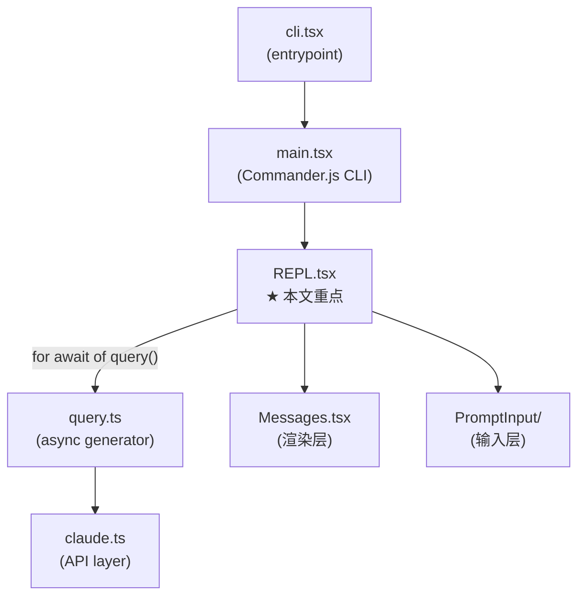

# REPL.tsx 深度学习

> 这是"总结学习"栏目的入口篇附录。`REPL.tsx` 是 Claude Code 的**交互大脑**——它横跨入口层（接收用户输入）和核心循环层（直接消费 `query()`），是理解整个系统最重要的单个文件。共约 5700 行，本文按执行流程逐层拆解。

---

## 一、REPL 的定位与架构关系



**核心定位**：REPL 是 React/Ink 组件树的**控制中心**，它：
- 维护整个会话的 `messages` 状态（React useState）
- 直接消费 `query()` async generator（不经过 QueryEngine）
- 管理权限对话框、工具 JSX 覆盖层、屏幕切换
- 组合约 60 个 hook 和子组件

---

## 二、Props 接口完整解析（REPL.tsx:762）

```typescript
export type Props = {
  commands: Command[];              // slash 命令列表（/clear、/help 等）
  debug: boolean;                   // 调试模式
  initialTools: Tool[];             // 初始工具集（MCP 工具在此之外动态合并）
  initialMessages?: MessageType[];  // 恢复会话时的历史消息
  pendingHookMessages?: Promise<HookResultMessage[]>; // SessionStart hook 延迟消息
  initialFileHistorySnapshots?: FileHistorySnapshot[]; // 文件历史快照
  initialContentReplacements?: ContentReplacementRecord[]; // 工具结果内容替换记录
  initialAgentName?: string;        // /rename 设置的 agent 名称
  initialAgentColor?: AgentColorName;
  mcpClients?: MCPServerConnection[]; // 已连接的 MCP 服务器
  dynamicMcpConfig?: Record<string, ScopedMcpServerConfig>;
  autoConnectIdeFlag?: boolean;
  strictMcpConfig?: boolean;
  systemPrompt?: string;            // 自定义系统提示覆盖
  appendSystemPrompt?: string;      // 追加到系统提示的内容
  onBeforeQuery?: (input: string, newMessages: MessageType[]) => Promise<boolean>; // query 前回调，返回 false 可阻止
  onTurnComplete?: (messages: MessageType[]) => void | Promise<void>; // turn 完成回调
  disabled?: boolean;               // 禁用输入（隐藏 prompt）
  mainThreadAgentDefinition?: AgentDefinition; // 主线程 agent 定义
  disableSlashCommands?: boolean;
  taskListId?: string;              // Tasks 模式：监听任务列表
  remoteSessionConfig?: RemoteSessionConfig; // --remote 模式
  directConnectConfig?: DirectConnectConfig; // claude connect 模式
  sshSession?: SSHSession;          // claude ssh 模式
  thinkingConfig: ThinkingConfig;   // 扩展思考配置
};
```

**关键 prop 含义**：
- `initialMessages`：会话恢复的核心。有值时，`haikuTitleAttemptedRef` 初始化为 `true`，跳过标题重命名（REPL.tsx:1412）
- `pendingHookMessages`：SessionStart hooks 异步执行，在第一次 API 调用前 `await`
- `onBeforeQuery`：返回 `false` 可中止本次 query，用于外部控制流

---

## 三、条件导入与 Feature Flag 模式（REPL.tsx:173）

REPL 顶部有大量**死代码消除式条件导入**，这是理解 feature flag 系统的关键示例：

```typescript
// VOICE_MODE feature gate — 外部构建完全不包含 useVoiceIntegration 模块
const useVoiceIntegration = feature('VOICE_MODE')
  ? require('../hooks/useVoiceIntegration.js').useVoiceIntegration
  : () => ({ stripTrailing: () => 0, handleKeyEvent: () => {}, resetAnchor: () => {} });

// 仅 ant 使用 — USER_TYPE 环境变量控制
const useFrustrationDetection = process.env.USER_TYPE === 'ant'
  ? require('.../useFrustrationDetection.js').useFrustrationDetection
  : () => ({ state: 'closed', handleTranscriptSelect: () => {} });

// COORDINATOR_MODE — 多 worker 协调器
const getCoordinatorUserContext = feature('COORDINATOR_MODE')
  ? require('../coordinator/coordinatorMode.js').getCoordinatorUserContext
  : () => ({});
```

**规律**：
1. `feature('X') ? require(...) : () => noop` — Bun 构建时 tree-shake 整个模块
2. `process.env.USER_TYPE === 'ant'` — 运行时门控，外部构建的 `.ant` 字符串会被移除
3. `feature()` 只能在 `if`/三元顶层使用，不能赋给变量再判断

---

## 四、核心状态变量全览（REPL.tsx:900 起）

### 4.1 消息状态（最重要）

```typescript
// 主消息数组 — React state，驱动渲染
const [messages, rawSetMessages] = useState<MessageType[]>(initialMessages ?? []);

// 始终新鲜的 ref 镜像 — 同步读取不等 React 调度
const messagesRef = useRef(messages);

// 包装的 setMessages — 同时更新 ref 和 React state
const setMessages = useCallback((action: SetStateAction<MessageType[]>) => {
  const next = typeof action === 'function' ? action(messagesRef.current) : action;
  messagesRef.current = next;  // 立即同步
  rawSetMessages(next);         // 通知 React
}, []);
```

**为什么需要 ref 镜像（REPL.tsx:1484）**：
- `onQuery` 的 `finally` 块需要立即读取最新消息（而非陈旧的闭包捕获值）
- `handleSpeculationAccept → onQuery` 这类链式调用不能等 React 调度
- 模式：**ref 是真相源，React state 是渲染投射**

### 4.2 Query 并发守卫

```typescript
// QueryGuard — 同步状态机，替代双状态模式
const queryGuard = React.useRef(new QueryGuard()).current;

// isQueryActive：订阅 guard，dispatching/running 期间为 true
const isQueryActive = React.useSyncExternalStore(
  queryGuard.subscribe,
  queryGuard.getSnapshot
);

// isExternalLoading：远程会话/后台任务的独立 loading 标志
const [isExternalLoading, setIsExternalLoadingRaw] = useState(
  remoteSessionConfig?.hasInitialPrompt ?? false
);

// 派生：任何 loading 源活跃
const isLoading = isQueryActive || isExternalLoading;
```

**QueryGuard 状态机**（`src/utils/QueryGuard.ts`）：
```
idle → (reserve) → dispatching → (tryStart) → running → (end) → idle
                 ↓ (cancelReservation)
               idle
```
- `reserve()`：在 `processUserInput` 的第一个 `await` 之前预占（防止并发提交）
- `tryStart()`：原子地从 idle/dispatching 转为 running，返回 generation 号
- `end(generation)`：原子检查并释放，陈旧 finally（cancel+resubmit 竞态）会返回 false 跳过

### 4.3 Streaming 状态

```typescript
const [streamMode, setStreamMode] = useState<SpinnerMode>('responding');
// 'requesting' | 'responding' | 'tool-use'
// Spinner 根据此显示不同文字

const [streamingToolUses, setStreamingToolUses] = useState<StreamingToolUse[]>([]);
// 当前正在流式执行的工具列表（用于 Spinner 显示）

const [streamingThinking, setStreamingThinking] = useState<StreamingThinking | null>(null);
// 扩展思考内容，30 秒后自动隐藏（REPL.tsx:1119）

const [streamingText, setStreamingText] = useState<string | null>(null);
// 实时流式文本（按行显示，隐藏正在输出的最后一行）
const visibleStreamingText = streamingText
  ? streamingText.substring(0, streamingText.lastIndexOf('\n') + 1) || null
  : null;
```

### 4.4 屏幕与 UI 状态

```typescript
const [screen, setScreen] = useState<Screen>('prompt');
// 'prompt'（主界面）| 'transcript'（全文预览，ctrl+o 切换）

const [toolJSX, setToolJSXInternal] = useState<{
  jsx: React.ReactNode | null;
  shouldHidePromptInput: boolean;
  shouldContinueAnimation?: true;  // 权限对话框在 toolJSX 期间继续动画
  showSpinner?: boolean;
  isLocalJSXCommand?: boolean;     // /config /mcp 等本地 JSX 命令
  isImmediate?: boolean;           // immediate 命令挂在 bottom 槽而非 scrollable
} | null>(null);

const [toolUseConfirmQueue, setToolUseConfirmQueue] = useState<ToolUseConfirm[]>([]);
// 权限审批队列 — 每次显示队列头部

const [abortController, setAbortController] = useState<AbortController | null>(null);
// 当前 query 的 abort controller，Ctrl+C 时调用 .abort('user-cancel')
```

---

## 五、工具集合并链路（REPL.tsx:969）

```
getTools(toolPermissionContext)          → localTools（内置工具，按权限过滤）
        +
initialTools（从 main.tsx 传入的初始工具集）
        ↓
combinedInitialTools（useMemo 合并）
        +
mcp.tools（MCP 服务器工具，动态注入）
        ↓ useMergedTools()
mergedTools
        ↓ resolveAgentTools()（如设置了 mainThreadAgentDefinition）
tools（最终工具集，含 allowedAgentTypes 限制）
```

**重要细节**：
- `getTools()` 在 `toolPermissionContext`、`proactiveActive`、`isBriefOnly` 变化时重新计算（REPL.tsx:969）
- `getToolUseContext` 中的 `computeTools()` 每次 query 时从 `store.getState()` 新鲜计算（REPL.tsx:2864），确保 MCP 异步连接后工具列表最新

---

## 六、Query 生命周期完整流程

### 6.1 onSubmit → onQuery → onQueryImpl 三层调用

```
用户按 Enter
    ↓
handlePromptSubmit() [utils/handlePromptSubmit.ts]
    ↓ 解析 slash 命令 / 普通文本 / bash 模式
onQuery(newMessages, abortController, shouldQuery, additionalAllowedTools, model)
    ↓
[REPL.tsx:3566] onQuery (并发守卫 + 消息追加)
    ├── queryGuard.tryStart()  → 返回 generation 号
    ├── setMessages([...old, ...newMessages])
    ├── mrOnBeforeQuery()  (MoreRight hook)
    ├── onBeforeQueryCallback?.(input, latestMessages)  → false 则提前返回
    └── onQueryImpl(latestMessages, newMessages, abort, shouldQuery, ...)
            ↓
[REPL.tsx:3278] onQueryImpl (系统提示构建 + query 循环)
    ├── diagnosticTracker.handleQueryStart()
    ├── maybeMarkProjectOnboardingComplete()
    ├── generateSessionTitle()  (第一条消息时，异步 Haiku 调用)
    ├── store.setState()  → 写入 alwaysAllowRules.command（skill 工具权限）
    ├── getToolUseContext()  → 构建 ProcessUserInputContext
    ├── Promise.all([getSystemPrompt(), getUserContext(), getSystemContext()])
    ├── buildEffectiveSystemPrompt()  → 最终系统提示
    └── for await (const event of query({...}))
            onQueryEvent(event)  → 更新 messages / streamingText / streamMode
    then:
    ├── resetLoadingState()
    ├── onTurnComplete?.(messagesRef.current)
    └── [finally in onQuery]
            queryGuard.end(thisGeneration)
            setLastQueryCompletionTime(Date.now())
            sendBridgeResult()
```

### 6.2 onQueryEvent — 事件路由（REPL.tsx:3100）

```typescript
const onQueryEvent = useCallback((event) => {
  handleMessageFromStream(
    event,
    newMessage => {
      if (isCompactBoundaryMessage(newMessage)) {
        // compact 边界：全屏保留旧消息用于回滚，非全屏直接替换
        setMessages(() => [newMessage]);
        setConversationId(randomUUID());  // 强制 Messages 行 key 刷新
      } else if (isEphemeralToolProgress(newMessage)) {
        // 瞬态进度（Sleep/Bash tick）：替换而非追加，防止数组膨胀
        setMessages(old => { /* 向后扫描替换 */ });
      } else {
        setMessages(old => [...old, newMessage]);
      }
    },
    newContent => setResponseLength(l => l + newContent.length),
    setStreamMode,
    setStreamingToolUses,
    tombstonedMessage => { /* 删除 tombstone 消息 */ },
    setStreamingThinking,
    metrics => { apiMetricsRef.current.push(metrics); },
    onStreamingText,
  );
}, [...]);
```

**瞬态进度替换逻辑**：Sleep/Bash 每秒 tick 一次，追加会造成数组爆炸（观察到 1.3 万+ 条目），因此向后扫描最近的同类型瞬态消息并替换（REPL.tsx:3143）。

### 6.3 并发输入排队（REPL.tsx:3590）

```typescript
// onQuery 内 — query 已在运行时
if (thisGeneration === null) {
  // 把新用户消息文本入队，等当前 query 完成后由 useQueueProcessor 处理
  newMessages
    .filter(m => m.type === 'user' && !m.isMeta)
    .map(m => getContentText(m.message.content))
    .filter(Boolean)
    .forEach(msg => enqueue({ value: msg, mode: 'prompt' }));
  return false;
}
```

---

## 七、onCancel — 取消机制（REPL.tsx:2504）

```typescript
function onCancel() {
  // 1. 宽限期守卫：local-jsx 面板刚关闭（500ms 内），吞掉 ESC
  if (Date.now() - localJSXClosedAtRef.current < 500) return;

  // 2. 暂停 proactive / goal 模式
  proactiveModule?.pauseProactive();

  // 3. 如果正在运行且有活跃 goal，自动暂停 goal
  if (queryGuard.getSnapshot() && currentGoal?.status === 'active') {
    pauseGoal(); persistCurrentGoal();
  }

  setWasAborted(true);
  queryGuard.forceEnd();  // 跳过 finally 路径，直接置 idle

  // 4. 保留部分流式文本（用户能读取已生成的内容）
  if (streamingText?.trim()) {
    setMessages(prev => [...prev, createAssistantMessage({ content: streamingText })]);
  }

  resetLoadingState();

  // 5. 根据当前对话框状态分派 abort 信号
  if (focusedInputDialog === 'tool-permission') {
    toolUseConfirmQueue[0]?.onAbort();
    setToolUseConfirmQueue([]);
  } else if (focusedInputDialog === 'prompt') {
    for (const item of promptQueue) item.reject(new Error('Prompt cancelled'));
    setPromptQueue([]);
    abortController?.abort('user-cancel');
  } else if (activeRemote.isRemoteMode) {
    activeRemote.cancelRequest();  // 向远程发送中断信号
  } else {
    abortController?.abort('user-cancel');
  }
  setAbortController(null);
}
```

**Escape 按键的完整流程**：
```
用户按 Escape
    ↓
CancelRequestHandler (src/hooks/useCancelRequest.ts)
    ├── chat:cancel keybinding isActive 检查
    │     ├── !isLocalJSXCommand (面板未挂载保护)
    │     ├── isLoading || toolUseConfirmQueue.length > 0
    │     └── ...其他条件
    └── onCancel() 调用
```

---

## 八、权限对话框系统（REPL.tsx:2373）

### 8.1 对话框优先级队列 `getFocusedInputDialog()`

```
退出状态 (isExiting)          → undefined（最高优先，阻断所有）
isMessageSelectorVisible       → 'message-selector'
isPromptInputActive            → undefined（用户输入中，抑制中断对话框）
sandboxPermissionRequestQueue  → 'sandbox-permission'
toolUseConfirmQueue            → 'tool-permission'
promptQueue                    → 'prompt'
workerSandboxPermissions       → 'worker-sandbox-permission'
elicitation                    → 'elicitation'
showingCostDialog ($5 阈值)    → 'cost'
idleReturnPending              → 'idle-return'
ULTRAPLAN pending choice       → 'ultraplan-choice'
ULTRAPLAN launch pending       → 'ultraplan-launch'
showIdeOnboarding              → 'ide-onboarding'
showModelSwitchCallout (ant)   → 'model-switch'
showUndercoverCallout (ant)    → 'undercover-callout'
showEffortCallout              → 'effort-callout'
showRemoteCallout              → 'remote-callout'
lspRecommendation              → 'lsp-recommendation'
hintRecommendation             → 'plugin-hint'
searchExtraToolsHint           → 'search-extra-tools-hint'
showDesktopUpsellStartup       → 'desktop-upsell'
```

### 8.2 权限暂停计时（REPL.tsx:2472）

```typescript
// 工具权限对话框出现/消失时，精确记录暂停时间
// SpinnerWithVerb 显示"经过时间 - 暂停时间"
useEffect(() => {
  if (!isLoading) return;
  const isPaused = focusedInputDialog === 'tool-permission';
  if (isPaused && pauseStartTimeRef.current === null) {
    pauseStartTimeRef.current = Date.now();  // 暂停开始
  } else if (!isPaused && pauseStartTimeRef.current !== null) {
    totalPausedMsRef.current += Date.now() - pauseStartTimeRef.current;
    pauseStartTimeRef.current = null;  // 暂停结束，累计
  }
}, [focusedInputDialog, isLoading]);
```

---

## 九、setToolJSX — 本地 JSX 命令保护机制（REPL.tsx:1336）

```typescript
// 包装器逻辑（简化）：
const setToolJSX = useCallback((args) => {
  if (args?.isLocalJSXCommand) {
    // 本地命令（/config、/plugin）：存入 ref 优先保护
    localJSXCommandRef.current = { ...args, isLocalJSXCommand: true };
    setToolJSXInternal(args);
    return;
  }

  if (localJSXCommandRef.current) {
    // 本地命令活跃期间：
    if (args?.clearLocalJSX) {
      // onDone 显式清除（用户关闭面板时）
      localJSXCommandRef.current = null;
      setToolJSXInternal(null);
      localJSXClosedAtRef.current = Date.now();  // 供 onCancel 宽限期使用
      return;
    }
    return;  // 忽略工具更新，本地命令优先
  }

  setToolJSXInternal(args);  // 普通工具 JSX
}, []);
```

**添加新 IMMEDIATE 命令的步骤**：
1. 命令定义中设置 `immediate: true`
2. 调用 `setToolJSX` 时传 `isLocalJSXCommand: true`
3. `onDone` 回调中传 `clearLocalJSX: true`

---

## 十、会话恢复 `resume()` 函数（REPL.tsx:2086）

```typescript
const resume = useCallback(async (sessionId, log, entrypoint) => {
  // 1. 反序列化历史消息（过滤未关闭 tool_use）
  const messages = deserializeMessages(log.messages);

  // 2. coordinator/normal 模式匹配
  if (feature('COORDINATOR_MODE')) { /* ... */ }

  // 3. 触发 SessionEnd hooks（与 /clear 一致）
  await executeSessionEndHooks('resume', { ... });

  // 4. 触发 SessionStart hooks（'resume' 类型）
  const hookMessages = await processSessionStartHooks('resume', { sessionId, ... });
  messages.push(...hookMessages);

  // 5. fork vs resume 的 plan 处理
  if (entrypoint === 'fork') {
    void copyPlanForFork(log, sessionId);  // 生成新 plan slug
  } else {
    void copyPlanForResume(log, sessionId);  // 复用原 slug
  }

  // 6. 恢复各种状态
  restoreSessionStateFromLog(log, setAppState);   // 文件历史、attribution
  restoreAgentFromSession(log.agentSetting, ...); // agent 定义
  restoreReadFileState(messages, cwd);            // readFileState 缓存

  // 7. 切换会话 ID（原子操作：id + projectDir）
  switchSession(sessionId, log.fullPath ? dirname(log.fullPath) : null);

  // 8. 会话文件指针重置
  await resetSessionFilePointer();
  clearSessionMetadata();
  restoreSessionMetadata(log);

  // 9. 成本状态恢复
  const targetSessionCosts = getStoredSessionCosts(sessionId);
  saveCurrentSessionCosts();
  resetCostState();
  if (targetSessionCosts) setCostStateForRestore(targetSessionCosts);

  // 10. 重构内容替换状态（非 fork）
  if (contentReplacementStateRef.current && entrypoint !== 'fork') {
    contentReplacementStateRef.current = reconstructContentReplacementState(
      messages, log.contentReplacements ?? []
    );
  }

  // 11. 最终设置
  setMessages(() => messages);
  setToolJSX(null);
  setInputValue('');
}, [...]);
```

**三种入口点**：
- `'resume'`：普通 `/resume`，复用原始 worktree 和 plan
- `'fork'`：`/branch`，新 session ID，新 plan slug，跳过 worktree 切换
- `'reload'`：重新加载当前会话

---

## 十一、`getToolUseContext` — 工具执行上下文构建（REPL.tsx:2848）

这是 REPL 中最重要的工厂函数，每次 query 前调用：

```typescript
const getToolUseContext = useCallback((messages, _newMessages, abortController, model) => {
  const s = store.getState();  // 新鲜读取（非闭包捕获）

  const computeTools = () => {
    // 每次调用从 store 新鲜计算，确保 MCP 动态连接后最新
    const state = store.getState();
    const assembled = assembleToolPool(state.toolPermissionContext, state.mcp.tools);
    return mergeAndFilterTools(combinedInitialTools, assembled, state.toolPermissionContext.mode);
  };

  return {
    abortController,
    options: {
      commands, tools: computeTools(), debug, verbose: s.verbose,
      mainLoopModel: model,
      thinkingConfig: s.thinkingEnabled !== false ? thinkingConfig : { type: 'disabled' },
      mcpClients: mergeClients(initialMcpClients, s.mcp.clients),
      // ... 其他选项
    },
    getAppState: () => store.getState(),
    setAppState,
    messages,
    setMessages,
    // 文件历史状态更新（性能优化：相同引用不触发通知）
    updateFileHistoryState(updater) {
      setAppState(prev => {
        const updated = updater(prev.fileHistory);
        if (updated === prev.fileHistory) return prev;  // 相同引用跳过
        return { ...prev, fileHistory: updated };
      });
    },
    setToolJSX,
    addNotification,
    appendSystemMessage: msg => setMessages(prev => [...prev, msg]),
    sendOSNotification: opts => void sendNotification(opts, terminal),
    readFileState: readFileState.current,
    setResponseLength,
    setStreamMode,
    resume,
    contentReplacementState: contentReplacementStateRef.current,
    // onCompactProgress：更新 spinner 颜色/消息（compact 过程中）
    onCompactProgress: event => { /* ... */ },
  };
}, [...]);
```

---

## 十二、系统提示构建链（REPL.tsx:3416）

```typescript
const [, , defaultSystemPrompt, baseUserContext, systemContext] = await Promise.all([
  undefined,
  feature('TRANSCRIPT_CLASSIFIER')
    ? checkAndDisableAutoModeIfNeeded(...)
    : undefined,
  getSystemPrompt(freshTools, mainLoopModelParam, additionalWorkingDirs, freshMcpClients),
  getUserContext(),   // git status、date、CLAUDE.md 内容、memory 文件
  getSystemContext(), // 环境信息（OS、shell、CWD）
]);

// coordinator 模式追加额外上下文
const userContext = {
  ...baseUserContext,
  ...getCoordinatorUserContext(freshMcpClients, scratchpadDir),
  // proactive 模式且终端未聚焦时追加提示
  ...(proactiveActive && !terminalFocused
    ? { terminalFocus: 'The terminal is unfocused — the user is not actively watching.' }
    : {}),
};

// 最终系统提示（agent 定义 > customSystemPrompt > defaultSystemPrompt）
const systemPrompt = buildEffectiveSystemPrompt({
  mainThreadAgentDefinition,
  toolUseContext,
  customSystemPrompt,
  defaultSystemPrompt,
  appendSystemPrompt,
});
```

---

## 十三、屏幕模式与 Transcript 模式（REPL.tsx:5531）

### 13.1 两种屏幕

| 屏幕 | 切换快捷键 | 特点 |
|------|-----------|------|
| `'prompt'`（主界面） | — | 实时 streaming，PromptInput 可用 |
| `'transcript'`（全文） | `ctrl+o` | 冻结状态，只读，支持 `/` 搜索 |

### 13.2 Transcript 搜索（less 风格，REPL.tsx:5249）

```
/         → 打开搜索栏（TranscriptSearchBar）
输入文字   → 增量搜索 + 高亮（useSearchHighlight）
Enter     → 提交 query，关闭栏，n/N 继续导航
Esc       → 取消，恢复锚点位置（VML setSearchQuery('')）
n / N     → 下/上一个匹配（按住键会批量跳转）
v         → 渲染到 tmp 文件，用 $VISUAL/$EDITOR 打开
[         → 强制 dump-to-scrollback（终端 cmd-F 可搜全文）
q         → 退出 transcript 模式
```

### 13.3 冻结状态（REPL.tsx:1607）

```typescript
// 进入 transcript 时捕获长度而非克隆数组（节省内存）
const [frozenTranscriptState, setFrozenTranscriptState] = useState<{
  messagesLength: number;
  streamingToolUsesLength: number;
} | null>(null);

// transcript 中显示的消息：冻结时的切片
const transcriptMessages = frozenTranscriptState
  ? deferredMessages.slice(0, frozenTranscriptState.messagesLength)
  : deferredMessages;
```

---

## 十四、渲染架构（REPL.tsx:5760）

### 14.1 普通模式 JSX 结构

```
<AlternateScreen>                       ← 全屏时包裹（终端备用缓冲区）
  <KeybindingSetup>                     ← keybinding 上下文
    <AnimatedTerminalTitle />           ← 终端 tab 标题动画（960ms tick，独立组件）
    <GlobalKeybindingHandlers />        ← ctrl+o / ctrl+e 等全局快捷键
    <VoiceKeybindingHandler />          ← VOICE_MODE 语音输入
    <CommandKeybindingHandlers />       ← slash 命令快捷键
    <ScrollKeybindingHandler />         ← PgUp/PgDn/wheel 滚动
    <MessageActionsKeybindings />       ← MESSAGE_ACTIONS 消息操作
    <CancelRequestHandler />            ← Ctrl+C / Escape 取消

    <MCPConnectionManager>              ← MCP 连接管理
      <FullscreenLayout
        scrollRef={scrollRef}
        scrollable={                    ← 可滚动区域
          <>
            <TeammateViewHeader />      ← swarm 模式头部
            <Messages                  ← 消息列表
              messages={displayedMessages}
              streamingText={visibleStreamingText}
              ...
            />
            <AwsAuthStatusBox />
            {placeholderText && <UserTextMessage />}  ← 处理中占位符
            {toolJSX && !isImmediate && !centered && <toolJSX.jsx />}
            <TungstenLiveMonitor />     ← ant 专属监控面板
            <Box flexGrow={1} />        ← 推 spinner 到底部
            {showSpinner && <SpinnerWithVerb />}
            {isBriefOnly && <BriefIdleStatus />}
          </>
        }
        bottom={                        ← 固定底部区域
          <>
            <PromptInputQueuedCommands />   ← 已排队命令预览
            {permissionStickyFooter}        ← ExitPlanMode 粘性底部
            {toolJSX?.isImmediate && <toolJSX.jsx />}  ← immediate 命令
            {showExpandedTodos && <TaskListV2 />}
            {/* 权限对话框 */}
            {focusedInputDialog === 'sandbox-permission' && <SandboxPermissionRequest />}
            {focusedInputDialog === 'prompt' && <PromptDialog />}
            {pendingWorkerRequest && <WorkerPendingPermission />}
            {elicitation.queue[0] && <ElicitationDialog />}
            {/* 调查/通知 */}
            {feedbackSurvey && <FeedbackSurvey />}
            {/* PromptInput */}
            {!disabled && !toolJSX?.shouldHidePromptInput && (
              <PromptInput onSubmit={onSubmit} ... />
            )}
          </>
        }
        overlay={toolPermissionOverlay}     ← 工具权限覆盖层
        modal={centeredModal}               ← 全屏 local-jsx 居中弹窗
        bottomFloat={<CompanionFloatingBubble />}  ← BUDDY 气泡
      />
    </MCPConnectionManager>
  </KeybindingSetup>
</AlternateScreen>
```

### 14.2 PromptInput 渲染条件

```typescript
// PromptInput 不渲染的情况：
disabled === true
|| toolJSX?.shouldHidePromptInput === true
|| focusedInputDialog !== undefined（有对话框时隐藏）

// focusedInputDialog 的关键副作用：
// - 'tool-permission' → 暂停计时器，滚动固定到底部
// - 'message-selector' → 显示消息选择器（始终显示，不抑制）
// - 'ultraplan-choice' → 禁用滚动的 wheel 处理器
```

### 14.3 `showSpinner` 计算（REPL.tsx:2000）

```typescript
const showSpinner =
  (!toolJSX || toolJSX.showSpinner === true) &&
  toolUseConfirmQueue.length === 0 &&
  promptQueue.length === 0 &&
  (isLoading || userInputOnProcessing || hasRunningTeammates || getCommandQueueLength() > 0) &&
  !pendingWorkerRequest &&
  !onlySleepToolActive &&          // Sleep 工具运行时隐藏 spinner（Sleep 自己有 UI）
  (!visibleStreamingText || isBriefOnly);  // 流式文本可见时不显示（文本本身是反馈）
```

---

## 十五、rewindConversationTo — 会话回退（REPL.tsx:4504）

```typescript
const rewindConversationTo = useCallback((message: UserMessage) => {
  const messageIndex = messagesRef.current.lastIndexOf(message);
  if (messageIndex === -1) return;

  setMessages(prev.slice(0, messageIndex));  // 截断消息
  setConversationId(randomUUID());           // 强制 Messages 行 key 刷新
  resetMicrocompactState();                  // 清除缓存的微压缩状态

  // 从回退点的消息恢复权限模式
  const permMode = message.permissionMode as InternalPermissionMode | undefined;
  setAppState(prev => ({
    ...prev,
    toolPermissionContext: permMode ? { ...prev.toolPermissionContext, mode: permMode } : prev.toolPermissionContext,
    promptSuggestion: { text: null, promptId: null, shownAt: 0, acceptedAt: 0, generationRequestId: null },
  }));
}, [setMessages, setAppState]);
```

**两种回退触发路径**：
1. 直接回退（无文件变更 + 之后只有合成消息）：`onCancel() → handleRestoreMessage()`
2. 对话框路径（有文件变更）：打开 `MessageSelector`，用户确认后回退

---

## 十六、挂载初始化流程（REPL.tsx:4650）

```typescript
async function onInit() {
  // 1. API key 验证
  void reverify();

  // 2. 加载 CLAUDE.md / MEMORY.md 文件到 readFileState 缓存
  const memoryFiles = await getMemoryFiles();
  for (const file of memoryFiles) {
    readFileState.current.set(file.path, {
      content: file.contentDiffersFromDisk ? (file.rawContent ?? file.content) : file.content,
      timestamp: Date.now(),
      offset: undefined,
      limit: undefined,
      isPartialView: file.contentDiffersFromDisk,
    });
  }
  // 注：isPartialView=true 时 Edit/Write 工具要求先 Read（安全约束）
}

useEffect(() => {
  void onInitRef.current();
  return () => { void diagnosticTrackerRef.current.shutdown(); };
}, []);
```

---

## 十七、后台任务与 Proactive 模式

### 17.1 会话后台化（REPL.tsx:3008）

```typescript
// Ctrl+B — 将当前会话切入后台
const handleBackgroundQuery = useCallback(() => {
  abortController?.abort('background');
  const removedNotifications = removeByFilter(cmd => cmd.mode === 'task-notification');
  
  void (async () => {
    const toolUseContext = getToolUseContext(...);
    const [defaultSystemPrompt, userContext, systemContext] = await Promise.all([...]);
    
    startBackgroundSession({
      messages: [...messagesRef.current, ...uniqueNotifications],
      queryParams: { systemPrompt, canUseTool, toolUseContext, ... },
      description: terminalTitle,
      setAppState,
    });
  })();
}, [...]);
```

### 17.2 Proactive 模式（REPL.tsx:5043）

```typescript
// feature('PROACTIVE') || feature('KAIROS') 时激活
useProactive?.({
  isLoading: isLoading || initialMessage !== null,
  queuedCommandsLength: queuedCommands.length,
  hasActiveLocalJsxUI: isShowingLocalJSXCommand,
  isInPlanMode: toolPermissionContext.mode === 'plan',
  onQueueTick: (command) => enqueue(command),  // proactive tick 入队
});

// 自动化状态通知（供外部进程观察）
notifyAutomationStateChanged({
  enabled: true,
  phase: 'standby',
  next_tick_at: proactiveNextTickAt,
  sleep_until: null,
});
```

---

## 十八、多远程模式（REPL.tsx:1682）

| 模式 | Hook | 传输 | 用途 |
|------|------|------|------|
| `--remote` | `useRemoteSession` | WebSocket → CCR | 远程执行引擎 |
| `claude connect` | `useDirectConnect` | WebSocket → claude server | 直连服务器 |
| `claude ssh` | `useSSHSession` | ChildProcess stdin/stdout | SSH 远程工具 |

```typescript
// 优先级选择（REPL.tsx:1715）
const activeRemote = sshRemote.isRemoteMode ? sshRemote
  : directConnect.isRemoteMode ? directConnect
  : remoteSession;
```

---

## 十九、关键常量与 Ref 集合

| Ref/常量 | 值/类型 | 用途 |
|---------|---------|------|
| `RECENT_SCROLL_REPIN_WINDOW_MS` | 3000ms | 用户滚动后，此窗口内输入不重新固定到底部 |
| `DEFERRED_CAP` | 500条 | `useDeferredValue` 的消息数上限 |
| `MAX_FULLSCREEN_SCROLLBACK` | 500条 | compact 后全屏回滚最多保留条数 |
| `LOCAL_JSX_CLOSE_CANCEL_GRACE_MS` | 500ms | 本地 JSX 面板关闭后的 ESC 宽限期 |
| `PROMPT_SUPPRESSION_MS` | 1500ms | 用户停止输入后多久恢复对话框显示 |
| `loadingStartTimeRef` | number | query 开始时间（计算 elapsed time） |
| `totalPausedMsRef` | number | 累计暂停时间（权限对话框期间） |
| `haikuTitleAttemptedRef` | boolean | 防止重复触发标题 Haiku 调用 |
| `messagesRef` | MessageType[] | messages 的同步镜像 |
| `abortControllerRef` | AbortController | 当前 query 的 abort（bridge 用） |
| `readFileState` | LRUCache(100) | 已读文件内容缓存（供 Edit/Write 工具） |

---

## 二十、REPL 在两层知识中的定位总结

```
┌─────────────────────────────────────────────────────┐
│                   入口层（Entry）                    │
│  cli.tsx → main.tsx → REPL.tsx（挂载、初始化）      │
│  · Props 解析          · onInit() 加载 CLAUDE.md    │
│  · 工具集合并          · 会话恢复 resume()           │
│  · 状态初始化          · 多远程模式选择              │
├─────────────────────────────────────────────────────┤
│                   核心循环层（Loop）                 │
│  REPL.tsx → query.ts（直接消费，无 QueryEngine）    │
│  · onQuery() 并发守卫    · onQueryEvent() 事件路由  │
│  · onQueryImpl() 系统提示构建                       │
│  · for await of query() 驱动循环                    │
│  · onCancel() 中止机制   · rewindConversationTo()   │
│  · QueryGuard 状态机     · setMessages ref 镜像      │
└─────────────────────────────────────────────────────┘
```

**REPL 与 QueryEngine 的根本区别**：
- REPL：`messages` 存在 React state（`useState`），直接 `for await of query()`
- QueryEngine：`mutableMessages` 存在类实例属性，通过 `ask()` 包装 `query()`
- 两者在 `query.ts` 层汇合，共享底层循环逻辑


-----------

 层级          文件                                    职责
  ──────────────────────────────────────────────────────────────────────
  输入接收      src/screens/REPL.tsx                   监听 PromptInput 提交
  路由分发      processUserInput.ts                    bash/slash/普通文本 三叉路由
  Slash 分发    processSlashCommand.tsx                parse → findCommand → 按 type 分支
                （local / local-jsx / prompt）
  命令定义      src/commands/rename/index.ts           type:'local-jsx' + 懒加载路径
                src/commands/resume/index.ts
  业务逻辑      src/commands/rename/rename.ts          写 sessionTitle 到磁盘
                src/commands/resume/resume.tsx         渲染 JSX 列表 / 加载历史消息
  持久化        src/utils/sessionStorage.ts            JSONL 读写，~/.claude/projects/

  两个命令都是 type: 'local-jsx'，区别在于：
  - /rename aa 有参数，直接在 call() 里同步完成，通过 onDone() 回报结果
  - /resume 无参数时返回 JSX 组件（<LogSelector/>），等用户在 UI 里选择后才触发 onDone()