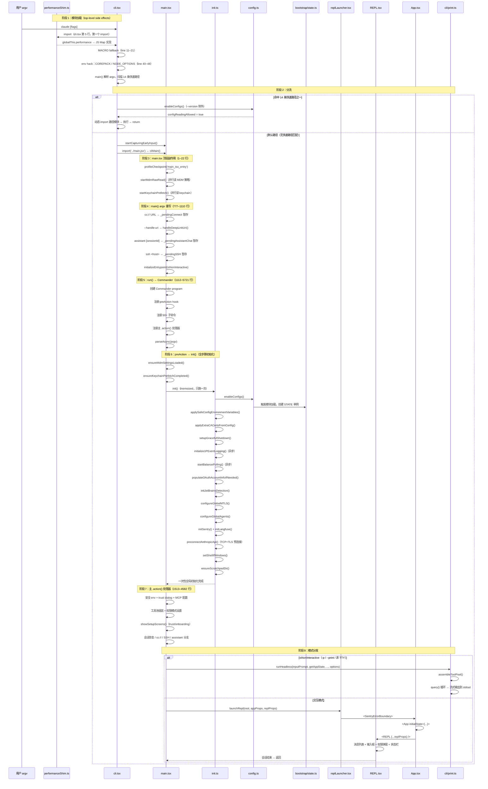

# 入口知识总结

> 这是"总结学习"栏目的第一篇。目标：完整理解 Claude Code 从 `claude` 命令敲下的那一刻，到用户看到交互界面（或无头输出完毕退出）的全链路。覆盖 6 个核心文件的详细实现。

---

## 一、启动链全貌（6 文件时序图）

> 下面的时序图展示了完整的启动链路，从 `cli.tsx` 分流到最终进入交互 REPL 或无头模式。



---

## 二、`cli.tsx` — 分流器（~410 行）

**文件路径**：`src/entrypoints/cli.tsx`

### 2.1 核心职责

`cli.tsx` 只做一件事：按优先级扫描 `argv`，匹配到快速路径就动态 `import` 对应模块然后 `return`，**只有默认路径**（无任何匹配）才会 `import('../main.jsx')` 加载完整 CLI。

关键位置：`cli.tsx:88`（`--version` 快速路径）、`cli.tsx:403`（默认路径 `import('../main.jsx')`）。

### 2.2 顶层副作用（1–69 行）

| 行号 | 作用 | 为什么在这里 |
|---|---|---|
| 5 | `import '../utils/performanceShim.js'` | **必须第一个 import**，在 React/OTel 捕获原生引用前替换 performance |
| 11–21 | MACRO fallback | 直接 `bun cli.tsx` 跑时没有 build defines 注入 |
| 23–36 | `CLAUDE_CODE_FORCE_INTERACTIVE` 强制 TTY | Windows 嵌套 bun 启动场景 |
| 40 | `COREPACK_ENABLE_AUTO_PIN = '0'` | 阻止 corepack 往用户 package.json 写 yarnpkg |
| 44–48 | `NODE_OPTIONS` 追加 `--max-old-space-size=8192` | CCR 容器有 16GB，给子进程分配 8GB |
| 56–68 | `ABLATION_BASELINE` 环境变量注入 | Harness-science 消融实验，必须在 BashTool/AgentTool import 前设置 |

### 2.3 14 条快速路径

| # | 触发条件 | 入口模块 | 是否 enableConfigs |
|---|---|---|---|
| 1 | `--version` / `-v` / `-V` | 内联打印 | 否 |
| 2 | `--dump-system-prompt`（DUMP_SYSTEM_PROMPT） | `constants/prompts.js` | 是 |
| 3 | `--claude-in-chrome-mcp` | `claudeInChrome/mcpServer.js` | 否 |
| 3b | `--chrome-native-host` | `claudeInChrome/chromeNativeHost.js` | 否 |
| 3c | `--computer-use-mcp`（CHICAGO_MCP） | `computerUse/mcpServer.js` | 否 |
| 4 | `--acp`（ACP） | `services/acp/entry.js` | 否 |
| 5 | `weixin` | `@claude-code-best/weixin` | 是 |
| 6 | `--daemon-worker[=kind]`（DAEMON） | `daemon/workerRegistry.js` | 否 |
| 7 | `remote-control`/`rc`/`remote`/`sync`/`bridge`（BRIDGE_MODE） | `bridge/bridgeMain.js` | 是 |
| 8 | `daemon`（DAEMON\|BG_SESSIONS） | `daemon/main.js` | 是 |
| 9 | `autonomy` | `cli/handlers/autonomy.js` | 否 |
| 10 | `--bg`/`--background`（BG_SESSIONS） | `cli/bg.js` | 是 |
| 11 | `job` / `new` / `list` / `reply`（TEMPLATES） | `cli/handlers/templateJobs.js` | 否 |
| 12 | `environment-runner`（BYOC_ENVIRONMENT_RUNNER） | `environment-runner/main.js` | 否 |
| 13 | `self-hosted-runner`（SELF_HOSTED_RUNNER） | `self-hosted-runner/main.js` | 否 |
| 14 | `--tmux` + `--worktree` | `utils/worktree.js` | 是 |

### 2.4 默认路径（384–406 行）

快速路径全部未命中后：

```ts
// 1. --update/--upgrade 单词级参数重写为 update 子命令
if (args.length === 1 && (args[0] === '--update' || args[0] === '--upgrade')) {
  process.argv = [process.argv[0]!, process.argv[1]!, 'update'];
}

// 2. --bare 提前写入 CLAUDE_CODE_SIMPLE=1
if (args.includes('--bare')) {
  process.env.CLAUDE_CODE_SIMPLE = '1';
}

// 3. 立即缓冲键盘输入（防止 main.tsx 加载期间用户输入丢失）
const { startCapturingEarlyInput } = await import('../utils/earlyInput.js');
startCapturingEarlyInput();

// 4. 动态加载完整 CLI（:403）
const { main: cliMain } = await import('../main.jsx');
await cliMain();
```

### 2.5 `earlyInput.ts` — 键盘输入缓冲

**文件路径**：`src/utils/earlyInput.ts`

#### 问题背景

从用户敲下 `claude` 到 main.tsx 的 Ink REPL 准备好接收输入，中间有约 **135ms** 的模块加载窗口。在此期间用户如果已经开始输入（常见场景：`claude` 回车后立即输入问题），这些按键在普通 TTY 下会被操作系统缓冲，但一旦 Ink 接管 stdin 进入 raw mode，操作系统缓冲就会被清空，导致内容丢失。

#### 解决方案

`startCapturingEarlyInput()` 在 cli.tsx 默认路径中（`:398`）被立即调用：
- 将 stdin 置为 raw mode 并注册 `readable` 事件监听
- 所有按键存入模块级 `earlyInputBuffer` 字符串
- 同时正确处理 Ctrl+C（exit 130）、Ctrl+D（停止捕获）、退格、转义序列等

```ts
// src/utils/earlyInput.ts — 核心导出
export function startCapturingEarlyInput(): void  // 开始捕获（仅 TTY 且非 -p 模式）
export function stopCapturingEarlyInput(): void   // 停止并解除 stdin ref
export function consumeEarlyInput(): string       // 取出缓冲并停止
export function hasEarlyInput(): boolean          // 是否有缓冲内容（不消费）
export function seedEarlyInput(text: string): void // 预填文本（不自动提交）
```

#### 停止时机

- **交互模式**：Ink App 挂载时 `handleSetRawMode(true)` 内部会调用 `consumeEarlyInput()`，内容自动注入 PromptInput 预填区。
- **非交互模式（`-p` / 非 TTY）**：`main.tsx:1003` 在 `isNonInteractive` 判定为 true 后立即调用 `stopCapturingEarlyInput()`。
- **安全阀**：10 秒超时后自动停止（防止 Ink 因错误未能挂载导致 stdin.ref() 永久泄漏）。

### 2.6 `performanceShim.ts` — JSC 性能泄漏修复

**文件路径**：`src/utils/performanceShim.ts`

#### 问题背景

Bun 使用 JSC（JavaScriptCore）作为 JS 引擎。JSC 原生的 `globalThis.performance` 在 C++ 层使用一个 Vector 存储所有 mark/measure/resource timing 条目。这个 Vector **永不收缩**，即使调用 `clearMarks()` 也只清空逻辑内容，C++ 容量不变。对于长期运行的会话（`/loop` 模式、daemon），数百次 API 调用累积的 OTel/React mark 会导致数百 MB 的 C++ 死容量。

#### 修复方式

将 `globalThis.performance` 替换为纯 JS `Map` 实现的 shim：
- `performance.now()` 委托给原生对象（快速、无内存成本）
- `mark()` / `measure()` / `getEntries*()` / `clearMarks()` 全部使用 JS `Map`，GC 可正常回收
- 保留 `timeOrigin`、`toJSON()` 等只读属性委托给原生（防止 JSC 内部 `this` 类型检查报错）

#### 为什么必须第一个 import

React reconciler 和 OpenTelemetry 在模块初始化时会**捕获** `globalThis.performance` 引用。若 shim 在它们之后安装，它们持有的是原生对象引用，shim 无效。

```ts
// src/entrypoints/cli.tsx — 第 5 行，第一个 import
import '../utils/performanceShim.js';
// ↑ 此行之后 globalThis.performance === shim（JS Map 实现）

// src/utils/performanceShim.ts:164-165
export function installPerformanceShim(): void { /* ... */ }
installPerformanceShim()  // import 时自动执行
```

### 2.7 `startupProfiler.ts` — 启动埋点

**文件路径**：`src/utils/startupProfiler.ts`

#### 核心函数

```ts
export function profileCheckpoint(name: string): void
// 记录 performance.mark(name) + 可选内存快照（DETAILED_PROFILING 时）

export function profileReport(): void
// 上报 Statsig + 写入文件（DETAILED_PROFILING 时），然后清理所有 startup marks

export function isDetailedProfilingEnabled(): boolean

export function getStartupPerfLogPath(): string
// → ~/.claude/startup-perf/<sessionId>.txt
```

#### 启用方式

| 模式 | 条件 | 效果 |
|---|---|---|
| **详细 profiling** | `CLAUDE_CODE_PROFILE_STARTUP=1` | 输出全量报告（含内存快照）到 `~/.claude/startup-perf/<sessionId>.txt` |
| **Statsig 采样** | `USER_TYPE=ant` 或 0.5% 随机 | 将各阶段时长上报到 `tengu_startup_perf` 事件 |
| **不采样** | 其他 | `profileCheckpoint()` 变 no-op，零开销 |

#### 跨文件 checkpoint 清单

| checkpoint 名 | 所在文件 | 说明 |
|---|---|---|
| `cli_entry` | `cli.tsx` | 进程启动，第一个 checkpoint |
| `cli_before_main_import` | `cli.tsx` | 开始 `import('../main.jsx')` 前 |
| `cli_after_main_import` | `cli.tsx` | `import` 完成后 |
| `cli_after_main_complete` | `cli.tsx` | `cliMain()` 执行完毕 |
| `main_tsx_entry` | `main.tsx` | main.tsx 顶层副作用执行时 |
| `main_tsx_imports_loaded` | `main.tsx` | 顶层 import 全部完成 |
| `main_function_start` | `main.tsx` | `main()` 函数体开始 |
| `main_warning_handler_initialized` | `main.tsx` | warning handler 注册完毕 |
| `run_function_start` | `main.tsx` | `run()` 函数体开始 |
| `preAction_after_init` | `main.tsx` | `init()` 在 preAction 中完成 |
| `action_after_hooks` | `main.tsx` | hooks promise 解析完毕，进入主 action |
| `init_function_start` | `init.ts` | `init()` 闭包体开始 |
| `init_configs_enabled` | `init.ts` | `enableConfigs()` 完成 |
| `init_safe_env_vars_applied` | `init.ts` | 安全 env vars 已应用 |
| `init_after_graceful_shutdown` | `init.ts` | `setupGracefulShutdown()` 完成 |
| `init_after_1p_event_logging` | `init.ts` | 1P event logging 异步触发 |
| `init_after_balance_polling` | `init.ts` | balance polling 异步触发 |
| `init_after_oauth_populate` | `init.ts` | OAuth 账户填充异步触发 |
| `init_after_jetbrains_detection` | `init.ts` | JetBrains 检测异步触发 |
| `init_after_remote_settings_check` | `init.ts` | 远程设置 loading promise 初始化 |
| `init_network_configured` | `init.ts` | mTLS + proxy agents 配置完成 |
| `init_function_end` | `init.ts` | `init()` 整体完成 |
| `before_print_import` / `launchRepl` | `main.tsx` | 进入无头或 REPL 路径 |

`profileReport()` 在主 `.action()` 执行完毕（会话结束前）被调用，上报后清理所有 marks 防止长期进程累积。

---

## 三、`main.tsx` — Commander 程序（5721 行）

**文件路径**：`src/main.tsx`

### 3.1 三层结构

| 层 | 行范围 | 内容 |
|---|---|---|
| 顶层副作用 | 1–22 | profileCheckpoint + MDM raw read + keychain 预热（利用 import 时间窗并行） |
| `main()` | 777–1110 | argv 早期重写 + isNonInteractive 判定 |
| `run()` | 1112–5721 | Commander program 构建 → preAction → 主 action → 子命令注册 → parseAsync() |

### 3.2 顶层副作用详解（1–22 行）

这三段副作用利用了 `import` 期间的时间窗，让重量级子进程与剩余 ~135ms 的 import **并行运行**：

```ts
// 1. profileCheckpoint —— 在重量级模块求值前标记入口
import { profileCheckpoint, profileReport } from './utils/startupProfiler.js';
profileCheckpoint('main_tsx_entry');

// 2. startMdmRawRead —— 触发 MDM 子进程（plutil/reg query）读取企业策略
import { startMdmRawRead } from './utils/settings/mdm/rawRead.js';
startMdmRawRead();

// 3. startKeychainPrefetch —— 并行触发两次 macOS keychain 读取
//    （OAuth + 旧版 API key），否则后续会在 init 中同步读取（每次 ~65ms）
import { startKeychainPrefetch } from './utils/secureStorage/keychainPrefetch.js';
startKeychainPrefetch();
```

### 3.3 `main()` argv 重写（777–1110 行）

`main()` 在 Commander 解析 argv **之前**做了 5 件事：

1. **安全 env**：`NoDefaultCurrentDirectoryInExePath = '1'`（防 Windows PATH 劫持）
2. **cc:// URL 重写**（DIRECT_CONNECT feature）：
   - 交互模式：剥离 URL → 暂存到 `_pendingConnect` → 运行主命令
   - 无头模式：改写为 `open <cc-url>` 子命令
3. **`--handle-uri` 深度链接**（LODESTONE feature）：解析 URI → `handleDeepLinkUri()` → `process.exit()`
4. **`assistant [sessionId]` 暂存**（KAIROS feature）：剥离参数 → 暂存到 `_pendingAssistantChat`
5. **`ssh <host>` 暂存**（SSH_REMOTE feature）：剥离参数 → 暂存到 `_pendingSSH`

最后调用 `initializeEntrypoint(isNonInteractive)` 设置 `CLAUDE_CODE_ENTRYPOINT` 环境变量：

```ts
// isNonInteractive 判定逻辑（~line 999）：
hasPrintFlag          // -p / --print
|| hasInitOnlyFlag    // --init-only
|| hasSdkUrl          // SDK URL 模式
|| (!forceInteractive && !process.stdout.isTTY)  // 非 TTY 环境

// CLAUDE_CODE_ENTRYPOINT 取值：
// - 'mcp'            → mcp serve 命令
// - 'claude-code-github-action' → GitHub Action 环境
// - 'sdk-cli'        → 非交互模式
// - 'cli'            → 交互模式
```

### 3.3.5 早期进程钩子（786–808 行）

在 Commander 开始解析 argv 之前，`main()` 注册了 3 个进程级钩子：

1. **`initializeWarningHandler()`**（`:786`）：拦截 Node.js `process.on('warning')` 事件，将警告格式化后写入 debug 日志而非直接打印到 stderr，避免污染交互界面。
2. **`resetCursor`**（`:788` exit 钩子）：`process.on('exit')` 中调用 `resetCursor()`，确保即使异常退出也能恢复终端光标状态。同时在 exit 中尝试调用 `peekWorkflowService()?.shutdown()` 杀掉所有运行中的 workflow，避免孤儿任务留在 AppState。
3. **SIGINT 处理**（`:800`）：非 print 模式下 Ctrl+C 直接 `process.exit(0)`；print 模式下跳过（`print.ts` 有自己的 SIGINT handler 来中止 query 并执行 gracefulShutdown）。

```ts
// main.tsx:785-808（精简）
initializeWarningHandler();

process.on('exit', () => {
  resetCursor();
  try {
    peekWorkflowService()?.shutdown();
  } catch { /* workflow 未启用或已卸载——忽略 */ }
});

process.on('SIGINT', () => {
  if (process.argv.includes('-p') || process.argv.includes('--print')) return;
  process.exit(0);
});
```

### 3.4 `run()` Commander 程序（1112–5721 行）

#### 3.4.1 preAction hook（1136–1197 行）

在每个子命令执行前统一运行。**`--help` 不触发 preAction**，所以显示帮助时不做重型初始化：

```ts
program.hook('preAction', async thisCommand => {
  // 1. 等待 MDM settings 和 keychain 预取完成
  await Promise.all([ensureMdmSettingsLoaded(), ensureKeychainPrefetchCompleted()]);

  // 2. 全步骤全局初始化（memoized）
  await init();

  // 3. 设置 process.title = 'claude'（除非禁用）
  if (!isEnvTruthy(process.env.CLAUDE_CODE_DISABLE_TERMINAL_TITLE)) {
    process.title = 'claude';
  }

  // 4. 挂载日志 sink（让子命令 handler 可以使用 logEvent/logError）
  const { initSinks } = await import('./utils/sinks.js');
  initSinks();

  // 5. --plugin-dir 顶层 option 传播给 getInlinePlugins()
  const pluginDir = thisCommand.getOptionValue('pluginDir');
  if (Array.isArray(pluginDir) && pluginDir.length > 0) {
    setInlinePlugins(pluginDir);
    clearPluginCache('preAction: --plugin-dir inline plugins');
  }

  // 6. 运行 config migration
  runMigrations();

  // 7. 异步加载远程托管设置 / 策略限制（fail-open）
  void loadRemoteManagedSettings();
  void loadPolicyLimits();

  // 8. 异步上传本地设置到远程（CCR 模式）
  if (feature('UPLOAD_USER_SETTINGS')) {
    void import('./services/settingsSync/index.js')
      .then(m => m.uploadUserSettingsInBackground());
  }
});
```

#### 3.4.2 主 .action() 处理器（~1513–4582 行）

这是整个 `main.tsx` 最庞大的部分，处理所有默认命令的场景。核心流程：

1. **安全环境设置**（~1520）：`checkHasTrustDialogAccepted()` 前的准备工作
2. **Kairos/Assistant 模式 gate**（~1524–1567）：需要 trust 后才能激活
3. **Option 解构**（~1569–1586）：debug、tools、allowedTools、disallowedTools、mcpConfig、permissionMode 等
4. **MCP 配置解析**：`parseMcpConfig*`、`filterMcpServersByPolicy`
5. **工具池组装**：`assembleToolPool()`、`filterToolsByDenyRules()`
6. **权限模式设置**：根据 `--permission-mode` / settings.json / 环境变量确定
7. **`showSetupScreens()`**（~2818）：trust dialog + onboarding + OAuth 登录
8. **会话分发**：
   - `--continue` / `--resume` → 恢复上次会话
   - `cc://` URL → Direct Connect 模式
   - SSH → 远端会话
   - assistant → Kairos 模式
   - 默认 → 新会话

9. **模式分发**：
   - `isNonInteractive` → `runHeadless()`
   - 交互模式 → `launchRepl()`

#### 3.4.3 子命令注册（~4700+ 行）

在 `run()` 末尾注册所有子命令：

| 子命令 | 作用 |
|---|---|
| `mcp serve/add/remove/list/get` | MCP 服务器生命周期管理 |
| `server` | Direct Connect HTTP/Unix server（feature-gated） |
| `ssh <host>` | SSH 远端运行（argv 重写到默认 action） |
| `open <cc-url>` | Direct Connect headless 入口 |
| `auth login/status/logout` | 认证管理 |
| `plugin install/marketplace` | 插件生命周期 + Marketplace |
| `agents` | 列出已配置 agent |
| `auto-mode` | Transcript classifier 规则查看 |
| `autonomy` | 自动化任务状态管理 |
| `doctor` | 安装健康检查 |
| `update` | 更新 ccb |
| `install` | 安装 native build |
| `task` | 任务管理（ant-only） |
| `completion` | shell 补全脚本生成 |

#### 3.4.4 7 处 `launchRepl()` 调用点

`launchRepl()` 在 `main.tsx` 主 `.action()` 处理器中共 7 处调用，针对不同场景传入不同的 `replProps`：

| # | 行号 | 场景 | replProps 关键差异 |
|---|---|---|---|
| 1 | `~3751` | `--continue` 会话恢复（文件/sessionId） | `initialMessages`（恢复消息）、`initialFileHistorySnapshots`、`initialContentReplacements`、`initialAgentName/Color`、`mainThreadAgentDefinition`（恢复定义） |
| 2 | `~3805` | `cc://` Direct Connect 模式 | `initialTools: []`、`initialMessages: [connectInfoMessage]`、`mcpClients: []`、`directConnectConfig`、`disableSlashCommands` |
| 3 | `~3883` | SSH 远端会话 | `initialTools: []`、`initialMessages: [sshInfoMessage]`、`mcpClients: []`、`sshSession`、`disableSlashCommands` |
| 4 | `~4005` | Kairos assistant 模式（只读客户端） | `initialState: assistantInitialState`（`isBriefOnly: true`、`kairosEnabled: false`）、`commands: remoteCommands`、`remoteSessionConfig`、`initialMessages: [infoMessage]` |
| 5 | `~4176` | Remote Control 模式 | `initialState: remoteInitialState`（含 `remoteSessionUrl`）、`commands: remoteCommands`、`remoteSessionConfig`、`initialMessages: [remoteInfoMessage, ...]` |
| 6 | `~4456` | `--resume` / teleport 恢复 | `initialMessages: resumeData.messages`、`initialFileHistorySnapshots`、`initialContentReplacements`、`initialAgentName/Color`（从 `resumeData` 取） |
| 7 | `~4533` | 默认新会话（最常见路径） | `initialMessages`（可选 deepLinkBanner + hookMessages）、`pendingHookMessages`（延迟 hook 注入，不阻塞 REPL 初渲染） |

所有 7 处都传入相同的前两个参数：`root`（Ink root）和 `{ getFpsMetrics, stats, initialState }`（AppWrapperProps）。

### 3.5 `initializeEntrypoint()` 详解（692–717 行）

设置 `CLAUDE_CODE_ENTRYPOINT` 环境变量，供下游模块判断来源：

```ts
function initializeEntrypoint(isNonInteractive: boolean): void {
  if (process.env.CLAUDE_CODE_ENTRYPOINT) return; // 已被外部设置

  const cliArgs = process.argv.slice(2);

  // mcp serve 命令
  const mcpIndex = cliArgs.indexOf('mcp');
  if (mcpIndex !== -1 && cliArgs[mcpIndex + 1] === 'serve') {
    process.env.CLAUDE_CODE_ENTRYPOINT = 'mcp';
    return;
  }

  // GitHub Action 环境
  if (isEnvTruthy(process.env.CLAUDE_CODE_ACTION)) {
    process.env.CLAUDE_CODE_ENTRYPOINT = 'claude-code-github-action';
    return;
  }

  // 根据交互状态设置
  process.env.CLAUDE_CODE_ENTRYPOINT = isNonInteractive ? 'sdk-cli' : 'cli';
}
```

---

## 四、`init.ts` — 全步骤初始化（~306 行 memoized 闭包）

**文件路径**：`src/entrypoints/init.ts`

### 4.1 核心设计

`init()` 被 `lodash-es/memoize` 包裹，**整个进程生命周期只执行一次**。在 Commander `preAction` hook 中调用，`--help` 不触发。memoized 闭包体从 `:89` 开始，到 `:306` 结束（`catch` 块含 `ConfigParseError` 处理）。

### 4.2 完整初始化步骤

| 步骤 | 函数 | 目的 | 同步/异步 |
|---|---|---|---|
| 1 | `enableConfigs()` | 开启配置读取闸门，校验 global config | 同步 |
| 2 | `setThemeConfigCallbacks()` | 注册主题加载/保存回调 | 同步 |
| 3 | `applySafeConfigEnvironmentVariables()` | 应用 trust 前可执行的环境变量 | 同步 |
| 4 | `applyExtraCACertsFromConfig()` | 加载额外 CA 证书（**必须在首次 TLS 握手前**） | 同步 |
| 5 | `setupGracefulShutdown()` | 注册进程退出清理钩子 | 同步 |
| 6 | `initialize1PEventLogging()` | 初始化 1P event logging（推迟避免加载 OTel sdk-logs） | **异步** |
| 7 | `startBalancePolling()` | 启动余额轮询（除非用第三方 provider） | **异步** |
| 8 | `populateOAuthAccountInfoIfNeeded()` | 补充 OAuth 账户信息（VSCode 扩展登录场景） | **异步** |
| 9 | `initJetBrainsDetection()` | 异步初始化 JetBrains IDE 检测 | **异步** |
| 10 | `detectCurrentRepository()` | 异步检测 GitHub 仓库（供 gitDiff PR 链接用） | **异步** |
| 11 | `initializeRemoteManagedSettingsLoadingPromise()` | 初始化远程管理设置 loading promise | 同步 |
| 12 | `initializePolicyLimitsLoadingPromise()` | 初始化策略限制 loading promise | 同步 |
| 13 | `recordFirstStartTime()` | 记录首次启动时间 | 同步 |
| 14 | `configureGlobalMTLS()` | 配置全局 mTLS | 同步 |
| 15 | `configureGlobalAgents()` | 配置全局 HTTP agents（代理 + mTLS） | 同步 |
| 16 | `initSentry()` | 初始化 Sentry 错误上报 | 同步 |
| 17 | `initUser()` | 预热用户 email 缓存（供 Langfuse trace userId） | **await** |
| 18 | `initLangfuse()` | 初始化 Langfuse 链路追踪 | 同步 |
| 19 | `registerCleanup(shutdownLangfuse)` | 注册 Langfuse 退出清理 | 同步 |
| 20 | `preconnectAnthropicApi()` | TCP+TLS 预连接（**节省 ~100–200ms**） | **异步** fire-and-forget |
| 21 | `initUpstreamProxy()`（条件） | CCR 上游代理中继（`CLAUDE_CODE_REMOTE=1` 时） | **await** |
| 22 | `setShellIfWindows()` | Windows 下设置 git-bash shell | 同步 |
| 23 | `registerCleanup(shutdownLspServerManager)` | 注册 LSP manager 退出清理 | 同步 |
| 24 | `registerCleanup(cleanupSessionTeams)` | 注册 swarm team 退出清理（懒导入） | 同步注册/异步执行 |
| 25 | `ensureScratchpadDir()`（条件） | 创建临时工作目录（`isScratchpadEnabled()` 时） | **await** |
| 26 | ripgrep 状态探测 | 每会话一次提示 ripgrep fallback（Termux 等环境） | **await** |

### 4.3 关键设计细节

**步骤 4 的时序要求**：`applyExtraCACertsFromConfig()` 必须在首次 TLS 握手前完成。Bun 在启动时通过 BoringSSL 缓存 TLS 证书存储，后续修改 `NODE_EXTRA_CA_CERTS` 不会生效。

**步骤 6 的推迟策略**：`initialize1PEventLogging()` 异步执行，避免在启动时加载 OpenTelemetry sdk-logs 模块（~400KB）。growthbook.js 此时已在模块缓存中，第二次 import 不增加成本。

**步骤 20 的性能收益**：`preconnectAnthropicApi()` 异步建立 TCP+TLS 连接，用户首次 query 时可节省 ~100–200ms 握手时间。代理/mTLS/unix/cloud-provider 场景跳过（SDK dispatcher 不复用全局连接池）。

**配置解析失败处理**：如果 `getConfig()` 抛出 `ConfigParseError`，init() 会捕获并弹出交互式错误对话框（`InvalidConfigDialog`）。非交互模式下写 stderr 后 `gracefulShutdownSync(1)` 退出。

### 4.4 `initializeTelemetryAfterTrust()` 和 `doInitializeTelemetry()`

这两个函数不在 `init()` 内部，而是在 trust dialog 确认之后由 `main.tsx` 调用：

```ts
// src/entrypoints/init.ts:321
export function initializeTelemetryAfterTrust(): void {
  // 对符合远程管理设置资格的用户：等设置加载完 → 重新应用 env vars → doInitializeTelemetry()
  // 其他用户：直接 doInitializeTelemetry()
}

// src/entrypoints/init.ts:391
async function setMeterState(): Promise<void> {
  // 懒加载 ~400KB OTel + protobuf，初始化 OTLP metrics/logs/traces
  // 成功后调用 setMeter(meter, createAttributedCounter) 注册全局 Meter
  // 递增 session counter
}
```

**为什么推迟到 trust 之后**：遥测需要读取用户配置（远程管理设置可能通过环境变量影响端点），而读取配置必须先通过 trust dialog 确认项目可信。

---

## 五、`replLauncher.tsx` — React/Ink 桥梁（45 行）

**文件路径**：`src/replLauncher.tsx`

### 5.1 核心职责

`launchRepl()` 是 `main.tsx` 和 `REPL.tsx` 之间的桥梁，负责：
1. 动态 import React/Ink 组件
2. 构建组件树
3. 调用 `renderAndRun()` 启动 Ink 渲染循环

### 5.2 组件树结构

```
<SentryErrorBoundary name="RootREPLBoundary">
  <App {...appProps}>          ← 根 Provider（AppState、Stats、FpsMetrics）
    <REPL {...replProps} />    ← 主交互界面
  </App>
</SentryErrorBoundary>
```

### 5.3 参数传递

```ts
export async function launchRepl(
  root: Root,                    // Ink root（由 main.tsx 创建）
  appProps: AppWrapperProps,     // { initialState, getFpsMetrics, stats }
  replProps: REPLProps,          // 30+ 个 REPL 配置参数
  renderAndRun: (root, element) => Promise<void>,  // Ink 渲染函数
): Promise<void> {
  const { App } = await import('./components/App.js');
  const { SentryErrorBoundary } = await import('./components/SentryErrorBoundary.js');
  const { REPL } = await import('./screens/REPL.js');
  await renderAndRun(
    root,
    <SentryErrorBoundary name="RootREPLBoundary">
      <App {...appProps}>
        <REPL {...replProps} />
      </App>
    </SentryErrorBoundary>,
  );
}
```

**`AppWrapperProps` 类型**：

| 字段 | 来源 | 作用 |
|---|---|---|
| `initialState` | `bootstrap/state.ts` + main.tsx 构建的 AppState | REPL 的初始状态 |
| `getFpsMetrics` | main.tsx 创建的 FPS 追踪器 | 性能监控 |
| `stats` | main.tsx 创建的 StatsStore | Token 用量统计 |

**`REPLProps`** 由 main.tsx 根据用户输入/配置构建，包含 30+ 个字段（见下文 REPL.tsx 章节）。

---

## 六、`REPL.tsx` — 交互式界面（6578 行）

**文件路径**：`src/screens/REPL.tsx`

### 6.1 核心职责

REPL 是 Claude Code 的**主交互界面**，负责：
- 渲染对话消息列表（用户消息 + 助手消息 + 工具调用结果）
- 处理用户输入（文本、slash 命令、键盘快捷键）
- 展示工具权限弹窗
- 管理 screen 模式切换（prompt / transcript）
- 与 `QueryEngine` 交互（提交查询、处理流式响应）

### 6.2 Props 类型定义（762–806 行）

```ts
export type Props = {
  commands: Command[];                    // 可用的 slash 命令列表
  debug: boolean;                         // 是否开启 debug 模式
  initialTools: Tool[];                   // 初始工具列表
  initialMessages?: MessageType[];        // 初始消息（会话恢复）
  pendingHookMessages?: Promise<HookResultMessage[]>;  // 延迟注入的 hook 消息
  initialFileHistorySnapshots?: FileHistorySnapshot[];  // 文件快照
  initialContentReplacements?: ContentReplacementRecord[];  // 内容替换记录
  initialAgentName?: string;              // agent 名称（/rename 设置）
  initialAgentColor?: AgentColorName;     // agent 颜色
  mcpClients?: MCPServerConnection[];     // MCP 连接列表
  dynamicMcpConfig?: Record<string, ScopedMcpServerConfig>;  // 动态 MCP 配置
  autoConnectIdeFlag?: boolean;           // 自动连接 IDE
  strictMcpConfig?: boolean;              // 严格 MCP 模式
  systemPrompt?: string;                  // 自定义 system prompt
  appendSystemPrompt?: string;            // 追加 system prompt
  onBeforeQuery?: (input, messages) => Promise<boolean>;  // 查询前回调
  onTurnComplete?: (messages) => void | Promise<void>;    // 回合完成回调
  disabled?: boolean;                     // 禁用输入
  mainThreadAgentDefinition?: AgentDefinition;  // 主线程 agent 定义
  disableSlashCommands?: boolean;         // 禁用 slash 命令
  taskListId?: string;                    // 任务列表 ID（tasks 模式）
  remoteSessionConfig?: RemoteSessionConfig;  // 远程会话配置
  directConnectConfig?: DirectConnectConfig;  // Direct Connect 配置
  sshSession?: SSHSession;                // SSH 会话
  thinkingConfig: ThinkingConfig;         // thinking 配置
};
```

### 6.3 核心状态管理

REPL 通过 `useAppState` / `useSetAppState` 消费和修改全局状态：

```ts
// 只读状态
const toolPermissionContext = useAppState(s => s.toolPermissionContext);
const verbose = useAppState(s => s.verbose);
const mcp = useAppState(s => s.mcp);
const plugins = useAppState(s => s.plugins);
const agentDefinitions = useAppState(s => s.agentDefinitions);
const fileHistory = useAppState(s => s.fileHistory);
const tasks = useAppState(s => s.tasks);
// ... 更多

// 可写状态
const setAppState = useSetAppState();
```

### 6.4 屏幕模式

REPL 有两种 screen 模式：

| 模式 | 用途 | 切换方式 |
|---|---|---|
| `'prompt'` | 显示输入框 + 消息列表 | 默认模式 |
| `'transcript'` | 全屏消息列表（无输入框） | `/transcript` 命令或快捷键 |

### 6.5 关键子组件

REPL 内部渲染的子组件树：

```
<REPL>
  <AnimatedTerminalTitle />      ← 终端标题动画
  <TranscriptSearchBar />        ← 搜索栏（transcript 模式）
  <TranscriptModeFooter />       ← transcript 模式底部提示
  <Messages />                   ← 消息列表（核心渲染组件）
  <PromptInput />                ← 用户输入框
  <PermissionDialog />           ← 工具权限弹窗
  <StatusBar />                  ← 状态栏（token 用量、模型名等）
</REPL>
```

### 6.6 核心交互流程

```
用户输入 → onBeforeQuery() 回调 → QueryEngine.submitMessage()
  → API 调用 → 流式响应 → 消息列表更新
  → 工具调用 → 权限检查 → 工具执行 → 结果写回消息
  → onTurnComplete() 回调
```

---

## 七、`cli/print.ts` — 无头模式（5775 行）

**文件路径**：`src/cli/print.ts`

### 7.1 核心职责

`print.ts` 实现无头（headless）模式，用于：
- `claude -p "prompt"` 管道模式
- SDK 集成（通过 `CLAUDE_CODE_ENTRYPOINT='sdk-cli'`）
- Direct Connect headless 入口（`claude open <url> -p`）

### 7.2 `runHeadless()` 导出（456 行）

真实签名（`src/cli/print.ts:456`）：

```ts
export async function runHeadless(
  inputPrompt: string | AsyncIterable<string>,  // 输入提示（字符串或流）
  getAppState: () => AppState,                   // 读取 AppState 的 getter
  setAppState: (f: (prev: AppState) => AppState) => void,  // 更新 AppState
  commands: Command[],                           // 可用 slash 命令列表
  tools: Tools,                                  // 工具池（已过滤）
  sdkMcpConfigs: Record<string, McpSdkServerConfig>,  // SDK MCP 配置
  agents: AgentDefinition[],                     // Agent 定义列表
  options: {
    continue: boolean | undefined
    resume: string | boolean | undefined
    resumeSessionAt: string | undefined
    verbose: boolean | undefined
    outputFormat: string | undefined
    jsonSchema: Record<string, unknown> | undefined
    permissionPromptToolName: string | undefined
    allowedTools: string[] | undefined
    thinkingConfig: ThinkingConfig | undefined
    maxTurns: number | undefined
    maxBudgetUsd: number | undefined
    taskBudget: { total: number } | undefined
    systemPrompt: string | undefined
    appendSystemPrompt: string | undefined
    userSpecifiedModel: string | undefined
    fallbackModel: string | undefined
    teleport: string | true | null | undefined
    sdkUrl: string | undefined
    replayUserMessages: boolean | undefined
    includePartialMessages: boolean | undefined
    forkSession: boolean | undefined
    rewindFiles: string | undefined
    enableAuthStatus: boolean | undefined
    agent: string | undefined
    workload: string | undefined
    setupTrigger?: 'init' | 'maintenance' | undefined
    sessionStartHooksPromise?: ReturnType<typeof processSessionStartHooks>
    setSDKStatus?: (status: SDKStatus) => void
  },
): Promise<void>
```

注意：与 MDX 原版本不同，`runHeadless` **不接受** `Root` / `initialState` / `sessionConfig` 三参数形式。它接受拆解后的 13+ 个参数，由 `main.tsx` 的 `.action()` 处理器直接传入已展开的参数。

### 7.3 StructuredIO vs RemoteIO

| 类 | 用途 | 输出格式 |
|---|---|---|
| `StructuredIO` | 本地管道模式（`-p`） | JSON 事件流到 stdout |
| `RemoteIO` | 远程会话模式 | WebSocket 转发到 CCR |

**StructuredIO 输出示例**：

```json
{"type":"assistant","content":[{"type":"text","text":"Hello!"}]}
{"type":"tool_use","name":"Bash","input":{"command":"ls"}}
{"type":"tool_result","name":"Bash","output":"file1.txt\nfile2.txt"}
{"type":"assistant","content":[{"type":"text","text":"I found 2 files."}]}
```

### 7.4 与 REPL 的差异

| 维度 | REPL（交互模式） | print.ts（无头模式） |
|---|---|---|
| **UI** | Ink 渲染终端界面 | 无 UI，直接输出 |
| **输入** | 用户键盘输入 | stdin / 参数 |
| **工具权限** | 弹窗审批 | 自动审批 / deny 规则 |
| **会话恢复** | `--continue` / `--resume` | 不支持 |
| **MCP** | 自动连接 | 跳过（除非 `--mcp-config`） |
| **Trust dialog** | 显示 | 跳过 |
| **退出时机** | 用户主动退出 | 单次查询后 |

### 7.5 `setIsInteractive()` / `getIsNonInteractiveSession()` 桥接

`main.tsx` 的 argv 解析结果通过 `bootstrap/state.ts` 的 STATE 单例在整个进程中共享：

```ts
// main.tsx:999（判定）
const isNonInteractive =
  hasPrintFlag || hasInitOnlyFlag || hasSdkUrl ||
  (!forceInteractive && !process.stdout.isTTY);

// main.tsx:1008（写入 bootstrap/state）
setIsInteractive(!isNonInteractive);

// main.tsx:1002-1003（副作用：非交互模式立即停止 earlyInput 捕获）
if (isNonInteractive) stopCapturingEarlyInput();
```

**读取侧**：

| 读取方 | 使用场景 |
|---|---|
| `init.ts:288` | `ConfigParseError` 时判断是否安全渲染 Ink 对话框 |
| `init.ts:326` | 无头模式 + beta tracing 时提前紧急初始化遥测 |
| `tools` / `BashTool` | 判断是否自动审批权限（非交互模式跳过弹窗） |
| `services/api/claude.ts` | 决定是否显示连接等待 spinner |

`setIsInteractive()` 的调用早于 `init()` 执行（发生在 `main():1008`，而 `init()` 在 preAction 即 `~run():1136` 之后），因此 init 内部读取到的值是正确的。

---

## 八、两套并行状态系统

| 维度 | `src/bootstrap/state.ts` | `src/state/AppState.tsx` |
|---|---|---|
| **载体** | 模块级 `const STATE` 单例 | React Context + Zustand-like store |
| **生命周期** | 进程级（import 即创建） | REPL 挂载后才活 |
| **何时可用** | 任何 import 链路里（init 期间就可用） | 只在 `<AppStateProvider>` 子树内 |
| **典型字段** | `sessionId`、`cwd`、`totalCostUSD`、`modelUsage`、telemetry 计数器 | `messages`、`tools`、`toolPermissionContext`、主循环模型 |
| **谁会读** | tools、API client、MCP、init.ts、QueryEngine | React 组件、REPL screen |
| **修改方式** | `setX()` / `addToY()` 直接函数 | `useSetAppState()` / `store.setState(prev => ...)` |

**交接点是 `launchRepl`**：它从 `bootstrap/state.ts` 读出已写好的 CLI 参数（cwd、模型选择、客户端类型等），作为 `initialState` 传给 `<AppStateProvider>`，React 层接管之后 UI 字段走 context，但 telemetry/cost 这类整个生命周期都只在 `bootstrap/state.ts`。

---

## 九、关键文件清单（必备书签）

| 文件 | 角色 | 必看行号 |
|---|---|---|
| `src/entrypoints/cli.tsx` | 分流器 | 全文（~410 行），快速路径 `88–382`，默认路径 `384–406` |
| `src/main.tsx` | Commander 程序 | `main():777`，`run():1112`，`preAction:1136`，主 action `~1513` |
| `src/entrypoints/init.ts` | 全步骤初始化 | `init():89`，memoized 闭包 `96–306` |
| `src/replLauncher.tsx` | React/Ink 桥梁 | 全文（~45 行），`launchRepl():28` |
| `src/screens/REPL.tsx` | 交互式界面 | `Props:762`，`REPL():825` |
| `src/cli/print.ts` | 无头模式 | `runHeadless():456` |
| `src/utils/performanceShim.ts` | JSC Vector 内存泄漏修复 | `installPerformanceShim():158`，自动安装 `165` |
| `src/utils/startupProfiler.ts` | 启动埋点 | `profileCheckpoint`，`profileReport` |
| `src/utils/config.ts` | 配置读取闸门 | `enableConfigs():1324`，`configReadingAllowed:1322` |
| `src/bootstrap/state.ts` | 进程级 STATE 单例 | `getInitialState()`，各 `setX()` / `addToY()` |
| `src/state/AppState.tsx` | React UI 状态 | `AppStateProvider`，`useAppState` |
| `scripts/defines.ts` | MACRO 中央定义 | `getMacroDefines()` |
| `build.ts` | 构建 + feature DCE | feature 解析，`import.meta.require` 替换 |

---

## 十、学习路径建议

| 下一步 | 主题 | 关键文件 |
|---|---|---|
| **第二篇** | 核心循环（REPL + QueryEngine + query） | `src/query.ts`、`src/QueryEngine.ts`、`src/screens/REPL.tsx` |
| **第三篇** | 工具系统 | `src/Tool.ts`、`src/tools.ts`、`packages/builtin-tools/` |
| **第四篇** | 状态管理 | `src/bootstrap/state.ts`、`src/state/AppState.tsx`、`src/state/onChangeAppState.ts` |
| **第五篇** | 安全与权限 | `src/utils/permissions/`、`src/components/permissions/` |
| **第六篇** | MCP 协议 | `src/services/mcp/`、`packages/mcp-client/` |
