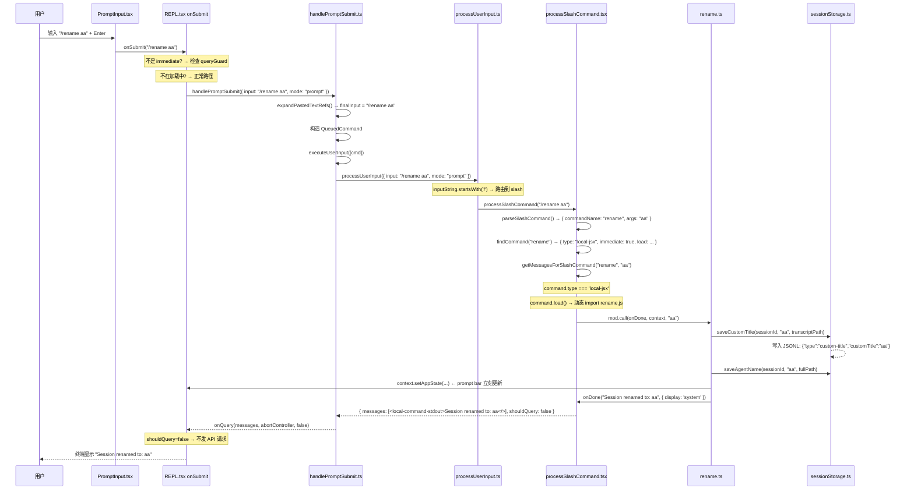
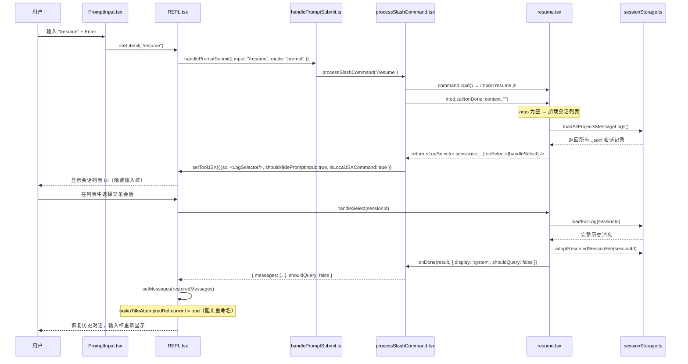

# 输入命令处理全链路

> 覆盖范围：用户按下 Enter 后的完整旅程。从 `PromptInput` 触发 `onSubmit`，经过队列、`handlePromptSubmit`、`processUserInput`，到三种命令类型（local / local-jsx / prompt）的执行，以及所有 80+ 个命令的分类目录。

---

## 一、全局流程总览

```
用户键盘输入
    │
    ▼
PromptInput.tsx（Enter / keybinding）
    │
    ├─ immediate 命令？ → 直接 load() + call()，跳过队列
    ├─ 远程模式？ → activeRemote.sendMessage()，跳过本地处理
    │
    ▼（正常路径）
REPL.onSubmit()
    │
    ├─ 正在加载中？ → enqueue() 入队，等待当前轮次完成
    │
    ▼
handlePromptSubmit()          src/utils/handlePromptSubmit.ts
    │
    ├─ 扩展粘贴文本占位符
    ├─ 过滤孤立图片
    │
    ▼
executeUserInput()
    │
    ├─ queryGuard.reserve() 防并发锁
    ├─ for 循环处理每条 QueuedCommand
    │
    ▼
processUserInput()            src/utils/processUserInput/processUserInput.ts
    │
    ├─ mode === 'bash'    → processBashCommand()
    ├─ startsWith('/')   → processSlashCommand()
    └─ 普通文本          → processTextPrompt()
```

---

## 二、PromptInput 触发（起点）

### 两种触发路径

**路径 A — Enter 键**

`TextInput`（来自 `@anthropic/ink`）内置 Enter 监听，通过 `onSubmit` prop 上报给 `PromptInput.tsx`：

```tsx
// PromptInput.tsx（简化）
<TextInput
  value={input}
  onSubmit={value => void onSubmit(value)}
/>
```

**路径 B — 历史搜索选择**

```ts
useHistorySearch(entry => {
  setPastedContents(entry.pastedContents)
  void onSubmit(entry.display)
})
```

### REPL.onSubmit 内部的提前 return 判断

`onSubmit` 在调用 `handlePromptSubmit` 之前，按顺序做以下判断，**命中即 return**：

| 顺序 | 条件 | 动作 |
|------|------|------|
| 1 | 输入被路由到 pipe 目标 | `routeToSelectedPipes(input)` |
| 2 | 正在处理中 **且** 是 `immediate: true` 的 local-jsx 命令 | 直接 `load()` → `call(onDone)` → `setToolJSX()` |
| 3 | speculation 接受 | `handleSpeculationAccept()` |
| 4 | 远程模式下的非本地命令 | `activeRemote.sendMessage()` 发往 WebSocket |
| 5 | 正常路径 | `await handlePromptSubmit(...)` |

---

## 三、队列机制

### 模块：`src/utils/messageQueueManager.ts`

队列是**模块级单例**，不是 React state。React 通过 `useSyncExternalStore` 订阅变化。

```ts
type QueuedCommand = {
  value: string | Array<ContentBlockParam>  // 文本或多模态内容块
  mode: PromptInputMode                      // 'prompt' | 'bash' | 'orphaned-permission' 等
  priority?: 'now' | 'next' | 'later'
  uuid?: UUID
  pastedContents?: Record<number, PastedContent>
  skipSlashCommands?: boolean
  bridgeOrigin?: boolean
  isMeta?: boolean                           // true = 模型可见但用户不可见
}
```

| 函数 | 默认优先级 | 典型调用方 |
|------|-----------|-----------|
| `enqueue()` | `'next'` | 用户在 loading 期间输入的命令 |
| `enqueuePendingNotification()` | `'later'` | 后台任务完成通知、Chrome 扩展消息 |

优先级顺序：`now(0) > next(1) > later(2)`，同级 FIFO。

### input 为 Array\<ContentBlockParam\> 的两种来源

正常用户输入 `value` 都是 `string`（图片通过 `pastedContents` 单独传递）。
`value` 为数组只发生在：

| 来源 | 场景 |
|------|------|
| **Claude for Chrome 扩展** | 扩展截图 + 文字发给 Claude Code，已打包成 `[{type:'text',...}, {type:'image',...}]` |
| **Bridge / RCS 入站消息** | 从 claude.ai 网页端或远程控制服务器发来的含图片附件消息 |

---

## 四、handlePromptSubmit 前置处理

文件：`src/utils/handlePromptSubmit.ts`

```
handlePromptSubmit(params)
    │
    ├─ queuedCommands 已传入 → 直接 executeUserInput()，跳过以下步骤
    │
    ├─ 1. 过滤孤立图片
    │       referencedIds = parseReferences(input)
    │       pastedContents = filter(图片 ID 在 input 中有引用的)
    │
    ├─ 2. 空输入检查 → return
    │
    ├─ 3. 退出命令识别（exit/quit/:q/:wq 等）
    │       → handlePromptSubmit('/exit') 或 process.exit()
    │
    ├─ 4. 扩展粘贴文本占位符
    │       expandPastedTextRefs(input) → finalInput
    │       （[Pasted text #N] → 实际文本内容）
    │
    ├─ 5. immediate 命令 + 正在加载中
    │       → load() + call(onDone)，提前 return
    │
    ├─ 6. 正在加载中（queryGuard.isActive）
    │       → enqueue({ value: finalInput, ... })，提前 return
    │
    └─ 7. 正常路径
            → 构造 QueuedCommand → executeUserInput([cmd], ...)
```

### executeUserInput

```ts
async function executeUserInput(params): Promise<void>
  // 1. 创建 AbortController
  // 2. queryGuard.reserve() — 防止并发执行
  // 3. for (const cmd of queuedCommands):
  //      result = await processUserInput({ input: cmd.value, mode: cmd.mode, ... })
  //      newMessages.push(...result.messages)
  // 4. onQuery(newMessages, abortController, shouldQuery, ...)
  //    → 触发 API 调用（如果 shouldQuery=true）
```

> **注意**：多条排队命令时，只有第一条命令的 `shouldQuery`、`model`、`effort` 有效；
> 只有第一条命令传入 `pastedContents`（后续命令 `skipAttachments=true`）。

---

## 五、processUserInput 三叉路由

文件：`src/utils/processUserInput/processUserInput.ts`

```
input: string | Array<ContentBlockParam>
    │
    ├─ Array<ContentBlockParam>（多模态）
    │     → 提取末尾 text block 为 inputString
    │     → 处理图片尺寸（maybeResizeAndDownsampleImageBlock）
    │
    └─ string → inputString = input
    
    判断路由（按此顺序）：
    │
    ├─ mode === 'bash'
    │     └─ processBashCommand()
    │
    ├─ inputString.startsWith('/') && !skipSlashCommands
    │     └─ processSlashCommand()
    │
    └─ 其他（普通文本）
          └─ processTextPrompt()
```

### 路由 1：bash 模式（`! cmd`）

用户输入 `!ls -la`，PromptInput 将 mode 设为 `'bash'`，value 为 `ls -la`（去掉 `!`）。

```ts
// processBashCommand.ts
const userMessage = createUserMessage({
  content: `<bash-input>${inputString}</bash-input>`,
})
// shouldQuery: true — 发给模型让 BashTool 执行
```

### 路由 2：slash 命令

见下一节。

### 路由 3：普通文本

`processTextPrompt()` 直接包装成 UserMessage，`shouldQuery: true`，发往 API。

---

## 六、Slash 命令完整处理链

### Step 1：解析（parseSlashCommand）

文件：`src/utils/slashCommandParsing.ts`

```ts
parseSlashCommand('/rename aa')
// → { commandName: 'rename', args: 'aa', isMcp: false }

parseSlashCommand('/mcp:tool (MCP) arg1')
// → { commandName: 'mcp:tool (MCP)', args: 'arg1', isMcp: true }

parseSlashCommand('/')
// → null（无命令名）
```

**解析规则：**
1. 不以 `/` 开头 → 返回 `null`
2. 去掉 `/`，按空格拆分
3. 检查 `words[1] === '(MCP)'`：是则 `isMcp=true`，commandName 追加 ` (MCP)`
4. 否则 `commandName = words[0]`，`args = words.slice(1).join(' ')`

### Step 2：查找命令（findCommand）

```ts
findCommand('rename', context.options.commands)
// → 从 getCommands() 返回的完整列表里找（含别名匹配）
```

**命令未找到时的行为：**
- 看起来像命令名（仅含 `[a-zA-Z0-9:\-_]`）→ 报错 `Unknown skill: xxx`
- 看起来像文件路径（`/var/tmp/...`）→ 当作普通文本发给模型，`shouldQuery: true`

### Step 3：执行（getMessagesForSlashCommand）

按 `command.type` 分三条路：

```
command.type
    │
    ├─ 'local'      → mod.call(args, context)
    │                 返回 { type: 'text', value } 或 { type: 'compact' }
    │
    ├─ 'local-jsx'  → mod.call(onDone, context, args)
    │                 可返回 JSX（展示交互 UI）或直接调 onDone()
    │
    └─ 'prompt'
          ├─ context !== 'fork' → getMessagesForPromptSlashCommand()
          │     展开 skill 内容，shouldQuery: true，发给模型
          │
          └─ context === 'fork' → executeForkedSlashCommand()
                在独立 sub-agent 中运行，完成后结果重新入队
```

---

## 七、三种命令类型详解

### 7.1 local 类型

**特点**：同步/async 纯逻辑，无 UI，结果作为系统消息显示。

```ts
// 定义示例（src/commands/clear/index.ts）
const clear: Command = {
  type: 'local',
  name: 'clear',
  aliases: ['reset', 'new'],
  description: '清空对话历史',
  load: () => import('./conversation.js'),
}

// 模块导出
export async function call(args: string, context: ToolUseContext)
  : Promise<LocalCommandResult>
// LocalCommandResult:
//   { type: 'text', value: string }
//   { type: 'compact', compactionResult, displayText? }
//   { type: 'skip' }   ← 不产生任何消息
```

`shouldQuery: false` — 不发 API 请求，结果直接以 `<local-command-stdout>` 显示。

### 7.2 local-jsx 类型

**特点**：可返回 React JSX 组件，用于需要交互 UI 的命令。

```ts
// 定义示例（src/commands/resume/index.ts）
const resume: Command = {
  type: 'local-jsx',
  name: 'resume',
  aliases: ['continue'],
  load: () => import('./resume.js'),
  // immediate?: true → 查询进行中时也允许立即执行
}

// 模块导出
export async function call(
  onDone: LocalJSXCommandOnDone,
  context: ToolUseContext & LocalJSXCommandContext,
  args: string,
): Promise<ReactNode | null>
```

**两种完成路径：**

| 路径 | 说明 |
|------|------|
| 直接调 `onDone(result, options)` | 同步完成，不显示 UI（如 `/rename aa`） |
| 返回 JSX，等用户操作后再调 `onDone` | 展示交互组件（如 `/resume` 的会话列表） |

`onDone` 的 `options.display`：
- `'system'` → 结果包裹在 `<local-command-stdout>` 里，不发 API
- `'skip'` → 完全不产生消息
- 默认 → 结果作为 UserMessage，`shouldQuery` 由 options 决定

**`immediate: true` 的特殊行为：**

当 `immediate: true` 且 Claude 正在处理其他请求时，该命令**绕过队列立即执行**，不等待当前轮次结束。适用于 `/exit`、`/rename`、`/status` 等"不需要上下文"的命令。

### 7.3 prompt 类型（skill）

**特点**：将 skill 文件内容展开，作为 UserMessage 发给模型，让模型执行。

```ts
// 动态加载，不在 src/commands/*/index.ts 里定义
// 来源：~/.claude/skills/*.md、.claude/skills/*.md、插件、MCP
{
  type: 'prompt',
  name: 'commit',
  context?: 'inline' | 'fork',  // fork = 在子 agent 运行
  getPromptForCommand(args, context): Promise<ContentBlockParam[]>
}
```

**`context: 'fork'` 的执行流程：**

```
executeForkedSlashCommand()
    │
    ├─ kairosEnabled → 后台异步模式：
    │     void (async () => { runAgent(...) })()
    │     立即 return { messages: [], shouldQuery: false }
    │     完成后：enqueuePendingNotification({ value: '<scheduled-task-result>...' })
    │
    └─ 普通模式：
          for await (const message of runAgent(...)) { ... }
          显示进度 UI（setToolJSX）
          完成后返回 { messages: [结果消息], shouldQuery: false }
```

---

## 八、getCommands() 命令注册机制

文件：`src/commands.ts`

```ts
getCommands(cwd, options)
    │
    ├─ 1. COMMANDS() — 内置命令（约 80 个，部分按 feature/env 条件注册）
    │       feature('BRIDGE_MODE') → bridge、remoteControlServer
    │       feature('DAEMON')     → daemon
    │       process.env.USER_TYPE === 'ant' → ~20 个内部命令
    │
    ├─ 2. getSkillDirCommands(cwd) — 用户 skill 目录
    │       ~/.claude/skills/*.md、.claude/skills/*.md
    │
    ├─ 3. getPluginSkills() — 已安装插件的 skill
    │
    ├─ 4. getBundledSkills() — 打包进产物的内置 skill
    │
    └─ 5. getMcpCommands() — MCP 服务器动态注册的命令
```

**优先级**：skill 不覆盖同名内置命令（内置命令优先）。

---

## 九、命令完整目录

### local 类型（纯逻辑，无 UI）

| 命令名 | 别名 | 描述 |
|--------|------|------|
| `attach` | — | 通过命名管道 attach 到子 Claude CLI |
| `clear` | reset, new | 清空对话历史 |
| `compact` | — | 压缩对话，保留摘要 |
| `detach` | — | 从子 CLI 断开 |
| `env` | — | 显示当前环境/runtime/feature flag 状态 |
| `files` | — | 列出 context 中所有文件 |
| `heapdump` | — | 导出 JS heap 到 ~/Desktop |
| `history` | hist | 查看已连接子 CLI 的会话历史 |
| `keybindings` | — | 打开/创建快捷键配置文件 |
| `peers` | who | 列出连接的 Claude Code 节点 |
| `poor` | — | 切换穷鬼模式（跳过 extract_memories 等） |
| `release-notes` | — | 查看发版说明 |
| `rewind` | checkpoint | 回退到检查点 |
| `send` | — | 向子 CLI 发送消息 |
| `share` | — | 上传会话日志到 GitHub Gist |
| `vim` | — | 切换 Vim/Normal 编辑模式 |
| `voice` | — | 切换语音输入模式 |

### local-jsx 类型（可带交互 UI）

| 命令名 | 别名 | immediate | 描述 |
|--------|------|-----------|------|
| `add-dir` | — | — | 添加工作目录 |
| `agents` | — | — | 管理 agent 配置 |
| `agents-platform` | agents, schedule-agent | — | 管理远程 agent 触发器 |
| `autofix-pr` | — | — | 自动修复 PR 的 CI 失败 |
| `branch` | — | — | 创建对话分支 |
| `btw` | — | ✅ | 快速侧问，不中断主对话 |
| `chrome` | — | — | Claude in Chrome 设置 |
| `color` | — | ✅ | 设置 prompt bar 颜色 |
| `config` | settings | — | 打开配置面板 |
| `context` | — | — | 可视化 context 用量 |
| `copy` | — | — | 复制最新回复到剪贴板 |
| `daemon` | — | — | 管理后台 session 和 daemon |
| `desktop` | app | — | 在 Claude Desktop 中继续会话 |
| `diff` | — | — | 查看未提交变更和 per-turn diff |
| `doctor` | — | — | 诊断 Claude Code 安装和设置 |
| `effort` | — | 动态 | 设置模型 effort 级别 |
| `exit` | quit | ✅ | 退出 REPL |
| `export` | — | — | 导出对话到文件/剪贴板 |
| `fork` | — | — | Fork 当前会话为新 sub-agent |
| `goal` | — | — | 设置持久目标驱动自动续写 |
| `help` | — | — | 显示帮助和可用命令 |
| `ide` | — | — | 管理 IDE 集成 |
| `install-github-app` | — | — | 为仓库设置 GitHub Actions |
| `lang` | — | ✅ | 设置显示语言（en/zh/auto） |
| `login` | — | — | 登录账户 |
| `logout` | — | — | 退出账户 |
| `mcp` | — | ✅ | 管理 MCP 服务器（enable/disable） |
| `memory` | — | — | 编辑 Claude memory 文件 |
| `memory-stores` | memstore | — | 管理远程 memory store |
| `mobile` | ios, android | — | 显示下载移动应用的二维码 |
| `mode` | — | — | 切换交互模式 |
| `model` | — | — | 查看/切换当前模型 |
| `onboarding` | — | — | 重新运行首次设置向导 |
| `permissions` | allowed-tools | — | 管理工具权限规则 |
| `plan` | — | — | 开启 plan 模式或查看计划 |
| `remote-control` | rc | ✅ | 连接终端供远程控制 |
| `remote-control-server` | rcs | ✅ | 启动持久 Remote Control 服务器 |
| `rename` | — | ✅ | 重命名当前对话 |
| `resume` | continue | — | 恢复历史对话（弹出列表 UI） |
| `session` | remote | — | 显示远程 session URL 和二维码 |
| `skills` | — | — | 列出可用 skill |
| `status` | — | ✅ | 显示版本/模型/账户/API 状态 |
| `tag` | — | — | 为当前 session 切换标签 |
| `tasks` | bashes | — | 列出并管理后台任务 |
| `teleport` | tp | — | 从 claude.ai 恢复 Claude Code 会话 |
| `theme` | — | — | 更改 UI 主题 |
| `triggers` | cron | — | 管理远程 agent 触发器 |
| `usage` | cost, stats | — | 显示会话费用和计划用量统计 |
| `web-tools` | — | — | 配置 web search/fetch 后端 |
| `workflows` | — | — | Workflow 监控面板 |

### prompt 类型（skill，动态加载）

`prompt` 类型命令不在 `src/commands/*/index.ts` 中定义，由运行时动态加载：

| 来源 | 路径/描述 |
|------|----------|
| 用户 skill | `~/.claude/skills/*.md`、`.claude/skills/*.md` |
| 插件 skill | 已安装插件提供 |
| 内置 skill | 编译进产物（`getBundledSkills`） |
| MCP skill | MCP 服务器动态注册 |

`context: 'fork'` 的 skill 会在独立 sub-agent 中运行（如 `/commit`、`/code-review`）。

---

## 十、关键数据流：合成消息标签

命令执行产生的消息不是普通用户文字，而是带 XML 标签的合成消息。这些标签用于后续判断（如是否生成 session 标题）：

| 标签 | 来源 | 含义 |
|------|------|------|
| `<bash-input>cmd</bash-input>` | `! cmd` 的 bash 模式 | 用户执行的 shell 命令 |
| `<command-name>/rename</command-name>` | slash 命令面包屑 | 记录执行了哪个命令 |
| `<command-message>rename</command-message>` | slash 命令面包屑 | 命令名（不含斜杠） |
| `<command-args>aa</command-args>` | slash 命令面包屑 | 命令参数 |
| `<local-command-stdout>...</local-command-stdout>` | local/local-jsx 命令输出 | 命令的标准输出 |
| `<local-command-stderr>...</local-command-stderr>` | 命令执行出错 | 错误信息 |

这些标签开头的消息会被 REPL 的标题生成逻辑跳过（不视为"真实用户对话"）：

```ts
// REPL.tsx:3379-3385
if (
  text &&
  !text.startsWith(`<${LOCAL_COMMAND_STDOUT_TAG}>`) &&
  !text.startsWith(`<${COMMAND_MESSAGE_TAG}>`) &&
  !text.startsWith(`<${COMMAND_NAME_TAG}>`) &&
  !text.startsWith(`<${BASH_INPUT_TAG}>`)
) {
  void generateSessionTitle(text, ...)  // 只有真实散文才生成标题
}
```

---

## 十一、完整时序图：/rename aa



---

## 十二、完整时序图：/resume（无参数，交互 UI）


