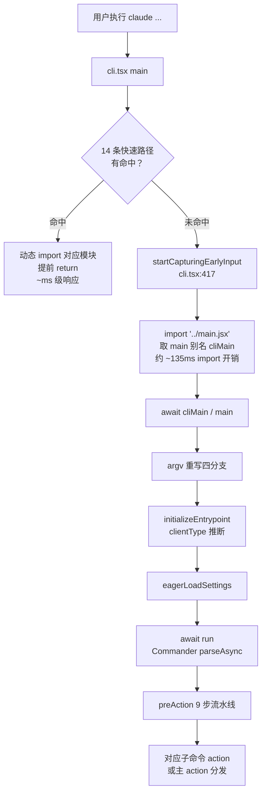
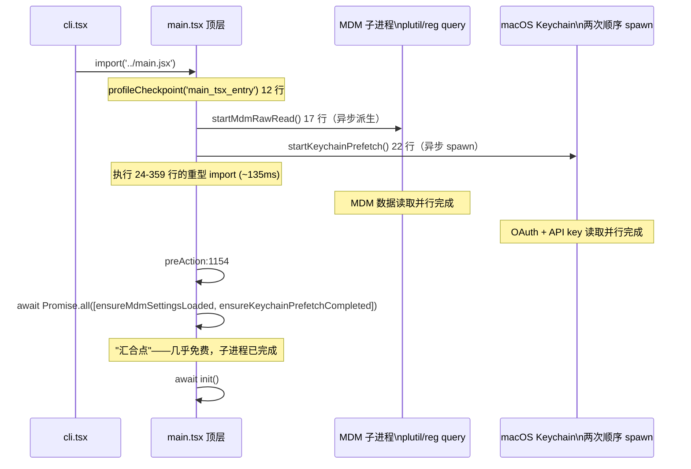
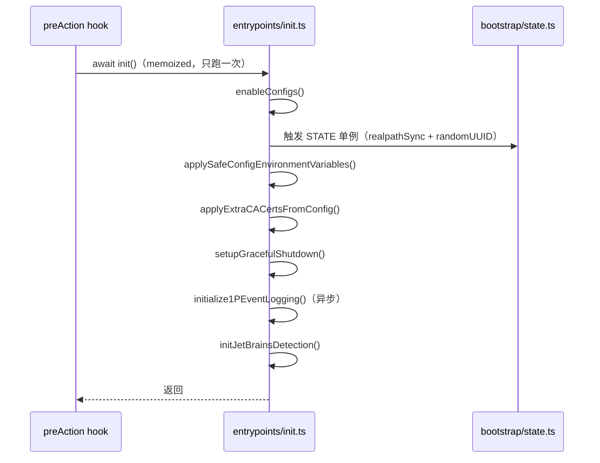
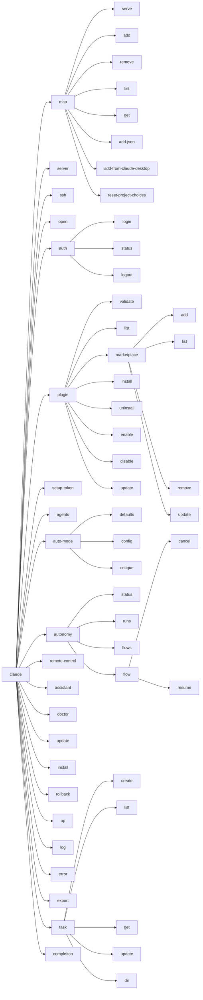
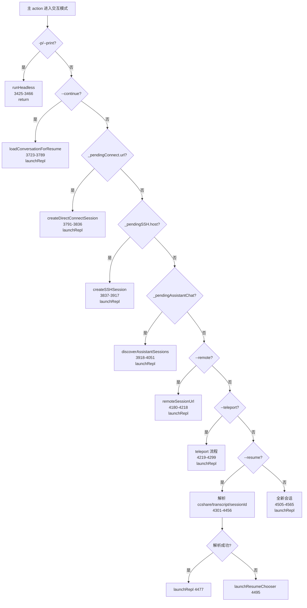
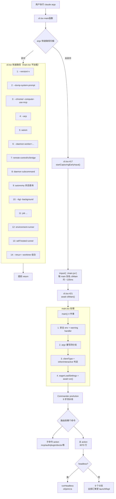

# 启动入口深度学习 · src/main.tsx

> `src/main.tsx` 是 Claude Code CLI 的"装配车间"：所有 `claude` 命令的语法定义、参数解析、初始化流水线、以及最终分发到 REPL 或 headless 模式，都在这 5743 行里完成。理解它等价于理解"`claude` 这条命令从语法层面到执行层面究竟支持什么、怎么走"。

---

## 一、全局视野

### 1.1 文件规模一览

| 指标 | 数量 | 说明 |
|---|---|---|
| 总行数 | 5743 | `wc -l` 实测 |
| `.command(...)` 调用 | 58 | 含 stub 和父命令 |
| `.option(...)` / `.addOption(...)` | 163 | 主命令 + 所有子命令累计 |
| `.action(...)` 调用 | 52 | 每个可执行命令一个 |
| 导出函数 | 2 | `main` + `startDeferredPrefetches` |
| 顶层非导出函数 | 18 | `run` / `getInputPrompt` / `runMigrations` 等 |

### 1.2 与 cli.tsx 的责任分工



**14 条快速路径（cli.tsx 拦截）：**

| # | 触发条件 | 拦截内容 |
|---|---|---|
| 1 | `--version` / `-v` / `-V` | 零模块加载，直接打印 |
| 2 | `--dump-system-prompt` | 打印系统提示词后退出 |
| 3 | `--claude-in-chrome-mcp` / `--chrome-native-host` / `--computer-use-mcp` | 对应 MCP server 模式 |
| 4 | `--acp` | Agent Client Protocol stdio |
| 5 | `weixin` | 微信集成 |
| 6 | `--daemon-worker=<kind>` | Daemon supervisor 派生 |
| 7 | `remote-control` / `rc` / `remote` / `sync` / `bridge` | Bridge 模式 |
| 8 | `daemon [subcommand]` | Daemon 长驻进程 |
| 9 | `autonomy ...`（部分查询） | 状态查询快速路径 |
| 10 | `--bg` / `--background` | 后台 daemon 模式 |
| 11 | `job ...` | Template job 命令 |
| 12 | `environment-runner` | BYOC runner |
| 13 | `self-hosted-runner` | 自托管 runner |
| 14 | `--tmux + --worktree` 组合 | `execIntoTmuxWorktree(args)` 直接 exec |

### 1.3 文件按职责切片

| 行号范围 | 内容 |
|---|---|
| `1-22` | 顶层副作用（3 个必须先于 import 的调用） |
| `24-359` | 主体 imports（Commander / chalk / lodash / services 等） |
| `360-511` | 模块级函数和常量（遥测 / migrations / prefetch） |
| `512-691` | Settings 早加载 / `eagerLoadSettings` |
| `692-717` | `initializeEntrypoint()`（设置 `CLAUDE_CODE_ENTRYPOINT`） |
| `718-763` | 三套 pending 模块单例类型 + 初始化 |
| `777-1072` | `main()` 导出函数（argv 重写 + clientType 推断 + 调用 run） |
| `1074-1107` | `getInputPrompt()`（stdin 3 秒超时拼接） |
| `1122-1209` | `run()` 开头 + preAction hook（9 步流水线） |
| `1211-1493` | 主命令 `program.name()` + 所有 `.option(...)` 注册 |
| `1495-4566` | 主 `.action(...)`（约 3070 行的巨型 handler） |
| `4567-4695` | `.version()` + worktree/tmux/ant/remote 等 option |
| `4720-5546` | 全部子命令注册（`mcp` → `task`） |
| `5562-5743` | 尾部辅助（`logTenguInit` / `maybeActivateProactive` / `extractTeammateOptions`） |

---

## 二、顶层副作用（前 22 行的"优先并行"）

```ts
// src/main.tsx:1-22
// 这些副作用必须先于所有其他 import 运行：
// 1. profileCheckpoint 在重量级模块求值开始前标记入口
// 2. startMdmRawRead 触发 MDM 子进程（plutil/reg query），让它们与
//    下面剩余约 ~135ms 的 import 并行运行
// 3. startKeychainPrefetch 同时触发两次 macOS keychain 读取（OAuth + 旧版 API
//    key）—— 否则会在 applySafeConfigEnvironmentVariables() 内部同步顺序读取
//    （每次 macOS 启动约 ~65ms）
import { profileCheckpoint } from './utils/startupProfiler.js';
profileCheckpoint('main_tsx_entry');        // 第 12 行

import { startMdmRawRead } from './utils/settings/mdm/rawRead.js';
startMdmRawRead();                          // 第 17 行

import { startKeychainPrefetchCompleted, startKeychainPrefetch } from './utils/secureStorage/keychainPrefetch.js';
startKeychainPrefetch();                    // 第 22 行
```

**为什么要这样排列？** 时序图展示"并行化"的价值：



**汇合点**：`preAction` 的第一件事（`main.tsx:1154`）是 `await Promise.all([ensureMdmSettingsLoaded(), ensureKeychainPrefetchCompleted()])`——等待这两个预取完成。因为子进程在 ~135ms 的 import 期间早已完成，这里几乎是 0 等待。

---

## 三、`main()` 函数与 argv 重写

### 3.1 `main()` 的四件事

`main()` 函数（`777-1072`）按顺序完成四件事：

```ts
// src/main.tsx:777 简化示意
export async function main() {
  // 1. 安全环境变量 + warning handler + 进程退出清理（789-811）
  process.env.NoDefaultCurrentDirectoryInExePath = '1'; // 防 Windows PATH 劫持
  initializeWarningHandler();

  // 2. argv 重写四分支（817-993）
  // → cc:// URL / --handle-uri / assistant / ssh

  // 3. isNonInteractive 判定 + clientType 9 种推断（997-1040）
  const isNonInteractive = hasPrintFlag || hasInitOnlyFlag || hasSdkUrl || (!forceInteractive && !process.stdout.isTTY);

  // 4. eagerLoadSettings + 调用 run()（1065-1070）
  eagerLoadSettings();
  await run();
}
```

### 3.2 三套 pending 模块单例

这三套"暂存-消费"状态对象是 `main.tsx` 最独特的设计模式：`main()` 写入，主 action 消费。

```ts
// src/main.tsx:725-763
const _pendingConnect: PendingConnect | undefined = feature('DIRECT_CONNECT')
  ? { url: undefined, authToken: undefined, dangerouslySkipPermissions: false }
  : undefined;

const _pendingAssistantChat: PendingAssistantChat | undefined = feature('KAIROS')
  ? { sessionId: undefined, discover: false }
  : undefined;

const _pendingSSH: PendingSSH | undefined = feature('SSH_REMOTE')
  ? { host: undefined, cwd: undefined, permissionMode: undefined,
      dangerouslySkipPermissions: false, local: false,
      extraCliArgs: [], remoteBin: undefined }
  : undefined;
```

**为什么是模块级变量而非函数参数？**

Commander 的 `parseAsync` 会自动分发到对应 `.action(handler)`，`main()` 无法直接把数据传给 action handler。模块级变量是这种"argv 预解析 → action 消费"跨函数通信的唯一方式。

| 变量 | 功能守卫 | main() 写入位置 | 主 action 消费位置 |
|---|---|---|---|
| `_pendingConnect` | `DIRECT_CONNECT` | `817-845`（cc:// URL 时） | `3791-3836` |
| `_pendingAssistantChat` | `KAIROS` | `881-896`（`assistant` argv 时） | `3918-4051` |
| `_pendingSSH` | `SSH_REMOTE` | `902-993`（`ssh` argv 时） | `3837-3917` |

### 3.3 四条 argv 重写分支

#### 3.3.1 `cc://` URL 重写（`817-846`）

```ts
// src/main.tsx:817
if (feature('DIRECT_CONNECT')) {
  const ccIdx = rawCliArgs.findIndex(a => a.startsWith('cc://') || a.startsWith('cc+unix://'));
  if (ccIdx !== -1 && _pendingConnect) {
    if (rawCliArgs.includes('-p') || rawCliArgs.includes('--print')) {
      // Headless 模式：改写为内部 open 子命令
      process.argv = [..., 'open', ccUrl, ...stripped];
    } else {
      // 交互模式：剥离 cc:// URL，暂存到 _pendingConnect
      _pendingConnect.url = parsed.serverUrl;
      _pendingConnect.authToken = parsed.authToken;
      process.argv = [..., ...stripped]; // 去掉 ccUrl 和 --dangerously-skip-permissions
    }
  }
}
```

两种行为的分叉：

| 模式 | 改写结果 | 最终路径 |
|---|---|---|
| 交互（默认） | 剥离 ccUrl，主命令看到干净 argv | 主 action `3791` 消费 `_pendingConnect.url` → `createDirectConnectSession` → `launchRepl` |
| Headless（`-p`） | 改写为 `['open', ccUrl, ...]` | `open` 子命令 action（`4927`） |

**示例：**

```bash
# 交互模式 —— 打开远端 session 的完整 TUI
claude cc://host:port/token

# Headless 模式 —— 向远端发一条 prompt
claude -p "git log --oneline" cc://host:port/token --output-format=json
# 改写后 argv: ['open', 'cc://host:port/token', '-p', 'git log ...', '--output-format=json']
```

#### 3.3.2 `--handle-uri` deep link（`851-872`）

```ts
// src/main.tsx:851
if (feature('LODESTONE')) {
  const handleUriIdx = process.argv.indexOf('--handle-uri');
  if (handleUriIdx !== -1) {
    const uri = process.argv[handleUriIdx + 1]!;
    const { handleDeepLinkUri } = await import('./utils/deepLink/protocolHandler.js');
    const exitCode = await handleDeepLinkUri(uri);
    process.exit(exitCode); // 直接 exit，不进入 Commander
  }

  // macOS LaunchServices 入口：__CFBundleIdentifier 被 bundle 覆盖
  if (process.platform === 'darwin' && process.env.__CFBundleIdentifier === 'com.anthropic.claude-code-url-handler') {
    const { handleUrlSchemeLaunch } = await import('./utils/deepLink/protocolHandler.js');
    process.exit(await handleUrlSchemeLaunch() ?? 1);
  }
}
```

这条路径**不暂存到模块单例**，处理完直接 `process.exit()`。macOS 在用户点击 `claude://...` 链接时，通过 LaunchServices 启动 app bundle，会把 `__CFBundleIdentifier` 覆盖为 bundle ID，这是比解析 argv 更精确的检测信号。

#### 3.3.3 `assistant [sessionId]` KAIROS 模式（`881-896`）

```ts
// src/main.tsx:881
if (feature('KAIROS') && _pendingAssistantChat) {
  const rawArgs = process.argv.slice(2);
  if (rawArgs[0] === 'assistant') {              // 只匹配位置 0
    const nextArg = rawArgs[1];
    if (nextArg && !nextArg.startsWith('-')) {
      _pendingAssistantChat.sessionId = nextArg; // claude assistant <uuid>
      rawArgs.splice(0, 2);
    } else if (!nextArg) {
      _pendingAssistantChat.discover = true;     // claude assistant（无 id → 弹选择器）
      rawArgs.splice(0, 1);
    }
    process.argv = [process.argv[0]!, process.argv[1]!, ...rawArgs];
  }
}
```

**为什么只匹配位置 0？** 防止 `claude -p "explain assistant mode"` 误判——`-p` 在前时 `rawArgs[0]` 是 `-p` 而非 `assistant`。

**示例：**

```bash
claude assistant                  # discover=true → launchAssistantSessionChooser
claude assistant abc-def-123      # sessionId='abc-def-123' → 直接连接
claude assistant --help           # 落入 stub 子命令，打印帮助
```

#### 3.3.4 `ssh <host> [dir]` SSH 远程（`902-993`）

这是最复杂的 argv 重写，会从 argv 中抽走 7 个专属 flag：

```ts
// src/main.tsx:902
if (feature('SSH_REMOTE') && _pendingSSH) {
  if (rawCliArgs[0] === 'ssh') {
    // 1. 预抽 SSH 专属标志
    _pendingSSH.local    = 提取 --local
    _pendingSSH.dangerouslySkipPermissions = 提取 --dangerously-skip-permissions
    _pendingSSH.permissionMode = 提取 --permission-mode <val>
    _pendingSSH.remoteBin      = 提取 --remote-bin <val>

    // 2. 转发给远程首次派生的标志（存入 extraCliArgs）
    extractFlag('-c', { as: '--continue' });
    extractFlag('--resume', { hasValue: true });
    extractFlag('--model',  { hasValue: true });

    // 3. 读 host [dir]（非 dash 参数）
    if (rawCliArgs[1] && !rawCliArgs[1].startsWith('-')) {
      _pendingSSH.host = rawCliArgs[1];
      _pendingSSH.cwd  = rawCliArgs[2] && !rawCliArgs[2].startsWith('-') ? rawCliArgs[2] : undefined;
      process.argv = [argv[0], argv[1], ...rest]; // 去掉 'ssh', host, dir
    }
  }
}
```

**v1 约束**：`-p/--print` 与 `ssh` 不兼容，会在第 `984-988` 行提前报错退出。

**示例：**

```bash
claude ssh user@host /app            # host='user@host', cwd='/app'
claude ssh host --permission-mode auto --resume abc123
# _pendingSSH.permissionMode='auto', extraCliArgs=['--resume','abc123']
claude ssh host --local              # e2e 测试模式，跳过真实 SSH
```

### 3.4 `clientType` 9 种推断（`1022-1040`）

```ts
// src/main.tsx:1022
const clientType = (() => {
  if (GITHUB_ACTIONS)                                                    return 'github-action';
  if (CLAUDE_CODE_ENTRYPOINT === 'sdk-ts')                               return 'sdk-typescript';
  if (CLAUDE_CODE_ENTRYPOINT === 'sdk-py')                               return 'sdk-python';
  if (CLAUDE_CODE_ENTRYPOINT === 'sdk-cli')                              return 'sdk-cli';
  if (CLAUDE_CODE_ENTRYPOINT === 'claude-vscode')                        return 'claude-vscode';
  if (CLAUDE_CODE_ENTRYPOINT === 'local-agent')                          return 'local-agent';
  if (CLAUDE_CODE_ENTRYPOINT === 'claude-desktop')                       return 'claude-desktop';
  if (CLAUDE_CODE_ENTRYPOINT === 'remote' || hasSessionIngressToken)     return 'remote';
  return 'cli';
})();
```

`clientType` 会影响遥测归因、权限检查、功能开关等下游逻辑。

### 3.5 `getInputPrompt()`——stdin 拼接（`1074-1107`）

```ts
// src/main.tsx:1074
async function getInputPrompt(prompt: string, inputFormat: 'text' | 'stream-json') {
  if (!process.stdin.isTTY && !process.argv.includes('mcp')) {
    if (inputFormat === 'stream-json') return process.stdin; // 直接返回流
    // text 模式：收集 stdin，等 3 秒
    // 超时则打印警告并继续（防止继承的僵尸管道）
    const timedOut = await peekForStdinData(process.stdin, 3000);
    return [prompt, data].filter(Boolean).join('\n');
  }
  return prompt; // TTY 模式：直接返回命令行 prompt
}
```

**设计细节**：3 秒超时覆盖了"慢生产者"（curl、大文件的 jq、带 import 开销的 python），超时后打印警告而非静默截断。MCP 模式排除 stdin 劫持，避免干扰 MCP 协议帧。

---

## 四、run() + preAction：每次执行前的固定流水线

### 4.1 preAction 9 步流水线（`1146-1209`）

`program.hook('preAction', ...)` 在**每个子命令或主命令的 action 执行前**统一运行，显示 `--help` 时不触发。

| 步骤 | 行号 | 调用 | 作用 |
|---|---|---|---|
| 1 | `1147` | `profileCheckpoint('preAction_start')` | 性能计时 |
| 2 | `1154` | `await Promise.all([ensureMdmSettingsLoaded(), ensureKeychainPrefetchCompleted()])` | 等待顶层 17/22 行启动的两个预取完成（汇合点） |
| 3 | `1156` | `await init()` | 执行 `entrypoints/init.ts:89` 的 memoized 初始化（apply env vars / analytics / graceful shutdown） |
| 4 | `1163-1165` | `process.title = 'claude'` | 终端标签/任务管理器显示 `claude`（除非 `CLAUDE_CODE_DISABLE_TERMINAL_TITLE`） |
| 5 | `1172-1173` | `initSinks()` | 挂载日志 sink，子命令 action（doctor/mcp/plugin）也能使用 `logEvent` |
| 6 | `1184-1188` | `setInlinePlugins()` + `clearPluginCache()` | 处理 `--plugin-dir` option，让 plugin 系统在所有子命令中可用 |
| 7 | `1190` | `runMigrations()` | 跑 9 项 migration（版本号 11，详见 4.2） |
| 8 | `1197-1198` | `loadRemoteManagedSettings()` + `loadPolicyLimits()` | 企业远程管理设置（非阻塞，fail-open） |
| 9 | `1204-1206` | `uploadUserSettingsInBackground()` | 上传本地 settings 到远端同步（feature gated） |

**关键 insight**：`init()` 是 memoized 的（`entrypoints/init.ts:89` 用了 memo wrapper），无论被 preAction 调用多少次，实际初始化代码只运行一次。这使得其他入口（cli.tsx 快速路径）也可以安全地独立调用 `init()`。

### 4.2 runMigrations() 9 项 migration（`484-510`）

```ts
// src/main.tsx:484
const CURRENT_MIGRATION_VERSION = 11;
function runMigrations(): void {
  if (getGlobalConfig().migrationVersion !== CURRENT_MIGRATION_VERSION) {
    migrateBypassPermissionsAcceptedToSettings();      // bypass perms 迁移到 settings
    migrateEnableAllProjectMcpServersToSettings();     // 启用所有 project MCP servers
    resetProToOpusDefault();                           // Pro 套餐 → 默认 Opus
    migrateSonnet1mToSonnet45();                       // Sonnet 1M → Sonnet 4.5
    migrateLegacyOpusToCurrent();                      // 旧 opus 系列 → 当前
    migrateSonnet45ToSonnet46();                       // Sonnet 4.5 → 4.6
    migrateOpusToOpus1m();                             // Opus → Opus 1m
    migrateReplBridgeEnabledToRemoteControlAtStartup();// bridge flag 改名
    if (feature('TRANSCRIPT_CLASSIFIER'))
      resetAutoModeOptInForDefaultOffer();             // auto-mode 重置
    if (process.env.USER_TYPE === 'ant')
      migrateFennecToOpus();                           // ant 内部：Fennec → Opus
    saveGlobalConfig(prev => ({ ...prev, migrationVersion: 11 }));
  }
  migrateChangelogFromConfig().catch(() => {}); // 异步 fire-and-forget
}
```

migration 是**幂等且版本号门控**的：只要 `migrationVersion !== 11` 才跑，完成后写入 11。

### 4.3 preAction 与 `init.ts` 的关系



### 4.4 `--help` 时不触发 preAction

Commander 内建行为：匹配到 `-h` / `--help` 后直接打印帮助并退出，**不会进入 preAction hook 也不会进入 action**。这意味着 `--help` 是零初始化成本的——无 keychain 读取、无 migration、无 init。

---

## 五、CLI 选项目录（主命令 option 分类）

### 5.1 调试与输出

| 选项 | 行号 | 说明 | 示例 |
|---|---|---|---|
| `-d, --debug [filter]` | `1218` | 启用 debug，可选过滤如 `"api,hooks"` 或 `"!1p"` | `claude --debug api` |
| `--debug-to-stderr` | `1228` | debug 输出到 stderr（hidden） | `claude --debug-to-stderr -p "..."` |
| `--debug-file <path>` | `1229` | 写 debug log 到文件，隐式开 debug | `claude --debug-file ./debug.log` |
| `--verbose` | `1234` | 覆盖 settings 中的 verbose 配置 | `claude --verbose` |
| `-p, --print` | `1235` | Headless / print 模式，无 TUI | `claude -p "说 hello"` |
| `--output-format <format>` | `1248` | `text` / `json` / `stream-json`（仅 `-p`） | `claude -p "..." --output-format=json` |
| `--include-hook-events` | `1261` | hook 生命周期事件加入输出流 | `claude -p "..." --include-hook-events` |
| `--include-partial-messages` | `1266` | 流式输出部分消息块 | `claude -p "..." --include-partial-messages` |
| `--input-format <format>` | `1271` | `text` / `stream-json`（仅 `-p`） | `echo '{"type":"user",...}' \| claude -p --input-format=stream-json` |
| `--json-schema <schema>` | `1254` | structured output 校验 schema | `claude -p "..." --json-schema '{"type":"object",...}'` |

**实战：SDK 双向流式调用**

```bash
claude --print \
  --input-format=stream-json \
  --output-format=stream-json \
  --sdk-url ws://localhost:3000
```

### 5.2 权限与安全

| 选项 | 行号 | 说明 | 示例 |
|---|---|---|---|
| `--permission-mode <mode>` | `1375` | 权限模式（`default`/`plan`/`auto`/`bypass`等） | `claude --permission-mode auto` |
| `--dangerously-skip-permissions` | `1282` | 绕过所有权限检查 | `claude --dangerously-skip-permissions -p "rm -rf ..."` |
| `--allow-dangerously-skip-permissions` | `1287` | 允许 dsp 但默认不开 | — |
| `--allowedTools <tools...>` | `1342` | 工具白名单 | `claude --allowedTools "Bash(git:*) Edit"` |
| `--disallowedTools <tools...>` | `1350` | 工具黑名单 | `claude --disallowedTools Read FileWrite` |
| `--tools <tools...>` | `1346` | 可用内建工具集（`""` 禁全部） | `claude --tools "default"` |

**实战：只允许 git 操作**

```bash
claude --allowedTools "Bash(git:*)" -p "帮我写一个 git commit 信息"
```

### 5.3 模型与思考

| 选项 | 行号 | 说明 | 示例 |
|---|---|---|---|
| `--model <model>` | `1431` | 模型别名或全名 | `claude --model sonnet` 或 `--model claude-sonnet-4-6` |
| `--effort <level>` | `1435` | `low`/`medium`/`high`/`max` | `claude --effort max` |
| `--thinking <mode>` | `1292` | `enabled`/`adaptive`/`disabled`（hidden） | `claude --thinking adaptive` |
| `--max-turns <turns>` | `1305` | 最大轮数（仅 `-p`，hidden） | `claude -p "..." --max-turns 5` |
| `--max-budget-usd <amount>` | `1313` | 美元预算上限（仅 `-p`） | `claude -p "..." --max-budget-usd 0.50` |
| `--betas <betas...>` | `1448` | API beta header | `claude --betas interleaved-thinking-2025-05-14` |
| `--fallback-model <model>` | `1449` | 主模型过载时回落（仅 `-p`） | `claude -p "..." --fallback-model haiku` |

### 5.4 会话恢复

| 选项 | 行号 | 说明 | 示例 |
|---|---|---|---|
| `-c, --continue` | `1380` | 继续当前 cwd 最近的会话 | `claude -c` |
| `-r, --resume [value]` | `1381` | 按 sessionId 恢复，或弹交互选择器 | `claude --resume` 或 `claude --resume abc-123` |
| `--fork-session` | `1386` | resume 时创建新 sessionId（保护原会话） | `claude --fork-session --resume abc-123` |
| `--from-pr [value]` | `1407` | 按 PR 号或 URL 恢复 | `claude --from-pr 123` 或 `--from-pr github.com/...` |
| `--session-id <uuid>` | `1470` | 强制指定 sessionId（必须是 UUID） | `claude --session-id $(uuidgen)` |
| `--name <name>` | `1471` | 会话显示名 | `claude --name "my-feature-session"` |
| `--no-session-persistence` | `1412` | 关闭会话持久化（仅 `-p`） | `claude -p "..." --no-session-persistence` |
| `--rewind-files <msg-id>` | `1424` | 文件回滚到指定消息时的状态后退出（hidden） | — |

**实战：安全 resume 工作流**

```bash
# 先恢复到选择器找到目标 session
claude --resume

# 确认 id 后 fork 出新 session，原 session 不受影响
claude --fork-session --resume abc-def-123
```

### 5.5 配置与外部资源

| 选项 | 行号 | 说明 | 示例 |
|---|---|---|---|
| `--settings <file-or-json>` | `1459` | settings JSON 文件或字符串 | `claude --settings ./my-settings.json` |
| `--setting-sources <sources>` | `1476` | 加载哪些 setting 来源 | `claude --setting-sources user,project` |
| `--mcp-config <configs...>` | `1354` | 从 JSON 文件/字符串加载 MCP server | `claude --mcp-config ./mcp.json` |
| `--strict-mcp-config` | `1465` | 只用 `--mcp-config` 的 server，忽略 settings 里的 | `claude --strict-mcp-config --mcp-config ./mcp.json` |
| `--system-prompt <prompt>` | `1360` | 完全覆盖系统提示词 | `claude --system-prompt "你是一个 SQL 专家"` |
| `--append-system-prompt <prompt>` | `1362` | 追加系统提示词 | `claude --append-system-prompt "请用中文回复"` |
| `--add-dir <directories...>` | `1463` | 追加工具可访问目录 | `claude --add-dir ~/lib --add-dir ~/scripts` |
| `--plugin-dir <path>` | `1482` | 临时插件目录（可重复） | `claude --plugin-dir ./my-plugin --plugin-dir ./other` |
| `--agents <json>` | `1472` | JSON 定义自定义 agents | `claude --agents '[{"name":"mybot",...}]'` |
| `--agent <agent>` | `1447` | 当前会话 agent（覆盖 settings） | `claude --agent mybot` |
| `--ide` | `1464` | 启动时自动连接唯一可用 IDE | `claude --ide` |
| `--chrome` | `1489` | 启用 Chrome 集成 | `claude --chrome` |
| `--bare` | `1240` | 最小模式：写 `CLAUDE_CODE_SIMPLE=1`，跳过 hooks/LSP/plugins/CLAUDE.md/keychain | `claude --bare -p "..."` |
| `--disable-slash-commands` | `1488` | 禁用所有 skills | `claude --disable-slash-commands` |

**实战：最小化脚本调用**

```bash
claude --bare \
  -p "$(cat query.txt)" \
  --system-prompt-file ./sys.md \
  --output-format=json \
  --no-session-persistence
```

### 5.6 高级/隐藏选项

| 选项 | 行号 | 说明 |
|---|---|---|
| `-w, --worktree [name]` | `4570` | 为本会话创建 git worktree |
| `--tmux` | `4571` | 在 tmux 内创建 worktree 会话（与 `--worktree` 配合，被 cli.tsx 拦截） |
| `--proactive` | `4620` | 启动 proactive 自治模式 |
| `--brief` | `4633` | 启用 SendUserMessage 工具 |
| `--sdk-url <url>` | `4667` | 远程 WebSocket I/O（hidden） |
| `--teleport [session]` | `4675` | resume teleport（hidden） |
| `--remote [description]` | `4678` | 创建远程会话（hidden） |
| `--remote-control [name]` | `4682` | 启用 Remote Control（BRIDGE_MODE，hidden） |
| `--prefill <text>` | `1391` | 预填 prompt 输入框（hidden） |
| `--effort <level>` | `1435` | low/medium/high/max |
| `--advisor <model>` | `4578` | 服务端 advisor 工具（hidden） |
| teammate 系列：`--agent-id`, `--agent-name`, `--team-name`, `--agent-color`, `--plan-mode-required`, `--parent-session-id`, `--teammate-mode`, `--agent-type` | `4653-4664` | 全部 hidden，tmux 派生 teammate 使用 |

---

## 六、Commander 子命令完整地图（58 个）

### 6.1 总览树状图



### 6.2.1 mcp 簇（9 个子命令，`4720-4800`）

| 行号 | 命令 | 说明 | 示例 |
|---|---|---|---|
| `4727` | `mcp serve` | 启动 Claude Code 自身作为 MCP server（让其他 MCP 客户端调用 Claude） | `claude mcp serve` |
| `4737`（外注册） | `mcp add <name>` | 添加 MCP server（`src/commands/mcp/addCommand.ts`） | `claude mcp add my-server --stdio "node server.js"` |
| `4744` | `mcp remove <name>` | 按 scope 删除 | `claude mcp remove my-server -s user` |
| `4756` | `mcp list` | 列出所有已配置 MCP server（含健康检查） | `claude mcp list` |
| `4766` | `mcp get <name>` | 显示单个 MCP server 详情 | `claude mcp get my-server` |
| `4776` | `mcp add-json <name> <json>` | 用 JSON 字符串添加 | `claude mcp add-json my-server '{"type":"stdio","command":"node","args":["s.js"]}' -s user` |
| `4786` | `mcp add-from-claude-desktop` | 从 Claude Desktop 导入（macOS/WSL） | `claude mcp add-from-claude-desktop -s user` |
| `4795` | `mcp reset-project-choices` | 清除对 `.mcp.json` server 的批准/拒绝记忆 | `claude mcp reset-project-choices` |

### 6.2.2 远程交互三套（server / open / ssh / assistant）

| 行号 | 命令 | 场景 | 机制 |
|---|---|---|---|
| `4805` | `server` | 启动本地 Claude Code session server，让其他客户端通过 `cc://` 连接 | HTTP/Unix socket；写 lockfile 到 `~/.claude/` |
| `4927` | `open <cc-url>` | headless 连接到远端 server | 由 `main()` argv 重写（`-p` 路径）生成，实际 handler 调用 `runConnectHeadless` |
| `4892` | `ssh <host> [dir]` | 在远程机器跑 Claude，本地渲染 UI | stub 子命令；真实逻辑在主 action `3837`（由 argv 重写 `902` 驱动） |
| `5323` | `assistant [sessionId]` | 连接 KAIROS bridge session | stub；真实逻辑在主 action `3918`（由 argv 改写 `881` 驱动） |

**为什么有 stub 子命令？**：stub 保证了 `claude ssh --help` 能正确打印帮助，且在 DIRECT_CONNECT 等 feature 未开时提供降级入口（不会因找不到命令报错）。

**实战：**

```bash
# 在机器 A 上启动 session server
claude server

# 从机器 B（或另一个终端）交互连接
claude cc://localhost:3000/token

# headless 连接（自动走 open 子命令）
claude -p "git status" cc://localhost:3000/token

# SSH 到远端
claude ssh user@remote.host /home/user/proj --model sonnet
claude ssh user@remote.host -c  # 继续远端最近会话
```

### 6.2.3 auth 簇（`4972-5023`）

| 行号 | 命令 | 说明 | 示例 |
|---|---|---|---|
| `4975` | `auth login` | OAuth / SSO / Console / Claude AI 四种路径登录 | `claude auth login` |
| `4999` | `auth status` | 显示当前 token / 订阅状态 | `claude auth status --json` |
| `5009` | `auth logout` | 清除本地 token | `claude auth logout` |

`auth login` 的四种路径通过 option 区分：

```bash
claude auth login              # 默认 OAuth（claude.ai 账号）
claude auth login --sso        # SSO 登录（企业 IdP）
claude auth login --console    # Anthropic Console API key
claude auth login --claudeai --email me@example.com  # Claude AI 指定邮箱
```

### 6.2.4 plugin + marketplace 簇（11 个子命令）

| 行号 | 命令 | 示例 |
|---|---|---|
| `5033` | `plugin validate <path>` | `claude plugin validate ./my-plugin` |
| `5043` | `plugin list [--json] [--available]` | `claude plugin list --available` |
| `5060` | `plugin marketplace add <source>` | `claude plugin marketplace add github.com/foo/claude-plugins --sparse .claude-plugin plugins` |
| `5083` | `plugin marketplace list` | `claude plugin marketplace list` |
| `5093` | `plugin marketplace remove <name>` | `claude plugin marketplace remove my-market` |
| `5103` | `plugin marketplace update [name]` | `claude plugin marketplace update` |
| `5113` | `plugin install <plugin>` | `claude plugin install my-plugin@my-market -s user` |
| `5125` | `plugin uninstall <plugin>` | `claude plugin uninstall my-plugin --keep-data` |
| `5148` | `plugin enable <plugin>` | `claude plugin enable my-plugin` |
| `5159` | `plugin disable [plugin]` | `claude plugin disable my-plugin` 或 `plugin disable -a`（禁全部） |
| `5171` | `plugin update <plugin>` | `claude plugin update my-plugin` |

### 6.2.5 autonomy + auto-mode 簇

```bash
# autonomy 状态监控（5243-5298）
claude autonomy status --deep       # 深度检查
claude autonomy runs 50             # 查看最近 50 次运行
claude autonomy flows               # 查看 flows
claude autonomy flow <flowId>       # 查看单个 flow
claude autonomy flow <flowId> cancel <flowId>   # 取消
claude autonomy flow <flowId> resume <flowId>   # 恢复

# auto-mode 配置（5209-5237，需 TRANSCRIPT_CLASSIFIER feature）
claude auto-mode defaults           # 显示默认值
claude auto-mode config             # 查看/修改配置
claude auto-mode critique --model sonnet  # 用指定模型评估
```

### 6.2.6 维护类命令

| 行号 | 命令 | 说明 | 示例 |
|---|---|---|---|
| `5342` | `doctor` | 健康检查（auto-updater + MCP） | `claude doctor` |
| `5408` | `update` | 升级 ccb 自身（npm/bun） | `claude update` |
| `5396` | `install [target]` | 安装指定版本的 native build | `claude install stable` 或 `claude install 2.2.1 --force` |
| `5183` | `setup-token` | 申请长期 token（订阅用户） | `claude setup-token` |

### 6.2.7 ant 专属命令

| 行号 | 命令 | 说明 |
|---|---|---|
| `5358` | `up` | 执行 CLAUDE.md 中的 `# claude up` 区块 |
| `5372` | `rollback [target]` | 回滚到旧版本：`claude rollback 3 --dry-run` |
| `5424` | `log [number\|sessionId]` | 查看历史日志：`claude log -1` |
| `5438` | `error [number]` | 查看错误日志：`claude error -1` |
| `5450` | `export <src> <out>` | 会话导出为 txt：`claude export <session-id> output.txt` |
| `5473` | `task create <subject>` | 创建 task：`claude task create "修复 bug" -l my-list` |
| `5483` | `task list [--pending]` | 列出 task |
| `5494` | `task get <id>` | 获取 task 详情 |
| `5503` | `task update <id>` | 更新 task：`claude task update abc -s done` |
| `5529` | `task dir` | 显示 task 数据目录 |
| `5540` | `completion <shell>` | 生成 shell 补全脚本：`claude completion bash > ~/.bashrc.d/claude.bash` |

---

## 七、主 .action(...)：3070 行的"装配车间"

### 7.1 注册位置

```ts
// src/main.tsx:1495
program.argument('[prompt]', ...).action(async (prompt, options) => {
  // 这里是 claude 命令不带子命令时的默认入口
  // 约 3070 行（1495-4566）
})
```

### 7.2 早期处理阶段（`1495-2300`）

- `1505-1507`：`--bare` → `process.env.CLAUDE_CODE_SIMPLE = '1'`（与 `cli.tsx:410-412` 双重保障）
- `1510-1513`：`claude code` 向后兼容（把 `code` 作为 prompt 消耗）
- `1540-1579`：KAIROS assistant 模式激活 trust gate
- `1581-1598`：解构主要标志（`print`, `outputFormat`, `inputFormat`, `verbose`, `permissionMode` 等）
- `1600-1602`：`--prefill` → `seedEarlyInput()`（写入 REPL 输入框）
- `1620-1746`：推导 `outputFormat`（自动 stream-json 等）/ `--sdk-url` 触发自动设 stream-json + verbose + print

### 7.3 MCP 客户端启动（`3280-3408`）

```ts
// src/main.tsx:3290 — connectMcpBatch
async function connectMcpBatch(configs, label) {
  // 批量连接 MCP server，带进度显示
}
// 3328：连接常规 MCP server（settings + --mcp-config）
await connectMcpBatch(regularConfigs, 'mcp');
// 3393：连接 claude.ai connector MCP（带超时）
await connectMcpBatch(claudeAiConfigs, 'claude.ai');
// 3415：非 --bare 时启动 startDeferredPrefetches + backgroundHousekeeping
```

### 7.4 Headless 派发（`3425-3466`）

```ts
// src/main.tsx:3425
const { runHeadless } = await import('src/cli/print.js'); // 动态 import
await runHeadless(inputPrompt, ..., {
  continue: options.continue,
  resume: options.resume,
  outputFormat,
  maxTurns,
  maxBudgetUsd,
  systemPrompt,
  appendSystemPrompt,
  // ...20+ 个参数
});
return; // 立即 return，不进入 REPL
```

### 7.5 交互式分支决策树



**终点统一性**：所有 9 条分支最终都调用 `launchRepl(...)`，这是交互式入口的唯一出口函数。

---

## 八、典型命令实战速查

| 命令 | 行为 | 关键代码点 |
|---|---|---|
| `claude` | 进入交互式 REPL，新会话 | 主 action `4555-4564` → `launchRepl` |
| `claude "帮我写一个 hello world"` | REPL + 首条消息预填 | `getInputPrompt(prompt)` `1074` → `launchRepl` |
| `claude -p "帮我写一个 hello world"` | Headless，text 输出 | `runHeadless` `3427` |
| `claude -p "..." --output-format=json` | Headless，JSON 输出 | `outputFormat='json'` → `runHeadless` |
| `claude -p "..." --output-format=stream-json` | Headless，流式 JSON | 同上，stream 模式 |
| `claude -c` | 继续当前 cwd 最近的会话 | `loadConversationForResume(undefined)` `3723` |
| `claude --resume` | 弹交互式会话选择器 | `launchResumeChooser` `4495` |
| `claude --resume abc-def-123` | 按 sessionId 恢复 | 主 action `4397` |
| `claude --fork-session --resume abc` | 恢复并 fork 新 sessionId | `4386` + `fork=true` |
| `claude --from-pr 123` | 按 PR 号恢复 | `4407-4411` |
| `claude mcp serve` | 启动 MCP server 模式 | `mcpServeHandler` `4727` |
| `claude mcp add my-server --stdio "node s.js" -s user` | 添加 MCP server | `registerMcpAddCommand` `4737` |
| `claude mcp list` | 列出 MCP server | `mcpListHandler` `4756` |
| `claude mcp get my-server` | 查看 MCP server 详情 | `mcpGetHandler` `4766` |
| `claude mcp add-json <n> <json> -s user` | JSON 方式添加 | `mcpAddJsonHandler` `4776` |
| `claude mcp add-from-claude-desktop -s user` | 从 Claude Desktop 导入 | `4786` |
| `claude mcp remove my-server -s user` | 删除 MCP server | `mcpRemoveHandler` `4744` |
| `claude server` | 启动本地 session server | `4805` → `startServer` |
| `claude cc://host:port/token` | 交互连接到远端 session | argv 改写 `817` → `_pendingConnect` → `3791` |
| `claude -p "..." cc://host:port/token` | Headless 连接远端 | argv 改写 `826` → `open` 子命令 `4927` |
| `claude ssh user@host /app` | SSH 到远端 | argv 改写 `902` → `_pendingSSH` → `3837` |
| `claude ssh host --resume abc --model sonnet` | SSH 并传参给远端 | `extraCliArgs` `964-967` |
| `claude auth login` | 登录 | `authLogin` `4975` |
| `claude auth status --json` | 查看登录状态 | `authStatus` `4999` |
| `claude auth logout` | 退出登录 | `authLogout` `5009` |
| `claude doctor` | 健康检查 | `doctorHandler` `5342` |
| `claude update` | 升级 | `updateCCB` `5408` |
| `claude --model sonnet --effort high` | 指定模型 + 强度 | option `1431` + `1435` |
| `claude --permission-mode auto` | 自动权限模式 | option `1375` |
| `claude --dangerously-skip-permissions -p "..."` | 跳过所有权限检查 | option `1282` |
| `claude --allowedTools "Bash(git:*) Edit"` | 工具白名单 | option `1342` |
| `claude --mcp-config ./mcp.json --strict-mcp-config` | 专用 MCP 配置 | option `1354` + `1465` |
| `claude --settings '{"model":"sonnet"}'` | 临时 settings | option `1459` → `eagerLoadSettings` `1065` |
| `claude --add-dir ~/lib --add-dir ~/scripts` | 追加目录权限 | option `1463` |
| `claude plugin install my-plugin -s user` | 安装 plugin | `pluginInstallHandler` `5113` |
| `claude plugin list --available` | 查看可用 plugin | `pluginListHandler` `5043` |
| `claude plugin marketplace add github.com/foo/plugins` | 添加 marketplace | `5060` |
| `claude --proactive` | 自主代理模式 | option `4620` + `maybeActivateProactive` `5668` |
| `claude --brief` | 启用 Brief 工具 | option `4633` + `maybeActivateBrief` `5681` |
| `claude --bare -p "..."` | 最小化调用（无 hooks/LSP/CLAUDE.md） | option `1240` → `CLAUDE_CODE_SIMPLE=1` |
| `claude -w feature/x --tmux` | tmux 内开 worktree（cli.tsx 拦截） | `cli.tsx:377` |
| `claude --ide` | 启动时连接唯一 IDE | option `1464` |

---

## 九、cli.tsx ↔ main.tsx 协作总图



**stub 命令的存在意义**：`ssh`、`assistant`、`remote-control` 在 main.tsx 也有 stub `.command(...)` 注册，原因是：
1. `claude ssh --help` 需要显示参数说明
2. feature 未开时 stub 提供"命令未启用"的友好提示
3. `cli.tsx` 快速路径仅 bridge/daemon 等才拦截，`ssh`/`assistant` 不在快速路径中

---

## 十、亲手验证

```bash
# 查看所有子命令列表
bun run dev --help

# 查看任意子命令详细 help
bun run dev mcp --help
bun run dev plugin marketplace add --help
bun run dev ssh --help

# 实测 CLAUDE_CODE_SIMPLE 分支
CLAUDE_CODE_SIMPLE=1 bun run dev --help   # 等价于 --bare 的效果

# 测试 headless 模式
bun run dev -p "say hello" --output-format=json

# 查看 MCP server 列表
bun run dev mcp list

# 实测 debug 启动链（查看 profileCheckpoint 输出）
bun run dev --debug startup -p "hi" 2>&1 | head -50
```

---

## 十一、常见问题 FAQ

**Q：为什么 main.tsx 顶层只有三行副作用？为什么必须排在所有 import 之前？**

A：因为 Bun/Node 在求值 `import` 时是**同步阻塞**的。`startMdmRawRead()` 和 `startKeychainPrefetch()` 各自派生异步子进程，如果放在重型 import 之后，就必须等 ~135ms 的 import 完成才能启动，与 import 并行的机会就丢了。注释里专门写明了"这三个副作用必须先于所有其他 import 运行"。

**Q：`_pendingConnect` / `_pendingAssistantChat` / `_pendingSSH` 为什么是模块级变量，而不是函数参数？**

A：Commander 的 `parseAsync` 自动把 argv 路由到对应 `.action(handler)`。`main()` 无法直接给 action handler 传额外参数——Commander 只给 `(prompt, options)` 两个参数。模块级变量是唯一在"argv 预解析（main 阶段）"和"action 消费（run 阶段）"之间通信的方式。

**Q：`ssh` / `assistant` / `remote-control` 既有 stub 子命令又有 argv 改写，不是重复了吗？**

A：不同作用。**argv 改写**（`902-993`）把特殊子命令的 argv 重写成主命令能接受的形式，让主 action 的 `_pendingSSH` 机制接手。**stub 子命令**（`4892`）只是为了给 `--help` 正确的帮助输出，以及在 feature 关闭时或 help 场景里给用户可见的命令名。两者不冲突——argv 改写在 `parseAsync` 之前就把 argv 改好了，Commander 解析时已经看不到 `ssh` 这个词。

**Q：preAction 在 `--help` 时不跑，这意味着什么？**

A：意味着 `claude --help` 是"零副作用"的——不读 keychain、不跑 migrations、不做 init，几乎瞬时响应。这是 Commander 的内建行为（`-h/--help` 匹配后直接打印并 exit）。反之，任何真实执行（哪怕 `claude mcp list`）都会先过 preAction 的 9 步流水线。

**Q：主 action 为什么这么大（3070 行）？应该拆分吗？**

A：历史演进的结果。这 3070 行实际上是 Claude Code 的"会话装配工厂"——它需要根据 20+ 个 option 的组合（resume/teleport/SSH/cc://…）决定怎么建立会话。拆分的难点在于这些分支之间共享大量中间变量（`setup()`、`enabledTools`、`mcpClients`、`sessionConfig` 等），提取为独立函数会有大量参数传递。从可读性角度看，流程图（七节中的决策树）比把它拆成 20 个小函数更容易理解。
