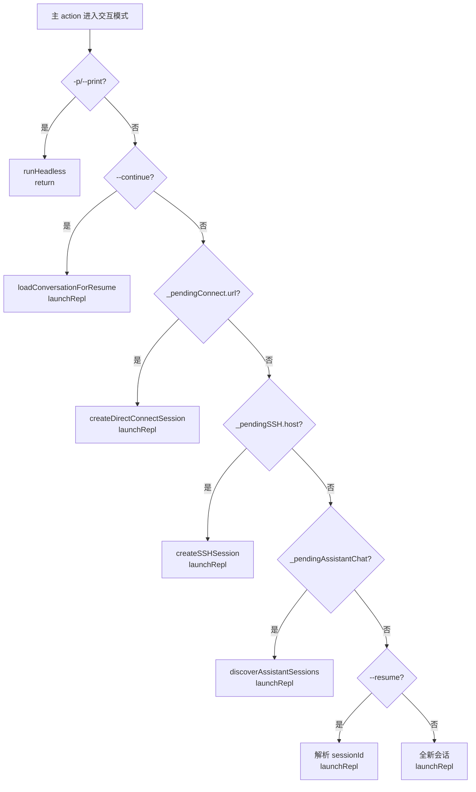
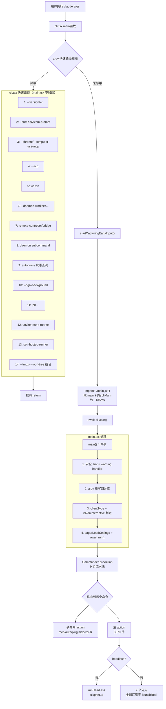

# 启动入口总览 · src/main.tsx

> `src/main.tsx` 是 Claude Code CLI 的"装配车间"：所有 `claude` 命令的语法定义、参数解析、初始化流水线、以及最终分发到 REPL 或 headless 模式，都在这 5743 行里完成。本节建立全局心智模型，后续 13 节逐个深入。

---

## 一、文件规模一览

| 指标 | 数量 | 说明 |
|---|---|---|
| 总行数 | 5743 | `wc -l` 实测 |
| `.command(...)` 调用 | 58 | 含 stub 和父命令 |
| `.option(...)` / `.addOption(...)` | 163 | 主命令 + 所有子命令累计 |
| `.action(...)` 调用 | 52 | 每个可执行命令一个 |
| 导出函数 | 2 | `main` + `startDeferredPrefetches` |
| 顶层非导出函数 | 20 | 见下方地图 |

---

## 二、20 个顶层函数地图

```mermaid
flowchart TD
    subgraph top["顶层副作用（1-22 行）"]
        A1["profileCheckpoint('main_tsx_entry') 12 行"]
        A2["startMdmRawRead() 17 行"]
        A3["startKeychainPrefetch() 22 行"]
    end

    subgraph helpers["模块级辅助（360–717 行）"]
        B1["遥测族：logManagedSettings / logSessionTelemetry / getCertEnvVarTelemetry / logStartupTelemetry"]
        B2["prefetch：prefetchSystemContextIfSafe / startDeferredPrefetches"]
        B3["settings 早加载：loadSettingsFromFlag / loadSettingSourcesFromFlag / eagerLoadSettings"]
        B4["initializeEntrypoint（设 CLAUDE_CODE_ENTRYPOINT）"]
    end

    B5["runMigrations（484–510）"]

    subgraph pending["三套 pending 单例（718–763 行）"]
        C1["_pendingConnect（DIRECT_CONNECT）"]
        C2["_pendingAssistantChat（KAIROS）"]
        C3["_pendingSSH（SSH_REMOTE）"]
    end

    subgraph mainFn["main() 函数（777–1072 行）"]
        D1["安全 env + warning handler"]
        D2["argv 重写四分支"]
        D3["clientType 9 种推断"]
        D4["eagerLoadSettings + run()"]
    end

    E1["getInputPrompt（1074–1107）"]

    subgraph runFn["run() + preAction（1122–1209 行）"]
        F1["preAction 9 步流水线"]
        F2["汇合点：await init()"]
    end

    subgraph options["Option 注册（1211–1493 + 4567–4695）"]
        G1["163 个 option 6 大类"]
    end

    subgraph action["主 action（1495–4566 行，3070 行）"]
        H1["早期处理（[9]）"]
        H2["setup + MCP 连接（[10]）"]
        H3["派发决策树（[11]）"]
    end

    subgraph subs["子命令地图（4720–5546 行）"]
        I1["58 个子命令注册"]
    end

    subgraph tail["尾部辅助（5562–5743 行）"]
        J1["logTenguInit / maybeActivateProactive"]
        J2["maybeActivateBrief / resetCursor"]
        J3["extractTeammateOptions"]
    end

    top --> helpers
    helpers --> B5
    B5 --> pending
    pending --> mainFn
    mainFn --> E1
    E1 --> runFn
    runFn --> options
    options --> action
    action --> subs
    subs --> tail
```

---

## 三、与 cli.tsx 的责任分工

| 职责 | cli.tsx（真入口） | main.tsx（装配车间） |
|---|---|---|
| 快速路径拦截 | 14 条（`--version` / `--dump-system-prompt` / MCP servers / daemon / bridge / tmux 等） | — |
| argv 重写 | — | 4 分支（cc:// URL / `--handle-uri` / `assistant` / `ssh`） |
| CLI 语法定义 | — | Commander.js `program.name().option().command().action()` 全注册 |
| 初始化流水线 | — | preAction 9 步 |
| 模式分发 | — | 主 action 的 headless / 9 交互分支 |

**14 条快速路径**（cli.tsx 拦截，零模块加载）：

| # | 触发条件 | 拦截内容 |
|---|---|---|
| 1 | `--version` / `-v` / `-V` | 零模块加载，直接打印 |
| 2 | `--dump-system-prompt` | 打印系统提示词后退出 |
| 3 | `--claude-in-chrome-mcp` / `--chrome-native-host` / `--computer-use-mcp` | 对应 MCP server 模式 |
| 4 | `--acp` | Agent Client Protocol stdio |
| 5 | `weixin` | 微信集成 |
| 6 | `--daemon-worker=<kind>` | Daemon supervisor 派生 |
| 7 | `remote-control` / `rc` / `remote` / `sync` / `bridge` | Bridge 模式 |
| 8 | `daemon [subcommand]` | Daemon 长驻进程 |
| 9 | `autonomy ...`（部分查询） | 状态查询快速路径 |
| 10 | `--bg` / `--background` | 后台 daemon 模式 |
| 11 | `job ...` | Template job 命令 |
| 12 | `environment-runner` | BYOC runner |
| 13 | `self-hosted-runner` | 自托管 runner |
| 14 | `--tmux + --worktree` 组合 | `execIntoTmuxWorktree(args)` 直接 exec |

---

## 四、文件按职责切片（5743 行）

| 行号范围 | 内容 | 对应小节 |
|---|---|---|
| `1-22` | 顶层副作用（3 个必须先于 import 的调用） | [1] top-side-effects |
| `24-359` | 主体 imports（Commander / chalk / lodash / services 等） | — |
| `360-483` | 模块级函数和常量（遥测 / prefetch / settings 早加载） | [2] module-helpers |
| `484-510` | `runMigrations()` 9 项幂等 migration | [3] run-migrations |
| `512-717` | Settings 早加载 / `initializeEntrypoint()` | [2] module-helpers |
| `718-763` | 三套 pending 模块单例类型 + 初始化 | [4] pending-singletons |
| `777-1072` | `main()` 导出函数（argv 重写 + clientType 推断 + 调用 run） | [5] main-fn-argv |
| `1074-1107` | `getInputPrompt()`（stdin 3 秒超时拼接） | [6] get-input-prompt |
| `1122-1209` | `run()` 开头 + preAction hook（9 步流水线） | [7] run-preaction |
| `1211-1493` | 主命令 `program.name()` + 所有 `.option(...)` 注册 | [8] options-registry |
| `1495-2300` | 主 `.action()` 早期处理 | [9] action-early |
| `2300-3424` | 主 action 中段（setup + MCP 连接） | [10] action-setup-mcp |
| `3425-4566` | 主 action 末段（headless 派发 + 9 交互分支决策树） | [11] action-dispatch |
| `4567-4695` | worktree/tmux/ant/remote 等 option | [8] options-registry |
| `4720-5546` | 全部子命令注册（`mcp` → `task`） | [12] subcommands-map |
| `5562-5743` | 尾部辅助（`logTenguInit` / `maybeActivateProactive` / `extractTeammateOptions`） | [13] tail-helpers |

---

## 五、14 节学习索引

| # | 小节 | 主题 | 源码行号 |
|---|---|---|---|
| 0 | **overview** | 总览与心智模型（本节） | 全文 |
| 1 | **top-side-effects** | 顶层 3 行副作用：并行预取的设计动机 | 1–22 |
| 2 | **module-helpers** | 模块级辅助：遥测/prefetch/settings 早加载 | 360–483, 512–717 |
| 3 | **run-migrations** | `runMigrations` 幂等 migration + 版本门控 | 484–510 |
| 4 | **pending-singletons** | 三套 pending 单例：argv 预解析 → action 消费 | 718–763 |
| 5 | **main-fn-argv** | `main()` 四件事 + argv 重写四分支 + clientType | 777–1072 |
| 6 | **get-input-prompt** | `getInputPrompt`：stdin 拼接与超时兜底 | 1074–1107 |
| 7 | **run-preaction** | `run()` + preAction 9 步流水线 | 1122–1209 |
| 8 | **options-registry** | 163 个 option 注册（6 大类目录） | 1211–1493, 4567–4695 |
| 9 | **action-early** | 主 action 早期处理 | 1495–2300 |
| 10 | **action-setup-mcp** | 主 action 中段：setup + MCP 连接 | 2300–3424 |
| 11 | **action-dispatch** | 主 action 末段：headless 派发 + 9 交互分支决策树 | 3425–4566 |
| 12 | **subcommands-map** | 58 个 Commander 子命令注册地图 | 4720–5546 |
| 13 | **tail-helpers** | 尾部辅助：logTenguInit / proactive / brief | 5562–5743 |

---

## 六、三条贯穿全文的暗线

### 6.1 并行预取（[1] top-side-effects）

顶层 3 行副作用（`profileCheckpoint` / `startMdmRawRead` / `startKeychainPrefetch`）必须先于所有 import，让子进程与 ~135ms 的重型 import **并行运行**，在 preAction 的"汇合点"（`1154`）等待完成。

> **类比**：像饭前先烧水——水壶响之前先切菜，开火时水已沸。

### 6.2 argv 重写四分支（[5] main-fn-argv）

`main()` 的 4 条 argv 重写（cc:// URL / `--handle-uri` / `assistant` KAIROS / `ssh` 远程）通过**模块级 pending 单例**把数据传给主 action，绕过 Commander 的 `(prompt, options)` 二参数限制。

> **为什么不用函数参数？** Commander 的 `parseAsync` 自动分发到 `.action(handler)`，`main()` 无法给 action 传额外参数。

### 6.3 派发决策树（[11] action-dispatch）

主 action 末段的 **9 条交互分支**全部汇聚到 `launchRepl()`，形成交互式入口的唯一出口函数。

---

## 七、cli.tsx ↔ main.tsx 协作总图

---

## 八、常见问题 FAQ

> **Q：为什么 main.tsx 顶层只有三行副作用？为什么必须排在所有 import 之前？**

A：因为 Bun/Node 在求值 `import` 时是**同步阻塞**的。`startMdmRawRead()` 和 `startKeychainPrefetch()` 各自派生异步子进程，如果放在重型 import 之后，就必须等 ~135ms 的 import 完成才能启动，与 import 并行的机会就丢了。

> **Q：`_pendingConnect` / `_pendingAssistantChat` / `_pendingSSH` 为什么是模块级变量，而不是函数参数？**

A：Commander 的 `parseAsync` 自动把 argv 路由到对应 `.action(handler)`。`main()` 无法直接给 action handler 传额外参数——Commander 只给 `(prompt, options)` 两个参数。模块级变量是唯一在"argv 预解析（main 阶段）"和"action 消费（run 阶段）"之间通信的方式。

> **Q：preAction 在 `--help` 时不跑，这意味着什么？**

A：意味着 `claude --help` 是"零副作用"的——不读 keychain、不跑 migrations、不做 init，几乎瞬时响应。这是 Commander 的内建行为（`-h/--help` 匹配后直接打印并 exit）。反之，任何真实执行（哪怕 `claude mcp list`）都会先过 preAction 的 9 步流水线。

> **Q：主 action 为什么这么大（3070 行）？应该拆分吗？**

A：历史演进的结果。这 3070 行实际上是 Claude Code 的"会话装配工厂"——它需要根据 20+ 个 option 的组合（resume/teleport/SSH/cc://…）决定怎么建立会话。拆分的难点在于这些分支之间共享大量中间变量（`setup()`、`enabledTools`、`mcpClients`、`sessionConfig` 等），提取为独立函数会有大量参数传递。从可读性角度看，流程图（七节中的决策树）比把它拆成 20 个小函数更容易理解。

---

**下一步**：逐节深入——从 [1] top-side-effects 开始，理解"并行预取"的设计动机。
