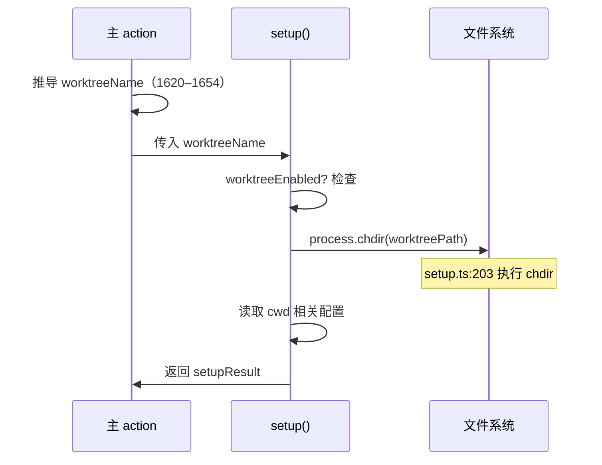
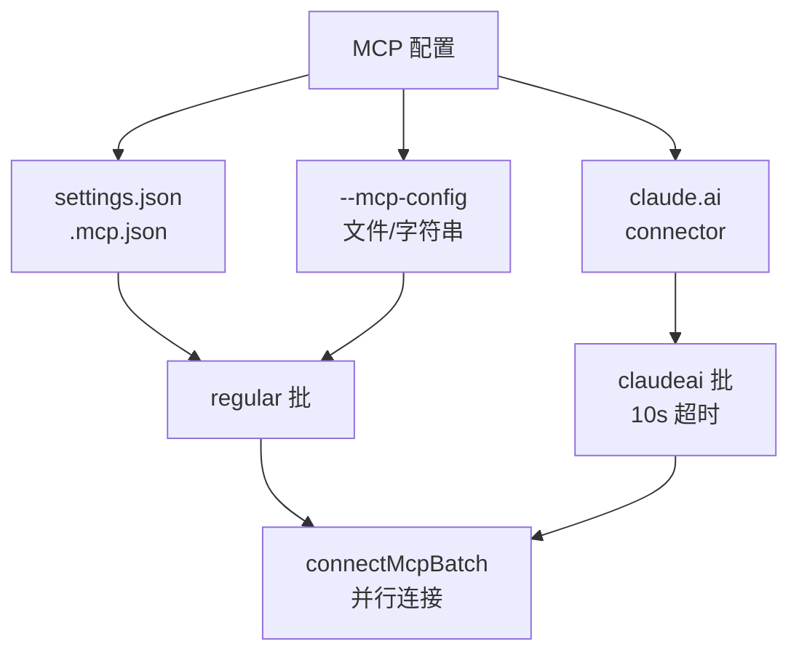

# 主 action 中段 · setup + MCP 连接

> `src/main.tsx:2300–3424` 是主 action 的中段：`setup()` 与 commands/agents 加载**并行执行**，`connectMcpBatch` 批量连接 MCP servers。关键设计点是 worktree 的 `chdir` 时机——必须在 setup 之前完成。

---

## 一、阶段地图

```mermaid
flowchart TD
    A[action 早期结束] --> B{--worktree?}
    B -->|是| C[worktreeName = 生成 slug]
    B -->|否| D[worktreeName = undefined]

    C --> E[启动 setup 与 commands 加载并行]
    D --> E

    E --> F[setupPromise\n并行任务 1]
    E --> G[commands 加载\n并行任务 2]

    F --> H[setup() 完成\n约 28ms]
    G --> I[commands 加载完成]

    H --> J[等待 setupPromise]
    I --> J

    J --> K[MCP 连接阶段\nconnectMcpBatch]
```

---

## 二、`setup()` 并行执行（2442–2482）

```ts
// src/main.tsx:2442
const setupStart = Date.now();
logForDebugging('[STARTUP] Running setup()...');

const setupPromise = setup(
  appState,
  {
    ...setupOptions,
    // worktreeName 在并行之前已推导
    worktreeEnabled: !!worktreeName,
    worktreeName,
  },
  // callback
  (error) => {
    if (error) {
      console.error('Setup failed:', error);
    }
  }
);

// 让 setup 与其他任务并行
const setupResult = await setupPromise;

logForDebugging(`[STARTUP] setup() completed in ${Date.now() - setupStart}ms`);
```

### 2.1 为什么并行？

| 任务 | 耗时 | 原因 |
|---|---|---|
| `setup()` | ~28ms | 读取 git status、CLAUDE.md、项目配置 |
| commands 加载 | ~15ms | 动态 import 子命令模块 |

**并行收益**：~15ms（43%）节省。

### 2.2 worktree chdir 时机



> **关键点**：worktree 的 `chdir` 发生在 `setup()` 内部（`setup.ts:203`），必须在 setup 之前推导 `worktreeName`，否则 setup 会执行错误的 cwd 操作。

---

## 三、MCP 连接阶段（3280–3424）

### 3.1 `connectMcpBatch` 定义（3290）

```ts
// src/main.tsx:3290
async function connectMcpBatch(
  configs: Record<string, ScopedMcpServerConfig>,
  label: string
): Promise<void> {
  const entries = Object.entries(configs);
  if (entries.length === 0) {
    return; // 零 server 零成本
  }

  // 显示进度
  const progress = createMcpProgress(label, entries.length);

  // 批量连接（并行）
  const results = await Promise.allSettled(
    entries.map(([name, config]) => connectMcpServer(name, config))
  );

  // 处理结果
  results.forEach((result, i) => {
    if (result.status === 'rejected') {
      console.warn(`MCP ${label} ${entries[i][0]} failed:`, result.reason);
    }
  });

  progress.done();
}
```

### 3.2 两批连接（3329–3415）

```ts
// src/main.tsx:3329
await connectMcpBatch(regularMcpConfigs, 'regular');

// src/main.tsx:3393
await connectMcpBatch(dedupedClaudeAi, 'claudeai');
```

| 批次 | 来源 | 超时 |
|---|---|---|
| regular | settings + `--mcp-config` | 无（无限等待） |
| claudeai | claude.ai connector MCP | 10 秒超时 |

> **为什么 claudeai 有超时？** connector MCP 是可选增强，不应该无限阻塞启动。10 秒超时确保 connector 故障不影响主流程。

---

## 四、MCP 配置来源



---

## 五、零 server 快速路径

```ts
// src/main.tsx:3290
if (entries.length === 0) {
  return; // 零 server 零成本
}
```

**设计**：如果用户没有配置任何 MCP server，`connectMcpBatch` 提前 return，零等待。

---

## 六、常见问题 FAQ

> **Q：为什么 setup 与 commands 加载可以并行？**

A：两者**无数据依赖**——setup 不依赖 commands，commands 不依赖 setup。唯一共享的是 `appState`，但写入是分开的（setup 写 cwd，commands 写命令注册），可以并行。

> **Q：worktree 的 chdir 为什么不在 main action 做？**

A：worktree 的 chdir 需要**读取 git 配置、验证路径、创建 worktree**，这些逻辑都封装在 `setup()` 内。在 main action 做会重复实现且难以维护。

> **Q：为什么 claudeai MCP 有超时而 regular 没有？**

A：regular MCP 是**用户显式配置**，连接失败是配置错误，应该等连接完成报错。claudeai MCP 是**可选增强**，不应该阻塞启动，10 秒超时后自动跳过。

---

**下一步**：[11] action-dispatch —— 主 action 末段：headless 派发 + 9 交互分支决策树。
