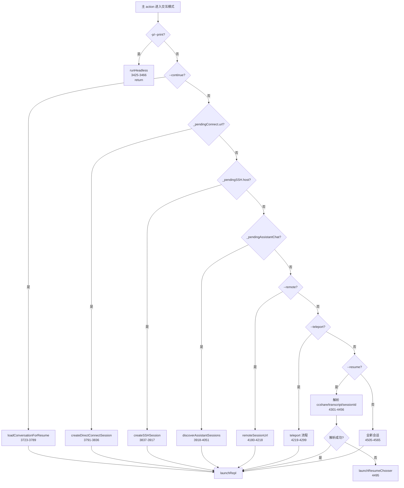
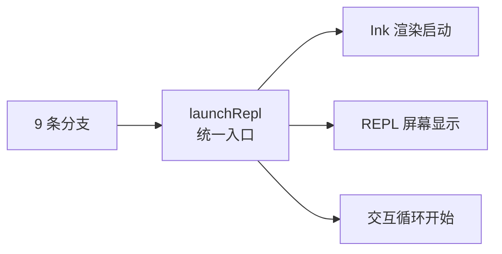

# 主 action 末段 · 派发决策树

> `src/main.tsx:3425–4566` 是主 action 的末段：**headless 派发**（`-p` 模式）和 **9 条交互分支决策树**。所有交互分支最终汇聚到 `launchRepl()`，形成交互式入口的唯一出口函数。

---

## 一、决策树总览



---

## 二、headless 派发（3425–3466）

```ts
// src/main.tsx:3425
if (print) {
  const { runHeadless } = await import('src/cli/print.js');
  await runHeadless(inputPrompt, ..., {
    continue: options.continue,
    resume: options.resume,
    outputFormat,
    maxTurns,
    maxBudgetUsd,
    systemPrompt,
    appendSystemPrompt,
    // ...20+ 个参数
  });
  return; // 立即 return，不进入 REPL
}
```

| 特性 | 说明 |
|---|---|---|
| 动态 import | `runHeadless` 只在 headless 模式加载，节省启动时间 |
| 参数传递 | 20+ 个参数全部传递，确保 headless 与交互模式一致 |
| 立即 return | headless 执行完直接退出，不进入 REPL |

---

## 三、9 条交互分支

### 3.1 `--continue`（3723–3789）

```ts
// src/main.tsx:3723
if (options.continue) {
  const result = await loadConversationForResume(undefined, undefined);
  if (result) {
    await launchRepl(result.session, ...);
  }
}
```

| 行为 | 说明 |
|---|---|---|
| 查找 | 按 cwd 查找最近的 session |
| 加载 | 恢复 messages、tools、permissions |
| 启动 | `launchRepl` 进入交互模式 |

### 3.2 `_pendingConnect.url`（3791–3836）

```ts
// src/main.tsx:3791
if (feature('DIRECT_CONNECT') && _pendingConnect?.url) {
  const session = await createDirectConnectSession(
    _pendingConnect.url,
    _pendingConnect.authToken,
    ...
  );
  await launchRepl(session, ...);
}
```

**来源**：`main():817-846` 的 cc:// URL argv 重写。

### 3.3 `_pendingSSH.host`（3837–3917）

```ts
// src/main.tsx:3837
if (feature('SSH_REMOTE') && _pendingSSH?.host) {
  const session = await createSSHSession(_pendingSSH, ...);
  await launchRepl(session, ...);
}
```

**来源**：`main():902-993` 的 ssh argv 重写。

### 3.4 `_pendingAssistantChat`（3918–4051）

```ts
// src/main.tsx:3918
if (feature('KAIROS') && _pendingAssistantChat) {
  if (_pendingAssistantChat.discover) {
    await launchAssistantSessionChooser();
  } else {
    const session = await loadAssistantSession(_pendingAssistantChat.sessionId);
    await launchRepl(session, ...);
  }
}
```

**来源**：`main():881-896` 的 assistant argv 重写。

### 3.5 `--remote`（4180–4218）

```ts
// src/main.tsx:4180
if (options.remote) {
  const sessionUrl = await createRemoteSession(options.remote);
  await launchRepl(session, ...);
}
```

### 3.6 `--teleport`（4219–4299）

```ts
// src/main.tsx:4219
if (options.teleport) {
  // teleport 流程（远程会话桥接）
  const session = await handleTeleport(options.teleport);
  await launchRepl(session, ...);
}
```

### 3.7 `--resume`（4301–4456）

```ts
// src/main.tsx:4301
if (options.resume) {
  // 解析 ccshare:// / transcript:// / sessionId
  const result = parseResumeArg(options.resume);
  if (result.success) {
    const session = await loadSession(result.value);
    await launchRepl(session, ...);
  } else {
    await launchResumeChooser();
  }
}
```

**解析支持**：
- `ccshare://...`（ccshare 链接）
- `transcript://...`（transcript 链接）
- 直接 sessionId（UUID）

### 3.8 全新会话（4505–4565）

```ts
// src/main.tsx:4505
// 默认路径：创建全新会话
const session = await createNewSession(...);
await launchRepl(session, ...);
```

---

## 四、终点统一：`launchRepl`



**设计意义**：无论哪条分支，最终都通过 `launchRepl` 进入交互界面。这确保：
- UI 启动逻辑统一
- Session 初始化一致
- 后续交互行为相同

---

## 五、常见问题 FAQ

> **Q：为什么 headless 要动态 import？**

A：`runHeadless` 只在 headless 模式使用，交互模式完全不需要。动态 import 节省约 ~50ms 的启动时间（不需要解析 `src/cli/print.ts` 及其依赖）。

> **Q：`--continue` 和 `--resume` 有什么区别？**

A：`--continue` 是**快捷方式**（按 cwd 查找最近 session），`--resume` 是**精确指定**（按 sessionId 或链接）。`--continue` 无参数，`--resume` 需要参数。

> **Q：为什么所有分支都汇聚到 `launchRepl`？**

A：这是**单一职责原则**——`launchRepl` 专门负责 UI 启动和交互循环，各分支只负责创建 session。分离让代码更易维护。

---

**下一步**：[12] subcommands-map —— 58 个 Commander 子命令注册地图。
