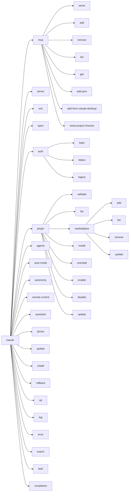

# 子命令地图 · 58 个子命令

> `src/main.tsx:4720–5546` 注册了**58 个 Commander 子命令**，覆盖 `mcp`（9 个）、`auth`（3 个）、`plugin`+`marketplace`（11 个）、`autonomy`+`auto-mode`、维护类（doctor/update/install）、ant 专属（up/rollback/log/export/task）。

---

## 一、总览树状图



---

## 二、mcp 簇（9 个子命令，4720–4800）

| 行号 | 命令 | 说明 | 示例 |
|---|---|---|---|
| `4727` | `mcp serve` | 启动 Claude Code MCP server | `claude mcp serve` |
| `4737` | `mcp add <name>` | 添加 MCP server | `claude mcp add my-server --stdio "node server.js"` |
| `4744` | `mcp remove <name>` | 按 scope 删除 | `claude mcp remove my-server -s user` |
| `4756` | `mcp list` | 列出所有 MCP server | `claude mcp list` |
| `4766` | `mcp get <name>` | 显示单个 MCP server 详情 | `claude mcp get my-server` |
| `4776` | `mcp add-json <name> <json>` | JSON 字符串添加 | `claude mcp add-json my-server '{"type":"stdio",...}'` |
| `4786` | `mcp add-from-claude-desktop` | 从 Claude Desktop 导入 | `claude mcp add-from-claude-desktop -s user` |
| `4795` | `mcp reset-project-choices` | 清除批准/拒绝记忆 | `claude mcp reset-project-choices` |

---

## 三、远程交互三套（server / open / ssh / assistant）

| 行号 | 命令 | 场景 | 机制 |
|---|---|---|---|
| `4805` | `server` | 启动本地 session server | HTTP/Unix socket；写 lockfile 到 `~/.claude/` |
| `4927` | `open <cc-url>` | headless 连接到远端 server | 由 `main()` argv 重写生成 |
| `4892` | `ssh <host> [dir]` | 在远程机器跑 Claude | stub 子命令；真实逻辑在主 action `3837` |
| `5323` | `assistant [sessionId]` | 连接 KAIROS bridge session | stub；真实逻辑在主 action `3918` |

**为什么有 stub 子命令？**：stub 保证 `claude ssh --help` 能正确打印帮助，且 feature 未开时提供降级入口。

---

## 四、auth 簇（4972–5023）

| 行号 | 命令 | 说明 | 示例 |
|---|---|---|---|
| `4975` | `auth login` | OAuth / SSO / Console / Claude AI 四种路径 | `claude auth login` |
| `4999` | `auth status` | 显示当前 token / 订阅状态 | `claude auth status --json` |
| `5009` | `auth logout` | 清除本地 token | `claude auth logout` |

**`auth login` 的四种路径**：

```bash
claude auth login              # 默认 OAuth（claude.ai 账号）
claude auth login --sso        # SSO 登录（企业 IdP）
claude auth login --console    # Anthropic Console API key
claude auth login --claudeai --email me@example.com  # Claude AI 指定邮箱
```

---

## 五、plugin + marketplace 簇（11 个子命令）

| 行号 | 命令 | 示例 |
|---|---|---|
| `5033` | `plugin validate <path>` | `claude plugin validate ./my-plugin` |
| `5043` | `plugin list [--json] [--available]` | `claude plugin list --available` |
| `5060` | `plugin marketplace add <source>` | `claude plugin marketplace add github.com/foo/claude-plugins` |
| `5083` | `plugin marketplace list` | `claude plugin marketplace list` |
| `5093` | `plugin marketplace remove <name>` | `claude plugin marketplace remove my-market` |
| `5103` | `plugin marketplace update [name]` | `claude plugin marketplace update` |
| `5113` | `plugin install <plugin>` | `claude plugin install my-plugin@my-market -s user` |
| `5125` | `plugin uninstall <plugin>` | `claude plugin uninstall my-plugin --keep-data` |
| `5148` | `plugin enable <plugin>` | `claude plugin enable my-plugin` |
| `5159` | `plugin disable [plugin]` | `claude plugin disable my-plugin` 或 `plugin disable -a` |
| `5171` | `plugin update <plugin>` | `claude plugin update my-plugin` |

---

## 六、autonomy + auto-mode 簇

```bash
# autonomy 状态监控（5243-5298）
claude autonomy status --deep
claude autonomy runs 50
claude autonomy flows
claude autonomy flow <flowId>
claude autonomy flow <flowId> cancel
claude autonomy flow <flowId> resume

# auto-mode 配置（5209-5237）
claude auto-mode defaults
claude auto-mode config
claude auto-mode critique --model sonnet
```

---

## 七、维护类命令

| 行号 | 命令 | 说明 | 示例 |
|---|---|---|---|
| `5342` | `doctor` | 健康检查 | `claude doctor` |
| `5408` | `update` | 升级 ccb 自身 | `claude update` |
| `5396` | `install [target]` | 安装指定版本 | `claude install stable` 或 `claude install 2.2.1 --force` |
| `5183` | `setup-token` | 申请长期 token | `claude setup-token` |

---

## 八、ant 专属命令

| 行号 | 命令 | 说明 |
|---|---|---|
| `5358` | `up` | 执行 CLAUDE.md 中的 `# claude up` 区块 |
| `5372` | `rollback [target]` | 回滚到旧版本 |
| `5424` | `log [number\|sessionId]` | 查看历史日志 |
| `5438` | `error [number]` | 查看错误日志 |
| `5450` | `export <src> <out>` | 会话导出为 txt |
| `5473` | `task create <subject>` | 创建 task |
| `5483` | `task list [--pending]` | 列出 task |
| `5494` | `task get <id>` | 获取 task 详情 |
| `5503` | `task update <id>` | 更新 task |
| `5529` | `task dir` | 显示 task 数据目录 |
| `5540` | `completion <shell>` | 生成 shell 补全脚本 |

---

## 九、常见问题 FAQ

> **Q：为什么 `ssh` / `assistant` 既有 stub 子命令又有 argv 改写？**

A：不同作用。**argv 改写**把特殊子命令的 argv 重写成主命令能接受的形式，让主 action 的 `_pending*` 机制接手。**stub 子命令**只给 `--help` 正确的帮助输出，feature 关闭时提供降级入口。两者不冲突。

> **Q：`plugin disable -a` 是什么意思？**

A：`-a` 是 `--all`，禁用所有已启用的 plugins。这是一个快捷操作，避免逐个禁用。

> **Q：ant 专属命令是什么？**

A：ant 内部命令（如 `up` / `rollback` / `log`），只在 `USER_TYPE=ant` 环境有意义。公开版本中这些命令存在但可能限制功能。

---

**下一步**：[13] tail-helpers —— 尾部辅助函数。
