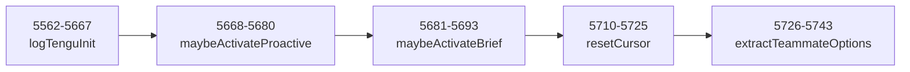

# 尾部辅助 · 最后 182 行

> `src/main.tsx:5562–5743` 是 main.tsx 的**尾部辅助函数**：`logTenguInit`（埋点字段）、`maybeActivateProactive`（自主代理模式）、`maybeActivateBrief`（Brief 工具）、`resetCursor`（终端光标）、`extractTeammateOptions`（teammate flag 解析）。

---

## 一、函数地图（5562–5743）



---

## 二、`logTenguInit()`（5562–5667）

```ts
// src/main.tsx:5562
async function logTenguInit({
  clientType,
  model,
  isProSubscriber,
  hasAntProtocol,
  sessionId,
}: {
  clientType: string;
  model: string;
  isProSubscriber: boolean;
  hasAntProtocol: boolean;
  sessionId: string;
}): Promise<void> {
  // 记录启动时的关键状态
  // 用于遥测归因
}
```

| 埋点字段 | 说明 |
|---|---|
| `clientType` | cli/sdk-ts/sdk-py/... |
| `model` | 启动时的默认模型 |
| `isProSubscriber` | Pro 订阅状态 |
| `hasAntProtocol` | 是否有 ant 协议 |
| `sessionId` | 会话 UUID |

**消费位置**：被 `main.tsx` 导出并可能在初始化完成后调用。

---

## 三、`maybeActivateProactive()`（5668–5680）

```ts
// src/main.tsx:5668
function maybeActivateProactive(options: unknown): void {
  if (feature('PROACTIVE') && options && typeof options === 'object') {
    const opts = options as Record<string, unknown>;
    if (opts.proactive === true) {
      // 启动 proactive 自主代理模式
      activateProactiveMode();
    }
  }
}
```

| 触发条件 | `--proactive` flag + `PROACTIVE` feature |
|---|---|
| 作用 | 启动自主代理模式（Claude 主动发起任务） |
| feature 门控 | `PROACTIVE` |

**示例**：

```bash
claude --proactive
```

---

## 四、`maybeActivateBrief()`（5681–5693）

```ts
// src/main.tsx:5681
function maybeActivateBrief(options: unknown): void {
  if (feature('BRIEF') && options && typeof options === 'object') {
    const opts = options as Record<string, unknown>;
    if (opts.brief === true) {
      // 启用 Brief 工具（SendUserMessage）
      enableBriefTool();
    }
  }
}
```

| 触发条件 | `--brief` flag + `BRIEF` feature |
|---|---|
| 作用 | 启用 Brief 工具（允许 Claude 发送用户消息） |
| feature 门控 | `BRIEF` |

**示例**：

```bash
claude --brief
```

---

## 五、`resetCursor()`（5710–5725）

```ts
// src/main.tsx:5710
function resetCursor(): void {
  // 重置终端光标形状
  // 确保退出时光标状态正常
  if (process.stdout.isTTY) {
    process.stdout.write('\x1b[0 q'); // 恢复默认光标
  }
}
```

**作用**：退出时恢复终端光标状态，避免光标形状异常（如竖线、方块）残留到用户终端。

---

## 六、`extractTeammateOptions()`（5726–5743）

```ts
// src/main.tsx:5726
function extractTeammateOptions(options: unknown): TeammateOptions {
  if (!options || typeof options !== 'object') {
    return {};
  }
  const opts = options as Record<string, unknown>;

  return {
    agentId: opts.agentId as string | undefined,
    agentName: opts.agentName as string | undefined,
    teamName: opts.teamName as string | undefined,
    agentColor: opts.agentColor as string | undefined,
    planModeRequired: opts.planModeRequired as boolean | undefined,
    parentSessionId: opts.parentSessionId as string | undefined,
    teammateMode: opts.teammateMode as string | undefined,
    agentType: opts.agentType as string | undefined,
  };
}
```

| 字段 | 说明 |
|---|---|---|
| `agentId` | teammate agent UUID |
| `agentName` | teammate 显示名称 |
| `teamName` | 所属团队 |
| `agentColor` | 显示颜色 |
| `planModeRequired` | 是否强制 plan 模式 |
| `parentSessionId` | 父会话 UUID |
| `teammateMode` | teammate 模式 |
| `agentType` | agent 类型 |

**用途**：tmux 派生 teammate 时使用，从 Commander options 中提取 teammate 相关配置。

---

## 七、常见问题 FAQ

> **Q：为什么 `logTenguInit` 是 async 函数？**

A：遥测发送是异步的（需要网络请求）。虽然返回值是 `Promise<void>`，调用方可以选择 await 或 fire-and-forget。

> **Q：`maybeActivateProactive` 和 `maybeActivateBrief` 为什么是 `maybe`？**

A：它们只在 feature 开启时激活。如果 feature 关闭，函数静默返回，不影响主流程。"maybe" 命名反映这种"可能激活，可能不"的语义。

> **Q：`resetCursor` 为什么只在 TTY 模式执行？**

A：非 TTY 模式（如重定向输出、管道）不支持 ANSI 转义序列，写 `\x1b[0 q` 会产生乱码。`isTTY` 检查确保只在终端执行。

---

**总结**：main.tsx 的 5743 行到此结束。从顶层副作用、模块辅助、pending 单例、main() 函数、getInputPrompt、run()+preAction、option 注册、主 action 三阶段、子命令地图，到尾部辅助——完整覆盖了 Claude Code CLI 的启动入口。
