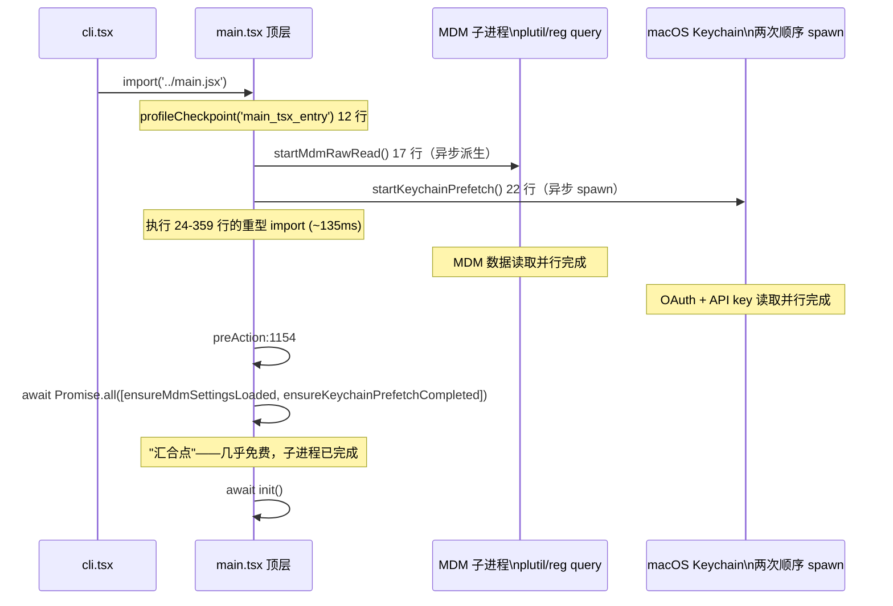

# 顶层副作用 · 并行预取的设计

> `src/main.tsx` 的前 22 行只有**3 个副作用调用**：`profileCheckpoint('main_tsx_entry')`、`startMdmRawRead()`、`startKeychainPrefetch()`。它们必须排在所有其他 import 之前——这是"并行预取"的核心设计，让子进程与重型 import 同时运行，在 preAction 的"汇合点"几乎免费完成。

---

## 一、代码位置（1–22 行）

```ts
// src/main.tsx:1-22
// 这些副作用必须先于所有其他 import 运行：
// 1. profileCheckpoint 在重量级模块求值开始前标记入口
// 2. startMdmRawRead 触发 MDM 子进程（plutil/reg query），让它们与
//    下面剩余约 ~135ms 的 import 并行运行
// 3. startKeychainPrefetch 同时触发两次 macOS keychain 读取（OAuth + 旧版 API
//    key）—— 否则会在 applySafeConfigEnvironmentVariables() 内部同步顺序读取
//    （每次 macOS 启动约 ~65ms）
import { profileCheckpoint } from './utils/startupProfiler.js';
profileCheckpoint('main_tsx_entry');        // 第 12 行

import { startMdmRawRead } from './utils/settings/mdm/rawRead.js';
startMdmRawRead();                          // 第 17 行

import { startKeychainPrefetchCompleted, startKeychainPrefetch } from './utils/secureStorage/keychainPrefetch.js';
startKeychainPrefetch();                    // 第 22 行
```

---

## 二、为什么要这样排列？

### 2.1 问题：import 是同步阻塞的



> **时序解读**：3 个副作用（12/17/22 行）各自派生异步子进程，然后立即继续执行剩下的重型 import（24–359 行，约 ~135ms）。子进程在 import 期间并行运行，到 preAction 的"汇合点"（1154 行）时早已完成，等待时间趋近于 0。

### 2.2 汇合点：preAction 第一件事

```ts
// src/main.tsx:1154（preAction hook 内）
await Promise.all([
  ensureMdmSettingsLoaded(),
  ensureKeychainPrefetchCompleted()
]);
```

**为什么是 `Promise.all` 而非顺序 await？**  
两个预取任务彼此独立，同时等待比顺序 await 更快。而且子进程在 ~135ms 的 import 期间早已完成，这里"汇合"几乎零等待。

---

## 三、三个副作用详解

### 3.1 `profileCheckpoint('main_tsx_entry')`（第 12 行）

| 作用 | 在重量级模块求值开始前标记入口时间点 |
|---|---|
| 位置 | `src/utils/startupProfiler.ts` |
| 消费 | 启动性能计时（用于 startup debug 输出） |
| 是否异步 | 否（同步打点） |

> **为什么标记在 import 之前？** 这是"起点"锚点——后续所有耗时测量都相对此点计算。如果放在重型 import 之后，起点本身就被延迟，无法真实反映"用户执行命令到可响应"的总时长。

### 3.2 `startMdmRawRead()`（第 17 行）

| 作用 | 触发 MDM（Mobile Device Management）子进程，读取 `plutil`（macOS）或 `reg query`（Windows）数据 |
|---|---|
| 位置 | `src/utils/settings/mdm/rawRead.ts` |
| 消费 | `ensureMdmSettingsLoaded()` 在 preAction:1154 汇合 |
| 子进程内容 | `plutil -p /Library/ManagedPreferences/com.anthropic.claude-code.plist`（macOS）或 `reg query HKLM\Software\Anthropic\ClaudeCode`（Windows） |
| 是否异步 | 是（派生子进程后立即返回） |

> **为什么需要预取？** macOS 的 `plutil` 单次调用约 ~35-50ms，Windows 的 `reg query` 约 ~20-30ms。如果放到 preAction 同步执行，会阻塞初始化流水线。派生后并行运行，在 import 期间"免费"完成。

### 3.3 `startKeychainPrefetch()`（第 22 行）

| 作用 | 同时触发两次 macOS keychain 读取（OAuth token + 旧版 API key） |
|---|---|
| 位置 | `src/utils/secureStorage/keychainPrefetch.ts` |
| 消费 | `ensureKeychainPrefetchCompleted()` 在 preAction:1154 汇合 |
| 查询项 | `security find-internet-password -s 'api.anthropic.com'`（OAuth）<br>`security find-generic-password -a 'claude-code-api-key'`（旧 API key） |
| 是否异步 | 是（派生两个子进程后立即返回） |

> **为什么需要预取？** macOS 的 `security` 命令单次调用约 ~65ms（每次 macOS 启动）。如果不预取，在 `applySafeConfigEnvironmentVariables()` 内部会同步顺序读取（OAuth → 旧 key），总计 ~130ms。预取后并行运行，在 import 期间完成。

> **为什么读两次？** 兼容逻辑——优先尝试 OAuth token，如果不存在再降级到旧 API key。两者独立查询，可并行执行。

---

## 四、并行收益计算

### 4.1 不并行（假设副作用在 import 之后）

```
[import ~135ms] → [MDM ~50ms] → [Keychain OAuth ~65ms] → [Keychain 旧key ~65ms]
总时长：~315ms
```

### 4.2 并行（实际设计）

```
[MDM ~50ms] ┐
[Keychain OAuth ~65ms] ├─→ [汇合点 ~0ms] → [后续初始化]
[Keychain 旧key ~65ms] ┘                 ↗
[import ~135ms] ────────────────────────┘
总时长：~135ms（import 为主瓶颈）
```

**收益**：~180ms（约 57%）的启动时间节省。

---

## 五、类比：饭前烧水

> **并行预取 = 饭前先烧水**  
> 水壶响之前先切菜、备料，开火炒菜时水已沸。  
> 如果等锅热了再烧水，就要额外等 5 分钟——饭前烧水让等待时间几乎为零。

对应到代码：
- "烧水" = 派生子进程（MDM / keychain）
- "切菜" = 执行重型 import（~135ms）
- "开火" = preAction 汇合点（await Promise.all）
- "水已沸" = 子进程已完成，等待时间趋近 0

---

## 六、常见问题 FAQ

> **Q：为什么这三个副作用不放到 `cli.tsx` 里？**

A：`cli.tsx` 的职责是"快速路径拦截 + 动态 import main.tsx"。副作用是 **main.tsx 的内部初始化需求**，放在 cli.tsx 会混淆两个模块的边界。而且 `cli.tsx` 已经有 14 条快速路径拦截逻辑，再加副作用会让入口更复杂。

> **Q：如果子进程在 preAction 之前还没完成怎么办？**

A：`await Promise.all([ensureMdmSettingsLoaded(), ensureKeychainPrefetchCompleted()])` 会**等待直到完成**。大多数情况下子进程在 ~135ms 的 import 期间早已完成；即使未完成，await 也会等——设计目标只是"并行重叠减少等待"，而非"不等结果"。

> **Q：`profileCheckpoint` 为什么不是异步的？**

A：它只是打点（记录当前时间戳到内存），不需要 I/O 或子进程，同步执行即可。打点本身 <1ms，不影响并行策略。

---

**下一步**：[2] module-helpers —— 模块级辅助函数（遥测 / prefetch / settings 早加载）。
