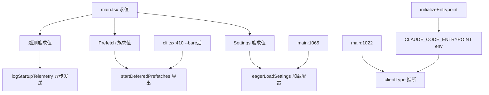

# 模块级辅助函数

> `src/main.tsx:360–717` 模块级辅助函数涵盖**遥测收集、系统预取、settings 早加载、入口点初始化**四大类。它们在 `main()` 之前求值，部分被 preAction 或其他流程消费。

---

## 一、函数地图（按职责）

```mermaid
flowchart LR
    subgraph telemetry["遥测族（360–463 行）"]
        A1["logManagedSettings()\n369–384"]
        A2["_isBeingDebugged()\n385–398"]
        A3["logSessionTelemetry()\n399–407"]
        A4["getCertEnvVarTelemetry()\n408–423"]
        A5["logStartupTelemetry()\n424–463"]
    end

    subgraph prefetch["Prefetch 族（464–517 行）"]
        B1["prefetchSystemContextIfSafe()\n473–483"]
        B2["startDeferredPrefetches()\n518–534"]
    end

    subgraph settings["Settings 早加载（535–717 行）"]
        C1["loadSettingsFromFlag()\n546–557"]
        C2["loadSettingSourcesFromFlag()\n558–657"]
        C3["eagerLoadSettings()\n658–675"]
        C4["initializeEntrypoint()\n676–717"]
    end

    telemetry --> prefetch
    prefetch --> settings
```



---

## 二、遥测族（360–463 行）

### 2.1 `logManagedSettings()`（369–384）

```ts
// src/main.tsx:369
function logManagedSettings(): void {
  const settings = getGlobalConfig();
  // 记录 settings 中的敏感管理配置（是否被远程管理覆盖）
  // 用于企业环境审计
}
```

| 作用 | 记录 settings 中的远程管理配置 |
|---|---|
| 消费 | 被 `logStartupTelemetry` 调用 |
| 记录项 | 是否有远程管理、策略来源、覆盖项数量 |

### 2.2 `_isBeingDebugged()`（385–398）

```ts
// src/main.tsx:385
function _isBeingDebugged(): boolean {
  // 检测进程是否被调试器附加
  // macOS: check sysctl proc.pid
  // Linux: check /proc/$pid/status TracerPid
  // Windows: check IsDebuggerPresent
}
```

| 作用 | 检测当前进程是否被调试器附加 |
|---|---|
| 平台差异 | macOS 用 `sysctl`、Linux 用 `/proc`、Windows 用 `IsDebuggerPresent` API |
| 消费 | 被遥测逻辑用来标记调试会话 |

### 2.3 `logSessionTelemetry()`（399–407）

```ts
// src/main.tsx:399
function logSessionTelemetry(): void {
  // 记录会话级别的遥测
  // 含 sessionId、clientType、是否 debug 等
}
```

### 2.4 `getCertEnvVarTelemetry()`（408–423）

```ts
// src/main.tsx:408
function getCertEnvVarTelemetry(): Record<string, boolean> {
  // 检测 HTTPS/TLS 证书相关的环境变量
  // 返回 { NODE_EXTRA_CA_CERTS: boolean, NODE_TLS_REJECT_UNAUTHORIZED: boolean, ... }
}
```

### 2.5 `logStartupTelemetry()`（424–463）

```ts
// src/main.tsx:424
async function logStartupTelemetry(): Promise<void> {
  // 组合调用 logManagedSettings / logSessionTelemetry / getCertEnvVarTelemetry
  // 异步发送到遥测端点
}
```

---

## 三、Prefetch 族（464–517 行）

### 3.1 `prefetchSystemContextIfSafe()`（473–483）

```ts
// src/main.tsx:473
function prefetchSystemContextIfSafe(): void {
  // 如果 CLAUDE_CODE_SIMPLE=1 或 --bare，跳过 prefetch
  // 否则触发 src/context.ts 的系统信息 prefetch
  // （git status、日期、CLAUDE.md 发现等）
}
```

| 作用 | 安全地触发系统上下文 prefetch |
|---|---|
| 何时安全 | 非 `--bare` 模式、非 `CLAUDE_CODE_SIMPLE=1` |
| 消费 | 被 `startDeferredPrefetches` 调用 |

### 3.2 `startDeferredPrefetches()`（518–534，导出）

```ts
// src/main.tsx:518
export function startDeferredPrefetches(): void {
  // 被 --bare 之后、非 --bare 的路径调用
  // 触发 prefetchSystemContextIfSafe()
  // 并启动其他延迟预取任务
}
```

> **为什么是导出函数？** 需要被 `cli.tsx:410` 的 `--bare` 之后的恢复路径调用。

---

## 四、Settings 早加载（535–675 行）

### 4.1 `loadSettingsFromFlag()`（546–557）

```ts
// src/main.tsx:546
function loadSettingsFromFlag(settingsFile: string): void {
  // 从 --settings <file> 或 <json-string> 加载 settings
  // 支持文件路径或 JSON 字符串
  // 覆盖后续的 eagerLoadSettings
}
```

### 4.2 `loadSettingSourcesFromFlag()`（558–657）

```ts
// src/main.tsx:558
function loadSettingSourcesFromFlag(settingSourcesArg: string): void {
  // 解析 --setting-sources <sources>
  // 支持逗号分隔：user,project,default
  // 决定哪些来源的 settings 会被加载
}
```

| 支持来源 | 说明 |
|---|---|
| `user` | `~/.claude/settings.json` |
| `project` | `.claude/settings.json`（项目级） |
| `default` | 内置默认值 |
| `remote` | 远程管理设置 |

### 4.3 `eagerLoadSettings()`（658–675）

```ts
// src/main.tsx:658
function eagerLoadSettings(): void {
  // 早期加载 settings（早于 Commander parseAsync）
  // 合并 user + project + default + remote
  // 被 main():1065 调用
}
```

> **为什么需要早加载？** settings 影响很多初始化逻辑（如 feature flags、权限模式、model 选择），在 `run()` 之前加载可以让 preAction 访问完整配置。

---

## 五、`initializeEntrypoint()`（676–717）

```ts
// src/main.tsx:676
function initializeEntrypoint(isNonInteractive: boolean): void {
  // 设置 CLAUDE_CODE_ENTRYPOINT 环境变量
  // 用于后续 clientType 推断和功能开关
  // 值域：cli/sdk-ts/sdk-py/sdk-cli/claude-vscode/local-agent/claude-desktop/remote
}
```

| 作用 | 设置入口点标识符，影响 clientType 推断 |
|---|---|
| 位置 | 被 `main()` 调用，在 argv 解析后立即执行 |
| 消费 | `clientType` 推断逻辑（`main.tsx:1022`）读取此 env var |

> **为什么是环境变量？** 需要跨模块访问（如 `services/api/` 需知道是 SDK 调用还是 CLI 调用），env var 是最简单的 IPC 机制。

---

## 六、调用关系图



---

## 七、常见问题 FAQ

> **Q：为什么遥测函数是模块级求值就定义，而不是在 main() 里调用？**

A：遥测函数需要被**延迟异步调用**（`logStartupTelemetry` 是 async），在模块级定义不等于执行。它们在 preAction 或其他合适时机被调用。

> **Q：`eagerLoadSettings` 和 Commander 的 `--settings` option 有什么区别？**

A：`eagerLoadSettings` 加载默认路径（user + project + default），而 `--settings` 允许用户指定任意 JSON 文件或字符串来覆盖。`--settings` 在 `main()` 阶段被解析（`loadSettingsFromFlag`），然后 `eagerLoadSettings` 合并剩余来源。

> **Q：`initializeEntrypoint` 为什么不是自动检测？**

A：入口点信息**无法自动推断**——CLI 被调用时无法知道是用户直接运行还是被 SDK 包装。必须由调用方（`cli.tsx` 或 `main()`）显式设置。

---

**下一步**：[3] run-migrations —— 幂等 migration + 版本门控。
