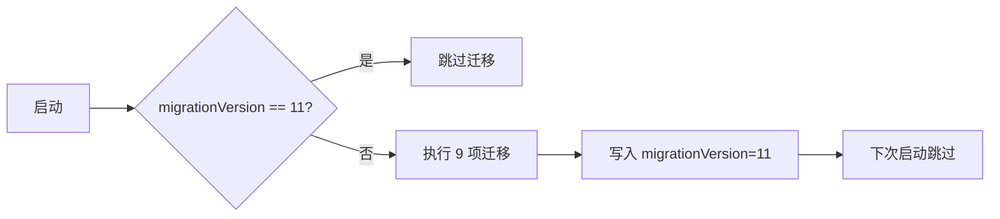

# 幂等 Migration · runMigrations

> `src/main.tsx:484–510` 的 `runMigrations()` 函数实现了**幂等的配置迁移系统**：每次启动检查 `migrationVersion`，如果不等于 11 则执行 9 项迁移，完成后写入 11。所有迁移都是幂等的，多次运行安全。

---

## 一、完整代码（484–510）

```ts
// src/main.tsx:484
const CURRENT_MIGRATION_VERSION = 11;

function runMigrations(): void {
  const prevVersion = getGlobalConfig().migrationVersion;
  if (prevVersion !== CURRENT_MIGRATION_VERSION) {
    // 1. bypass perms 迁移到 settings
    migrateBypassPermissionsAcceptedToSettings();

    // 2. 启用所有 project MCP servers
    migrateEnableAllProjectMcpServersToSettings();

    // 3. Pro 套餐 → 默认 Opus
    resetProToOpusDefault();

    // 4. Sonnet 1M → Sonnet 4.5
    migrateSonnet1mToSonnet45();

    // 5. 旧 opus 系列 → 当前
    migrateLegacyOpusToCurrent();

    // 6. Sonnet 4.5 → 4.6
    migrateSonnet45ToSonnet46();

    // 7. Opus → Opus 1m
    migrateOpusToOpus1m();

    // 8. bridge flag 改名
    migrateReplBridgeEnabledToRemoteControlAtStartup();

    // 9. auto-mode 重置（feature gated）
    if (feature('TRANSCRIPT_CLASSIFIER'))
      resetAutoModeOptInForDefaultOffer();

    // 10. ant 内部：Fennec → Opus（env gated）
    if (process.env.USER_TYPE === 'ant')
      migrateFennecToOpus();

    // 更新版本号
    saveGlobalConfig(prev => ({ ...prev, migrationVersion: CURRENT_MIGRATION_VERSION }));
  }

  // 异步 fire-and-forget
  migrateChangelogFromConfig().catch(() => {});
}
```

---

## 二、9 项迁移详解

| # | 迁移函数 | 说明 | 何时引入 |
|---|---|---|---|
| 1 | `migrateBypassPermissionsAcceptedToSettings` | 把旧位置的 bypass perms 接受记录迁移到 settings.json | v2.x |
| 2 | `migrateEnableAllProjectMcpServersToSettings` | 启用所有 project 级 MCP servers（兼容性变更） | v2.1 |
| 3 | `resetProToOpusDefault` | Pro 用户默认模型改为 Opus | v2.0 |
| 4 | `migrateSonnet1mToSonnet45` | Sonnet 1M 名称更新为 Sonnet 4.5 | v2.1 |
| 5 | `migrateLegacyOpusToCurrent` | 旧 opus 系列（opus-2024 / opus-2025）迁移到当前 opus | v2.2 |
| 6 | `migrateSonnet45ToSonnet46` | Sonnet 4.5 → 4.6 升级 | v2.2 |
| 7 | `migrateOpusToOpus1m` | Opus → Opus 1m 升级 | v2.2 |
| 8 | `migrateReplBridgeEnabledToRemoteControlAtStartup` | `replBridgeEnabled` flag 改名为 `remoteControlEnabled` | v2.1 |
| 9 | `resetAutoModeOptInForDefaultOffer` | auto-mode 选项重置（TRANSCRIPT_CLASSIFIER feature） | v2.2 |

> **ant 内部迁移**：`migrateFennecToOpus` 仅当 `USER_TYPE=ant` 时运行，非公开环境。

---

## 三、幂等性设计

### 3.1 版本号门控



### 3.2 为什么需要幂等性？

| 场景 | 问题 | 幂等性保障 |
|---|---|---|
| 用户降级版本后升级 | 迁移会重复执行 | 每个迁移函数内部检查旧值是否存在 |
| 多实例并发启动 | 可能同时写 settings | `saveGlobalConfig` 的合并写策略 |
| 迁移代码有 bug | 需要回滚再修复 | 版本号只在全部成功后更新 |

---

## 四、异步迁移：`migrateChangelogFromConfig`

```ts
// src/main.tsx:509
migrateChangelogFromConfig().catch(() => {});
```

| 特性 | 说明 |
|---|---|
| 执行时机 | runMigrations 末尾，fire-and-forget |
| 是否等待 | 否（不阻塞初始化流水线） |
| 失败处理 | 静默 catch（不影响主流程） |
| 作用 | 从 settings 读取 changelog 配置，更新本地缓存 |

> **为什么异步？** Changelog 迁移不是关键路径，可以后台进行。如果同步执行会延长启动时间。

---

## 五、调用位置

```ts
// src/main.tsx:1190（preAction hook 内）
runMigrations();
```

**每次执行前**都检查一次，确保：
- 首次启动后用户更新版本，迁移自动执行
- 开发时修改 `CURRENT_MIGRATION_VERSION`，下次启动自动跑迁移

---

## 六、常见问题 FAQ

> **Q：为什么是 9 项而不是 10 项？**

A：`migrateChangelogFromConfig` 是异步 fire-and-forget，不计入同步迁移列表。它没有版本号门控，每次启动都尝试执行（内部有幂等性检查）。

> **Q：如果迁移中途失败怎么办？**

A：`saveGlobalConfig` 只在**所有迁移成功后**更新版本号。如果某个迁移抛异常，版本号不变，下次启动会重新执行所有 9 项。因此每个迁移函数必须保证**部分幂等**——检测旧值是否已存在，避免重复操作。

> **Q：为什么不在安装脚本里跑迁移？**

A：用户可能直接下载二进制或跳过安装脚本。每次启动检查是最安全的保障——无论怎样进入系统，迁移都会执行。

---

**下一步**：[4] pending-singletons —— 三套 pending 单例（argv 预解析 → action 消费）。
