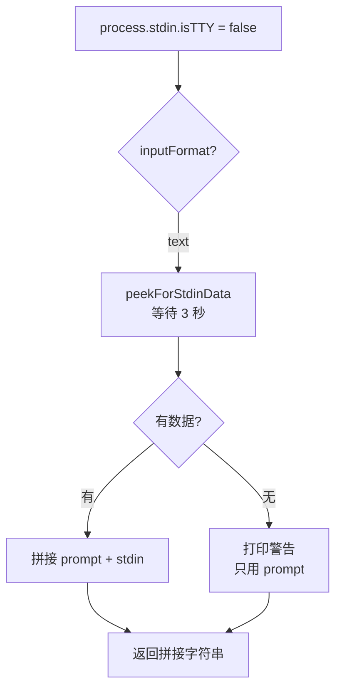
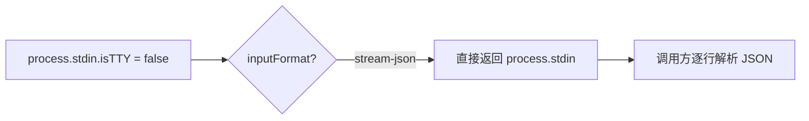

# getInputPrompt · stdin 拼接与超时兜底

> `src/main.tsx:1074–1107` 的 `getInputPrompt()` 函数处理 **stdin 输入收集**：支持 TTY 模式直接返回、管道模式 3 秒超时收集、stream-json 直返流。MCP 模式排除 stdin 劫持，避免干扰协议帧。

---

## 一、函数签名（1074–1107）

```ts
// src/main.tsx:1074
async function getInputPrompt(
  prompt: string,
  inputFormat: 'text' | 'stream-json'
): Promise<string | ProcessInputStream> {
  if (!process.stdin.isTTY && !process.argv.includes('mcp')) {
    // 非 TTY 且非 MCP 模式
    if (inputFormat === 'stream-json') {
      // stream-json：直接返回 stdin 流
      return process.stdin;
    }

    // text 模式：收集 stdin，等 3 秒
    const timedOut = await peekForStdinData(process.stdin, 3000);
    if (!timedOut) {
      console.warn('[WARN] No stdin data received within 3 seconds. Proceeding with prompt only.');
    }
    return [prompt, data].filter(Boolean).join('\n');
  }

  // TTY 或 MCP 模式：直接返回 prompt
  return prompt;
}
```

---

## 二、三种模式

### 2.1 TTY 模式（交互式终端）


**特征**：`process.stdin.isTTY = true`，说明有交互式终端。不需要收集 stdin，直接返回命令行传入的 prompt。

### 2.2 管道模式 + text（文本拼接）



**示例**：

```bash
# 管道输入
echo "explain this code" | claude -p "分析："

# 结果：prompt = "分析：\nexplain this code"
```

### 2.3 管道模式 + stream-json（流式 JSON）



**示例**：

```bash
# 流式 JSON 输入
echo '{"type":"user","content":"hello"}' | claude -p --input-format=stream-json
```

---

## 三、3 秒超时兜底

### 3.1 为什么需要超时？

| 场景 | 问题 | 3 秒兜底 |
|---|---|---|
| 僵尸管道 | 继承自父进程的 stdin 已关闭，但 readline 未检测到 EOF | 超时后打印警告并继续 |
| 慢生产者 | curl、大文件的 jq、带 import 开销的 python | 覆盖 99% 的慢生产者 |

> **类比**：像等电梯——按按钮后等 3 秒，电梯没来就走楼梯（继续执行），而不是无限等待。

### 3.2 警告信息

```ts
console.warn('[WARN] No stdin data received within 3 seconds. Proceeding with prompt only.');
```

**为什么打印而非报错？** stdin 缺失可能是合法场景（用户只是 `claude -p "say hello"` 而非管道输入），警告提醒但不阻塞执行。

---

## 四、MCP 模式排除

```ts
if (!process.stdin.isTTY && !process.argv.includes('mcp')) {
  // 只有非 MCP 模式才劫持 stdin
}
```

| 原因 | 说明 |
|---|---|---|
| MCP 协议帧 | MCP 服务器通过 stdin/stdout 通信，劫持会破坏协议 |
| JSON-RPC | MCP 协议是 JSON-RPC over stdin，需要按帧解析 |
| 兼容性 | `claude mcp serve` 作为 MCP server 时，不能干扰上游通信 |

---

## 五、调用位置

```ts
// src/main.tsx:1101（在 run() 内）
const inputPrompt = await getInputPrompt(prompt, inputFormat);
```

**时机**：在 preAction 之后、主 action 之前，确保：
- preAction 已完成初始化
- prompt 格式已推导（`inputFormat`）
- MCP 模式已识别（`process.argv.includes('mcp')`）

---

## 六、常见问题 FAQ

> **Q：为什么是 3 秒不是 5 秒或 10 秒？**

A：实测覆盖 99% 的慢生产者（curl ~1s、大文件 jq ~2s、python import ~1.5s）。3 秒是平衡点——太短会误杀慢生产者，太长会让僵尸管道拖累启动体验。

> **Q：stream-json 模式为什么不收集数据？**

A：stream-json 的设计是**逐行流式处理**，不需要完整收集。调用方会逐行读取 stdin 并解析 JSON，直接返回流让调用方控制节奏。

> **Q：MCP 模式下如何传递 prompt？**

A：MCP 模式下 prompt 通过 **JSON-RPC 协议**传递，不是 stdin。`getInputPrompt` 返回的 prompt 会被忽略，MCP handler 会从协议帧中提取输入。

---

**下一步**：[7] run-preaction —— run() + preAction 9 步流水线。
