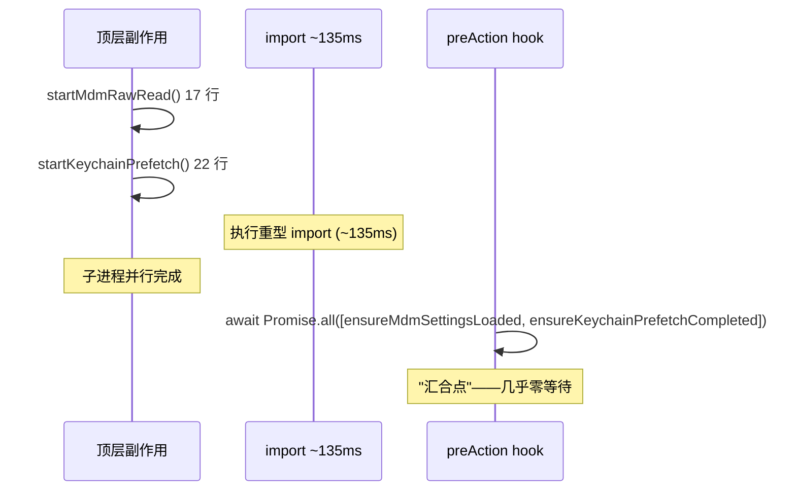

# run() + preAction · 初始化流水线

> `src/main.tsx:1122–1209` 的 `run()` 函数注册 Commander `preAction` hook，定义了**每次执行前的 9 步初始化流水线**。无论执行哪个子命令或主 action，preAction 都会先运行（`--help` 除外）。

---

## 一、preAction 9 步流水线（1146–1209）

```ts
// src/main.tsx:1146
program.hook('preAction', async (thisCommand, actionCommand) => {
  // 步骤 1：性能计时
  profileCheckpoint('preAction_start');

  // 步骤 2：等待顶层预取完成（汇合点）
  await Promise.all([
    ensureMdmSettingsLoaded(),
    ensureKeychainPrefetchCompleted()
  ]);

  // 步骤 3：memoized init()
  await init();

  // 步骤 4：进程标题
  if (!process.env.CLAUDE_CODE_DISABLE_TERMINAL_TITLE) {
    process.title = 'claude';
  }

  // 步骤 5：挂载日志 sink
  initSinks();

  // 步骤 6：处理 --plugin-dir
  setInlinePlugins();
  clearPluginCache();

  // 步骤 7：跑 migrations
  runMigrations();

  // 步骤 8：加载远程管理设置（非阻塞）
  loadRemoteManagedSettings().catch(() => {});
  loadPolicyLimits().catch(() => {});

  // 步骤 9：上传本地 settings 到远端（feature gated）
  uploadUserSettingsInBackground().catch(() => {});
});
```

---

## 二、9 步详解

| 步骤 | 行号 | 调用 | 作用 | 阻塞? |
|---|---|---|---|---|
| 1 | `1147` | `profileCheckpoint('preAction_start')` | 性能计时 | 否 |
| 2 | `1154` | `await Promise.all([...])` | 等待顶层预取完成（汇合点） | 是 |
| 3 | `1156` | `await init()` | 执行 memoized 初始化 | 是 |
| 4 | `1163-1165` | `process.title = 'claude'` | 终端标签/任务管理器显示 `claude` | 否 |
| 5 | `1172-1173` | `initSinks()` | 挂载日志 sink，子命令也能使用 `logEvent` | 否 |
| 6 | `1184-1188` | `setInlinePlugins()` + `clearPluginCache()` | 处理 `--plugin-dir` option | 否 |
| 7 | `1190` | `runMigrations()` | 跑 9 项 migration（版本号 11） | 否 |
| 8 | `1197-1198` | `loadRemoteManagedSettings()` + `loadPolicyLimits()` | 企业远程管理设置（非阻塞，fail-open） | 否 |
| 9 | `1204-1206` | `uploadUserSettingsInBackground()` | 上传本地 settings 到远端同步（feature gated） | 否 |

---

## 三、汇合点设计（步骤 2）



**为什么是 `Promise.all`？** 两个预取任务（MDM / keychain）彼此独立，同时等待比顺序 await 更快。大多数情况下子进程在 import 期间早已完成，这里汇合接近零等待。

---

## 四、memoized init()（步骤 3）

```ts
// entrypoints/init.ts:89（示意）
export const init = memo(() => {
  enableConfigs();
  // 触发 STATE 单例（realpathSync + randomUUID）
  // applySafeConfigEnvironmentVariables()
  // applyExtraCACertsFromConfig()
  // setupGracefulShutdown()
  // initialize1PEventLogging()（异步）
  // initJetBrainsDetection()
});
```

| 特性 | 说明 |
|---|---|---|
| memoized | 无论被调用多少次，实际代码只运行一次 |
| 单例触发 | 首次调用触发 `bootstrap/state.ts` 的 `STATE` 单例 |
| 异步部分 | `initialize1PEventLogging` 是 fire-and-forget |

> **为什么需要 memoized？** 其他入口（cli.tsx 快速路径）也会调用 `init()`，memoized 确保初始化代码只运行一次。

---

## 五、与 `entrypoints/init.ts` 的关系

```mermaid
flowchart TD
    A[preAction hook] --> B[await init()]
    B --> C[entrypoints/init.ts]
    C --> D[enableConfigs]
    C --> E[STATE 单例触发]
    C --> F[applySafeConfigEnvironmentVariables]
    C --> G[applyExtraCACertsFromConfig]
    C --> H[setupGracefulShutdown]
    C --> I[initialize1PEventLogging 异步]
    C --> J[initJetBrainsDetection]
```

---

## 六、--help 零初始化

```ts
// Commander 内建行为
if (argv.includes('-h') || argv.includes('--help')) {
  // 直接打印帮助并 exit
  // 不进入 preAction，不进入 action
}
```

| 行为 | 结果 |
|---|---|
| `claude --help` | 零副作用，瞬时响应 |
| `claude mcp --help` | 同上 |
| `claude -p "hi"` | 过 preAction 9 步流水线 |

> **意义**：`--help` 是真正的"零成本"查询——不读 keychain、不跑 migrations、不做 init。

---

## 七、常见问题 FAQ

> **Q：为什么 steps 4-9 非阻塞（无 await）？**

A：它们是"发射后不管"（fire-and-forget）的初始化：进程标题设置、日志挂载、插件注册、migrations 都是快速操作或可以异步执行。只有 steps 2-3 需要等待（预取汇合 + init）。

> **Q：`loadRemoteManagedSettings` 为什么非阻塞 + fail-open？**

A：远程管理设置是**企业功能的锦上添花**，不应该阻塞本地执行。如果远程服务不可用，降级到本地配置（fail-open）确保 CLI 仍可用。

> **Q：`initSinks` 为什么在 preAction 而非 init() 里？**

A：sinks 挂载依赖 preAction 的执行上下文（如知道当前是哪个命令）。放在 preAction 确保子命令（doctor / mcp / plugin）也能使用日志功能。

---

**下一步**：[8] options-registry —— 163 个 option 注册（6 大类目录）。
