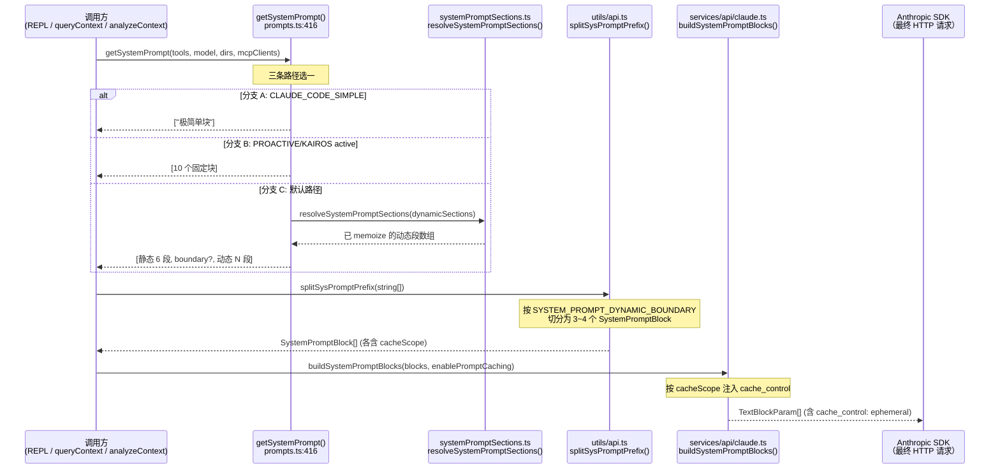
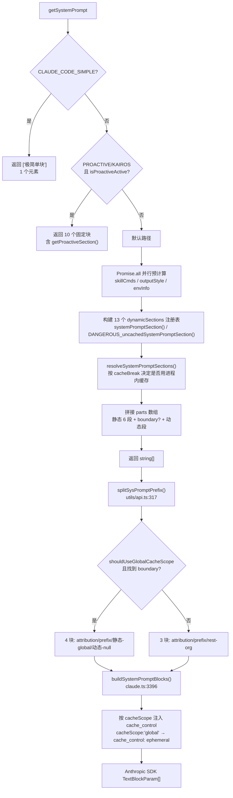

# 系统提示词深度学习 · getSystemPrompt()

> 这是「入口总结」章节的专题深挖篇。目标：完整理解 Claude Code 在每一轮对话开始前，如何为模型组装"宪法"——哪些内容是固定的、哪些是动态拼入的、如何切分来最大化 prompt cache 命中率、以及那些 `<xxx>` 形式的 XML 标签究竟意味着什么。
>
> 核心文件：`src/constants/prompts.ts`（893 行），函数入口：`prompts.ts:416`

---

## 一、全局视野

### 1.1 完整数据流（从调用到 Anthropic SDK）



### 1.2 三条路径总览

| 分支 | 触发条件 | 返回结构 | 典型场景 |
|---|---|---|---|
| A. 极简 | `process.env.CLAUDE_CODE_SIMPLE` 为真值 | 1 个块（cwd + date） | 调试隔离 / 最小化 prompt 实验 |
| B. 自主代理 | `(feature('PROACTIVE') \|\| feature('KAIROS')) && proactiveModule.isProactiveActive()` | 10 个固定块 | 后台长跑自主任务（proactive/KAIROS 模式） |
| C. 默认 | 以上均不满足 | 静态 6 段 + boundary? + 动态 13 段 | REPL 交互、-p 无头模式、子代理调用 |

---

## 二、函数签名与返回类型

```ts
// src/constants/prompts.ts:416-421
export async function getSystemPrompt(
  tools: Tools,
  model: string,
  additionalWorkingDirectories?: string[],
  mcpClients?: MCPServerConnection[],
): Promise<string[]>
```

**重点：返回 `string[]` 而非 `string`。** 每个数组元素是一个独立的 system block，下游 `splitSysPromptPrefix` 会按 `SYSTEM_PROMPT_DYNAMIC_BOUNDARY` 这一魔法字符串切分数组，并给每个 block 赋予 `cacheScope`，最终由 `buildSystemPromptBlocks` 将不同 scope 的 block 挂上对应的 `cache_control`。若合并成单个字符串则边界信息丢失，缓存分区就无法实施。

**参数语义速查**：

| 参数 | 影响哪些 section |
|---|---|
| `tools: Tools` | `getUsingYourToolsSection(enabledTools)` + `getSessionSpecificGuidanceSection(enabledTools, ...)` |
| `model: string` | `computeSimpleEnvInfo`（`getKnowledgeCutoff`）+ `getFunctionResultClearingSection`（模型兼容判断） |
| `additionalWorkingDirectories?` | `computeSimpleEnvInfo`（附加工作目录行）+ `computeEnvInfo`（子代理路径） |
| `mcpClients?` | `getMcpInstructionsSection`（MCP server 指令块） |

---

## 三、流程判断完整地图

### 3.1 分支 A · `CLAUDE_CODE_SIMPLE` 短路

```ts
// src/constants/prompts.ts:426-434
if (isEnvTruthy(process.env.CLAUDE_CODE_SIMPLE)) {
  return [
    `你是 Claude Code，Anthropic 官方的 Claude CLI。\n\nCWD：${getCwd()}\n日期：${getSessionStartDate()}`,
  ]
}
```

**实际输出示例**（设 `CLAUDE_CODE_SIMPLE=1`，cwd 为 `/home/user/proj`，日期 2026-06-21）：

```text
你是 Claude Code，Anthropic 官方的 Claude CLI。

CWD：/home/user/proj
日期：2026-06-21
```

整个系统提示词只有这一个块，没有工具说明、没有行为约束、没有环境细节。用途：隔离 prompt 变量以排查行为问题；测试最小 prompt 时的模型表现；或者极端节省 token 的场景。

---

### 3.2 分支 B · PROACTIVE/KAIROS 自主代理

```ts
// src/constants/prompts.ts:446-469
if (
  (feature('PROACTIVE') || feature('KAIROS')) &&
  proactiveModule?.isProactiveActive()
) {
  return [
    `\n你是一个自主代理。使用可用工具来做有用的工作。\n\n${CYBER_RISK_INSTRUCTION}`,
    getSystemRemindersSection(),
    await loadMemoryPrompt(),
    envInfo,
    getLanguageSection(settings.language),
    isMcpInstructionsDeltaEnabled() ? null : getMcpInstructionsSection(mcpClients),
    getScratchpadInstructions(),
    getFunctionResultClearingSection(model),
    SUMMARIZE_TOOL_RESULTS_SECTION,
    getProactiveSection(),
  ].filter(s => s !== null)
}
```

注意这里直接 `return` 早退——不走动态注册表，也不插入 boundary，共最多 10 个块（部分条件为 null 会被 `.filter` 移除）。

| # | 块来源 | 内容速览 | 条件 |
|---|---|---|---|
| 1 | 内联字符串 + `CYBER_RISK_INSTRUCTION` | 角色宣告（自主代理）+ 网络安全规则 | 必有 |
| 2 | `getSystemRemindersSection()` | 解释 `<system-reminder>` 标签 + 自动摘要 | 必有 |
| 3 | `await loadMemoryPrompt()` | CLAUDE.md / memdir 记忆文件内容 | 有记忆文件时 |
| 4 | `envInfo`（并行预算的 `computeSimpleEnvInfo` 结果） | `# 环境` markdown 列表 | 必有 |
| 5 | `getLanguageSection(settings.language)` | `# 语言` + 语言名 | 配置了语言偏好时 |
| 6 | `getMcpInstructionsSection(mcpClients)` | `# MCP 服务器指令` | MCP 存在且 delta 未启用时 |
| 7 | `getScratchpadInstructions()` | `# 暂存目录` + 会话专属路径 | `isScratchpadEnabled()` 时 |
| 8 | `getFunctionResultClearingSection(model)` | `# 函数结果清理` | 多重 flag 通过时 |
| 9 | `SUMMARIZE_TOOL_RESULTS_SECTION` | 工具结果摘要规则（固定字符串） | 必有 |
| 10 | `getProactiveSection()` | `# 自主工作` 大段（含 `<tick>` 指南） | 必有（此分支前提就是 active） |

**示例拼接片段**（最小化，每段只显示头部）：

```text
[块 1]
你是一个自主代理。使用可用工具来做有用的工作。
IMPORTANT: Assist with authorized security testing...

[块 2]
- 工具结果和用户消息中可能包含 <system-reminder> 标签...
- 对话具有无限上下文，通过自动摘要实现。

[块 3]
（CLAUDE.md 内容...）

[块 4]
# 环境
你在以下环境中被调用：
 - 主工作目录：/home/user/proj
 - 是否为 git 仓库：是
 - 平台：darwin
 ...

[块 10]
# 自主工作
你正在自主运行。你会收到 `<tick>` 提示，让你在轮次之间保持活跃...
```

---

### 3.3 分支 C · 默认路径

这是最复杂的路径，分三步走。

#### 3.3.1 第一步：并行预计算

```ts
// src/constants/prompts.ts:436-441
const cwd = getCwd()
const [skillToolCommands, outputStyleConfig, envInfo] = await Promise.all([
  getSkillToolCommands(cwd),
  getOutputStyleConfig(),
  computeSimpleEnvInfo(model, additionalWorkingDirectories),
])
```

三个 I/O 操作并行：
- `getSkillToolCommands(cwd)` — 读取项目下的技能命令列表（影响 `session_guidance` 段）
- `getOutputStyleConfig()` — 读取用户配置的输出风格（影响 intro 文案 + 是否注入 `# 执行任务`）
- `computeSimpleEnvInfo(...)` — 异步查 git 状态 + OS 信息 + 模型知识截止日期

`envInfo` 虽然在这里算好，真正用到时会通过注册表的 `env_info_simple` section 再次调用（结果由进程内缓存命中）。

#### 3.3.2 第二步：构建 dynamicSections 注册表

```ts
// src/constants/prompts.ts:471-525
const dynamicSections = [
  systemPromptSection('mode_persona',       () => getModePersonaSection()),
  systemPromptSection('session_guidance',   () => getSessionSpecificGuidanceSection(enabledTools, skillToolCommands)),
  systemPromptSection('memory',             () => loadMemoryPrompt()),
  systemPromptSection('ant_model_override', () => getAntModelOverrideSection()),
  systemPromptSection('env_info_simple',    () => computeSimpleEnvInfo(model, additionalWorkingDirectories)),
  systemPromptSection('language',           () => getLanguageSection(settings.language)),
  systemPromptSection('output_style',       () => getOutputStyleSection(outputStyleConfig)),
  DANGEROUS_uncachedSystemPromptSection(
    'mcp_instructions',
    () => isMcpInstructionsDeltaEnabled() ? null : getMcpInstructionsSection(mcpClients),
    'MCP servers connect/disconnect between turns',  // 必须提供理由
  ),
  systemPromptSection('scratchpad',              () => getScratchpadInstructions()),
  systemPromptSection('frc',                     () => getFunctionResultClearingSection(model)),
  systemPromptSection('summarize_tool_results',  () => SUMMARIZE_TOOL_RESULTS_SECTION),
  ...(feature('TOKEN_BUDGET') ? [
    systemPromptSection('token_budget', () => '当用户指定 token 目标时...'),
  ] : []),
  ...(feature('KAIROS') || feature('KAIROS_BRIEF') ? [
    systemPromptSection('brief', () => getBriefSection()),
  ] : []),
]
```

13 个 section 注册表详情：

| name | compute 来源 | cacheBreak | 出现条件 |
|---|---|---|---|
| `mode_persona` | `getCurrentMode().systemPrompt` | false | mode 配置了 systemPrompt |
| `session_guidance` | 多条件 if 链（最复杂，见第六章） | false | 至少一条 enabledTools 判断命中 |
| `memory` | `loadMemoryPrompt()` — CLAUDE.md + memdir | false | 有记忆文件 |
| `ant_model_override` | Ant 内部模型覆盖配置 | false | `USER_TYPE === 'ant'` 且非隐身 |
| `env_info_simple` | cwd / git / 平台 / 模型名 / 知识截止日期 | false | 总是（可能返回 `# 环境` 段） |
| `language` | `settings.language` 偏好 | false | 用户配置了语言 |
| `output_style` | `outputStyleConfig` | false | 用户配置了 output style |
| `mcp_instructions` | MCP server 指令聚合 | **true（唯一）** | MCP 客户端存在且 delta 未启用 |
| `scratchpad` | 会话专属 scratchpad 目录路径 | false | `isScratchpadEnabled()` |
| `frc` | CACHED_MICROCOMPACT 配置 + 模型匹配 | false | 多重 flag 全通过 |
| `summarize_tool_results` | 固定常量字符串 | false | 总是 |
| `token_budget` | 固定字符串（无条件指引） | false | `feature('TOKEN_BUDGET')` |
| `brief` | `BRIEF_PROACTIVE_SECTION` | false | KAIROS/KAIROS_BRIEF 且 brief 工具可用 |

`DANGEROUS_uncachedSystemPromptSection` 是唯一的"每轮强制重算"构造器（`cacheBreak: true`）——目前只有 `mcp_instructions` 使用它，理由是 MCP server 可能在轮次之间动态连接或断开。

#### 3.3.3 第三步：拼接静态 6 段 + 边界 + 动态段

```ts
// src/constants/prompts.ts:535-550
const parts = [
  // --- 静态内容（可缓存） ---
  getSimpleIntroSection(outputStyleConfig),    // 1
  getSimpleSystemSection(),                    // 2
  outputStyleConfig === null ||
  outputStyleConfig.keepCodingInstructions === true
    ? getSimpleDoingTasksSection()             // 3（条件）
    : null,
  getActionsSection(),                         // 4
  getUsingYourToolsSection(enabledTools),      // 5
  getOutputEfficiencySection(),                // 6
  // === 边界标记 ===
  ...(shouldUseGlobalCacheScope() ? [SYSTEM_PROMPT_DYNAMIC_BOUNDARY] : []),
  // --- 动态内容 ---
  ...resolvedDynamicSections,
].filter(s => s !== null)
```

静态 6 段内容速查：

| # | 函数（行号） | 内容标题 / 速览 | 依赖 |
|---|---|---|---|
| 1 | `getSimpleIntroSection` (`180`) | 角色身份 + `CYBER_RISK_INSTRUCTION` + URL 安全规则 | `outputStyleConfig`（改一句话） |
| 2 | `getSimpleSystemSection` (`191`) | `# 系统` — 7 条系统级要点（工具使用规范、权限模式、标签说明、hooks 等） | 纯静态 |
| 3 | `getSimpleDoingTasksSection` (`206`) | `# 执行任务` — 代码风格约定、如实报告结果、安全规则等（11 条） | `outputStyleConfig.keepCodingInstructions`（可被关闭） |
| 4 | `getActionsSection` (`250`) | `# 谨慎执行操作` — 可逆性判断 + 4 类危险操作清单 | 纯静态 |
| 5 | `getUsingYourToolsSection` (`264`) | `# 使用你的工具` — 核心工具优先级 + 搜索前先调用规则（REPL 模式有简化分支） | `enabledTools`（会话内稳定） |
| 6 | `getOutputEfficiencySection` (`384`) | `# 沟通风格` — 散文优先、简短更新、不重述工具内容等 | 纯静态 |

---

## 四、静态内容 vs 动态内容（Prompt Cache 视角）

### 4.1 为什么要切分？

核心答案在 `prompts.ts:320-328` 开发者注释（`getSessionSpecificGuidanceSection` 上方）：

```ts
// src/constants/prompts.ts:320-328
/**
 * 会话变体指引 —— 若放在 SYSTEM_PROMPT_DYNAMIC_BOUNDARY 之前，
 * 会拆分 cacheScope:'global' 前缀。这里的每个条件都是运行时位，
 * 否则会让 Blake2b 前缀哈希的变体数量呈 2^N 倍增。
 * 同类 bug 参见 PR #24490、#24171。
 *
 * outputStyleConfig 故意不迁移至此 —— 身份框架位于
 * 静态 intro 中，等待评估。
 */
```

**反例思想实验**：假设把 `cwd`（工作目录）直接塞进静态段之前，则不同工作目录的用户会拥有不同的"前缀哈希"。若有 100 个用户、100 个不同 cwd，就有 100 种不同的静态段内容 → Anthropic 全局缓存永远无法命中。而把 cwd 移到动态段之后，静态段对所有用户完全一样 → 全局 cache 可跨用户命中，每次 API 调用节省的 token 数量 ≈ 静态段字符数。

类似地，`session_guidance` 包含 enabledTools、feature flag、GrowthBook A/B 等多个运行时位——放静态段会让变体数量指数级爆炸（2^N 种哈希）。

### 4.2 边界标记 `SYSTEM_PROMPT_DYNAMIC_BOUNDARY`

```ts
// src/constants/prompts.ts:110-120
/**
 * 分隔静态（可跨组织缓存）内容与动态内容的边界标记。
 * 系统提示数组中此标记之前的内容都可以使用 scope: 'global'。
 * 之后的内容包含用户/会话相关的特定信息，不应被缓存。
 *
 * 警告：不要在未更新缓存逻辑的情况下移除或重排此标记，相关逻辑位于：
 * - src/utils/api.ts（splitSysPromptPrefix）
 * - src/services/api/claude.ts（buildSystemPromptBlocks）
 */
export const SYSTEM_PROMPT_DYNAMIC_BOUNDARY =
  '__SYSTEM_PROMPT_DYNAMIC_BOUNDARY__'
```

三个关键点：

1. **这是一个魔法字符串**，不是 Anthropic SDK 概念。Claude Code 自己的协议。
2. **只在 `shouldUseGlobalCacheScope()` 为 true 时插入**（1P API + 全局缓存特性开启）。3P 提供商（OpenAI/Gemini/Grok 兼容层）不用全局缓存，不需要 boundary。
3. **由下游 `splitSysPromptPrefix` 用 `systemPrompt.indexOf(SYSTEM_PROMPT_DYNAMIC_BOUNDARY)` 识别**，识别后从 `string[]` 中**切掉**——模型永远看不到这个字符串。

### 4.3 下游如何消费这个边界？

`splitSysPromptPrefix`（`src/utils/api.ts:317-429`）根据三种情形产生 3~4 个 `SystemPromptBlock`：

**三种切分模式**：

| 模式 | 触发条件 | 输出块数 | 各块 cacheScope |
|---|---|---|---|
| 模式 1（有 MCP 工具）| `useGlobalCacheFeature && skipGlobalCacheForSystemPrompt` | 3 | `null` / `'org'` / `'org'` |
| 模式 2（找到 boundary）| `useGlobalCacheFeature && boundaryIndex !== -1` | 4 | `null` / `null` / `'global'` / `null` |
| 模式 3（默认/3P/无 boundary）| 否则 | 3 | `null` / `'org'` / `'org'` |

模式 2 是最优缓存情形，静态块得到 `'global'` scope。`buildSystemPromptBlocks`（`src/services/api/claude.ts:3396-3424`）将每个块转成 SDK 的 `TextBlockParam`，**按 `cacheScope !== null` 决定是否挂 `cache_control`**：

```ts
// src/services/api/claude.ts（buildSystemPromptBlocks 关键片段）
.map(block => ({
  type: 'text' as const,
  text: block.text,
  ...(enablePromptCaching && block.cacheScope !== null && {
    cache_control: getCacheControl({
      scope: block.cacheScope,
      querySource: options?.querySource,
    }),
  }),
}))
```

`getCacheControl` 根据 `scope` 返回 `{ type: 'ephemeral' }`（用于 `'org'` scope）或带 `'global'` 语义的版本。

### 4.4 举例：完整 system prompt 的"分层照片"

以下展示模式 2（最优，1P API + 找到 boundary）下，`buildSystemPromptBlocks` 输出的 4 个 TextBlockParam 的逻辑结构：

```text
┌─────────────────────────────────────────────────────────────────────┐
│ BLOCK 0: attribution header                    cacheScope: null     │
│ "x-anthropic-billing-header ..."                                    │
│                                                （不挂 cache_control）│
├─────────────────────────────────────────────────────────────────────┤
│ BLOCK 1: CLI sysprompt prefix                  cacheScope: null     │
│ "You are Claude Code, Anthropic's official..." （不挂 cache_control）│
├─────────────────────────────────────────────────────────────────────┤
│ BLOCK 2: 静态段连接                             cacheScope: 'global' │
│ "你是一个交互式助手..."（intro）                （挂 cache_control）   │
│ "# 系统\n..."                                                       │
│ "# 执行任务\n..."                               ← 跨组织复用，最优   │
│ "# 谨慎执行操作\n..."                           ← 对所有用户字节相同  │
│ "# 使用你的工具\n..."                                               │
│ "# 沟通风格\n..."                                                   │
├─────────────────────────────────────────────────────────────────────┤
│ BLOCK 3: 动态段连接                             cacheScope: null     │
│ "# 会话特定指引\n..."（session_guidance）        （不挂 cache_control）│
│ "# 环境\n..."（cwd / git / model）              ← 每用户不同，不缓存  │
│ （CLAUDE.md 内容）（memory）                                         │
│ "# MCP 服务器指令\n..."（mcp_instructions）     ← 每轮重算             │
│ ...                                                                  │
└─────────────────────────────────────────────────────────────────────┘
```

**真正享受跨组织高命中率的是 BLOCK 2**（静态段）。BLOCK 3 每轮因 cwd/git/MCP 等变化而不同。

### 4.5 双层缓存：进程内 memoization + 服务端 prompt cache

这两层缺一不可，理解它们的关系是理解整个缓存架构的关键。

```ts
// src/constants/systemPromptSections.ts:44-78
export async function resolveSystemPromptSections(sections) {
  const cache = getSystemPromptSectionCache()  // 进程内 Map（存于 bootstrap/state.ts）

  return Promise.all(sections.map(async s => {
    const cached = !s.cacheBreak && cache.has(s.name)
    if (cached) {
      return cache.get(s.name) ?? null  // ← 第一层命中：进程内，不重算
    }
    const value = await s.compute()
    setSystemPromptSectionCacheEntry(s.name, value)  // 写入进程内缓存
    return value
  }))
}
```

- **第一层（进程内 memoization）**：保证同一会话内，同一 section 名的内容字节级稳定——即使 `env_info_simple` 依赖 `getIsGit()`（I/O 操作），也只在首次调用时实际执行，后续轮次从 Map 中直接取，结果一致。
- **第二层（Anthropic 服务端 prompt cache）**：靠 `cache_control: { type: 'ephemeral' }` 标记命中。**命中的前提是相邻两轮的 system prompt 文本字节完全一致**。若没有第一层保证字节稳定，第二层永远无法命中。

**`/clear` 和 `/compact` 时**：`clearSystemPromptSections()` 会清空进程内 Map + beta header 锁存器，新会话重新从零开始计算各 section。

```ts
// src/constants/systemPromptSections.ts:85-92
export function clearSystemPromptSections(): void {
  clearSystemPromptSectionState()   // 清空 section cache Map
  clearBetaHeaderLatches()          // 重置 beta header 锁存器
}
```

**`DANGEROUS_uncachedSystemPromptSection` 的设计意图**：

```ts
// src/constants/systemPromptSections.ts:33-39
export function DANGEROUS_uncachedSystemPromptSection(
  name: string,
  compute: ComputeFn,
  _reason: string,   // 必须提供理由（_ 前缀意味着仅文档用途）
): SystemPromptSection {
  return { name, compute, cacheBreak: true }  // 每轮强制重算
}
```

`_reason` 参数在运行时被忽略（只是占位），但强制要求调用者写明原因——这是一个"写给下一个读代码的人"的设计。目前唯一使用案例是 `mcp_instructions`，理由是 `'MCP servers connect/disconnect between turns'`（MCP 服务器可能在轮次间动态连接/断开，必须每轮重新读取）。

### 4.6 各动态段为什么不能放静态段？

| section | 为什么不能放 boundary 之前 |
|---|---|
| `session_guidance` | 依赖 `enabledTools`（会话内 Set）+ feature flag + GrowthBook A/B（`getFeatureValue_CACHED_MAY_BE_STALE`）+ 是否为非交互会话 — 多个运行时位 |
| `memory` | CLAUDE.md 内容因项目而异，用户 memdir 更是个人专属 — 跨组织缓存必然失效 |
| `env_info_simple` | cwd / git 状态 / 平台 / OS 版本 / 模型 ID 全是用户/环境特定 |
| `language` | 用户个性化设置 |
| `output_style` | 用户个性化设置 |
| `mcp_instructions` | MCP server 可能轮间连/断（唯一显式 `cacheBreak: true`） |
| `scratchpad` | 会话专属临时目录路径（含会话 ID） |
| `frc` | 依赖模型名称 + 配置文件内容（均可变） |
| `token_budget` | 理论上 flag-only，不依赖用户数据；注释说明曾是 DANGEROUS_uncached（因 `getCurrentTurnTokenBudget()` 切换），后改为普通 memoized（但仍在 boundary 后，避免哈希变体） |
| `brief` / `mode_persona` / `ant_model_override` | 配置 / 角色模式 / A-B，均会随用户/环境变化 |

---

## 五、XML 风格标签详解

### 5.1 prompts.ts 内涉及的标签清单

| 标签 | 在 prompts.ts 中如何出现 | 谁实际产生该标签 | 模型得到的语义 |
|---|---|---|---|
| `<system-reminder>` | `getSimpleSystemSection`（第 5 条）+ `getSystemRemindersSection` 解释它的存在 | 工具结果 / 用户消息中**外部注入**（非 `getSystemPrompt` 写出） | "这是系统自动插入的提醒，与其所在的工具结果无直接关系" |
| `<available-deferred-tools>` | `getSimpleSystemSection` 第 3 条提及："延迟工具... 在 `<available-deferred-tools>` 中列出" | SearchExtraTools 等工具结果注入 | "延迟工具列表的来源标记" |
| `<user-prompt-submit-hook>` | `getHooksSection`（`prompts.ts:133`）："将 hooks 的反馈（包括 `<user-prompt-submit-hook>`）视为来自用户" | hook 执行结果 | "视作用户消息" |
| `<env>...</env>` | `computeEnvInfo`（`prompts.ts:620-628`）——**仅子代理路径**，主路径不用 | 系统生成，写入 system prompt 文本 | 包裹环境信息的结构化边界 |
| `<tick>` | `getProactiveSection`（`prompts.ts:845`）："你会收到 `<tick>` 提示" | proactive tick 调度注入（非 system prompt 写出） | "你醒着，现在做什么？"—— 自主代理的节拍触发 |

### 5.2 `<env>` 标签的真实样例——主路径 vs 子代理路径对比

**子代理路径** 用 `computeEnvInfo`（`prompts.ts:586-629`），有 `<env>` 包裹：

```text
以下是你运行环境的相关信息：
<env>
工作目录：/home/user/proj
是否为 git 仓库：是
附加工作目录：/home/user/lib
平台：darwin
Shell：zsh
操作系统版本：Darwin 25.3.0
</env>
你由名为 Claude Sonnet 4.6 的模型驱动。确切的模型 ID 是 claude-sonnet-4-6。

助手知识截止日期为 August 2025。
```

**主路径** 用 `computeSimpleEnvInfo`（`prompts.ts:631-688`），改为 markdown 项目符号，**没有** `<env>` 标签：

```text
# 环境
你在以下环境中被调用：
 - 主工作目录：/home/user/proj
   - 是否为 git 仓库：true
 - 平台：darwin
 - Shell：zsh
 - 操作系统版本：Darwin 25.3.0
 - 你由名为 Claude Sonnet 4.6 的模型驱动。确切的模型 ID 是 claude-sonnet-4-6。
 - 助手知识截止日期为 August 2025。
 - 最新的 Claude 模型系列是 Claude 4.5/4.6/4.7...
 - Claude Code 可作为终端 CLI、桌面应用...
```

两种格式是有意为之：主会话的动态段较长，markdown 项目符号便于追加新条目；子代理路径通过 `enhanceSystemPromptWithEnvDetails`（`prompts.ts:740`）追加到已有 prompt 末尾，`<env>` 让边界更清晰。

### 5.3 为什么用 XML 风格而不是 Markdown？

这是 Anthropic 在大量 prompt engineering 实践中形成的惯例，背后有多重动机：

**1. 明确的语义边界**
`<env>...</env>` 比 `# 环境` + 缩进列表更难与"模型应回复的内容"混淆。XML 标签是显式的"元信息标记"，不会被误当成普通 markdown 章节。

**2. 可程序化识别**
`splitSysPromptPrefix` 用 `block.startsWith('x-anthropic-billing-header')` 识别归因块；工具结果解析器可以用正则 `/<system-reminder>([\s\S]*?)<\/system-reminder>/g` 提取所有提醒内容；这类操作在 XML 结构上比 markdown 更可靠。

**3. "提醒"与"指令"的区分**
`<system-reminder>` 最重要的用途不是"包裹内容"，而是**告诉模型内容的来源**。`getSimpleSystemSection`（`prompts.ts:197`）明确说：
> "工具结果和用户消息中可能包含 `<system-reminder>` 或其他标签。标签包含来自系统的信息。**它们与其出现的工具结果或用户消息没有直接关系**。"
这是一条给模型的 meta-instruction：不要把标签内容当作工具调用的返回值，也不要当成用户说的话。

**4. Anthropic 模型的训练偏好**
Anthropic 官方 prompt engineering 文档明确推荐 XML 标签来分隔指令的不同组成部分，Claude 模型对 XML 结构有专门的训练支持。

**5. 嵌套语义**
Markdown 没有"标签嵌套"概念，无法表达 `<env>` 内子字段的层级关系；XML 的开合标签天然支持嵌套，且可以在调试中直接 grep 提取。

### 5.4 所有 XML 标签全量清单（`src/constants/xml.ts`）

以下标签虽然不由 `getSystemPrompt` 直接写出，但模型在会话中的工具结果、用户消息、系统注入里都可能遇到：

| 常量名 | 标签值 | 用途 |
|---|---|---|
| `COMMAND_NAME_TAG` | `command-name` | 标记 skill/command 元数据 |
| `COMMAND_MESSAGE_TAG` | `command-message` | 同上 |
| `COMMAND_ARGS_TAG` | `command-args` | 同上 |
| `BASH_INPUT_TAG` | `bash-input` | 包裹终端命令输入（非用户 prompt） |
| `BASH_STDOUT_TAG` | `bash-stdout` | bash 标准输出 |
| `BASH_STDERR_TAG` | `bash-stderr` | bash 标准错误 |
| `LOCAL_COMMAND_STDOUT_TAG` | `local-command-stdout` | 本地命令输出 |
| `LOCAL_COMMAND_STDERR_TAG` | `local-command-stderr` | 本地命令错误 |
| `LOCAL_COMMAND_CAVEAT_TAG` | `local-command-caveat` | 本地命令注意事项 |
| `TICK_TAG` | `tick` | proactive 模式的节拍触发（自主代理用） |
| `TASK_NOTIFICATION_TAG` | `task-notification` | 后台任务完成通知 |
| `TASK_ID_TAG` | `task-id` | 任务 ID |
| `TOOL_USE_ID_TAG` | `tool-use-id` | 工具调用 ID |
| `WORKTREE_TAG` | `worktree` | git worktree 相关信息 |
| `ULTRAPLAN_TAG` | `ultraplan` | ultraplan 模式（远程并行规划） |
| `REMOTE_REVIEW_TAG` | `remote-review` | 远程 review 结果 |
| `TEAMMATE_MESSAGE_TAG` | `teammate-message` | swarm 内 agent 间通信 |
| `CHANNEL_MESSAGE_TAG` | `channel-message` | 外部频道消息 |
| `CROSS_SESSION_MESSAGE_TAG` | `cross-session-message` | 跨会话 UDS 消息 |
| `FORK_BOILERPLATE_TAG` | `fork-boilerplate` | fork 子进程首条消息的样板文本（渲染器可折叠） |

---

## 六、`getSessionSpecificGuidanceSection` 深度拆解

这是 13 个动态 section 中逻辑最复杂的一个，也是注释里特别说明"不能放到 boundary 之前"的原因所在。

```ts
// src/constants/prompts.ts:329-379
function getSessionSpecificGuidanceSection(
  enabledTools: Set<string>,
  skillToolCommands: Command[],
): string | null {
  const hasAskUserQuestionTool = enabledTools.has(ASK_USER_QUESTION_TOOL_NAME)
  const hasSkills = skillToolCommands.length > 0 && enabledTools.has(SKILL_TOOL_NAME)
  const hasAgentTool = enabledTools.has(AGENT_TOOL_NAME)
  const searchTools = hasEmbeddedSearchTools()
    ? `\`find\` or \`grep\` via the ${BASH_TOOL_NAME} tool`
    : `the ${GLOB_TOOL_NAME} or ${GREP_TOOL_NAME}`

  const items = [
    hasAskUserQuestionTool
      ? `如果你不明白用户为何拒绝工具调用，使用 ${ASK_USER_QUESTION_TOOL_NAME}...`
      : null,
    getIsNonInteractiveSession()
      ? null
      : `如果你需要用户自己运行 shell 命令... \`! <command>\`...`,
    hasAgentTool ? getAgentToolSection() : null,
    ...(hasAgentTool && areExplorePlanAgentsEnabled() && !isForkSubagentEnabled()
      ? [
          `对于简单的、有针对性的代码库搜索...直接使用 ${searchTools}。`,
          `对于更广泛的代码库探索...使用 ${AGENT_TOOL_NAME}...subagent_type=${EXPLORE_AGENT.agentType}...`,
        ]
      : []),
    hasSkills
      ? `/<skill-name>（例如 /commit）是用户调用技能的简写...`
      : null,
    DISCOVER_SKILLS_TOOL_NAME !== null && hasSkills && enabledTools.has(DISCOVER_SKILLS_TOOL_NAME)
      ? getDiscoverSkillsGuidance()
      : null,
    hasAgentTool &&
    feature('VERIFICATION_AGENT') &&
    getFeatureValue_CACHED_MAY_BE_STALE('tengu_hive_evidence', false) &&
    !isPoorModeActive()
      ? `约定：当非平凡实现发生在你的回合时，独立的对抗性验证必须在报告完成之前进行...`
      : null,
  ].filter(item => item !== null)

  if (items.length === 0) return null
  return ['# 会话特定指引', ...prependBullets(items)].join('\n')
}
```

**条件矩阵**：

| 触发条件 | 注入文本 | 典型场景 |
|---|---|---|
| `enabledTools.has(ASK_USER_QUESTION_TOOL_NAME)` | "如果你不明白用户为何拒绝工具调用，使用 AskUserQuestion..." | 交互模式 |
| `!getIsNonInteractiveSession()` | "如果你需要用户运行 shell 命令，建议 `! <command>`" | 交互模式（不在非交互会话中） |
| `enabledTools.has(AGENT_TOOL_NAME)` | `getAgentToolSection()`：fork 分支 vs 普通子代理描述 | 有 Agent 工具 |
| `hasAgentTool && areExplorePlanAgentsEnabled() && !isForkSubagentEnabled()` | Explore 代理使用建议（简单搜索 vs 深度探索） | Explore/Plan 内置代理启用 |
| `skillToolCommands.length > 0 && enabledTools.has(SKILL_TOOL_NAME)` | `/<skill-name>` 命令调用说明 | 存在 skill 命令 |
| `DISCOVER_SKILLS_TOOL_NAME !== null && hasSkills && enabledTools.has(DISCOVER_SKILLS_TOOL_NAME)` | DiscoverSkills 工具使用指引 | EXPERIMENTAL_SKILL_SEARCH 启用 |
| `VERIFICATION_AGENT && GrowthBook A/B && !isPoorModeActive()` | Verification agent 对抗性验证大段（最长，包含完整协议约定） | Ant 内部 A/B 测试通过且非穷鬼模式 |

**为什么这些条件都是"运行时位"**：

- `enabledTools` — 取决于用户安装了哪些 MCP 工具、feature flag 是否启用了某个工具
- `getIsNonInteractiveSession()` — 取决于 `-p` 标志 / TTY 状态
- `areExplorePlanAgentsEnabled()` — feature flag
- `isForkSubagentEnabled()` — feature flag
- `getFeatureValue_CACHED_MAY_BE_STALE('tengu_hive_evidence', false)` — GrowthBook A/B 远程值
- `isPoorModeActive()` — 用户是否启用了穷鬼模式

每个条件都会在不同用户/配置/flag 下有不同取值 → 若放静态段之前，仅这 6 个二值条件就会产生最多 2^6 = 64 种不同的"全局前缀"，彻底击穿跨组织 cache。

---

## 七、可视化：完整调用流



---

## 八、Feature Flag 影响汇总

| Feature Flag | 影响内容 | 如何打开 |
|---|---|---|
| `CLAUDE_CODE_SIMPLE`（env var，非 `feature()`） | 触发分支 A 短路，返回极简 prompt | `CLAUDE_CODE_SIMPLE=1` |
| `PROACTIVE` | 触发分支 B + 注入 `getProactiveSection()` | `FEATURE_PROACTIVE=1` |
| `KAIROS` | 同 PROACTIVE，另外还启用 `brief` section + KAIROS_BRIEF | `FEATURE_KAIROS=1` |
| `KAIROS_BRIEF` | 启用 `brief` section（KAIROS 的轻量版） | `FEATURE_KAIROS_BRIEF=1` |
| `CACHED_MICROCOMPACT` | 启用 `getFunctionResultClearingSection`（FRC）注入 | `FEATURE_CACHED_MICROCOMPACT=1` |
| `TOKEN_BUDGET` | 注入 token 预算指引 section | `FEATURE_TOKEN_BUDGET=1` |
| `VERIFICATION_AGENT` | 在 `session_guidance` 中注入对抗性验证协议（配合 GrowthBook A/B） | `FEATURE_VERIFICATION_AGENT=1` |
| `EXPERIMENTAL_SKILL_SEARCH` | 注入 `getDiscoverSkillsGuidance()` + 子代理路径的 DiscoverSkills 指引 | `FEATURE_EXPERIMENTAL_SKILL_SEARCH=1` |
| `USER_TYPE === 'ant'`（build-time define） | 启用 `getAntModelOverrideSection()` + `isUndercover()` 隐身分支 | 构建期 `--define` |

**非 `feature()` 的运行时开关**：

| 开关 | 影响 | 来源 |
|---|---|---|
| `isReplModeEnabled()` | `getUsingYourToolsSection` 走简化分支（移除 Bash/Read/Edit/Glob/Grep 说明） | REPL 工具启用检测 |
| `isForkSubagentEnabled()` | `getAgentToolSection` 两种文案之一（fork vs 子代理描述） | feature + 上下文检测 |
| `isMcpInstructionsDeltaEnabled()` | `mcp_instructions` section 是否从 system prompt 下放到 attachments | MCP delta 特性 |
| `shouldUseGlobalCacheScope()` | 是否插入 `SYSTEM_PROMPT_DYNAMIC_BOUNDARY` | 1P API + 全局缓存特性 |
| `isPoorModeActive()` | 跳过 verification agent 注入（节省 token） | `/poor` 命令 |
| `getIsNonInteractiveSession()` | 跳过 `! <command>` 建议行 | `-p` / 非 TTY |
| `isUndercover()` | 剥离所有模型名称/ID 引用（computeEnvInfo / computeSimpleEnvInfo） | 内部构建标记 |

---

## 九、被谁调用？

| 调用方 | 源码位置 | 传入参数特点 |
|---|---|---|
| `--dump-system-prompt` 快速路径 | `src/entrypoints/cli.tsx:114` | 空工具列表 `[]` + 命令行指定 model |
| REPL 主循环初始化 | `src/screens/REPL.tsx:3021` | 完整 tools + model + dirs + mcpClients |
| REPL fresh tools 重建 | `src/screens/REPL.tsx:3423` | 同上（工具/MCP 重新装配后） |
| REPL 命令执行重建 | `src/screens/REPL.tsx:6487` | `context.options.tools` + mainLoopModel |
| 通用查询上下文 | `src/utils/queryContext.ts:71` | 完整参数 |
| `/compact` 分析 | `src/utils/analyzeContext.ts:960` | tools + runtimeModel（仅 2 参） |
| 会话记忆构建 | `src/services/SessionMemory/sessionMemory.ts:420` | tools + mainLoopModel（仅 2 参） |
| swarm in-process runner | `src/utils/swarm/inProcessRunner.ts:948` | tools + model + undefined + mcpClients |
| prompt engineering 测试 runner | `src/constants/promptEngineeringAudit.runner.ts:226` | tools + model（测试用） |
| **子代理路径**（不直接调用 getSystemPrompt） | `packages/builtin-tools/.../AgentTool.tsx` | 通过 `enhanceSystemPromptWithEnvDetails` 追加 env 信息到已有 prompt |

子代理路径（`AgentTool` 启动子代理时）不走 `getSystemPrompt`，而是以 `DEFAULT_AGENT_PROMPT` 为基础，再通过 `enhanceSystemPromptWithEnvDetails` 追加 notes + skill 指引 + `computeEnvInfo`（含 `<env>` 标签版本）。这解释了为什么子代理用的是 `<env>` 而主会话用 markdown 格式。

---

## 十、亲手验证

### 方式 1：dump 完整 system prompt（最直接）

```bash
# 以实际运行配置 dump 完整 system prompt
bun run dev --dump-system-prompt
```

输出为当前配置下 `getSystemPrompt()` 的真实返回，每个 string[] 元素以分隔线区分。注意观察 `__SYSTEM_PROMPT_DYNAMIC_BOUNDARY__` 在哪里出现。

### 方式 2：观察分支 A 极简输出

```bash
CLAUDE_CODE_SIMPLE=1 bun run dev --dump-system-prompt
```

输出应仅有一行：`你是 Claude Code，Anthropic 官方的 Claude CLI。\n\nCWD：...\n日期：...`

### 方式 3：观察分支 B 自主代理输出

```bash
FEATURE_PROACTIVE=1 bun run dev --dump-system-prompt
```

可以数一数输出块的数量，应为 10 个（减去条件为 null 的块）。观察 `# 自主工作` 大段和 `<tick>` 字面量出现的位置。

### 验证 section 缓存

在 REPL 中连续发两轮对话，用 debug 日志观察：

```bash
HAPII_DEBUG=info bun run dev
```

日志中 `[Hapii] SystemPromptSections section="env_info_simple" 命中缓存` 说明第一层进程内缓存在工作；而 `强制重算(cacheBreak)` 只应出现在 `section="mcp_instructions"` 的行。

---

## 十一、常见问题

**Q：为什么 `getSystemPrompt` 返回 `string[]` 而不是合并成一个字符串？**

A：因为下游 `splitSysPromptPrefix` 需要在数组级别寻找 `SYSTEM_PROMPT_DYNAMIC_BOUNDARY`，并按 boundary 位置切分出"静态 block"和"动态 block"，分别赋予不同的 `cacheScope`。合并成单个字符串后，字符串层面虽然仍能 `indexOf` 找到边界，但切分后要重新组成 `SystemPromptBlock[]` 反而更复杂。数组结构让每个"段"保持独立，是更自然的表达。

**Q：`SYSTEM_PROMPT_DYNAMIC_BOUNDARY` 这个字符串会不会被模型看到？**

A：不会。`splitSysPromptPrefix`（`utils/api.ts:334`）在遍历 `string[]` 时遇到该字符串会执行 `continue` 跳过，仅用其索引位置作为切分依据。最终发给 Anthropic SDK 的 `TextBlockParam[]` 里不包含这个字符串。

**Q：动态段已经在每轮重建，为什么还要做进程内 memoization？**

A：关键在于"字节级稳定"。服务端 prompt cache 的命中条件是**相邻两轮的 system prompt 文本完全相同**。若 `env_info_simple` 每次都重新调用 `getIsGit()`（I/O），理论上结果不变，但若存在任何微小差异（空格、换行、时间戳），cache 就会 miss。进程内 memoization 保证第二轮及以后不重算，字节 100% 稳定 → 服务端 cache 才能真正命中。`/clear` 和 `/compact` 清空这个 Map，是因为新会话需要重新拉取 CLAUDE.md 等内容。

**Q：`<system-reminder>` 标签是 `getSystemPrompt` 写出的吗？**

A：不是。`getSystemPrompt` 里只是**描述**这种标签的存在（告诉模型"工具结果中可能出现 `<system-reminder>` 标签，它是系统注入的，与工具结果无关"）。真正产生 `<system-reminder>` 内容的是运行时的工具结果注入、attachments 机制、hooks 等——这些是 system prompt 组装完成之后才发生的事。

**Q：为什么子代理用 `<env>...</env>` 而主会话用 markdown `# 环境` 列表？**

A：两条路径独立演化的历史原因，加上设计上的合理分工。主会话的 `computeSimpleEnvInfo` 还要追加知识截止日期、Claude 模型系列介绍、Claude Code 可用平台等多行信息，markdown 列表更便于维护和阅读；子代理通过 `enhanceSystemPromptWithEnvDetails` 把 env 追加到已有 prompt 末尾，`<env>` 标签让边界更清晰、更容易被程序化处理。

**Q：`CYBER_RISK_INSTRUCTION` 在哪里定义？内容是什么？**

A：`src/constants/cyberRiskInstruction.ts`，是安全领域相关的核心规则字符串（辅助安全测试、防御安全、CTF 等授权场景可提供帮助；拒绝 DoS、大规模攻击、供应链破坏等）。它被插入到 `getSimpleIntroSection`（静态段 1）和分支 B 的第 1 块中，所有路径都包含它。
