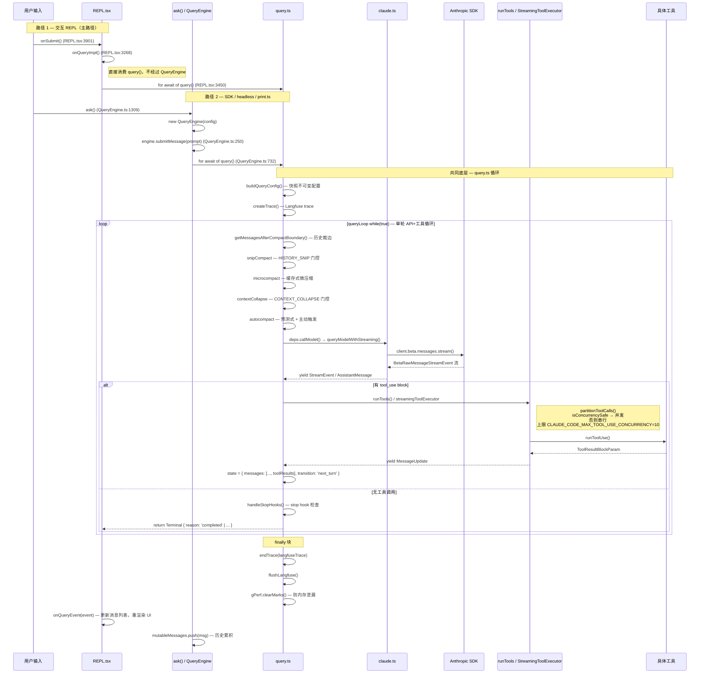

# 核心循环知识总结

> 这是"总结学习"栏目的第二篇。目标：深入理解 Claude Code 的**核心执行引擎**——从用户输入到 API 调用到工具执行再到响应渲染的完整循环。覆盖 9 个核心文件的详细实现，全部行号从源码实际读取。

---

## 一、核心循环全貌（双路径时序图）

> 下面的时序图展示了**两条平行消费路径**：REPL 路径直接 `for await of query()`，SDK/headless 路径经由 `QueryEngine`。两条路径在 `query.ts` 层汇合。



---

## 二、三层执行模型

> Claude Code 的核心循环是严格分层的三层架构。理解每层的"拥有什么/接收什么/返回什么"是读懂代码的钥匙。

### 2.1 三层架构表

| 层 | 文件 | 拥有什么 | 接收什么 | 返回/yield 什么 |
|---|---|---|---|---|
| **QueryEngine（可选编排层）** | `src/QueryEngine.ts` | `mutableMessages`（完整历史）、`totalUsage`、`permissionDenials` | `prompt` 字符串或 ContentBlockParam[] | `SDKMessage` 流（assistant/user/result/system 等） |
| **query()（底层 async generator）** | `src/query.ts` | 内部 `State` 可变对象（含 `messages` 快照副本） | 不可变 `QueryParams`（messages 快照、systemPrompt、canUseTool 等） | `StreamEvent / AssistantMessage / Message / Terminal` |
| **claude.ts（API 执行层）** | `src/services/api/claude.ts` | 无持久状态 | messages、systemPrompt、tools、options | `StreamEvent / AssistantMessage / SystemAPIErrorMessage` |

### 2.2 关键架构事实

**REPL 不经过 QueryEngine**：`REPL.tsx:3450` 直接 `for await (const event of query({...}))` 消费，REPL 自己维护 `messages` state（React useState）。QueryEngine 只在 SDK/headless（`ask()` 函数）路径使用。

**QueryEngine 的 mutableMessages 守恒**：
- QE 在 `QueryEngine.ts:482` `this.mutableMessages.push(...messagesFromUserInput)` 添加用户消息
- 在 `QueryEngine.ts:831` `this.mutableMessages.push(msg)` 回流 assistant 消息
- `query()` 接收的是 `[...this.mutableMessages]` 快照（`QueryEngine.ts:485`），不是引用

**State vs mutableMessages**：`query.ts` 内部的 `State.messages`（`query.ts:262`）是循环迭代间的可变对象，每个继续点用 `state = { messages: [...], ... }` 整体替换，与 QE 的 `mutableMessages` 完全独立。

---

## 三、`src/query.ts` 底层循环（核心引擎）

### 3.1 `query()` 入口（`query.ts:298`）

```ts
export async function* query(
  params: QueryParams,
): AsyncGenerator<
  | StreamEvent
  | RequestStartEvent
  | Message
  | TombstoneMessage
  | ToolUseSummaryMessage,
  Terminal
>
```

**入口职责**：

| 行号段 | 作用 |
|---|---|
| `query.ts:308` | 初始化 `consumedCommandUuids: string[]` — 排队命令生命周期追踪 |
| `query.ts:314` | `ownsTrace` 判断：子 agent 复用父 trace，主调用创建新 trace |
| `query.ts:322–332` | `createTrace(sessionId, model, provider, input, querySource)` — Langfuse trace 创建 |
| `query.ts:346` | `terminal = yield* queryLoop(...)` — 委托给内部循环 |
| `query.ts:355–416` | `finally` 块：`endTrace` / `flushLangfuse` / `gPerf.clearMarks()` / `clearMeasures` / `clearResourceTimings` |
| `query.ts:413–416` | `for (uuid of consumedCommandUuids) notifyCommandLifecycle(uuid, 'completed')` |

**关键设计**：`finally` 块是三重清理链。`flushLangfuse` 释放 SpanImpl 持有的序列化对话历史（防止长会话内存泄漏）；`gPerf.clearMarks()` 斩断 OTel 引用的 C++ Vector（防止 571MB Performance 对象累积）。

### 3.2 `State` 可变状态体（`query.ts:261–274`）

```ts
type State = {
  messages: Message[]                                    // 当前迭代的消息列表
  toolUseContext: ToolUseContext                          // 工具上下文（含 abortController）
  autoCompactTracking: AutoCompactTrackingState | undefined  // compact 状态追踪
  maxOutputTokensRecoveryCount: number                   // max_output_tokens 恢复次数
  hasAttemptedReactiveCompact: boolean                   // 是否已尝试 reactive compact
  maxOutputTokensOverride: number | undefined            // 动态 token 上限覆盖（escalate 用）
  pendingToolUseSummary: Promise<ToolUseSummaryMessage | null> | undefined  // 异步摘要
  stopHookActive: boolean | undefined                    // stop hook 是否活跃
  turnCount: number                                      // 已执行轮次数
  transition: Continue | undefined                       // 上一次继续的原因
}
```

**设计要点**：`State` 是循环内部的可变对象，`params`（QueryParams）是入口处一次性传入的不可变快照。每次迭代开头解构 `state`，继续点统一用 `state = { ... }` 整体替换，避免 9 个独立赋值导致的竞态。

### 3.3 `Continue` / `Terminal` 转移表（`query/transitions.ts`）

**Terminal**（终止原因，generator 返回值）：

| reason | 含义 |
|---|---|
| `completed` | 正常完成，无工具调用 |
| `blocking_limit` | 上下文达到硬阻塞上限 |
| `image_error` | 图片尺寸/调整错误 |
| `model_error` | 模型/运行时错误 |
| `aborted_streaming` | 流式响应中被用户中断 |
| `aborted_tools` | 工具执行中被用户中断 |
| `prompt_too_long` | 上下文过长且无法恢复 |
| `stop_hook_prevented` | stop hook 阻止继续 |
| `hook_stopped` | hook 在工具执行中阻止继续 |
| `max_turns` | 达到最大轮次限制 |

**Continue**（继续原因，记录在 `state.transition`）：

| reason | 含义 |
|---|---|
| `collapse_drain_retry` | context collapse 排空后重试（PTL 恢复第一阶段） |
| `reactive_compact_retry` | reactive compact 成功后重试（PTL 恢复第二阶段） |
| `max_output_tokens_escalate` | 8k → 64k 上限升级重试（`ESCALATED_MAX_TOKENS`） |
| `max_output_tokens_recovery` | 注入续写 prompt 后重试（最多 `MAX_OUTPUT_TOKENS_RECOVERY_LIMIT=3` 次） |
| `stop_hook_blocking` | stop hook 返回 blockingErrors，注入后重试 |
| `token_budget_continuation` | token budget 未耗尽，注入 nudge message 续写 |
| `next_turn` | 正常下一轮（有工具调用，追加结果后继续） |

### 3.4 `queryLoop` 单轮 11 步流水线（`query.ts:432`）

```
while (true) {
  step1  → getMessagesAfterCompactBoundary()  历史裁边
  step2  → snipCompact（HISTORY_SNIP 门控）   toolUseResult payload 丢弃
  step3  → applyToolResultBudget()            按消息预算限制聚合工具结果大小
  step4  → microcompact                        缓存式微压缩（pendingCacheEdits 延迟 yield）
  step5  → contextCollapse（CONTEXT_COLLAPSE 门控）  上下文折叠投影
  step6  → autocompact（主动阈值检查）         超过阈值 → buildPostCompactMessages()
  step7  → predictive autocompact             估算本轮增长 → 预测式提前 compact
  step8  → deps.callModel()                   queryModelWithStreaming，流式事件 yield
  step9  → PTL / 媒体错误恢复                 collapse_drain → reactive_compact → 暴露错误
  step10 → max_output_tokens 三档恢复          escalate(8k→64k) → recovery × 3 → 暴露
  step11 → stop hooks → 工具执行 → state 更新  handleStopHooks → runTools/StreamingToolExecutor
}
```

**关键步骤详解**：

- **step1**（`query.ts:576`）：`getMessagesAfterCompactBoundary(messages)` — 只看最近一次 compact 之后的消息，防止把已摘要的历史重复发给 API。
- **step2**（`query.ts:583–591`）：删除 `msg.toolUseResult` payload —— UI 已渲染，API 不需要原始输出对象，释放内存（防止 400KB FileRead 永久驻留）。
- **step4**（`query.ts:640`）：`deps.microcompact(messagesForQuery, toolUseContext, querySource)` — 缓存 MC 靠 tool_use_id 操作，API 响应后才 yield 边界消息（获得真实 cache_deleted_input_tokens）。
- **step8**（`query.ts:935`）：`for await (const message of deps.callModel({...}))` — 流式事件逐 chunk yield；`FallbackTriggeredError` 触发 fallback 重试（切换模型，丢弃孤儿消息）。
- **step9**（`query.ts:1395–1513`）：PTL 恢复两阶段：① `contextCollapse.recoverFromOverflow()` 排空已分阶段的 collapse（`collapse_drain_retry`）；② `reactiveCompact.tryReactiveCompact()`（`reactive_compact_retry`）。两阶段都失败才暴露错误。
- **step10**（`query.ts:1517–1583`）：`isWithheldMaxOutputTokens` 检查 — 先 `max_output_tokens_escalate`（无 override 且 Statsig gate `tengu_otk_slot_v1` 开启），再 `max_output_tokens_recovery`（最多 `MAX_OUTPUT_TOKENS_RECOVERY_LIMIT=3` 次），最后暴露。
- **step11 续写点**（`query.ts:2101–2113`）：正常下一轮更新 state：`messages: [...messagesForQuery, ...assistantMessages, ...toolResults]`，`transition: { reason: 'next_turn' }`。

### 3.5 错误恢复矩阵

| 错误类型 | 触发条件 | 处理逻辑 | 结果 |
|---|---|---|---|
| PTL（PromptTooLong）| API 返回 413 | ① collapse_drain_retry ② reactive_compact_retry | Terminal `prompt_too_long` 或继续 |
| 媒体尺寸错误 | 图片/PDF 超限 | `reactiveCompact.isWithheldMediaSizeError` → strip-retry | Terminal `image_error` 或继续 |
| `max_output_tokens` | 响应截断 | escalate → recovery ×3 | Terminal `model_error` 或继续 |
| `FallbackTriggeredError` | 主模型高负载 | `currentModel = fallbackModel`，重建 StreamingToolExecutor | 继续（同轮次） |
| stop hook blocking | stop hook 返回 blockingErrors | `stopHookResult.blockingErrors` 追加，`stopHookActive: true` | `stop_hook_blocking` 继续 |
| stop hook prevent | stop hook 返回 preventContinuation | 直接返回 | Terminal `stop_hook_prevented` |
| 用户中断（流式） | `abortController.signal.aborted`（流中） | yield `userInterruptionMessage({toolUse: false})` | Terminal `aborted_streaming` |
| 用户中断（工具中） | `abortController.signal.aborted`（工具后） | yield `userInterruptionMessage({toolUse: true})` | Terminal `aborted_tools` |
| `ImageSizeError` | 图片处理失败 | yield errorMessage | Terminal `image_error` |

### 3.6 工具执行两条路径（`query.ts:1700–1748`）

**路径 A：`runTools()`**（`toolOrchestration.ts:21`，默认路径）

```ts
// query.ts:1722
const toolUpdates = runTools(toolUseBlocks, assistantMessages, canUseTool, toolUseContext)
```

`runTools` 内部调用 `partitionToolCalls()` 将工具列表分区为批次：
- **并发批**（`isConcurrencySafe = true`）：工具的 `isConcurrencySafe(input)` 返回 `true`（通常是只读工具），上限由 `CLAUDE_CODE_MAX_TOOL_USE_CONCURRENCY`（默认 10）控制。
- **串行批**：写操作或 `isConcurrencySafe = false` 的工具，逐个执行。

**路径 B：`StreamingToolExecutor`**（gate: Statsig `tengu_streaming_tool_execution2`）

通过 `config.gates.streamingToolExecution` 控制。在流式响应期间就开始调度工具（`streamingToolExecutor.addTool(block, assistantMessage)`），而非等整个响应完成。`FallbackTriggeredError` 发生时调用 `streamingToolExecutor.discard()` 丢弃孤儿结果。

### 3.7 排队命令生命周期

| 步骤 | 代码位置 | 说明 |
|---|---|---|
| 命令进入队列 | `messageQueueManager.ts` `enqueue()` | 外部触发（用户排队、agent 任务通知） |
| 命令快照 | `query.ts:1922` | `getCommandsByMaxPriority(sleepRan ? 'later' : 'next')` |
| 声明消费 | `query.ts:1931` | `claimConsumableQueuedAutonomyCommands()` |
| 标记启动 | `query.ts:1946` | `notifyCommandLifecycle(uuid, 'started')` |
| 追加到 toolResults | `query.ts:1952` | `getAttachmentMessages()` 转为附件 |
| 标记完成 | `query.ts:413` | `notifyCommandLifecycle(uuid, 'completed')` — 在 `query()` 正常返回后 |

---

## 四、`src/query/` 目录五子文件

### 4.1 `query/transitions.ts`（21 行）

| 行号 | 导出类型 | 作用 |
|---|---|---|
| 1–11 | `Terminal` | 查询循环的终止原因联合类型（10 个 reason） |
| 13–21 | `Continue` | 继续迭代的原因联合类型（7 个 reason） |

**为什么存在**：将转移类型抽出到独立文件，让测试可以直接 `import type { Terminal }` 断言恢复路径而不引入 `query.ts` 的大模块图。也是文档化"所有可能的循环出口"的契约点。

### 4.2 `query/deps.ts`（40 行）

| 行号 | 导出 | 作用 |
|---|---|---|
| 21–31 | `QueryDeps` | DI 接口：4 个可注入依赖（callModel / microcompact / autocompact / uuid） |
| 33–40 | `productionDeps()` | 生产环境默认实现（返回真实函数引用） |

**为什么存在**：`callModel` 和 `autocompact` 在 6–8 个测试文件中都需要 mock，`deps.ts` 把它们聚合为一个 DI 接口，测试只需传 `deps: { callModel: mock, ... }` 即可，省去逐文件 `spyOn`。`typeof fn` 写法确保签名与真实实现自动同步。

### 4.3 `query/config.ts`（46 行）

| 行号 | 导出 | 作用 |
|---|---|---|
| 15–27 | `QueryConfig` | 不可变配置快照：sessionId + 4 个 runtime gates |
| 29–46 | `buildQueryConfig()` | 在 `queryLoop` 入口处调用一次，快照 env/Statsig 状态 |

**QueryConfig 的 4 个 gates**：

| gate 字段 | 来源 | 作用 |
|---|---|---|
| `streamingToolExecution` | Statsig `tengu_streaming_tool_execution2` | 是否用 StreamingToolExecutor |
| `emitToolUseSummaries` | `CLAUDE_CODE_EMIT_TOOL_USE_SUMMARIES` env | 是否生成 tool use 摘要 |
| `isAnt` | `USER_TYPE === 'ant'` env | 内部员工特性开关 |
| `fastModeEnabled` | `!CLAUDE_CODE_DISABLE_FAST_MODE` env | fast mode 是否可用 |

**为什么存在**：与 `feature()` 门控区分——`feature()` 是构建时 tree-shaking 边界，必须内联于 `if/三元` 条件；`gates` 是运行时 env/Statsig 状态，快照一次避免 5–30s 流期间翻转导致扣留与恢复逻辑不一致。

### 4.4 `query/tokenBudget.ts`（93 行）

| 行号 | 导出 | 作用 |
|---|---|---|
| 6–11 | `BudgetTracker` | 预算追踪器状态（continuationCount / lastDelta / lastGlobal / startedAt） |
| 13–19 | `createBudgetTracker()` | 初始化追踪器（每次 `queryLoop` 调用一次） |
| 43–93 | `checkTokenBudget()` | 检查是否应继续/停止：`ContinueDecision` 或 `StopDecision` |

**taskBudget vs TOKEN_BUDGET 对比**：

| 概念 | 来源 | 控制位置 | 机制 |
|---|---|---|---|
| `taskBudget` | `QueryParams.taskBudget.total`（API 调用方传入） | `query.ts:250–255`，传给 `claude.ts` 的 `output_config.task_budget` | API 服务端 beta `task-budgets-2026-03-13` 控制每次采样的 token 上限 |
| `TOKEN_BUDGET` | `feature('TOKEN_BUDGET')` + `getCurrentTurnTokenBudget()` | `query.ts:1639–1686`，`tokenBudget.ts:checkTokenBudget()` | 客户端检查，累计输出 token 接近预算时注入 nudge message 让模型提前结束 |

两者相互独立：`taskBudget` 是服务端约束，`TOKEN_BUDGET` 是客户端续写策略。

### 4.5 `query/stopHooks.ts`（~200 行）

| 行号段 | 作用 |
|---|---|
| 57–60 | `StopHookResult` 类型：`{ blockingErrors: Message[], preventContinuation: boolean }` |
| 62–77 | `handleStopHooks()` 签名：async generator，接收完整上下文，返回 `StopHookResult` |
| 79–100 | 构建 `stopHookContext`，调用 `saveCacheSafeParams`（仅 `repl_main_thread` / `sdk`） |

**两种 stop hook 结果**：
- `preventContinuation = true`：→ Terminal `stop_hook_prevented`（不再调用 API）
- `blockingErrors.length > 0`：→ Continue `stop_hook_blocking`（注入错误消息，重新调用 API）

**为什么存在**：将 stop hook 逻辑从 `query.ts` 主循环抽出，避免循环主体过于臃肿，同时便于独立测试 hook 行为。

---

## 五、`src/QueryEngine.ts` 会话编排

### 5.1 类字段（`QueryEngine.ts:209–230`）

| 字段 | 类型 | 说明 |
|---|---|---|
| `config` | `QueryEngineConfig` | 不可变配置（tools / commands / mcpClients 等） |
| `mutableMessages` | `Message[]` | 完整对话历史，跨 `submitMessage()` 调用持久化 |
| `abortController` | `AbortController` | 可由 `interrupt()` / `resetAbortController()` 管理 |
| `permissionDenials` | `SDKPermissionDenial[]` | 每次 `submitMessage()` 开头清空 |
| `totalUsage` | `NonNullableUsage` | token 累计（input / output / cache 等） |
| `discoveredSkillNames` | `Set<string>` | 技能发现追踪，每次 `submitMessage()` 开头清空 |
| `loadedNestedMemoryPaths` | `Set<string>` | 跨轮次持久化，防止重复加载嵌套 memory |
| `readFileState` | `FileStateCache` | 文件读取缓存（用于 undo/diff） |

### 5.2 `submitMessage()` 流水线（`QueryEngine.ts:250`）

```
1. this.discoveredSkillNames.clear()  (QueryEngine.ts:279)
2. this.permissionDenials = []
3. fetchSystemPromptParts()  (QueryEngine.ts:339) — 构建 system prompt
4. loadMemoryPrompt()  — 若有 CLAUDE_COWORK_MEMORY_PATH_OVERRIDE
5. processUserInput()  (QueryEngine.ts:457) — 处理 slash 命令 / 普通 prompt
6. this.mutableMessages.push(...messagesFromUserInput)  (QueryEngine.ts:482)
7. recordTranscript(messages)  (QueryEngine.ts:501) — 在 API 调用前持久化用户消息
8. buildSystemInitMessage()  (QueryEngine.ts:591) → yield
9. for await of query()  (QueryEngine.ts:732) → 事件处理循环
   - assistant/user 消息 push 到 mutableMessages
   - stream_event message_start/delta/stop → updateUsage / accumulateUsage
   - compact_boundary → splice 释放旧消息（GC 友好）
10. yield result { type: 'result', subtype: 'success' | 'error_*' }  (QueryEngine.ts:1245)
```

### 5.3 mutableMessages 守恒图

```
QueryEngine.mutableMessages（完整历史）
        │
        │ push(messagesFromUserInput)  :482
        │
        ▼
传给 query() 的不可变快照 messages = [...this.mutableMessages]  :485
        │
        │ yield message
        ▼
for await (message of query()):732
        │
        │ this.mutableMessages.push(msg)  :831 (assistant)
        │ this.mutableMessages.push(msg)  :852 (user/tool_result)
        │ this.mutableMessages.push(msg)  :907 (attachment)
        │
        ▼
compact_boundary 触发时释放旧消息:
  this.mutableMessages.splice(0, mutableBoundaryIdx)  :1008
```

**为什么这样设计**：query() 操作的是快照，QE 的 mutableMessages 只在 `for await` 处理时追加，避免 race condition。compact 后 QE 也同步 splice，防止内存无限增长。

### 5.4 `ask()` 便捷封装（`QueryEngine.ts:1309`）

`ask()` 是面向 `print.ts`（headless）和外部 SDK 调用方的便捷函数，内部创建 `QueryEngine` 实例并调用 `submitMessage()`，结束时通过 `finally` 将 `readFileState` 同步回调用方（`setReadFileCache(engine.getReadFileState())`）。

`snipReplay` DI 注入原理（`QueryEngine.ts:1399–1407`）：仅 `HISTORY_SNIP` feature 开启时，`ask()` 注入一个回调函数，当 QE 收到 snip 边界系统消息时调用 `snipModule.snipCompactIfNeeded(store, { force: true })`，在 `mutableMessages` 上重放 snip 以限制长时会话内存占用。REPL 路径不注入此回调（保留完整历史供 UI 回滚）。

### 5.5 SDKMessage result 子类型

| `subtype` | 触发条件 |
|---|---|
| `success` | 正常完成 |
| `error_max_turns` | 达到 `maxTurns` 限制 |
| `error_max_budget_usd` | 累计费用超过 `maxBudgetUsd` |
| `error_max_structured_output_retries` | 结构化输出重试次数超过 `MAX_STRUCTURED_OUTPUT_RETRIES`（默认 5） |
| `error_during_execution` | `isResultSuccessful` 返回 false（含 `[ede_diagnostic]` 诊断前缀） |

---

## 六、`src/services/api/claude.ts` 关键导出

### 6.1 `getExtraBodyParams()`（`claude.ts:280`）

```ts
export function getExtraBodyParams(betaHeaders?: string[]): JsonObject
```

解析 `CLAUDE_CODE_EXTRA_BODY` 环境变量（JSON 对象），与传入的 `betaHeaders` 数组合并到 `anthropic_beta` 字段。为 Bedrock 等 provider 注入额外 beta headers 的入口。

### 6.2 `queryModelWithStreaming()`（`claude.ts:772`）

```ts
export async function* queryModelWithStreaming({
  messages, systemPrompt, thinkingConfig, tools, signal, options,
}): AsyncGenerator<StreamEvent | AssistantMessage | SystemAPIErrorMessage, void>
```

`deps.callModel` 的真实实现。内部通过 `withStreamingVCR` 包装后调用 `queryModel()`。是 `query.ts` 与 Anthropic SDK 之间的唯一接口点。

### 6.3 `executeNonStreamingRequest()`（`claude.ts:836`）

流式请求失败时的非流式降级请求。含 `getNonstreamingFallbackTimeoutMs()`（远端 session 120s，其他 300s）和 `withRetry()` 重试包装。

### 6.4 `updateUsage()` / `accumulateUsage()`（`claude.ts:3078` / `3147`）

- `updateUsage`：将单条 `BetaMessageDeltaUsage` 合并到当前消息用量（`message_start` / `message_delta` 时调用）
- `accumulateUsage`：将 `currentMessageUsage` 累计到 `totalUsage`（`message_stop` 时调用，在 `QueryEngine.ts:887`）

### 6.5 `FallbackTriggeredError`（`withRetry.ts:160`）

```ts
export class FallbackTriggeredError extends Error {
  constructor(
    public readonly originalModel: string,
    public readonly fallbackModel: string,
  )
}
```

主模型高负载时由 `withRetry` 抛出，`query.ts:1188` 捕获后切换 `currentModel = fallbackModel`，`attemptWithFallback = true` 重试同轮次。同时调用 `streamingToolExecutor.discard()` 丢弃孤儿工具结果。

---

## 七、`src/screens/REPL.tsx` 核心循环视角

### 7.1 REPL 消费路径

```
onSubmit() (REPL.tsx:3901)
  └→ [processImmediateCommands / queueing logic]
  └→ onQuery() → onQueryImpl() (REPL.tsx:3268)
       └→ [buildEffectiveSystemPrompt, fetchSystemPromptParts 等准备]
       └→ for await (const event of query({...})) (REPL.tsx:3450)
              └→ onQueryEvent(event) — 更新 messages state，触发 React 重渲染
```

**关键事实**：REPL 直接消费 `query()`，不经过 `QueryEngine`。`querySource` 由 `getQuerySourceForREPL()` 决定（非 `sdk`）。

### 7.2 `toolUseConfirmQueue` 权限弹窗流

```
query() 内部 canUseTool 闭包
  └→ 需要用户批准时：
       setToolUseConfirmQueue(prev => [...prev, { tool, resolve, reject }])
       await new Promise(resolve => ...)  ← 挂起工具执行
用户点击允许/拒绝
  └→ toolUseConfirmQueue[0].resolve(decision)
       └→ 工具执行继续
```

`toolUseConfirmQueue` 定义于 `REPL.tsx:1369`。`REPL.tsx:1406` 的 `isWaitingForApproval` 判断队列非空时禁用 spinner，显示权限弹窗。用户 Ctrl+C 时（`REPL.tsx:2564`）调用 `toolUseConfirmQueue[0]?.onAbort()` 并清空队列。

### 7.3 `abortController` 的 4 种 reason

| reason | 触发源 | 效果 |
|---|---|---|
| `'user-cancel'` | `REPL.tsx:2577` 用户 Ctrl+C / ESC（非 interrupt 模式） | `query.ts` 检查后 Terminal `aborted_streaming` 或 `aborted_tools`；不 yield 中断消息 |
| `'interrupt'` | 某些快捷键触发（`signal.reason === 'interrupt'` 分支） | `query.ts:1367` 检查 `!== 'interrupt'` 时跳过 yield `userInterruptionMessage`，避免重复消息 |
| `undefined`（abort()无参数） | 常规 abort | 会 yield `userInterruptionMessage` |
| 内部超时 | 部分工具内部 abort | 工具内部处理，通常不到主循环 |

`abortController` state 定义于 `REPL.tsx:1122`，ref 于 `REPL.tsx:1125`（供 bridge 等异步场景读取）。

### 7.4 `querySource` 语义

| `querySource` 值 | 路径 |
|---|---|
| `'sdk'` | QE 路径（`QueryEngine.ts:740`），也是 `ask()` / headless 路径 |
| `'repl_main_thread'` | REPL 主线程，通过 `getQuerySourceForREPL()` 返回 |
| `'repl_main_thread_auto_compact'` | REPL 中的自动 compact 调用 |
| `'agent:<agentId>'` | 子 agent 调用（`AgentTool`） |
| `'compact'` | compact fork agent |
| `'session_memory'` | session memory fork agent |

`querySource` 影响多处行为：stop hook 中的 `saveCacheSafeParams` 过滤（仅 `repl_main_thread` / `sdk`）；排队命令的 `isMainThread` 判断；blocking_limit 的跳过逻辑等。

---

## 八、关键类型速查

| 类型名 | 文件:行号 | 简要说明 |
|---|---|---|
| `Terminal` | `query/transitions.ts:1` | query() 返回值，10 个终止 reason |
| `Continue` | `query/transitions.ts:13` | state.transition，7 个继续 reason |
| `State` | `query.ts:261` | queryLoop 跨迭代可变状态体（9 个字段） |
| `QueryParams` | `query.ts:238` | query() 入参，不可变快照 |
| `QueryDeps` | `query/deps.ts:21` | DI 接口，4 个可注入依赖 |
| `QueryConfig` | `query/config.ts:15` | 不可变 env/Statsig 快照，sessionId + 4 gates |
| `BudgetTracker` | `query/tokenBudget.ts:6` | TOKEN_BUDGET 续写状态追踪 |
| `StopHookResult` | `query/stopHooks.ts:57` | `{ blockingErrors, preventContinuation }` |
| `QueryEngineConfig` | `QueryEngine.ts:139` | QueryEngine 构造配置（tools / commands / canUseTool 等） |
| `SDKMessage` | `entrypoints/agentSdkTypes.ts` | QueryEngine.submitMessage() 的 yield 类型 |
| `FallbackTriggeredError` | `services/api/withRetry.ts:160` | 模型回退触发信号 |

---

## 九、设计模式速览

### 9.1 DI seam（`deps.ts`）

`QueryDeps` 的 4 个字段（`callModel` / `microcompact` / `autocompact` / `uuid`）是最常被 mock 的依赖。通过 `params.deps ?? productionDeps()` 注入，测试无需 `spyOn` 整个模块，只需传 `deps: { callModel: mockFn }` 即可。`typeof fn` 写法保证 DI 接口与真实签名自动同步。

### 9.2 `feature()` tree-shaking

```ts
const contextCollapse = feature('CONTEXT_COLLAPSE')
  ? (require('./services/contextCollapse/index.js') as ...)
  : null
```

`feature()` 只能用于 `if/三元` 条件（`bun:bundle` 编译器限制）。Build 时若 `CONTEXT_COLLAPSE` 未启用，`require(...)` 整个分支被 DCE 消除，产物中不包含 contextCollapse 代码。这是 `query.ts` 顶部大量 `const x = feature('X') ? require(...) : null` 的原因。

### 9.3 async generator yield-up

```
claude.ts → yield StreamEvent
query.ts  → yield StreamEvent（透传）
REPL.tsx  → onQueryEvent(event)（消费）
```

每一层都是 async generator，通过 `yield*` 或 `for await` 向上传递事件。这使流式渲染成为可能：用户看到的每个字符增量都是从 SDK 流经这 3 层后直接渲染的。

### 9.4 不可变快照 + 可变 State 分离

```
params.messages（入口处的不可变快照）
       ↓ 传入 queryLoop
State.messages（循环内可变，每个继续点整体替换）
```

防止 race condition：query() 从不修改 `params.messages`，也从不直接修改外部的 `mutableMessages`。两套数据在 QueryEngine 层通过事件回流合并。

### 9.5 `mutableMessages`（QE）vs `messages`（query 快照）

| | `QE.mutableMessages` | `State.messages`（query 内） |
|---|---|---|
| 归属 | QueryEngine 实例 | queryLoop 的 State 对象 |
| 生命周期 | 跨多次 `submitMessage()` 调用 | 单次 `query()` 调用内 |
| 增长方式 | push（消息回流） | state = { messages: [...old, ...new] } |
| compact 处理 | splice 释放旧消息 | 替换为 postCompactMessages |

---

## 十、文件书签 + 学习路径

### 精确行号书签表

| 符号 | 文件:行号 | 说明 |
|---|---|---|
| `Terminal` 类型 | `src/query/transitions.ts:1` | 所有终止 reason 一览 |
| `Continue` 类型 | `src/query/transitions.ts:13` | 所有继续 reason 一览 |
| `QueryDeps` 接口 | `src/query/deps.ts:21` | DI 注入点 |
| `QueryConfig` 类型 | `src/query/config.ts:15` | 不可变配置结构 |
| `checkTokenBudget()` | `src/query/tokenBudget.ts:45` | TOKEN_BUDGET 续写决策 |
| `handleStopHooks()` | `src/query/stopHooks.ts:62` | stop hook 入口 |
| `QueryParams` 类型 | `src/query.ts:238` | query() 入参类型 |
| `State` 类型 | `src/query.ts:261` | 循环内可变状态体 |
| `query()` 入口 | `src/query.ts:298` | 底层 async generator 定义 |
| `queryLoop()` 入口 | `src/query.ts:432` | 内部循环实现 |
| `getMessagesAfterCompactBoundary` | `src/query.ts:576` | 历史裁边（step1） |
| PTL 恢复 collapse_drain | `src/query.ts:1412` | PTL 恢复第一阶段 |
| PTL 恢复 reactive_compact | `src/query.ts:1442` | PTL 恢复第二阶段 |
| `max_output_tokens` escalate | `src/query.ts:1534` | 8k→64k 升级 |
| `max_output_tokens` recovery | `src/query.ts:1558` | 注入续写 prompt |
| `handleStopHooks` 调用 | `src/query.ts:1596` | stop hook 主调用点 |
| 正常下一轮 state 更新 | `src/query.ts:2101` | next_turn 继续点 |
| `runTools()` | `src/services/tools/toolOrchestration.ts:21` | 工具执行入口 |
| `partitionToolCalls()` | `src/services/tools/toolOrchestration.ts:116` | 并发/串行分区 |
| `getExtraBodyParams()` | `src/services/api/claude.ts:280` | beta headers 组装 |
| `queryModelWithStreaming()` | `src/services/api/claude.ts:772` | API 调用入口 |
| `executeNonStreamingRequest()` | `src/services/api/claude.ts:836` | 非流式降级入口 |
| `updateUsage()` | `src/services/api/claude.ts:3078` | 单条消息用量更新 |
| `accumulateUsage()` | `src/services/api/claude.ts:3147` | 累计总用量 |
| `FallbackTriggeredError` | `src/services/api/withRetry.ts:160` | 模型回退信号 |
| `QueryEngine` 类 | `src/QueryEngine.ts:208` | 会话编排器类定义 |
| `submitMessage()` | `src/QueryEngine.ts:250` | 高层入口 |
| `query()` 调用（QE 内） | `src/QueryEngine.ts:732` | QE 消费 query() 的位置 |
| `ask()` 函数 | `src/QueryEngine.ts:1309` | SDK/headless 便捷封装 |
| `snipReplay` 注入 | `src/QueryEngine.ts:1399` | HISTORY_SNIP DI 注入 |
| REPL Props | `src/screens/REPL.tsx:762` | REPL 组件入参类型 |
| `abortController` state | `src/screens/REPL.tsx:1122` | abort 控制器 state 定义 |
| `toolUseConfirmQueue` | `src/screens/REPL.tsx:1369` | 权限弹窗队列 state |
| `onQueryImpl()` | `src/screens/REPL.tsx:3268` | REPL 查询实现 |
| `for await of query()` | `src/screens/REPL.tsx:3450` | REPL 直接消费 query() |
| `onSubmit()` | `src/screens/REPL.tsx:3901` | 用户提交入口 |

### 读代码建议顺序

1. **先读 `query/transitions.ts`**（21 行）：理解所有可能的循环出口，建立"终止条件"的心智模型。
2. **再读 `query/deps.ts` + `query/config.ts`**（40+46 行）：理解 DI 接口和配置快照设计。
3. **然后读 `query.ts` 的 `State` 类型（261-274 行）和 `query()` 入口（298-416 行）**：理解状态隔离设计和 finally 清理链。
4. **精读 `queryLoop` 的 11 步流水线（query.ts:504-2114）**：重点看 API 调用（step8）、PTL 恢复（step9）、max_output_tokens 恢复（step10）、工具执行（step11）。
5. **然后读 `QueryEngine.ts:250-750`**：理解高层编排和 mutableMessages 守恒。
6. **最后读 `REPL.tsx:3268-3460`**：理解 REPL 路径与 QE 路径的分离。

### 下一步学习建议

- **`[3]state-management-summary`**：深入 `AppState`、`bootstrap/state.ts`（sessionId / cwd / tokenBudget）、`AbortController` 的状态管理全貌。
- **`[4]api-layer-summary`**：深入 `claude.ts` 的 7 个 provider 兼容层、prompt caching、streaming vs non-streaming、withRetry 重试策略的完整细节。
