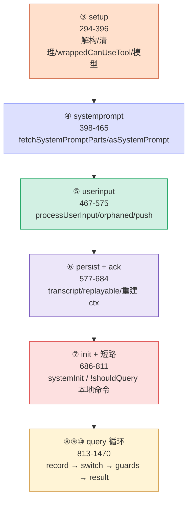
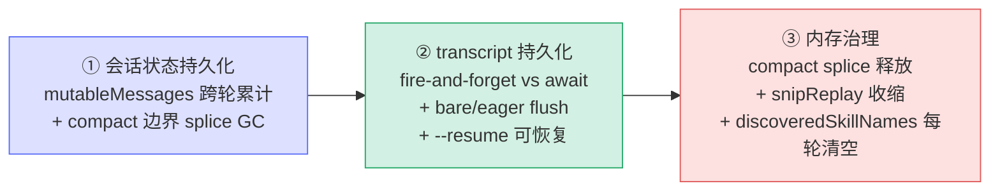

# [0] QueryEngine 总览与心智模型

> `src/QueryEngine.ts`（1695 行）是 Claude Code 的**会话级对话调度器**。它本身不调用 API、也不跑工具——那是底层 `query()`（`src/query.ts`，见姊妹系列 [`query-ts/`](../../query-ts/query/[0]overview/overview.mdx)）的活。QueryEngine 的价值在于**拥有一整段对话的生命周期与状态**：把一次次 `query()` 的「单轮」产出，累计成「会话」。
>
> 本系列按**代码自上而下的执行顺序**把这个文件切成 12 个小节（`[0]`~`[11]`）。本文是**总索引 + 心智模型**：先建立全局认知（四层调用链、状态生命周期、SDKMessage 流），再逐节深入。重点是核心方法 `submitMessage()`（`QueryEngine.ts:294-1470`，约 1200 行），它独占 `[3]`~`[10]` 八节。

---

## 一、四层调用链：它在哪一层

从「一次性脚本调用」到「真正发请求」，纵向有四层，QueryEngine 居中：

```
ask()                  ← QueryEngine.ts:1545   一次性便捷入口（建临时 engine 跑一轮）
   │  new QueryEngine(...) + yield* engine.submitMessage(...)
   ▼
QueryEngine            ← QueryEngine.ts:223     ★本系列主角：会话状态拥有者
   │  submitMessage() 每轮调用
   ▼
submitMessage()        ← QueryEngine.ts:294     单次用户提交的执行器（处理输入→调 query→消费流→出 result）
   │  for await (const m of query({...}))
   ▼
query() → queryLoop()  ← src/query.ts           while(true) 回合循环（调 API + 跑工具）
```

| 层 | 职责 | 位置 |
|---|---|---|
| `ask()` | 一次性封装：建临时 engine、注入 snipReplay、跑一轮、回写文件缓存 | `QueryEngine.ts:1545-1695` |
| **`QueryEngine` 类** | **拥有会话状态：消息历史 / 用量 / 权限拒绝 / 文件缓存 / abort** | `QueryEngine.ts:223-1543` |
| **`submitMessage()`** | **单轮执行器：输入处理 → 系统提示 → query 循环 → result** | `QueryEngine.ts:294-1470` |
| `query()` / `queryLoop()` | 回合循环：预处理 → 调 API → 跑工具 → 判终止 | `src/query.ts` |

> 一句话定位：**QueryEngine = query() 的「会话外壳」**。`query()` 只懂「这一轮」；QueryEngine 把多轮串起来、记账、持久化，并对外暴露 SDK 友好的消息流。

---

## 二、QueryEngine vs query()：分工

`query()` 是无状态的「单轮纯执行」：给它 messages，它 yield 这一轮的产出然后结束。**跨轮要记住的东西**全在 QueryEngine 的实例字段里：

| 持久状态字段 | 作用 | 节 |
|---|---|---|
| `mutableMessages` | 完整对话历史，跨轮累计，compact 边界处会裁剪 GC | `[2]` |
| `totalUsage` | token 用量累计（每个 message_stop 累加） | `[9]` |
| `permissionDenials` | 本轮被拒绝的工具调用，供 SDK result 报告 | `[3]` |
| `readFileState` | 文件读取缓存（Read 工具的 freshness 判定基础） | `[2]` |
| `abortController` | 中断信号，供 `interrupt()` / ACP bridge 使用 | `[2]` |

> **类比**：`query()` 是「一局游戏」的裁判（吹哨、记这一局比分）；QueryEngine 是「整场比赛」的记分牌——累计总分、记录犯规、保存录像（transcript），并在每局之间把场地交接好。

---

## 三、submitMessage 是 SDK / headless 的生成器

`submitMessage()` 是 `async function*`，产出的是 **`SDKMessage`**（对外协议类型，不是内部 `Message`）。调用方（print.ts / SDK / RC）`for-await` 消费它来驱动输出或 UI：

```typescript
async *submitMessage(
  prompt: string | ContentBlockParam[],
  options?: { uuid?: string; isMeta?: boolean },
): AsyncGenerator<SDKMessage, void, unknown>
```

它 yield 的 SDKMessage 主要类型：

| SDKMessage 类型 | 何时 yield |
|---|---|
| `system`（init） | 开头一次：`buildSystemInitMessage`（工具/模型/权限模式/skills/plugins 清单） |
| `assistant` / `user` | 每轮模型回复 / 工具结果（经 `normalizeMessage`） |
| `system`（compact_boundary / api_retry） | 压缩边界 / API 重试通知 |
| `stream_event` | 仅 `includePartialMessages` 时：逐 token 的原始 SSE 事件 |
| `tool_use_summary` | 工具调用的 haiku 摘要 |
| `result` | **最后一次**：本轮终局（success 或各类 error） |

---

## 四、⭐ submitMessage 执行阶段地图

把 1200 行按执行顺序看成 **6 个阶段**，正好对应 `[3]`~`[10]`：



| 小节文件 | 主题 | 行号 |
|---|---|---|
| `[1]module-config` | 模块级设施 + `QueryEngineConfig` 类型 | 1-195 |
| `[2]class-constructor` | 类骨架：私有字段 + 构造 + 生命周期方法 | 197-274, 1472-1543 |
| `[3]submit-setup` | 解构 / 状态清理 / `wrappedCanUseTool` / 初始模型 | 294-396 |
| `[4]submit-systemprompt` | 系统提示三层拼接 + 结构化输出 hook | 398-465 |
| `[5]submit-userinput` | `processUserInput` 分发 + orphaned 权限 + push | 467-575 |
| `[6]submit-persist-ack` | transcript 持久化 + replayable + 重建 context | 577-684 |
| `[7]submit-init-shortcircuit` | systemInit yield + `!shouldQuery` 本地命令短路 | 686-811 |
| `[8]submit-loop-record` | 进 query 循环 + transcript 记录策略 + ack | 813-945 |
| `[9]submit-loop-switch` | `switch(message.type)` 全分支 + 用量累计 | 947-1231 |
| `[10]submit-guards-result` | 预算守卫 + 结果提取 + result yield | 1233-1470 |
| `[11]ask-wrapper` | `ask()` 一次性封装 | 1545-1695 |

---

## 五、result subtype 全表（终局信号）

`submitMessage` 最终一定 yield 一条 `type: 'result'`，`subtype` 表明本轮结局：

| subtype | is_error | 触发点 | errors[] 来源 |
|---|---|---|---|
| `success` | false（除非 API 错误） | 正常完成 / `!shouldQuery` 本地命令 | — |
| `error_max_turns` | true | attachment `max_turns_reached` | "Reached maximum number of turns" |
| `error_max_budget_usd` | true | `getTotalCost() >= maxBudgetUsd` | "Reached maximum budget" |
| `error_max_structured_output_retries` | true | 结构化输出调用数超 `MAX_STRUCTURED_OUTPUT_RETRIES` | "Failed to provide valid structured output" |
| `error_during_execution` | true | `!isResultSuccessful(result, lastStopReason)` | ede_diagnostic + 按轮次作用域的 in-memory errors |

> **为什么按轮次作用域 errors[]**：`error_during_execution` 用 `errorLogWatermark`（进循环前快照的最后一条错误）作水位线，只收集本轮新增错误——否则会把整个进程的历史错误（ripgrep 超时、ENOENT…）全 dump 出来。详见 `[8]`、`[10]`。

---

## 六、三条贯穿全文的暗线



- **① 会话状态持久化**：`mutableMessages` 是真理之源，每轮 push assistant/user/progress/attachment；遇 compact_boundary 用 `splice(0, idx)` 把压缩前历史释放给 GC（`[9]`）。
- **② transcript 持久化策略**：用户消息在进循环前就写盘（保 `--resume`），assistant 用 fire-and-forget（不阻塞 generator 的 drain 定时器），compact 边界前先 flush 到 `preservedSegment.tailUuid`（防 relink 失败）。详见 `[6]`、`[8]`。
- **③ 内存治理**：`discoveredSkillNames` 每次 submitMessage 开头清空（防 SDK 多轮无界增长，`[2]`/`[3]`）；snipReplay 重放后收缩 mutableMessages（`[9]`/`[11]`）。

---

## 七、阅读建议

1. **先读本文**建立四层调用链 + 阶段地图 + result 全表。
2. **主干路线**：`[3]→[4]→[5]→[8]→[9]→[10]`（一次正常对话从输入到结果的完整执行流）。
3. **补充路线**：`[1]`（模块设施与 Config 契约）、`[2]`（类与生命周期方法）、`[6]`（持久化细节）、`[7]`（slash 命令短路）、`[11]`（ask 封装）。
4. 本系列**只讲 QueryEngine 这一层**；循环内部的压缩家族、恢复家族、工具执行等，见姊妹系列 [`query-ts/queryLoop/`](../../query-ts/queryLoop/[0]overview/overview.mdx)。

---

## 速记口诀

- **一句话**：QueryEngine = query() 的会话外壳，记账 + 持久化 + 对外发 SDKMessage 流。
- **四层链**：`ask` → `QueryEngine` → `submitMessage` → `query/queryLoop`。
- **六阶段**：setup → systemprompt → userinput → persist/ack → init/短路 → query 循环（record→switch→guards→result）。
- **五 result**：success · max_turns · max_budget_usd · max_structured_output_retries · during_execution。
- **三暗线**：会话状态持久化 · transcript 持久化（fire-and-forget vs await）· 内存治理。
