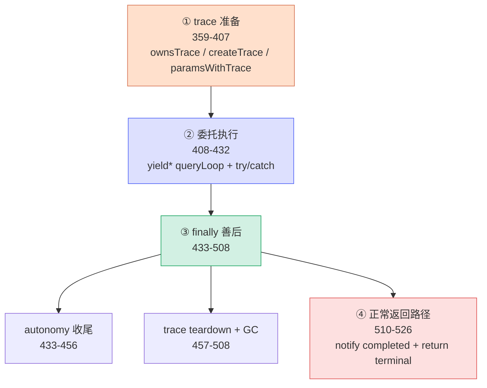
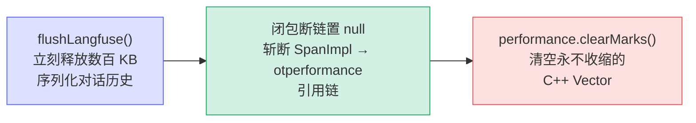

# [0] query() 方法总览

> `query()`（`src/query.ts:359-526`，约 167 行）是 Claude Code 对话回合的**公开入口**。但它**不是**真正的循环——循环本体是内部的 `queryLoop()`（`query.ts:540-2457`，已在姊妹系列 [`query-ts/queryLoop/`](../../queryLoop/[0]overview/overview.mdx) 里逐段拆解）。`query()` 的全部价值在于**包装与善后**：trace 生命周期、命令收尾、内存治理。
>
> 本系列把这 167 行按**代码自上而下的执行顺序**切成 8 个小节（`[0]`~`[7]`）。本文是**总索引 + 控制流地图**，先建立全局认知，再逐节深入。

---

## 一、它在调用链里的位置

`query()` 是上层（REPL / print.ts / runAgent）与内部循环之间的**唯一公开门面**：

```
QueryEngine / print.ts / runAgent
        │  for await (const ev of query(params)) { ... }
        ▼
query()                ← query.ts:359   ★本系列主角（包装 + 善后）
        │  yield* 委托
        ▼
queryLoop()            ← query.ts:540   真正的 while(true) 回合循环
        │  每轮调用
        ▼
deps.callModel → queryModel → Anthropic API
```

| 层 | 职责 | 位置 |
|---|---|---|
| 调用方 | `for await` 消费事件流，拿到 `Terminal` 决定下一步 | QueryEngine / print.ts |
| **`query()`** | **trace 拥有权 + 委托 queryLoop + finally 善后 + completed 信号** | `query.ts:359-526` |
| `queryLoop()` | `while(true)` 预处理→调 API→跑工具→判终止 | `query.ts:540-2457` |

> 一句话定位：**`query()` = queryLoop 的「外壳与善后人」**。把 trace、命令收尾、内存清理从循环里剥出来，`queryLoop` 才能专注于「回合逻辑」。

---

## 二、async generator 协议

`query()` 是 `async function*`，调用方用 `for await` 消费。它通过 `yield*` 把 `queryLoop` 的**全部产出透明转发**给上游，并接收 `queryLoop` 的 `return` 值作为自己的 `terminal`。

```typescript
export async function* query(
  params: QueryParams,
): AsyncGenerator<
  | StreamEvent           // 流式 SSE 事件（逐 token 渲染）
  | RequestStartEvent     // 一次 API 请求开始的标记
  | Message               // 完整消息（assistant / tool_result 等）
  | TombstoneMessage      // 墓碑（流式 fallback 时的孤儿消息占位）
  | ToolUseSummaryMessage,// 工具调用的 haiku 摘要
  Terminal                // ← 返回值：本回合为何终止
>
```

> **类比**：`query()` 像一场演出的「舞台监督」——演员（`queryLoop`）在台上演（`yield` 各类事件），监督不上台，但负责开演前挂好灯光（trace）、谢幕后关灯锁门（finally 善后）、并在演出**圆满结束时**才在登记簿写「completed」。

---

## 三、⭐ query() 控制流地图

把 167 行按执行顺序看成 **3 个阶段、5 个动作**：



| 小节文件 | 主题 | 行号 |
|---|---|---|
| `[1]module-helpers` | 模块级辅助：扣留判定 `isWithheldMaxOutputTokens` + 结局反推 `getAutonomyTurnOutcome` | 214-282 |
| `[2]params-and-state` | 输入与状态契约：`QueryParams` 16 字段 + `State` 12 字段 | 284-335 |
| `[3]trace-ownership` | trace 拥有权与注入：`ownsTrace` / `createTrace` / `paramsWithTrace` | 359-407 |
| `[4]loop-invocation` | 委托执行：`yield* queryLoop(...)` + `try/catch` 捕获结局 | 408-432 |
| `[5]autonomy-finalize` | finally①：autonomy 命令收尾 → `enqueue` 后续命令 | 433-456 |
| `[6]trace-teardown-gc` | finally②：`endTrace` + `flushLangfuse` + 闭包断链 + Performance 清理 | 457-508 |
| `[7]completion-signal` | 正常返回路径：`notifyCommandLifecycle('completed')` + `return terminal!` | 510-526 |

---

## 四、三个出口的不同语义（理解 finally 的关键）

`try { yield* queryLoop } catch { rethrow } finally { 善后 }` 之后，还有一行 `notifyCommandLifecycle('completed')` 在 `finally` **之外**。三种退出方式落点不同：

| 出口 | finally 执行？ | completed 通知？ | 场景 |
|---|---|---|---|
| **正常 return** | ✅ | ✅ | queryLoop 跑到 `completed` 等终止原因正常返回 |
| **throw** | ✅ | ❌ 跳过 | queryLoop 内部抛出未捕获错误（经 `yield*` 传播） |
| **`.return()`** | ✅ | ❌ 跳过 | 调用方提前关闭 generator（如用户 ESC 中断后丢弃） |

> **为什么这样设计**：`completed` 通知放在 `finally` 之外，使得「回合失败 / 被中断」时**故意不发** completed，形成与 `print.ts` 的 `drainCommandQueue` 一致的**非对称 started-without-completed 信号**——上层据此知道「这条命令开始了但没善终」。详见 `[7]`。

---

## 五、贯穿全文的一条暗线：内存治理

`query()` 最精华的部分（`[6]`）是对一个 **571MB 真实内存泄漏**的修复。三连清理缺一不可：



- **`flushLangfuse()`**：不主动 flush，`SpanImpl` 会把序列化对话历史保留到批次定时器（默认 10s）。
- **闭包断链**：`toolUseContext` 捕获的 `langfuseTrace → SpanImpl → otperformance`（571MB Performance 对象），`endTrace` 后置 null 才能 GC。
- **Performance 缓冲清理**：OTel 把 marks/measures 存进永不收缩的 C++ Vector，长会话即便 span 已置 null 仍累积数百 MB 死容量。

---

## 六、阅读建议

1. **先读本文**建立控制流地图（3 阶段 5 动作 + 3 出口语义）。
2. **主干路线**：`[2]→[3]→[4]→[6]→[7]`（输入契约 → trace 准备 → 委托 → 内存治理 → 完成信号），完整理解一次正常回合的「外壳生命周期」。
3. **补充路线**：`[1]`（模块级辅助，理解扣留与结局反推）、`[5]`（autonomy 自动模式收尾）。
4. 本系列**只讲 `query()` 外壳**；循环内部的压缩家族、恢复家族、工具执行等细节，见姊妹系列 [`query-ts/queryLoop/`](../../queryLoop/[0]overview/overview.mdx)。

---

## 速记口诀

- **一句话**：`query()` = queryLoop 的外壳 + 善后，循环本体在 `queryLoop`。
- **五类 yield**：StreamEvent · RequestStartEvent · Message · TombstoneMessage · ToolUseSummaryMessage；**返回** Terminal。
- **三阶段**：trace 准备 → 委托 queryLoop → finally 善后 + 正常返回信号。
- **三出口**：正常 return（发 completed）· throw（跳过）· `.return()`（跳过）。
- **一暗线**：内存治理三连 = flushLangfuse → 闭包断链 → Performance 清理（571MB 泄漏对策）。
