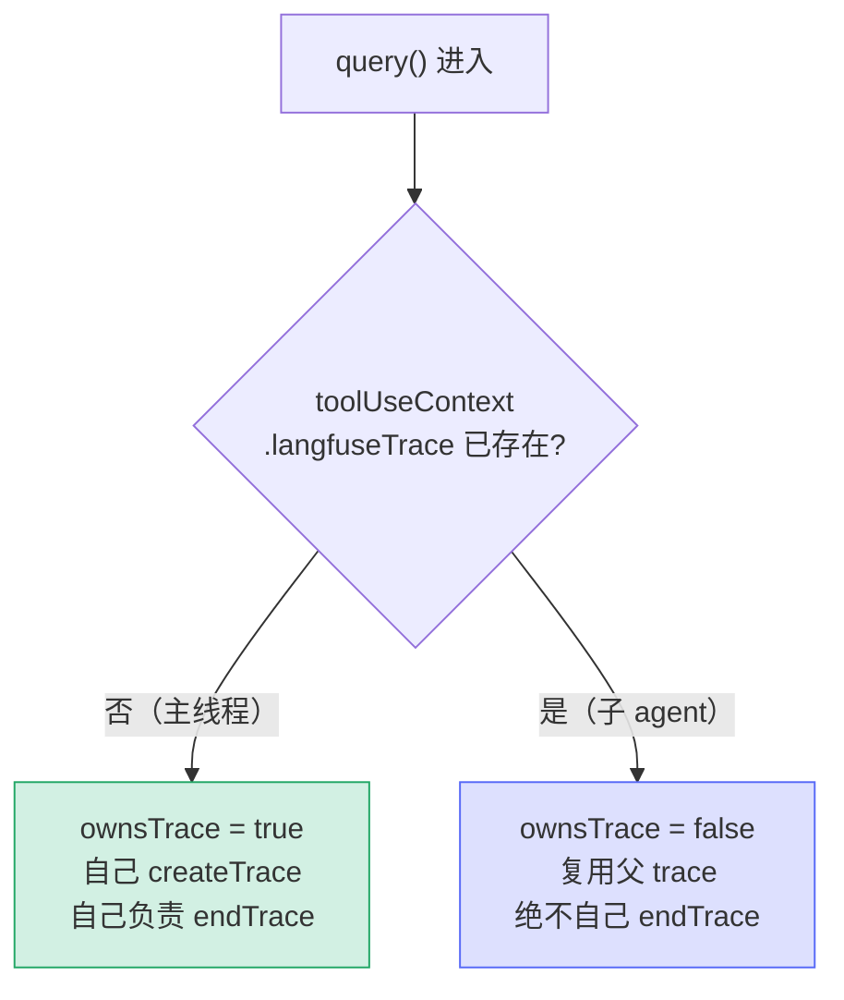

# [3] trace 拥有权与注入

> `query()` 函数体一进来，先做**开演前的准备**：登记两个「已消费命令」数组、决定 Langfuse trace 的**拥有权**、并把 trace 注入到工具上下文里。这一段（`query.ts:359-407`）决定了后面 `finally` 里 trace 怎么收尾、内存怎么断链。

---

## 一、两个「已消费命令」出参数组

```ts
const consumedCommandUuids: string[] = []          // query.ts:373
const consumedAutonomyCommands: QueuedCommand[] = []
```

这两个数组**以引用传给 `queryLoop`**（见 `[4]`），由循环在执行过程中往里 push：

| 数组 | 装什么 | 在哪用 |
|---|---|---|
| `consumedCommandUuids` | 本回合消费掉的命令 uuid | `[7]` 正常返回时逐个 `notifyCommandLifecycle('completed')` |
| `consumedAutonomyCommands` | 本回合消费的自动模式命令 | `[5]` finally 里交给 `finalizeAutonomyCommandsForTurn` 结算 |

> **为什么用「出参数组」而不是返回值**：`queryLoop` 是个 generator，它的 `return` 值已被占用给 `Terminal`。要把「消费了哪些命令」带出来，又要保证**即便循环中途 throw 也能拿到已消费部分**，最干净的办法就是传入数组让循环原地填充——`query()` 的 `finally` 总能读到当前已消费的内容。

---

## 二、`ownsTrace`：谁创建谁销毁

```ts
const ownsTrace = !params.toolUseContext.langfuseTrace   // query.ts:379
```

一行布尔，决定本次调用是否「拥有」这条 trace：



- **主线程**：进来时 `langfuseTrace` 为空 → `ownsTrace = true`，自己 `createTrace`，自己在 `[6]` 负责 `endTrace`。
- **子 agent**：`runAgent()` 已把父 trace 塞进 `toolUseContext` → `ownsTrace = false`，**复用**父 trace。

> **为什么重要**：Langfuse trace 是带层级的 observation 树。子 agent 若自己 `endTrace`，会把**父级的 span 树提前关闭**，导致父 trace 数据残缺。`ownsTrace` 落实了「谁创建谁销毁」的所有权纪律。

---

## 三、`createTrace`：仅启用时创建，否则 no-op

```ts
const langfuseTrace =
  params.toolUseContext.langfuseTrace ??         // 子 agent：复用
  (isLangfuseEnabled()
    ? createTrace({                              // 主线程 + 启用：新建
        sessionId: getSessionId(),
        model: params.toolUseContext.options.mainLoopModel,
        provider: getAPIProvider(),
        input: params.messages,
        querySource: params.querySource,
      })
    : null)                                       // 未启用：null（全程 no-op）
```

三种结果：
1. **复用**（子 agent）：直接用传入的父 trace。
2. **新建**（主线程 + Langfuse 启用）：以 sessionId / model / provider / input / querySource 建新 trace。
3. **null**（未启用）：后续所有 trace 操作变成 no-op，零开销。

---

## 四、`paramsWithTrace`：把 trace 注入工具上下文

```ts
const paramsWithTrace: QueryParams = langfuseTrace
  ? {
      ...params,
      toolUseContext: { ...params.toolUseContext, langfuseTrace },
    }
  : params                                        // 无 trace：引用复用
```

- **有 trace**：浅拷贝 `params`，再浅拷贝 `toolUseContext`，把 `langfuseTrace` 挂上去——让循环里的**工具执行能记录 observation**（每个工具调用挂在 trace 下）。
- **无 trace**：直接复用 `params`（**引用相等**）。

> ⭐ **这个「引用相等」是个伏笔**：`[6]` 的闭包断链会判断 `if (paramsWithTrace !== params)`——只有真正浅拷贝过（即有 trace）才需要把 `toolUseContext.langfuseTrace` 等置 null。无 trace 时 `paramsWithTrace === params`，跳过断链（没东西可断）。一行三元运算同时承担了「注入」与「后续是否需要断链」两个语义。

---

## 速记口诀

- **两数组**：`consumedCommandUuids`（→ `[7]` 发 completed）、`consumedAutonomyCommands`（→ `[5]` 结算）；用「出参数组」是因为 generator 的 return 已给 Terminal。
- **ownsTrace**：`!langfuseTrace`，谁创建谁销毁；子 agent 复用父 trace，绝不自己 end。
- **createTrace**：复用 / 新建 / null（未启用 no-op）三选一。
- **paramsWithTrace**：有 trace 才浅拷贝注入；无 trace 引用复用——`!== params` 成为 `[6]` 断链的判据。
