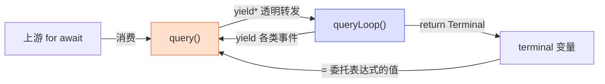

# [4] 委托执行与结局捕获

> 这是 `query()` 真正「干活」的一行——但它干的活其实是**把活交出去**。`yield* queryLoop(...)` 把整个回合循环委托给内部实现，`query()` 自己只负责在外面架一个 `try/catch`，**记录**循环是正常结束还是抛错，好让 `finally` 知道该怎么善后。（`query.ts:408-432`）

---

## 一、骨架：try / catch（只记录、不降级）

```ts
let terminal: Terminal | undefined
let didThrow = false
let thrownError: unknown
try {
  terminal = yield* queryLoop(
    paramsWithTrace,
    consumedCommandUuids,
    consumedAutonomyCommands,
  )
} catch (error) {
  didThrow = true
  thrownError = error
  throw error            // ← 原样重新抛出，不吞
} finally {
  /* 善后：见 [5] [6] */
}
```

三个局部变量是这一段的全部状态：

| 变量 | 写于 | 读于 |
|---|---|---|
| `terminal` | 正常返回时赋值 | `[5]` 反推结局 / `[6]` 判 isAborted / `[7]` 最终返回 |
| `didThrow` | catch 中置 `true` | `[5]` 决定是否带 `thrownError` |
| `thrownError` | catch 中记录 error | `[5]` 反推 `failed` 结局 |

---

## 二、`yield*` 委托语义

`yield*`（yield-delegate）是理解这一行的关键。它做两件事：



1. **透明转发产出**：`queryLoop` 内部每个 `yield`（StreamEvent / Message / Tombstone / ToolUseSummary …）都**直接穿过** `query()` 流到上游的 `for await`——`query()` 不拦截、不改写。
2. **接收返回值**：`queryLoop` 的 `return terminalObject` 成为 `yield* ...` **整个表达式的值**，赋给 `terminal`。

> **类比**：`yield*` 像把水管中间接了一截**直通管**——所有水（事件）原样流过，但管子末端有个读数表，记下最后一滴水（`Terminal`）。`query()` 不碰水流本身，只读末端那个读数。

这也解释了为什么 `query()` 能把循环逻辑完全外包：它在数据通路上是「透明」的，只在两端做生命周期管理。

---

## 三、为什么 catch 只「记录 + 重抛」，不做降级

```ts
} catch (error) {
  didThrow = true
  thrownError = error
  throw error            // 不吞，原样抛给上游
}
```

- **不做错误降级**：模型限流切换、413 压缩、媒体恢复、max-output-tokens 续写——这些**全是 `queryLoop` 内部的职责**（见 `queryLoop/[10]fallback-errors`、`[12]termination-recovery`）。到了 `query()` 这一层还没被消化的错误，说明已经无可挽回。
- **catch 的唯一作用是记录**：置 `didThrow = true`、存 `thrownError`，供 `finally` 的 `getAutonomyTurnOutcome` 把本回合判为 `failed`（见 `[5]`）。
- **`throw error` 重新抛出**：错误经 `yield*` 继续向上传播到调用方的 `for await`。注意这会触发 `finally`，但**跳过** `[7]` 的 `completed` 通知——形成失败信号的非对称性（见 `[0]` 三出口表）。

> **关键纪律**：`query()` 不是错误处理层，是**结局记录层**。它把「错误怎么救」留给循环，自己只关心「这一轮到底成没成」，并据此善后。

---

## 速记口诀

- **一行委托**：`terminal = yield* queryLoop(paramsWithTrace, 两个出参数组)`。
- **yield\* 双职责**：透明转发所有 yield 给上游 + 接 queryLoop 的 return 作为 terminal。
- **三局部**：`terminal`（结局）、`didThrow`（是否抛）、`thrownError`（抛了什么）——全为 finally 服务。
- **catch 不降级**：只记录 + 重抛；错误降级是 queryLoop 的事，query() 只记结局。
