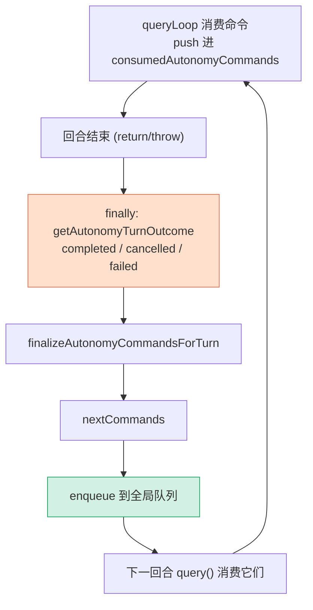

# [5] finally①：autonomy 命令收尾

> `finally` 块**无论正常返回、抛错、还是被 `.return()` 提前关闭都会执行**。它做的第一件事，是给「自动模式（autonomy）」结算本回合：用 `[1]` 的结局反推函数判断成败，决定下一步要不要、要注入哪些命令。（`query.ts:433-456`）

---

## 一、完整代码

```ts
await finalizeAutonomyCommandsForTurn({
  commands: consumedAutonomyCommands,                         // [3] 里循环填充的
  outcome: getAutonomyTurnOutcome({                           // [1] 的结局反推
    terminal,
    ...(didThrow ? { thrownError } : {}),
  }),
  priority: 'later',
})
  .then(nextCommands => {
    for (const command of nextCommands) {
      enqueue(command)                                        // 后续命令入全局队列
    }
  })
  .catch(logError)                                            // 兜底，绝不让 finally 抛
```

---

## 二、四个组成部分

### 2.1 `commands: consumedAutonomyCommands`
本回合实际消费掉的自动模式命令——由 `queryLoop` 在执行中往 `[3]` 初始化的数组里 push。`finally` 拿到的是**到当前为止**已消费的那些（即便中途抛错也有部分）。

### 2.2 `outcome: getAutonomyTurnOutcome({ terminal, ...thrownError? })`
调 `[1]` 的反推函数，把本回合翻译成三态：

```ts
getAutonomyTurnOutcome({
  terminal,                              // 正常结束：用 terminal.reason
  ...(didThrow ? { thrownError } : {}),  // 抛错：附带 thrownError → 判 failed
})
```

> 注意 `...(didThrow ? { thrownError } : {})` 这个**条件展开**：只有真抛错时才把 `thrownError` 放进参数对象。`getAutonomyTurnOutcome` 内部「`thrownError` 存在就优先判 failed」（见 `[1]` 3.1），所以正常返回时绝不能误传一个 `undefined` 的 `thrownError` 字段进去——条件展开保证了这一点。

### 2.3 `priority: 'later'`
入队优先级。`later` 表示这些收尾产生的后续命令排在常规优先级之后，不抢占用户当前的交互。

### 2.4 `.then(enqueue) / .catch(logError)`
- **`.then`**：`finalizeAutonomyCommandsForTurn` 返回 `nextCommands`（本回合结局触发的后续命令），逐个 `enqueue` 到全局命令队列——这就是自动模式「一轮完成→自动推进下一步」的**链式推进**。
- **`.catch(logError)`**：⭐ 关键的兜底。`finally` 里**绝不能抛出新异常**，否则会**掩盖**正在传播的原始错误（`[4]` 的 `throw error`）。`.catch(logError)` 把结算失败降级为日志，保证原始结局原样上抛。

---

## 三、它在自动模式闭环里的位置



> **为什么放在 `finally` 而非正常返回路径**：自动模式即使在回合**失败/取消**时也需要收尾决策（比如 failed 要不要重试、cancelled 要不要停）。放进 `finally` 才能覆盖全部三个出口；`completed` 通知则相反，只在正常返回时发（见 `[7]`）——两者刻意分置在 `finally` 内外。

---

## 速记口诀

- **finally 第一件事**：给自动模式结算本回合。
- **四要素**：`consumedAutonomyCommands`（消费了什么）+ `getAutonomyTurnOutcome`（成没成）+ `priority:'later'` + `.then(enqueue)`。
- **条件展开** `...(didThrow ? {thrownError} : {})`：正常返回不误传 thrownError。
- **`.catch(logError)`**：finally 绝不抛新异常，否则掩盖原始错误。
- **闭环**：结局 → finalize → nextCommands → enqueue → 下一回合，自动模式链式推进。
