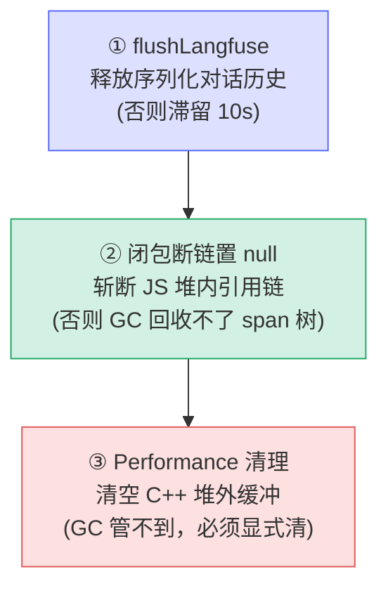

# [6] finally②：trace 收尾与内存治理 ⭐

> 这是 `query()` 全函数**最精华的一段**，对应一个 **571MB 的真实内存泄漏**修复。三连清理——`endTrace` + `flushLangfuse`、闭包断链置 null、Performance 缓冲清理——**缺一不可**，少做任何一步长会话都会持续涨内存。（`query.ts:457-508`）

---

## 一、只有 `ownsTrace` 才 endTrace + flush

```ts
if (ownsTrace) {
  const isAborted =
    terminal?.reason === 'aborted_streaming' ||
    terminal?.reason === 'aborted_tools'
  endTrace(langfuseTrace, undefined, isAborted ? 'interrupted' : undefined)
  await flushLangfuse()
}
```

- **`if (ownsTrace)`**：呼应 `[3]`——只有自己创建的 trace 才负责结束。子 agent（`ownsTrace=false`）跳过，由父级善后。
- **`isAborted`**：`terminal.reason` 是两种中断之一（`aborted_streaming` / `aborted_tools`）时，给 trace 打 `'interrupted'` 状态标记，便于在 Langfuse 面板区分「正常完成」与「用户中断」。
- **`await flushLangfuse()`** ⭐：**主动** flush processor。

> **为什么必须主动 flush**：不调它，`SpanImpl` 会把以 `langfuse.observation.input` 存储的**序列化对话历史**（数百 KB JSON）一直保留到 processor 的批次定时器触发（默认 **10s**）。长会话里每回合堆几百 KB、10s 才放，峰值内存被无谓抬高。主动 flush 让数据**立刻**落盘释放。

---

## 二、闭包断链：把 trace 引用置 null

```ts
if (paramsWithTrace !== params) {
  paramsWithTrace.toolUseContext.langfuseTrace = null
  paramsWithTrace.toolUseContext.langfuseRootTrace = null
  paramsWithTrace.toolUseContext.langfuseBatchSpan = null
}
```

### 2.1 引用相等判据
`if (paramsWithTrace !== params)` 直接复用 `[3]` 埋下的伏笔：只有当时**真浅拷贝过**（即有 trace）才需要断链。无 trace 时两者引用相等，没东西可断，跳过。

### 2.2 为什么置 null 能救 571MB


`toolUseContext` 被循环里的各种闭包长期捕获，它顺着 `langfuseTrace → SpanImpl → otperformance`（那个 571MB 的 Performance 对象）形成一条**强引用链**。即便 `endTrace` 已结束逻辑上的 trace，只要这条 JS 引用链还在，**GC 就无法回收整棵 span 树**。把三个字段置 null，链路被斩断，GC 才能回收。

> 三个字段：`langfuseTrace`（当前 trace）、`langfuseRootTrace`（根 trace）、`langfuseBatchSpan`（批次 span）——都是潜在的 span 树入口，必须一并断开。

---

## 三、清理 JSC 原生 Performance 缓冲

```ts
const gPerf = globalThis.performance
if (gPerf && typeof gPerf.clearMarks === 'function') {
  try {
    gPerf.clearMarks()
    gPerf.clearMeasures?.()
    gPerf.clearResourceTimings?.()
  } catch {
    // 非关键 —— 某些环境可能不支持所有方法
  }
}
```

- **根因**：OTel（otperformance）引用 `globalThis.performance`，后者把 `marks` / `measures` / `resource timings` 存在一个**永不收缩的 C++ Vector**（JSC 原生缓冲）里。
- **后果**：长时间运行的会话，即便 span 已 flush 且置 null，这个 C++ Vector **仍会累积数百 MB 死容量**——它在 JS 堆之外，GC 管不到。
- **对策**：显式调 `clearMarks/clearMeasures/clearResourceTimings` 把缓冲清空。`?.()` 可选链 + `try/catch` 兜底，因为某些运行环境不支持全部方法（非关键，失败仅记 warn）。

> **关键认知**：第二步（置 null）只解决了 **JS 堆内**的引用，但 Performance 缓冲在 **C++/堆外**，GC 够不着。所以第三步是独立且必需的——这也是为什么「三连」少一步都不行。

---

## 四、三连清理为何缺一不可



| 步骤 | 解决的内存 | 不做的后果 |
|---|---|---|
| ① flushLangfuse | 序列化对话历史（数百 KB/回合） | 滞留至 10s 批次定时器，峰值抬高 |
| ② 闭包断链 | JS 堆内 span 树（含 571MB Performance 对象入口） | GC 无法回收整棵树 |
| ③ Performance 清理 | C++ 堆外缓冲（marks/measures） | 永不收缩，累积数百 MB 死容量 |

---

## 速记口诀

- **ownsTrace 才 endTrace**：aborted_* → 标 `interrupted`；`await flushLangfuse` 立刻释放，不等 10s。
- **断链判据** `paramsWithTrace !== params`：复用 `[3]` 伏笔，无 trace 跳过。
- **置 null 三字段**：`langfuseTrace / langfuseRootTrace / langfuseBatchSpan`，斩断 → SpanImpl → otperformance(571MB)。
- **Performance 清理**：C++ 堆外 Vector，GC 管不到，必须显式 `clearMarks/Measures/ResourceTimings`。
- **三连缺一不可**：① 堆外滞留 ② 堆内引用 ③ 堆外缓冲，分属三处内存。
