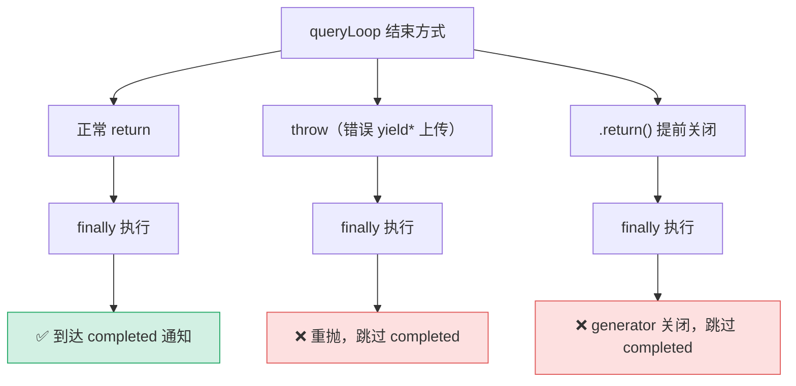

# [7] 正常返回路径：completed 信号

> `query()` 的收尾不止 `finally`。`finally` 之后、`return` 之前还有一小段——它是**只有正常返回才会执行**的代码。这处「放在 `finally` 外面」的刻意安排，造就了命令生命周期信号的**非对称性**：失败/中断时**故意不发** completed。（`query.ts:510-526`）

---

## 一、代码：通知 completed + 返回 terminal

```ts
  } /* end finally */

  // 只有 queryLoop 正常返回才会到达这里。
  for (const uuid of consumedCommandUuids) {
    notifyCommandLifecycle(uuid, 'completed')
  }
  return terminal!
}
```

两件事：
1. 遍历 `[3]` 初始化、`queryLoop` 填充的 `consumedCommandUuids`，逐个发 `'completed'` 生命周期通知。
2. `return terminal!`——把 `[4]` 拿到的 `Terminal` 交还调用方（QueryEngine 据此决定下一步）。

> `terminal!` 的非空断言：能走到这里说明 `queryLoop` 正常 `return` 了，`terminal` 必然已赋值（不会是 catch 路径的 undefined）。

---

## 二、为什么这段在 `finally` 之外（核心）

回顾 `[0]` 的三出口表——三种退出方式对这段代码的可达性不同：



| 出口 | 机制 | completed 通知 |
|---|---|---|
| **正常 return** | 顺序执行到 `finally` 后的代码 | ✅ 发 |
| **throw** | `[4]` 的 `throw error` 经 `finally` 后**继续向上抛**，永不执行 finally 之后的语句 | ❌ 跳过 |
| **`.return()`** | 调用方关闭 generator，`finally` 跑完即终止，不回到正常控制流 | ❌ 跳过 |

> **JS 语义关键**：`finally` 块**会**在所有三种情况执行；但 `finally` **之后**的普通语句，只有「正常完成」时才执行。throw 和 `.return()` 都会在 `finally` 跑完后立即沿各自路径离开函数。这正是把 `completed` 通知放在 `finally` 外的目的。

---

## 三、非对称 started-without-completed 信号

```ts
for (const uuid of consumedCommandUuids) {
  notifyCommandLifecycle(uuid, 'completed')
}
```

每条被消费的命令，在被领取时已发过 `'started'`（见 `queryLoop/[15]attachments-next-turn`）。这里在**正常完成**时补发 `'completed'`，形成成对信号。

> **刻意的非对称**：当回合失败（throw）或被中断（`.return()`）时，命令**只有 `started`、没有 `completed`**。上层（监控 / 自动模式）据此能识别「这条命令开始了但没善终」。源码注释点明：这与 `print.ts` 的 `drainCommandQueue` 行为**一致**——两处都用「started 而无 completed」作为失败/中断的统一信号。

| 回合结局 | started | completed | 上层解读 |
|---|---|---|---|
| 正常完成 | ✅ | ✅ | 命令圆满结束 |
| throw 失败 | ✅ | ❌ | 开始了但出错，未善终 |
| `.return()` 中断 | ✅ | ❌ | 开始了但被丢弃，未善终 |

---

## 四、与 `[5]` autonomy 收尾的对照

`query()` 的两处「收尾」刻意分置，覆盖面不同：

| 收尾 | 位置 | 覆盖出口 | 目的 |
|---|---|---|---|
| **autonomy 结算**（`[5]`） | `finally` **内** | 全部三个出口 | 失败/取消也要做收尾决策（重试？停？） |
| **completed 通知**（本节） | `finally` **外** | 仅正常 return | 只有真完成才标记 completed |

> 一个在 `finally` 内（无论如何都跑），一个在 `finally` 外（只有成功才跑）——这组对照精确体现了「哪些善后无条件做、哪些只在成功时做」的设计判断。

---

## 速记口诀

- **位置**：`finally` 之外、`return` 之前——只有正常返回可达。
- **两件事**：逐个 `notifyCommandLifecycle(uuid, 'completed')` + `return terminal!`。
- **三出口**：正常 return 发 completed；throw / `.return()` 跳过。
- **非对称信号**：失败/中断 = started 无 completed，与 `print.ts` drainCommandQueue 一致。
- **对照 `[5]`**：autonomy 结算在 finally 内（全覆盖），completed 在 finally 外（仅成功）。
