# query.ts 底层引擎深度学习

> 这是"核心循环"专题的第三篇深度文档，聚焦 `src/query.ts`——Claude Code 的**核心执行引擎**。它在 `claude.ts`（API 传输层）之上、`QueryEngine.ts`（会话编排层）之下，负责**单轮 API+工具执行循环**的完整生命周期。共 2370 行，本文按数据流和执行顺序逐段拆解。

---

## 一、定位与全景

### 1.1 三层架构中的位置

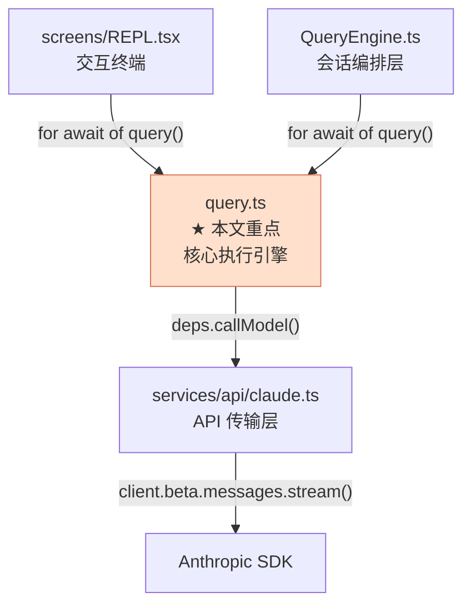

**核心定位**：`query()` 是 Claude Code 的**底层 async generator**——它接收消息列表和系统提示词，驱动 API 流式调用，处理工具执行，管理上下文压缩，并通过 yield 向上传递流式事件和消息。所有上层（REPL、SDK、ACP、fork agent）最终都汇聚于此。

### 1.2 文件规模一览

| 指标 | 数量 | 说明 |
|---|---|---|
| 总行数 | 2370 | `wc -l` 实测 |
| 导出函数 | 1 | `query()`（async generator） |
| 导出类型 | 1 | `QueryParams` |
| 内部类型 | 1 | `State`（循环可变状态体） |
| 内部函数 | 4 | `queryLoop()` + `yieldMissingToolResultBlocks()` + `isWithheldMaxOutputTokens()` + `getAutonomyTurnOutcome()` |
| Feature 门控数 | 11 | `CONTEXT_COLLAPSE`、`HISTORY_SNIP`、`TOKEN_BUDGET`、`CHICAGO_MCP` 等 |
| `import` 语句 | 52 | 含条件 `require()` 的 feature-gated 导入 |

### 1.3 文件按职责切片

| 行号范围 | 内容 |
|---|---|
| `1-147` | 模块 imports（含 6 处 `feature()` 条件 `require()`） |
| `149-198` | `yieldMissingToolResultBlocks()` — 为孤儿 tool_use 生成合成错误结果 |
| `200-234` | `isWithheldMaxOutputTokens()` — max_output_tokens 错误类型守卫 |
| `236-282` | `getAutonomyTurnOutcome()` — 映射终止原因为 AutonomyTurnOutcome |
| `284-302` | `QueryParams` 导出类型 |
| `307-320` | `State` 内部类型 |
| `322-511` | `query()` 导出函数（入口 + finally 清理链） |
| `526-2370` | `queryLoop()` 内部函数（核心循环主体） |

---

## 二、导出类型与接口

### 2.1 `QueryParams`（`query.ts:284-302`）

`query()` 的入参类型——不可变快照，入口处一次性传入，循环内绝不重新赋值。

```typescript
export type QueryParams = {
  messages: Message[]                      // 当前对话历史（不可变快照）
  systemPrompt: SystemPrompt              // 基础系统提示词（缓存分块数组）
  userContext: { [k: string]: string }     // 用户上下文（CLAUDE.md + 日期）
  systemContext: { [k: string]: string }   // 系统上下文（git status）
  canUseTool: CanUseToolFn                 // 权限决策回调
  toolUseContext: ToolUseContext            // 工具执行共享上下文
  fallbackModel?: string                   // 主模型失败时的备用模型
  querySource: QuerySource                 // 调用来源标识
  maxOutputTokensOverride?: number         // 覆盖 max_output_tokens（escalate 用）
  maxTurns?: number                        // 最大工具调用轮次
  skipCacheWrite?: boolean                 // 跳过 prompt cache 写入
  taskBudget?: { total: number }           // API 级 task_budget
  deps?: QueryDeps                         // 可注入依赖（测试用）
}
```

**字段语义详解**：

| 字段 | 谁传入 | 说明 |
|---|---|---|
| `messages` | 所有调用方 | `QueryEngine` 传 `[...this.mutableMessages]` 快照；`runForkedAgent` 传 `initialMessages` |
| `systemPrompt` | `QueryEngine` / `REPL` | 由 `fetchSystemPromptParts()` 或 `buildEffectiveSystemPrompt()` 构建 |
| `userContext` | `QueryEngine` / `REPL` | `{ claudeMd: string, currentDate: string }`，通过 `prependUserContext()` 注入 |
| `systemContext` | `QueryEngine` / `REPL` | `{ gitStatus: string }`，通过 `appendSystemContext()` 追加到系统提示词 |
| `canUseTool` | 所有调用方 | 权限检查函数——工具调用前被调用，决定是否允许执行 |
| `toolUseContext` | 所有调用方 | 包含 `tools`、`abortController`、`agentId`、`getAppState()`、`readFileState` 等 |
| `querySource` | 所有调用方 | 标识调用来源，影响 stop hook 行为、命令路由、blocking limit 跳过等 |
| `taskBudget` | `QueryEngine` | API 端 `output_config.task_budget`（beta `task-budgets-2026-03-13`），与客户端 `TOKEN_BUDGET` 无关 |
| `deps` | 测试 | 注入 mock 的 `callModel`/`microcompact`/`autocompact`/`uuid` |

### 2.2 `query()` 函数签名（`query.ts:344-352`）

```typescript
export async function* query(
  params: QueryParams,
): AsyncGenerator<
  | StreamEvent            // Anthropic SSE 原始事件
  | RequestStartEvent      // HTTP 请求启动信号
  | Message                // 完整消息（assistant/user/system/attachment）
  | TombstoneMessage       // 要求删除已 yield 的消息
  | ToolUseSummaryMessage, // 子 agent 工具使用摘要
  Terminal                 // 返回值：终止原因
>
```

**AsyncGenerator 的 yield/return 语义**：
- **yield** 类型：每次循环迭代产生的事件流——流式 token、完整消息、tombstone 等，调用方通过 `for await` 消费
- **return** 类型（`Terminal`）：循环终止的原因，调用方通过 `yield*` 或 `for await` 结束后获取

### 2.3 `State` 内部可变状态体（`query.ts:307-320`）

```typescript
type State = {
  messages: Message[]                                    // 当前迭代的消息列表
  toolUseContext: ToolUseContext                          // 工具上下文（含 abortController）
  autoCompactTracking: AutoCompactTrackingState | undefined  // compact 追踪
  maxOutputTokensRecoveryCount: number                   // max_output_tokens 恢复次数
  hasAttemptedReactiveCompact: boolean                   // 是否已尝试 reactive compact
  maxOutputTokensOverride: number | undefined            // 动态 token 上限覆盖
  pendingToolUseSummary: Promise<ToolUseSummaryMessage | null> | undefined  // 异步摘要
  stopHookActive: boolean | undefined                    // stop hook 是否活跃
  turnCount: number                                      // 已执行轮次数
  transition: Continue | undefined                       // 上一次继续的原因
}
```

**设计要点**：`State` 是循环内部的可变对象，`params`（QueryParams）是入口处一次性传入的不可变快照。每次迭代开头解构 `state`，继续点统一用 `state = { ... }` 整体替换，避免 9 个独立赋值导致的竞态。

---

## 三、对外调用方全景

### 3.1 调用链总图

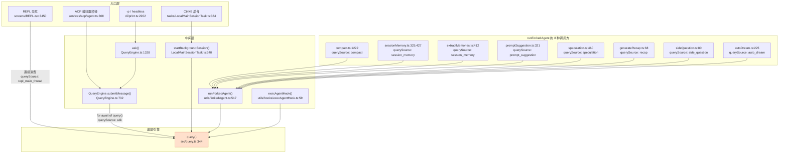

### 3.2 四大直接调用方详解

#### 调用方 A：`QueryEngine.submitMessage()` — SDK/headless/ACP 路径

**文件**：`src/QueryEngine.ts:732-758`

```typescript
for await (const message of query({
  messages,                    // 本轮快照（含新用户消息）
  systemPrompt,                // asSystemPrompt 数组
  userContext,                 // { claudeMd, currentDate }
  systemContext,               // { gitStatus }
  canUseTool: wrappedCanUseTool,
  toolUseContext: processUserInputContext,
  fallbackModel,
  querySource: 'sdk',
  maxTurns,
  taskBudget,
})) { /* 9 种事件分发 */ }
```

**三大上游**：

| 上游 | 文件 | 场景 |
|---|---|---|
| `ask()` | `QueryEngine.ts:1328` | `-p` / headless 模式，一次性 per prompt |
| ACP agent | `services/acp/agent.ts:585` | Zed 编辑器桥接，长驻 per session |
| `print.ts` | `cli/print.ts:2202` | 通过 `ask()` 间接调用 |

**特点**：`querySource = 'sdk'`，所有 stop hook 行为完整启用，排队命令路由到主线程。

#### 调用方 B：`startBackgroundSession()` — Ctrl+B 后台任务

**文件**：`src/tasks/LocalMainSessionTask.ts:340-387`

```typescript
export function startBackgroundSession({
  messages,
  queryParams,
  description,
  setAppState,
  agentDefinition,
}: {
  messages: Message[]
  queryParams: Omit<QueryParams, 'messages'>
  // ...
}): string {
  // ...
  for await (const event of query({
    messages: bgMessages,
    ...queryParams,
  })) { /* 事件处理 */ }
}
```

**触发时机**：用户在 REPL 中按 Ctrl+B，当前查询被转移到后台继续执行。

**特点**：透传前台的 `queryParams`（包括 `querySource`），在 `runWithAgentContext()` 中运行以获得 ALS 隔离。

#### 调用方 C：`runForkedAgent()` — 11 种 fork agent 场景

**文件**：`src/utils/forkedAgent.ts:517-584`

```typescript
export async function runForkedAgent({
  promptMessages,
  cacheSafeParams,
  canUseTool,
  querySource,
  forkLabel,
  overrides,
  maxOutputTokens,
  maxTurns,
  // ...
}: ForkedAgentParams): Promise<ForkedAgentResult> {
  // ...
  for await (const message of query({
    messages: initialMessages,
    systemPrompt,
    userContext,
    systemContext,
    canUseTool,
    toolUseContext: isolatedToolUseContext,
    querySource,
    maxOutputTokensOverride: maxOutputTokens,
    maxTurns,
    skipCacheWrite,
  })) { /* 事件收集 */ }
}
```

**8 种调用方及 querySource 值**：

| 调用方 | 文件:行号 | `querySource` | 场景 |
|---|---|---|---|
| `compact.ts` | `:1222` | `'compact'` | 上下文压缩（fork 一个 agent 做摘要） |
| `sessionMemory.ts` | `:325, :427` | `'session_memory'` | 自动提取会话记忆 |
| `extractMemories.ts` | `:412` | `'session_memory'` | 显式记忆提取 |
| `promptSuggestion.ts` | `:321` | `'prompt_suggestion'` | 建议下一个 prompt |
| `speculation.ts` | `:460` | `'speculation'` | 推测性 prompt 生成 |
| `generateRecap.ts` | `:68` | `'recap'` | `/recap` 命令 |
| `sideQuestion.ts` | `:80` | `'side_question'` | 侧问（auto mode 等） |
| `autoDream.ts` | `:225` | `'auto_dream'` | 空闲时的自动处理 |

**特点**：每次调用通过 `createSubagentContext()` 创建隔离的 `ToolUseContext`，防止 fork agent 修改主会话的可变状态。

#### 调用方 D：`execAgentHook()` — stop hook 多轮验证

**文件**：`src/utils/hooks/execAgentHook.ts:59-198`

```typescript
export async function execAgentHook(
  hook: AgentHook,
  hookName: string,
  hookEvent: HookEvent,
  jsonInput: string,
  signal: AbortSignal,
  toolUseContext: ToolUseContext,
  // ...
): Promise<HookResult> {
  // ...
  for await (const message of query({
    messages: agentMessages,
    systemPrompt,
    userContext: {},
    systemContext: {},
    canUseTool: hasPermissionsToUseTool,
    toolUseContext: agentToolUseContext,
    querySource: 'hook_agent',
  })) { /* 事件收集 */ }
}
```

**特点**：
- `querySource = 'hook_agent'`
- 使用 `mode: 'dontAsk'`（不弹权限确认）
- 禁用 thinking，最多 50 轮
- 使用结构化输出判断 pass/fail

**调用链**：`query()` 完成一轮 → stop hooks 触发 → `execAgentHook()` → 再次调用 `query()` 做多轮验证。

### 3.3 `querySource` 语义总表

| `querySource` 值 | 路径 | 特殊行为 |
|---|---|---|
| `'repl_main_thread'` | REPL 直接消费 | stop hook 保存 cacheSafeParams；blocking limit 正常检查 |
| `'repl_main_thread_auto_compact'` | REPL 自动 compact | 同 repl_main_thread |
| `'sdk'` | QueryEngine / ask() | stop hook 保存 cacheSafeParams；blocking limit 正常检查 |
| `'compact'` | runForkedAgent → compact | 跳过 blocking limit（防死锁）；跳过 snip |
| `'session_memory'` | runForkedAgent → memory | 跳过 blocking limit（防死锁） |
| `'hook_agent'` | execAgentHook | stop hook 行为受限 |
| `'agent:<agentId>'` | AgentTool 子 agent | 排队命令路由到子 agent |
| `'prompt_suggestion'` | runForkedAgent | 临时调用 |
| `'speculation'` | runForkedAgent | 临时调用 |
| `'recap'` | runForkedAgent → recap | 临时调用 |
| `'side_question'` | sideQuestion | 临时调用 |
| `'agent_summary'` | runForkedAgent | 临时调用 |
| `'auto_dream'` | runForkedAgent | 临时调用 |

---

## 四、`query()` 入口函数（`query.ts:344-511`）

### 4.1 入口职责

`query()` 是对外暴露的 async generator，核心逻辑委托给内部的 `queryLoop()`。它自身负责**生命周期管理**：

| 步骤 | 行号 | 作用 |
|---|---|---|
| 1 | `:358` | 初始化 `consumedCommandUuids` 和 `consumedAutonomyCommands` |
| 2 | `:364` | 判断是否拥有 Langfuse trace（子 agent 复用父 trace） |
| 3 | `:369-379` | 创建或复用 Langfuse trace |
| 4 | `:386-391` | 将 trace 挂到 `toolUseContext` |
| 5 | `:401` | `terminal = yield* queryLoop(...)` — 委托给内部循环 |
| 6 | `:418-492` | `finally` 块：三重清理链 |
| 7 | `:503-505` | 通知已消费命令生命周期 `completed` |

### 4.2 finally 三重清理链

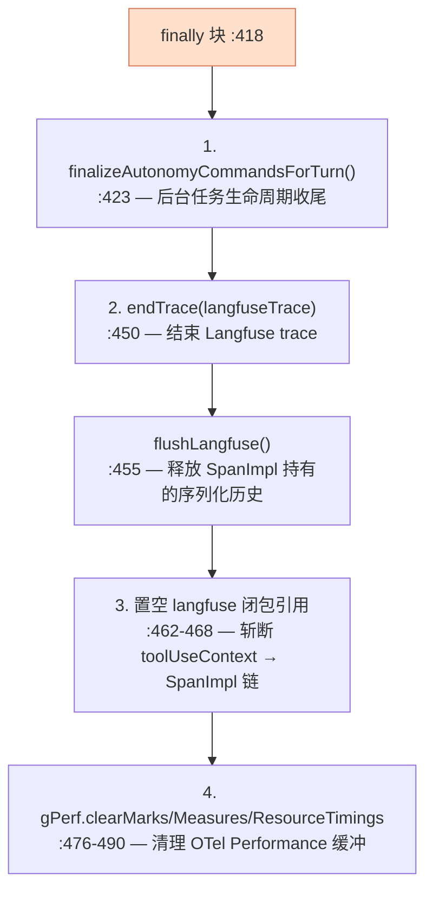

**为什么需要清理**：
- `flushLangfuse()`：SpanImpl 对象保留序列化对话历史（数百 KB JSON），不 flush 要等批次定时器（默认 10s）
- 闭包置 null：`toolUseContext.langfuseTrace` 捕获了 SpanImpl → `otperformance`（571MB Performance 对象），不斩断 GC 无法回收
- `gPerf.clearMarks()`：OTel 引用的 `globalThis.performance` 把 marks/measures 存在永不收缩的 C++ Vector 中

---

## 五、`queryLoop()` 核心循环详解

### 5.1 总体结构

```typescript
async function* queryLoop(
  params: QueryParams,
  consumedCommandUuids: string[],
  consumedAutonomyCommands: QueuedCommand[],
): AsyncGenerator<StreamEvent | RequestStartEvent | Message | TombstoneMessage | ToolUseSummaryMessage, Terminal> {
  // 解构不可变 params :543-552
  // 初始化可变 State :562-573
  // 创建 BudgetTracker :574
  // 快照 QueryConfig :587
  // 启动 Memory 预取 :597

  while (true) {
    // 14 步流水线...
    // 继续或返回
  }
}
```

### 5.2 初始化阶段（`:542-599`）

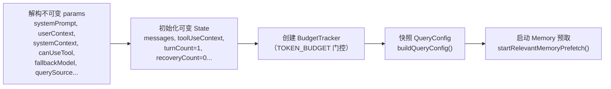

**关键设计**：
- `deps = params.deps ?? productionDeps()` — DI 注入点，测试传 mock，生产用默认
- `config = buildQueryConfig()` — 一次性快照 env/Statsig 状态，防止 5-30s 流期间翻转
- `using pendingMemoryPrefetch` — `using` 语义确保所有 generator 退出路径都 dispose

### 5.3 14 步流水线总览

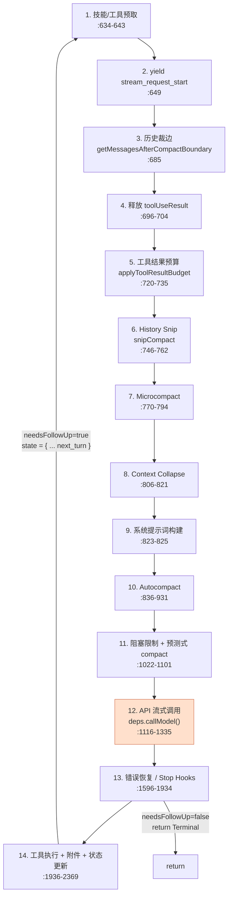

### 5.4 各步骤详解

#### 步骤 1：技能/工具预取（`:634-643`）

```typescript
const pendingSkillPrefetch = skillPrefetch?.startSkillDiscoveryPrefetch(
  null, messages, toolUseContext,
)
const pendingToolPrefetch = searchExtraToolsPrefetch?.startSearchExtraToolsPrefetch(
  toolUseContext.options.tools ?? [], messages,
)
```

- **技能预取**：`EXPERIMENTAL_SKILL_SEARCH` 门控，TF-IDF 搜索匹配的技能
- **工具预取**：`EXPERIMENTAL_SEARCH_EXTRA_TOOLS` 门控，搜索延迟加载的工具
- 两者在模型流式输出和工具执行期间**并行跑**，结果在步骤 14 消费

#### 步骤 2：yield `stream_request_start`（`:649`）

通知调用方 HTTP 请求即将开始。`QueryEngine` 收到后调用 `setSDKStatus('requesting')`。

#### 步骤 3：历史裁边（`:685`）

```typescript
let messagesForQuery = getMessagesAfterCompactBoundary(messages)
```

只保留最近一次 compact 之后的消息。防止把已摘要的历史重复发给 API。

#### 步骤 4：释放 toolUseResult（`:696-704`）

```typescript
for (const msg of messagesForQuery) {
  if (msg.type === 'user' && 'toolUseResult' in msg && msg.toolUseResult !== undefined) {
    delete (msg as Message & { toolUseResult?: unknown }).toolUseResult
  }
}
```

UI 已渲染完工具结果，API 只需要 `message.content`（tool_result 块）。删除原始输出对象防止 400KB FileRead 永久驻留内存。

#### 步骤 5：工具结果预算（`:720-735`）

```typescript
messagesForQuery = await applyToolResultBudget(
  messagesForQuery,
  toolUseContext.contentReplacementState,
  persistReplacements ? records => void recordContentReplacement(records, ...) : undefined,
  new Set(toolUseContext.options.tools.filter(t => !Number.isFinite(t.maxResultSizeChars)).map(t => t.name)),
)
```

对聚合工具结果大小按消息执行预算限制。在 microcompact 之前执行——缓存 MC 完全靠 `tool_use_id` 操作，内容替换对它不可见，两者可以干净地组合。

#### 步骤 6：History Snip（`:746-762`）

```typescript
if (feature('HISTORY_SNIP')) {
  const snipResult = snipModule!.snipCompactIfNeeded(messagesForQuery)
  messagesForQuery = snipResult.messages
  snipTokensFreed = snipResult.tokensFreed
  if (snipResult.boundaryMessage) yield snipResult.boundaryMessage
}
```

`HISTORY_SNIP` 门控。移除旧历史，释放 token。`snipTokensFreed` 传递给 autocompact 以修正阈值检查。

#### 步骤 7：Microcompact（`:770-794`）

```typescript
const microcompactResult = await deps.microcompact(
  messagesForQuery, toolUseContext, querySource,
)
messagesForQuery = microcompactResult.messages
```

替换旧工具结果为清理摘要。缓存 microcompact（缓存编辑模式）的边界消息延迟到 API 响应后才 yield，使用真实的 `cache_deleted_input_tokens`。

#### 步骤 8：Context Collapse（`:806-821`）

```typescript
if (feature('CONTEXT_COLLAPSE') && contextCollapse) {
  const collapseResult = await contextCollapse.applyCollapsesIfNeeded(
    messagesForQuery, toolUseContext, querySource,
  )
  messagesForQuery = collapseResult.messages
}
```

`CONTEXT_COLLAPSE` 门控。在 autocompact 之前执行——如果折叠已让我们低于阈值，autocompact 就是 no-op，保留细粒度上下文。

#### 步骤 9：系统提示词构建（`:823-825`）

```typescript
const fullSystemPrompt = asSystemPrompt(
  appendSystemContext(systemPrompt, systemContext),
)
```

将 `systemContext`（git status 等）追加到 `systemPrompt`，然后转换为最终的 `SystemPrompt` 类型。

#### 步骤 10：Autocompact（`:836-931`）

```typescript
const { compactionResult, consecutiveFailures } = await deps.autocompact(
  messagesForQuery, toolUseContext,
  { systemPrompt, userContext, systemContext, toolUseContext, forkContextMessages: messagesForQuery },
  querySource, tracking, snipTokensFreed,
)
```

- 若压缩成功：yield `postCompactMessages`，重置 `tracking`，更新 `taskBudgetRemaining`
- 若压缩失败：传播 `consecutiveFailures` 给熔断器

#### 步骤 11：阻塞限制 + 预测式 compact（`:1022-1101`）

**阻塞限制**（`:1022-1052`）：当 auto-compact 关闭且 token 达到硬阻塞上限时，yield 错误并返回 `blocking_limit`。`compact`/`session_memory` 查询跳过此检查（防止死锁）。

**预测式 autocompact**（`:1057-1101`）：估算本轮增长是否会超过上下文窗口。如果当前 token 超过 `predictiveThreshold = effectiveContextWindow - estimatedGrowth`，提前触发 compact。

#### 步骤 12：API 流式调用（`:1110-1335`）

这是核心步骤——实际的模型调用：

```mermaid
flowchart TD
    A["while (attemptWithFallback)<br/>:1111"] --> B["deps.callModel()<br/>queryModelWithStreaming<br/>:1116"]
    B --> C{"流式事件处理<br/>:1166-1335"}
    C --> D["yield yieldMessage<br/>（或扣留可恢复错误）<br/>:1266-1292"]
    C --> E["收集 tool_use 块<br/>:1293-1316"]
    C --> F["StreamingToolExecutor<br/>实时工具执行<br/>:1319-1334"]
    C --> G{"FallbackTriggeredError?<br/>:1369"}
    G -->|"是"| H["切换模型 + 重试<br/>:1375-1432"]
    G -->|"否"| I["throw innerError"]
    H --> A
```

**关键子步骤**：

1. **Fallback 处理**（`:1170-1199`）：如果 `streamingFallbackOccured`，tombstone 孤儿消息，清空状态，创建新的 `StreamingToolExecutor`

2. **Backfill observable input**（`:1200-1256`）：对克隆消息回填 `tool_use` 输入的派生字段（如展开文件路径），让 SDK 消费者看到友好字段。原始消息保持不变（修改会破坏 prompt 缓存）。

3. **Withholding 机制**（`:1257-1292`）：扣留可恢复的错误（PTL、媒体尺寸、max_output_tokens），不 yield 给调用方，等恢复逻辑决定是否重试。

4. **StreamingToolExecutor**（`:1309-1334`）：在流式响应期间就开始调度工具，完成的结果实时 yield。

5. **FallbackTriggeredError**（`:1369-1432`）：主模型高负载时触发，切换到 `fallbackModel`，剥离 thinking 签名块，重试。

#### 步骤 13：错误恢复 / Stop Hooks（`:1596-1934`）

当 `needsFollowUp === false`（无工具调用）时进入此分支。详见第九章"错误恢复矩阵"。

#### 步骤 14：工具执行 + 附件 + 状态更新（`:1936-2369`）

详见第八章"流式处理与工具执行"和第十章"上下文管理管线"。

### 5.5 状态机转移图

```mermaid
stateDiagram-v2
    [*] --> 初始迭代

    初始迭代 --> API调用 : step 12

    API调用 --> next_turn : 有 tool_use 块<br/>工具执行成功
    API调用 --> completed : 无 tool_use 块<br/>stop hooks 通过
    API调用 --> prompt_too_long : PTL 恢复失败
    API调用 --> image_error : 媒体错误恢复失败
    API调用 --> model_error : API 错误（不可恢复）
    API调用 --> aborted_streaming : 用户中断（流式中）
    API调用 --> aborted_tools : 用户中断（工具中）
    API调用 --> blocking_limit : 上下文硬阻塞
    API调用 --> max_turns : 达到最大轮次

    API调用 --> collapse_drain_retry : PTL → context collapse 排空
    collapse_drain_retry --> API调用

    API调用 --> reactive_compact_retry : PTL/媒体 → reactive compact
    reactive_compact_retry --> API调用

    API调用 --> max_output_tokens_escalate : 8k → 64k 升级
    max_output_tokens_escalate --> API调用

    API调用 --> max_output_tokens_recovery : 注入续写 prompt (×3)
    max_output_tokens_recovery --> API调用

    API调用 --> stop_hook_blocking : stop hook 返回 blocking errors
    stop_hook_blocking --> API调用

    API调用 --> stop_hook_prevented : stop hook 阻止继续
    API调用 --> token_budget_continuation : token budget 续写
    token_budget_continuation --> API调用

    API调用 --> hook_stopped : hook 阻止继续
    API调用 --> model_error : FallbackTriggeredError 后仍失败
```

---

## 六、系统提示词构建

### 6.1 数据流全景

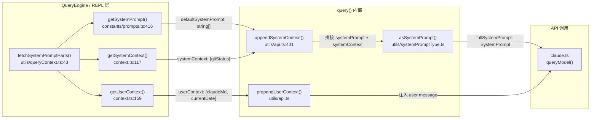

### 6.2 `appendSystemContext()` — 系统上下文追加

**文件**：`src/utils/api.ts:431`

```typescript
function appendSystemContext(
  systemPrompt: SystemPrompt,
  systemContext: { [k: string]: string },
): SystemPrompt
```

将 `systemContext` 中的 key-value 对（主要是 `gitStatus`）格式化为文本块，追加到 `systemPrompt` 数组末尾。

**内容**：
- `gitStatus`：`git status --short` 输出 + 最近 5 条 commit log + 当前分支 + 用户名
- `cacheBreaker`：可选的缓存破坏器（用于强制刷新）

### 6.3 `prependUserContext()` — CLAUDE.md 注入

**文件**：`src/utils/api.ts`

```typescript
function prependUserContext(
  messages: Message[],
  userContext: { [k: string]: string },
): Message[]
```

将 `userContext`（主要是 `claudeMd`）包装为 `<project-instructions>` 标签的 user message，注入到消息数组**开头**。

**为什么是 user message 而非 system prompt**：CLAUDE.md 的内容在 API 调用之间可能变化（文件被编辑），放在 user message 中可以利用 prompt caching 的 `cache_control` 标记。

### 6.4 `buildSystemPromptBlocks()` — 缓存标记策略

在 `claude.ts` 的 `queryModel()` 中，`fullSystemPrompt` 被转换为 `TextBlockParam[]`，每块带有 `cache_control: { type: 'ephemeral' }` 标记。策略：
- 系统提示词的第一块标记为 `ephemeral`（最长的不变部分）
- 消息列表中最后一条带 `cache_control` 的消息被标记
- 确保跨迭代的缓存命中率最大化

---

## 七、Skills 集成

### 7.1 Prefetch-Then-Consume 模式

```mermaid
sequenceDiagram
    participant loop as queryLoop
    participant prefetch as skillPrefetch 模块
    participant index as skillSearch 索引
    participant api as API 调用
    participant attach as 附件注入

    loop ->> prefetch: startSkillDiscoveryPrefetch()<br/>:634（步骤 1）
    Note right of prefetch: TF-IDF 搜索<br/>并行于 API 调用
    loop ->> api: deps.callModel()<br/>:1116（步骤 12）
    api -->> loop: 流式响应 + tool_use
    loop ->> loop: 工具执行（步骤 14）
    loop ->> prefetch: collectSkillDiscoveryPrefetch()<br/>:2235-2243
    prefetch -->> attach: skill attachments
    attach ->> loop: yield createAttachmentMessage(att)
```

### 7.2 预取启动（`:634-638`）

```typescript
const pendingSkillPrefetch = skillPrefetch?.startSkillDiscoveryPrefetch(
  null, messages, toolUseContext,
)
```

- **门控**：`EXPERIMENTAL_SKILL_SEARCH` feature flag
- **输入**：当前消息列表 + 工具上下文
- **时机**：每次迭代开头，与 API 调用并行执行

### 7.3 结果消费（`:2235-2243`）

```typescript
if (skillPrefetch && pendingSkillPrefetch) {
  const skillAttachments =
    await skillPrefetch.collectSkillDiscoveryPrefetch(pendingSkillPrefetch)
  for (const att of skillAttachments) {
    const msg = createAttachmentMessage(att)
    yield msg
    toolResults.push(msg)
  }
}
```

- 技能发现结果作为 `attachment` 消息注入
- 注入时机：工具执行完成后、下一轮 API 调用之前
- 结果被追加到 `toolResults`，随下一轮消息发给 API

### 7.4 去重机制

**`QueryEngine.discoveredSkillNames`**（`QueryEngine.ts:227`）：
- 类型：`Set<string>`
- 生命周期：**每 turn 清空**（`QueryEngine.ts:294`）
- 作用：防止同一 turn 内重复加载相同技能

**skillSearch 内部**（`prefetch.ts`）：
- 使用 bounded Set（FIFO 驱逐，1000 条上限）跨迭代追踪已发现的技能
- 评分阈值：≥ 0.30 的技能才被加载
- 每次最多加载 2 个技能，每个最多 12k 字符

---

## 八、MCP 工具集成

### 8.1 MCP 工具传入 API

**传入位置**（`:1146-1149`）：

```typescript
mcpTools: appState.mcp.tools,
hasPendingMcpServers: appState.mcp.clients.some(
  c => c.type === 'pending',
),
```

- `mcpTools`：已连接的 MCP 服务器提供的工具列表，与内置工具合并后传给 API
- `hasPendingMcpServers`：信号——还有 MCP 服务器在连接中，API 端据此决定是否等待

### 8.2 工具刷新（`:2290-2302`）

```typescript
if (updatedToolUseContext.options.refreshTools) {
  const refreshedTools = updatedToolUseContext.options.refreshTools()
  if (refreshedTools !== updatedToolUseContext.options.tools) {
    updatedToolUseContext = {
      ...updatedToolUseContext,
      options: { ...updatedToolUseContext.options, tools: refreshedTools },
    }
  }
}
```

**时机**：每次工具执行完成后、下一轮迭代之前。

**目的**：新连接的 MCP server 提供的工具在下一轮可用。`refreshTools()` 比较引用，只在工具列表真正变化时创建新 context。

### 8.3 Chicago MCP Cleanup

**两个清理点**：

1. **流式中断**（`:1563-1572`）：
```typescript
if (feature('CHICAGO_MCP') && !toolUseContext.agentId) {
  const { cleanupComputerUseAfterTurn } = await import('./utils/computerUse/cleanup.js')
  await cleanupComputerUseAfterTurn(toolUseContext)
}
```

2. **工具执行中断**（`:2081-2090`）：相同的清理逻辑

**作用**：自动取消隐藏状态 + 释放锁。仅主线程执行（子 agent 释放主线程锁的原因见 stopHooks.ts）。

### 8.4 延迟工具路由

当 MCP 工具尚未连接时，它们被标记为 "deferred"。这些工具不会出现在 API 的工具列表中，而是通过 `SearchExtraToolsTool` + `ExecuteExtraTool` 路由：

- `SearchExtraToolsTool`：TF-IDF 搜索延迟工具
- `ExecuteExtraTool`：按需执行延迟工具

`searchExtraToolsPrefetch`（`:639-643`）在每次迭代开头预取，结果作为附件注入（`:2246-2256`）。

---

## 九、错误恢复矩阵

### 9.1 完整恢复流程图

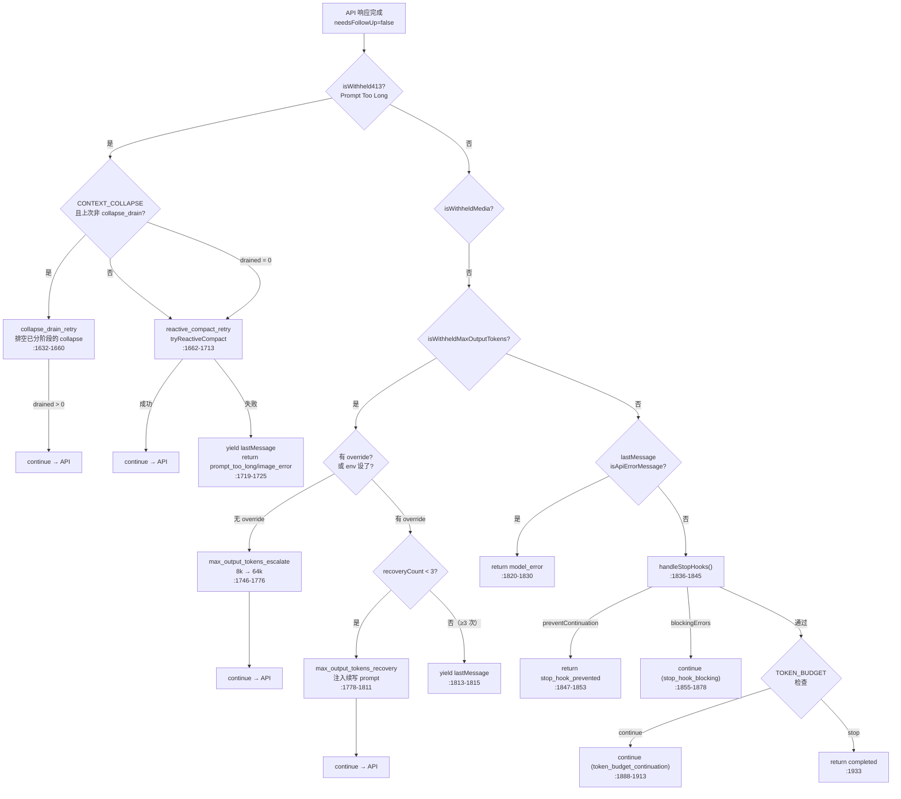

### 9.2 各恢复路径详解

#### PTL（Prompt Too Long）两阶段恢复

| 阶段 | 行号 | 转移原因 | 动作 |
|---|---|---|---|
| 1 | `:1632-1660` | `collapse_drain_retry` | `contextCollapse.recoverFromOverflow()` — 排空已分阶段的 collapse，保留细粒度上下文 |
| 2 | `:1662-1713` | `reactive_compact_retry` | `reactiveCompact.tryReactiveCompact()` — 完整摘要压缩 |

**单次尝试保证**：每个阶段只尝试一次。`state.transition?.reason !== 'collapse_drain_retry'` 防止第一阶段重复；`hasAttemptedReactiveCompact` 防止第二阶段重复。

#### max_output_tokens 三档恢复

| 档位 | 行号 | 转移原因 | 动作 |
|---|---|---|---|
| 1 | `:1746-1776` | `max_output_tokens_escalate` | 8k → 64k 上限升级（一次性），Statsig gate `tengu_otk_slot_v1` |
| 2 | `:1778-1811` | `max_output_tokens_recovery` | 注入 "Resume directly — no apology, no recap" 用户消息 |
| 3 | `:1813-1815` | — | 恢复耗尽（≥ `MAX_OUTPUT_TOKENS_RECOVERY_LIMIT=3` 次），暴露扣留的错误 |

**续写 prompt 内容**（`:1784-1787`）：
```
Output token limit hit. Resume directly — no apology, no recap of what you were doing.
Pick up mid-thought if that is where the cut happened. Break remaining work into smaller pieces.
```

#### FallbackTriggeredError 模型切换

| 步骤 | 行号 | 动作 |
|---|---|---|
| 1 | `:1375` | `currentModel = fallbackModel` |
| 2 | `:1376` | `attemptWithFallback = true` |
| 3 | `:1379-1382` | `yieldMissingToolResultBlocks()` — 为孤儿 tool_use 生成合成错误结果 |
| 4 | `:1383-1386` | 清空 assistantMessages/toolResults/toolUseBlocks |
| 5 | `:1390-1397` | 丢弃 StreamingToolExecutor 的待处理结果，创建新实例 |
| 6 | `:1400` | `toolUseContext.options.mainLoopModel = fallbackModel` |
| 7 | `:1405-1406` | `stripSignatureBlocks(messagesForQuery)` — 剥离 thinking 签名（ant 模式） |
| 8 | `:1427-1430` | yield 系统消息通知用户模型切换 |

---

## 十、上下文管理管线

### 10.1 六级管线总览

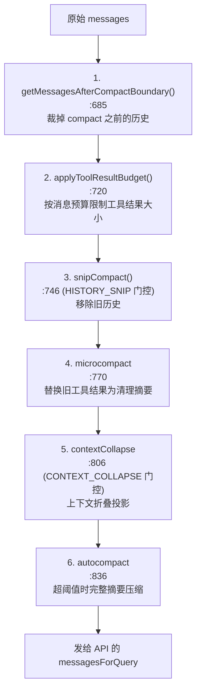

### 10.2 各级设计意图

| 级别 | 模块 | 粒度 | 不可逆？ | 成本 |
|---|---|---|---|---|
| 1. Compact boundary | `getMessagesAfterCompactBoundary()` | 按压缩边界裁剪 | 是（摘要替代） | 零（纯裁剪） |
| 2. Tool result budget | `applyToolResultBudget()` | 按消息预算截断 | 是（替换为占位符） | 低 |
| 3. History snip | `snipCompact()` | 移除旧历史段 | 是（摘要替代） | 一次 fork agent 调用 |
| 4. Microcompact | `microcompactMessages()` | 按 tool_use_id 替换 | 是（替换为摘要） | 零（纯文本替换） |
| 5. Context collapse | `contextCollapse.applyCollapsesIfNeeded()` | 按轮次折叠 | 可恢复（排空恢复） | 低（读时投影） |
| 6. Autocompact | `autoCompactIfNeeded()` | 全量摘要 | 是（单一摘要） | 一次 fork agent 调用 |

### 10.3 预测式 Autocompact（`:1057-1101`）

```typescript
const currentTokens = tokenCountWithEstimation(messagesForQuery) - snipTokensFreed
const estimatedGrowth = estimateMaxTurnGrowth(model)
const predictiveThreshold = getEffectiveContextWindowSize(model) - estimatedGrowth

if (currentTokens > predictiveThreshold) {
  // 提前触发 compact，避免在 API 调用时撞墙
}
```

**设计意图**：估算本轮的增长是否会超过上下文窗口。如果当前 token 已经超过 `predictiveThreshold`，提前 compact 而不是等到 API 返回 413 再恢复。

---

## 十一、流式处理与工具执行

### 11.1 流式事件处理（`:1166-1335`）

API 调用返回的流式事件逐 chunk 处理：

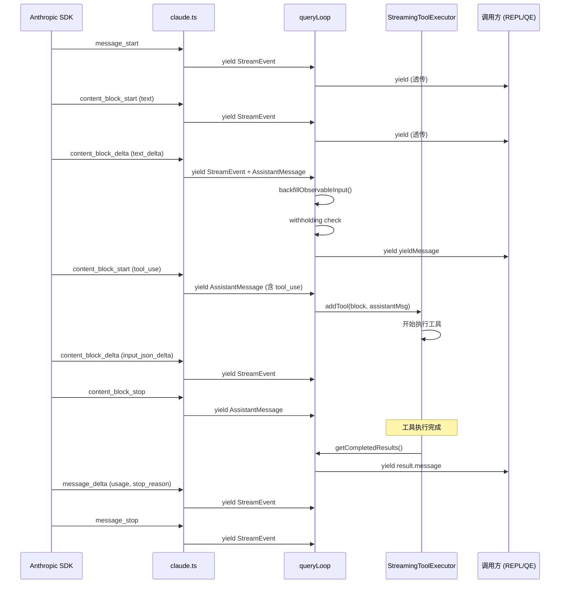

### 11.2 StreamingToolExecutor vs runTools

| 维度 | StreamingToolExecutor | runTools |
|---|---|---|
| 门控 | Statsig `tengu_streaming_tool_execution2` | 默认路径 |
| 时机 | 流式响应期间**边收边执行** | 等整个响应完成后执行 |
| 并发 | 内部并发管理 | `partitionToolCalls()` 分区（并发/串行） |
| 上限 | 无显式上限 | `CLAUDE_CODE_MAX_TOOL_USE_CONCURRENCY=10` |
| Fallback 处理 | `discard()` + 新建实例 | 不涉及 |
| 结果收集 | `getCompletedResults()`（实时） + `getRemainingResults()`（收尾） | 同步迭代 |

**StreamingToolExecutor 生命周期**：
1. 创建（`:950-956`）：API 调用前
2. `addTool()`（`:1313-1314`）：流式中收到 tool_use 块时
3. `getCompletedResults()`（`:1323`）：流式中实时收集完成的结果
4. `getRemainingResults()`（`:1960`）：流结束后收集剩余结果
5. `discard()`（`:1192, :1391`）：Fallback 时丢弃所有待处理结果

### 11.3 Withholding 机制

某些可恢复的错误在流式循环中被**扣留**（不 yield），给恢复逻辑一个机会：

| 扣留条件 | 检查函数 | 行号 | 恢复路径 |
|---|---|---|---|
| Prompt Too Long（context collapse） | `contextCollapse.isWithheldPromptTooLong()` | `:1267-1276` | collapse_drain_retry |
| Prompt Too Long（reactive） | `reactiveCompact.isWithheldPromptTooLong()` | `:1278-1280` | reactive_compact_retry |
| 媒体尺寸错误 | `reactiveCompact.isWithheldMediaSizeError()` | `:1281-1286` | reactive_compact_retry |
| max_output_tokens | `isWithheldMaxOutputTokens()` | `:1287-1289` | escalate → recovery × 3 |

**为什么扣留**：提前 yield 会让中间态错误泄漏给 SDK 调用方（如 cowork/desktop），它们一遇到 `error` 字段就终止会话——恢复循环仍在跑，但没人监听了。

### 11.4 Backfill Observable Input

**位置**：`:1200-1256`

```typescript
if (block.type === 'tool_use' && typeof block.input === 'object') {
  const tool = findToolByName(toolUseContext.options.tools, block.name)
  if (tool?.backfillObservableInput) {
    const inputCopy = { ...block.input }
    tool.backfillObservableInput(inputCopy)
    // 仅当新增字段时才克隆 yield
    const addedFields = Object.keys(inputCopy).some(k => !(k in originalInput))
    if (addedFields) {
      clonedContent[i] = { ...block, input: inputCopy }
    }
  }
}
```

**设计意图**：让 SDK 流输出和 transcript 看到派生字段（如展开的文件路径），但**原始消息保持不变**——修改它会破坏 prompt 缓存（字节不匹配）。

---

## 十二、Feature Flags 与 Gates

### 12.1 `feature()` 门控一览

| Feature Flag | 门控位置 | 作用 |
|---|---|---|
| `REACTIVE_COMPACT` | `:17-19` | 条件加载 `reactiveCompact` 模块 |
| `CONTEXT_COLLAPSE` | `:20-22` | 条件加载 `contextCollapse` 模块 |
| `EXPERIMENTAL_SKILL_SEARCH` | `:68-70` | 条件加载 skill 预取模块 |
| `EXPERIMENTAL_SEARCH_EXTRA_TOOLS` | `:71-73` | 条件加载延迟工具预取模块 |
| `TEMPLATES` | `:74-76` | 条件加载 job 分类器 |
| `HISTORY_SNIP` | `:141-143` | 条件加载 snip 模块 |
| `BG_SESSIONS` | `:144-146` | 条件加载 task summary 模块 |
| `CACHED_MICROCOMPACT` | `:789` | 延迟 microcompact 边界消息 |
| `TOKEN_BUDGET` | `:574, :1880` | 客户端 token 预算续写 |
| `CHICAGO_MCP` | `:1563, :2081` | Computer Use MCP 清理 |
| `CACHED_MAY_BE_STALE` | `:101` | Statsig 缓存门控值 |

### 12.2 `feature()` vs `QueryConfig.gates` vs Statsig

| 机制 | 解析时机 | 可变？ | 用途 |
|---|---|---|---|
| `feature('X')` | **构建时**（tree-shaking） | 不可变 | 模块加载/排除 |
| `config.gates.*` | **queryLoop 入口处**（快照一次） | 不可变（单次 query） | env/Statsig 状态 |
| `getFeatureValue_CACHED_MAY_BE_STALE()` | **运行时**（可能缓存） | 可能翻转 | 恢复路径门控 |

**为什么 `feature()` 必须排除在 gate 之外**：`feature()` 是 Bun 编译时的 tree-shaking 边界——只能用于 `if/三元` 条件，不能在运行时翻转。而 `config.gates` 是运行时 env/Statsig 状态的快照，在一次 `query()` 调用中不变。

### 12.3 `QueryConfig.gates` 四字段

| gate 字段 | 来源 | 行号 |
|---|---|---|
| `streamingToolExecution` | Statsig `tengu_streaming_tool_execution2` | `config.ts:32` |
| `emitToolUseSummaries` | `CLAUDE_CODE_EMIT_TOOL_USE_SUMMARIES` env | `config.ts:35` |
| `isAnt` | `USER_TYPE === 'ant'` env | `config.ts:38` |
| `fastModeEnabled` | `!CLAUDE_CODE_DISABLE_FAST_MODE` env | `config.ts:42` |

---

## 十三、排队命令生命周期

### 13.1 命令从进入到消费

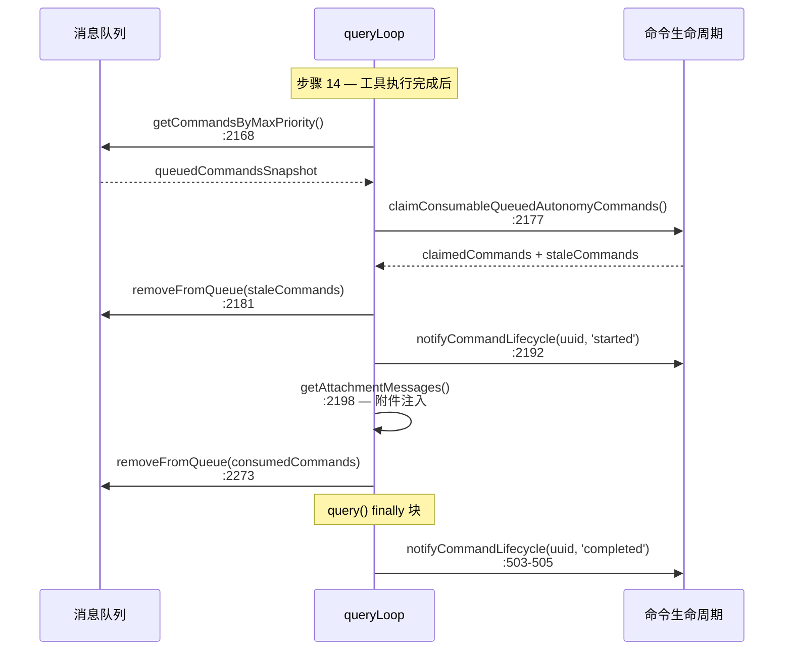

### 13.2 Agent 作用域路由

**过滤逻辑**（`:2164-2176`）：

```typescript
const isMainThread = querySource.startsWith('repl_main_thread') || querySource === 'sdk'
const currentAgentId = toolUseContext.agentId

const queuedCommandsSnapshot = getCommandsByMaxPriority(
  sleepRan ? 'later' : 'next',
).filter(cmd => {
  if (isSlashCommand(cmd)) return false         // Slash 命令排除
  if (isMainThread) return cmd.agentId === undefined  // 主线程只排空自己的
  return cmd.mode === 'task-notification' && cmd.agentId === currentAgentId  // 子 agent 只排空 task-notification
})
```

- **主线程**：排空 `agentId === undefined` 的命令
- **子 agent**：只排空发给自己（`agentId === currentAgentId`）的 `task-notification`
- **Sleep 工具**：如果 Sleep 工具运行了，优先级切换到 `'later'`（否则 `'next'`）

---

## 十四、设计模式与架构决策

### 14.1 DI Seam（`deps.ts`）

```typescript
export type QueryDeps = {
  callModel: typeof queryModelWithStreaming
  microcompact: typeof microcompactMessages
  autocompact: typeof autoCompactIfNeeded
  uuid: () => string
}
```

通过 `params.deps ?? productionDeps()` 注入，测试无需 `spyOn` 整个模块，只需传 `deps: { callModel: mockFn }`。`typeof fn` 写法保证 DI 接口与真实签名自动同步。

### 14.2 Async Generator Yield-Up 链

```
claude.ts → yield StreamEvent
query.ts  → yield StreamEvent（透传 + 过滤 + 额外消息）
REPL.tsx  → onQueryEvent(event)（消费）
QueryEngine → switch(event.type) → SDKMessage yield
```

每一层都是 async generator，通过 `yield*` 或 `for await` 向上传递事件。流式渲染：用户看到的每个字符增量都是从 SDK 流经 3 层后直接渲染的。

### 14.3 不可变快照 + 可变 State 分离

```
params.messages（入口处的不可变快照）
       ↓ 传入 queryLoop
State.messages（循环内可变，每个继续点整体替换）
```

`query()` 从不修改 `params.messages`，也从不直接修改外部的 `mutableMessages`。两套数据在 QueryEngine 层通过事件回流合并。

### 14.4 `feature()` 条件 `require()` 模式

```typescript
const reactiveCompact = feature('REACTIVE_COMPACT')
  ? (require('./services/compact/reactiveCompact.js') as typeof import('./services/compact/reactiveCompact.js'))
  : null
```

`feature()` 是 Bun 编译时的 tree-shaking 边界。Build 时若 feature 未启用，`require(...)` 整个分支被 DCE 消除。运行时通过 `?.` 可选链调用，null 时短路为 undefined。

### 14.5 `state = { ... }` 整体替换模式

```typescript
// 每个继续点
const next: State = {
  messages: [...],
  toolUseContext,
  autoCompactTracking: tracking,
  maxOutputTokensRecoveryCount: ...,
  hasAttemptedReactiveCompact: ...,
  maxOutputTokensOverride: undefined,
  pendingToolUseSummary: undefined,
  stopHookActive: ...,
  turnCount,
  transition: { reason: '...' },
}
state = next
continue
```

为什么不用 9 个独立赋值？避免遗漏和竞态——所有 10 个字段在同一个对象字面量中赋值，TypeScript 强制完整性。

---

## 十五、关键行号书签表

### 入口与类型

| 内容 | 行号 |
|---|---|
| `yieldMissingToolResultBlocks()` | 149-198 |
| `isWithheldMaxOutputTokens()` | 224-234 |
| `getAutonomyTurnOutcome()` | 236-282 |
| `QueryParams` 类型 | 284-302 |
| `State` 类型 | 307-320 |
| `MAX_OUTPUT_TOKENS_RECOVERY_LIMIT` | 214 |
| `query()` 函数 | 344-511 |
| `queryLoop()` 函数 | 526-2370 |

### queryLoop 流水线关键行号

| 步骤 | 行号 |
|---|---|
| 不可变 params 解构 | 543-552 |
| 可变 State 初始化 | 562-573 |
| BudgetTracker 创建 | 574 |
| QueryConfig 快照 | 587 |
| Memory 预取启动 | 597-600 |
| 技能/工具预取 | 634-643 |
| yield stream_request_start | 649 |
| 历史裁边 | 685 |
| 释放 toolUseResult | 696-704 |
| 工具结果预算 | 720-735 |
| History Snip | 746-762 |
| Microcompact | 770-794 |
| Context Collapse | 806-821 |
| 系统提示词构建 | 823-825 |
| Autocompact | 836-931 |
| 阻塞限制检查 | 1022-1052 |
| 预测式 autocompact | 1057-1101 |
| API 流式调用 | 1116-1335 |
| Fallback 处理 | 1170-1199 |
| Backfill observable input | 1200-1256 |
| Withholding 检查 | 1257-1292 |
| StreamingToolExecutor 实时结果 | 1319-1334 |
| FallbackTriggeredError | 1369-1432 |
| 外层 API 错误处理 | 1441-1497 |
| 缓存警告 | 1499-1523 |
| Post-sampling hooks | 1526-1535 |
| 流式中断处理 | 1541-1585 |
| PTL collapse_drain | 1624-1660 |
| PTL reactive_compact | 1662-1737 |
| max_output_tokens escalate | 1741-1776 |
| max_output_tokens recovery | 1778-1815 |
| API 错误终止 | 1820-1830 |
| handleStopHooks 调用 | 1836-1878 |
| Token budget 检查 | 1880-1927 |
| completed 返回 | 1933 |
| 工具执行 | 1936-1996 |
| Tool use summary 生成 | 1998-2074 |
| 工具中断处理 | 2077-2111 |
| Hook stop 检查 | 2114-2120 |
| 排队命令快照 | 2164-2196 |
| 附件注入 | 2198-2208 |
| Memory 预取消费 | 2215-2230 |
| Skill 预取消费 | 2235-2243 |
| 工具预取消费 | 2246-2256 |
| MCP 工具刷新 | 2290-2302 |
| Task summary | 2315-2331 |
| Max turns 检查 | 2334-2345 |
| 下一轮 state 更新 | 2352-2364 |

### query() 生命周期行号

| 内容 | 行号 |
|---|---|
| consumedCommandUuids 初始化 | 358 |
| Langfuse trace 判断 | 364 |
| Langfuse trace 创建 | 369-379 |
| queryLoop 委托 | 401 |
| finalizeAutonomyCommands | 423-440 |
| endTrace | 450 |
| flushLangfuse | 455 |
| 闭包置 null | 462-468 |
| Performance 清理 | 476-490 |
| Command lifecycle completed | 503-505 |

---

## 十六、学习路径建议

### 推荐阅读顺序

1. **`query/transitions.ts`**（21 行）：理解所有可能的循环出口——10 个 Terminal + 7 个 Continue
2. **`query/deps.ts`**（38 行）+ **`query/config.ts`**（45 行）：理解 DI 接口和配置快照设计
3. **`query.ts` 的 `QueryParams`（284-302）和 `State`（307-320）**：理解入参和内部状态的区别
4. **`query()` 入口（344-511）**：理解 finally 清理链和生命周期管理
5. **`queryLoop` 的 14 步流水线**：重点看 API 调用（1116-1335）、PTL 恢复（1624-1737）、max_output_tokens 恢复（1741-1815）、工具执行（1936-1996）
6. **`QueryEngine.ts:732-758`**：理解高层编排如何消费 query()
7. **`REPL.tsx:3450`**：理解 REPL 直接消费 query() 的路径

### 相关文档交叉引用

| 文档 | 覆盖范围 | 与本文的关系 |
|---|---|---|
| `core-loop-summary.mdx` | 三层架构全貌 | 本文是其中"query.ts 层"的深度展开 |
| `query_engine.mdx` | QueryEngine 编排层 | 本文的"调用方 A"章节详细描述了 QueryEngine 如何调用 query() |
| `[4]api-layer-summary` | claude.ts API 层 | 本文的 `deps.callModel()` 指向 claude.ts |
| `[5]context-engineering-summary` | 上下文工程 | 本文的第十章是上下文管线的 query.ts 视角 |
| `[6]tool-system-summary` | 工具系统 | 本文的 StreamingToolExecutor 和 runTools 指向工具系统 |
| `[9]hooks-system-summary` | Hooks 系统 | 本文的 handleStopHooks 和 execAgentHook 指向 hooks 系统 |
| `[12]skills-system-summary` | Skills 系统 | 本文的第七章是 skills 在 query.ts 中的集成视角 |
