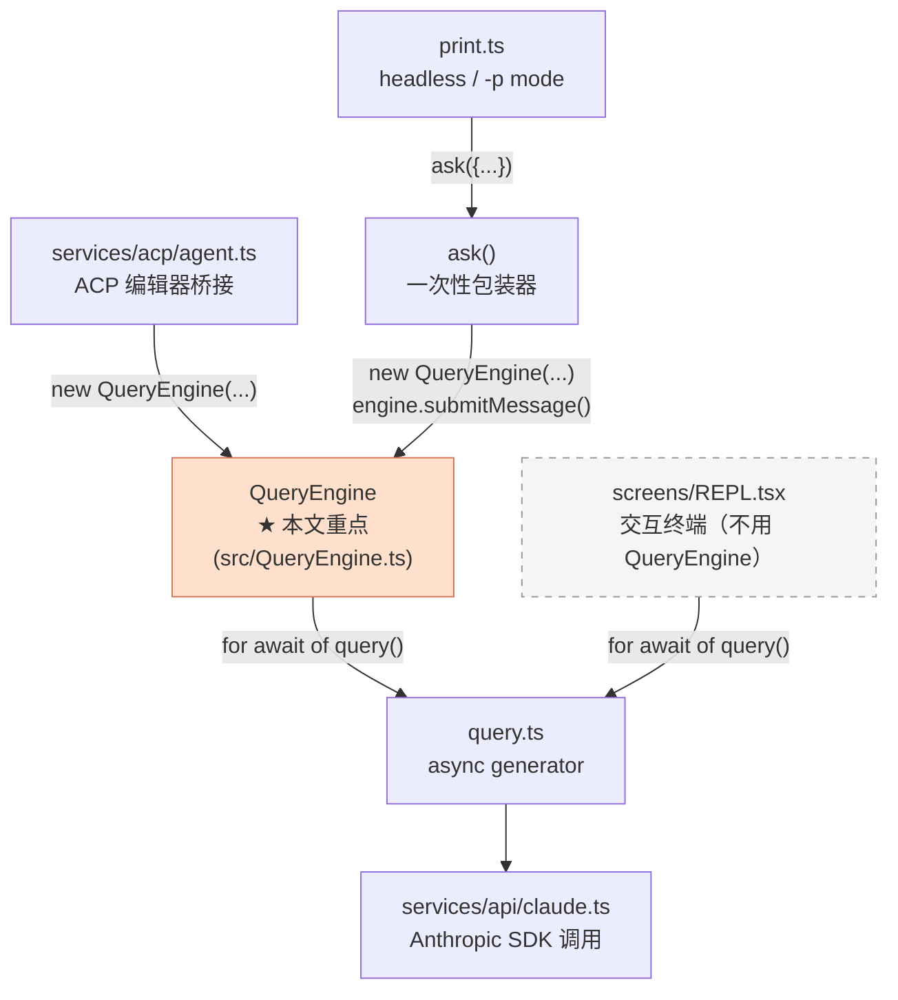
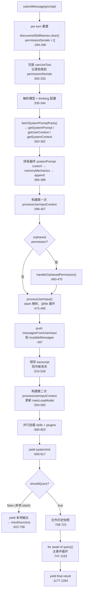
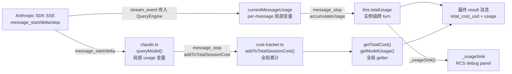

# QueryEngine.ts 深度学习

> 这是"核心循环"专题的第二篇深度文档。`QueryEngine` 是 Claude Code **SDK / headless / ACP** 路径的**会话编排器**——它在 `query()` 之上封装了提示词组装、输入预处理、历史管理、token 累计，并对外提供稳定的 `SDKMessage` 协议。共 1442 行，本文按执行流程逐层拆解。

---

## 一、定位与生命周期边界

### 1.1 在分层架构中的位置



**核心定位**：QueryEngine 是 `query()` 上方的**薄编排层**，它：
- 维护**会话级不变状态**（`mutableMessages`、`totalUsage`、`abortController`）
- 负责**每轮前准备**（提示词、输入预处理、模型解析）
- 对外输出**稳定的 `SDKMessage` 流**（供 ACP 协议、SDK 消费者使用）

> 交互 REPL（`REPL.tsx`）**完全不使用 QueryEngine**，它直接消费 `query()`。这是两条平行路径，见第九章。

### 1.2 一句话职责矩阵

| 层 | 文件 | 拥有什么 | 不做什么 |
|---|---|---|---|
| **API 传输** | `claude.ts` | Anthropic SDK 调用、流解码 | 不知道"会话"概念 |
| **单轮引擎** | `query.ts` | tool 执行循环、autocompact | 不知道"历史跨轮累积" |
| **会话编排** | `QueryEngine.ts` | 历史持久化、token 累计、SDKMessage 协议 | 不渲染 UI |
| **交互 UI** | `REPL.tsx` | 用户输入、React 状态、权限对话框 | 不走 QueryEngine |

---

## 二、QueryEngineConfig 全字段解析

类型定义：`src/QueryEngine.ts:154-195`

### 必填字段

| 字段 | 类型 | 说明 |
|---|---|---|
| `cwd` | `string` | 当前工作目录 |
| `tools` | `Tool[]` | 工具列表（含 MCP 工具） |
| `commands` | `Command[]` | slash 命令列表 |
| `mcpClients` | `MCPServerConnection[]` | 已连接的 MCP 服务器 |
| `agents` | `AgentDefinition[]` | 子 agent 定义 |
| `canUseTool` | `CanUseToolFn` | 权限决策回调（引擎内部会再次包装） |
| `getAppState` | `() => AppState` | 读取当前会话状态 |
| `setAppState` | `(updater) => void` | 更新会话状态 |
| `readFileCache` | `FileStateCache` | 文件内容 LRU 缓存 |

### 可选字段（控制行为）

| 字段 | 默认值 | 说明 |
|---|---|---|
| `initialMessages` | `[]` | 恢复会话时的历史消息 |
| `customSystemPrompt` | — | 完全替换默认系统提示 |
| `appendSystemPrompt` | — | 追加到系统提示末尾 |
| `userSpecifiedModel` | — | 覆盖模型名称（解析后写入 config） |
| `fallbackModel` | — | API 失败时的备用模型 |
| `thinkingConfig` | — | 显式控制扩展思考（不设则自适应） |
| `maxTurns` | — | 最多工具调用轮次 |
| `maxBudgetUsd` | — | 费用上限（QueryEngine 自己判断，不传给 `query()`） |
| `jsonSchema` | — | 强制结构化输出时的 JSON Schema |
| `verbose` | `false` | 调试详情输出 |
| `replayUserMessages` | `false` | 是否重放用户消息给 SDK 消费者 |
| `includePartialMessages` | `false` | 是否 yield 流式中间消息 |

### 关键回调

| 回调 | 签名 | 作用 |
|---|---|---|
| `canUseTool` | `CanUseToolFn` | 权限门控；QueryEngine 会包装它以记录拒绝 |
| `setSDKStatus` | `(status) => void` | 通知 SDK 消费者当前状态（requesting / responding） |
| `handleElicitation` | `(req) => Promise<resp>` | 处理 MCP `-32042` URL 授权请求 |
| `snipReplay` | `(msg, store) => SnipResult \| undefined` | HISTORY_SNIP 门控的 snip 边界回调 |
| `orphanedPermission` | `PermissionRequest` | 上一轮中断未完成的权限请求 |

---

## 三、实例字段（9 个 private 状态）

定义：`src/QueryEngine.ts:224-236`

| 字段 | 类型 | 初始化 | Reset 时机 | 用途 |
|---|---|---|---|---|
| `config` | `QueryEngineConfig` | 构造函数 `:239` | `setModel()` 可变 `config.userSpecifiedModel` | 不可变基础配置 |
| `mutableMessages` | `Message[]` | `config.initialMessages ?? []` `:240` | compact 边界后裁剪 | **跨 turn 对话历史**（最重要字段） |
| `abortController` | `AbortController` | `config.abortController ?? createAbortController()` `:241` | `resetAbortController()` 替换 | 取消当前 query 的控制器 |
| `permissionDenials` | `SDKPermissionDenial[]` | `[]` `:242` | 每轮 `submitMessage()` 开始时清空 `:295` | 收集本轮被拒绝的工具调用 |
| `totalUsage` | `NonNullableUsage` | `EMPTY_USAGE` `:244` | 只累加，不重置 | **实例级累计 token**（跨所有 turn） |
| `hasHandledOrphanedPermission` | `boolean` | `false`（inline） | 触发后设为 `true` `:461` | 孤儿权限仅处理一次 |
| `readFileState` | `FileStateCache` | `config.readFileCache` `:243` | 工具执行时被修改 | 文件内容 LRU 缓存，`/undo` 依赖 |
| `discoveredSkillNames` | `Set<string>` | `new Set()`（inline） | 每轮开始 `.clear()` `:294` | **per-turn**：防止 skill 重复加载 |
| `loadedNestedMemoryPaths` | `Set<string>` | `new Set()`（inline） | 不重置，跨 turn 累积 | 防止嵌套 MEMORY.md 重复注入 |

> **关键差异**：`mutableMessages` 和 `loadedNestedMemoryPaths` 跨 turn 保留；`discoveredSkillNames` 和 `permissionDenials` 每 turn 清空。这两个节律差异决定了引擎的记忆边界。

---

## 四、构造函数与延迟启动

```typescript
constructor(config: QueryEngineConfig) {   // src/QueryEngine.ts:238
  this.config = config
  this.mutableMessages = config.initialMessages ?? []
  this.readFileState = config.readFileCache
  this.abortController = config.abortController ?? createAbortController()
  this.permissionDenials = []
  this.totalUsage = EMPTY_USAGE
}
```

构造函数**仅做赋值**——没有文件 I/O，没有网络请求，没有 React 上下文访问。所有重量级操作（提示词 fetch、skill 加载、API 调用）全部推迟到第一次 `submitMessage()` 调用时执行。

---

## 五、处理用户输入：`submitMessage()` 全流程

这是 QueryEngine 的唯一公开输入方法，也是理解整个引擎的核心。

### 5.1 入参签名

```typescript
async *submitMessage(
  prompt: string | ContentBlockParam[],   // 用户文本 or 预构建内容块（图片等）
  options?: {
    uuid?: string     // 指定消息 UUID（恢复会话时用）
    isMeta?: boolean  // 标记为内部合成轮（不计入用户轮次）
  }
): AsyncGenerator<SDKMessage, void, unknown>
```

`prompt` 可以是：
- 字符串（普通用户文本，包括 slash 命令）
- `ContentBlockParam[]`（图片 + 文本混合块）

### 5.2 全流程时序图



### 5.3 关键步骤详解

**步骤 1：per-turn 重置（:294-296）**

```typescript
this.discoveredSkillNames.clear()
this.permissionDenials = []
setCwd(cwd)
```

每轮开始时丢弃上轮的 skill 发现缓存和权限拒绝记录，确保两者的生命周期严格限定在单轮内。

**步骤 2：包装 `canUseTool`（:305-333）**

```typescript
const wrappedCanUseTool: CanUseToolFn = async (tool, input, ctx, msg, id, force) => {
  const result = await canUseTool(tool, input, ctx, msg, id, force)
  if (result.behavior !== 'allow') {
    this.permissionDenials.push({
      type: 'permission_denial',
      tool_name: sdkCompatToolName(tool.name),   // 'Agent' → 'Task'（SDK 兼容名）
      tool_use_id: id,
      tool_input: input,
    })
  }
  return result
}
```

包装层**不改变决策**，只是侧录拒绝记录。最终 result 消息里的 `permission_denials` 字段就来自这里（:1277）。

**步骤 3-4：模型与 thinking（:335-344）**

```typescript
const mainLoopModelParam = userSpecifiedModel
  ? parseUserSpecifiedModel(userSpecifiedModel)
  : getMainLoopModel()

const thinkingConfig = config.thinkingConfig
  ?? getAdaptiveThinkingConfig()   // 默认：自适应（根据 token budget 决定是否开启）
  ?? { type: 'disabled' }
```

**步骤 5-6：提示词组装**（详见第六章）

**步骤 7：processUserInputContext（:398-457）**

这个 Context 对象是 QueryEngine 和 `processUserInput` 之间的"接线盒"，包含：
- `cwd`、`tools`、`commands`、`mcpClients`、`agents`
- `abortController`（传入 `query()` 以支持取消）
- `updateFileHistoryState`（文件历史回调）
- `updateAttributionState`（git 归因回调）
- `loadedNestedMemoryPaths`（防止 MEMORY.md 重复注入）

**步骤 8：`processUserInput()`（:472-490）**

从 `src/utils/processUserInput/processUserInput.ts:90` 调用：
- 解析 slash 命令（`/clear`、`/help`、`@file` 等）
- 展开 `@filename` 文件引用
- 规范化图片附件
- 执行用户输入 hook（`user-prompt-submit` 类型）
- 返回 `{ messages, shouldQuery, allowedTools, model, resultText }`

**步骤 9：push 到历史 + 快照（:497-500）**

```typescript
this.mutableMessages.push(...messagesFromUserInput)
const messages = [...this.mutableMessages]   // 不可变快照传入 query()
```

`mutableMessages` 是持久化的历史；`messages` 是本轮 `query()` 调用的只读快照。

**步骤 10：预写 transcript（:515-528）**

```typescript
if (persistSession) {
  if (isBareMode) {
    void recordTranscript(messages)          // 非严格模式：fire-and-forget
  } else {
    await recordTranscript(messages)         // 严格模式：等写完再继续
  }
}
```

在 API 请求发出**之前**就写盘，确保进程意外中断时用户消息不丢失（`--resume` 依赖此机制）。

**步骤 14：本地 slash 短路（:622-706）**

如果 `shouldQuery === false`（纯本地命令，如 `/clear`），跳过 `query()`，直接：
1. yield 合成的 user/assistant 消息对
2. 写 transcript
3. yield `result/success`
4. `return`

整个 API 层完全不涉及，极快响应。

---

## 六、获取提示词：`fetchSystemPromptParts` 的三股汇流

### 6.1 三个并行任务

调用入口：`src/QueryEngine.ts:354-362`，委托给 `src/utils/queryContext.ts:43-89`：

```typescript
const { defaultSystemPrompt, userContext, systemContext } =
  await fetchSystemPromptParts({
    tools, mainLoopModel, additionalWorkingDirectories, mcpClients, customSystemPrompt
  })
```

内部并行：

```typescript
// src/utils/queryContext.ts:68-79
const [defaultSystemPrompt, userContext, systemContext] = await Promise.all([
  getSystemPrompt(tools, model, additionalDirs, mcpClients),  // src/constants/prompts.ts:416
  getUserContext(),                                            // src/context.ts:159
  getSystemContext(),                                         // src/context.ts:117
])
```

| 函数 | 产出 | 包含内容 |
|---|---|---|
| `getSystemPrompt` | `string[]` | 角色定位、环境信息、skill 命令、输出规范、语言规则、MCP 指令 |
| `getUserContext` | `{ claudeMd?, currentDate }` | 所有层级的 CLAUDE.md 合并内容 + 今日日期 |
| `getSystemContext` | `{ gitStatus?, cacheBreaker? }` | `git status --short` + 近 5 条 commit log |

> **memoized**：`getUserContext` 和 `getSystemContext` 均有 memoize 缓存，同一进程内多轮调用只执行一次文件/git 读取。

> **customSystemPrompt 短路**：设置了 `customSystemPrompt` 时，`getSystemPrompt` 返回 `[]`，`getSystemContext` 返回 `{}`，即完全跳过默认提示词和 git 状态注入（`:116-118`, `:154-155`）。

### 6.2 QueryEngine 叠加的两段

在 `fetchSystemPromptParts` 返回后，QueryEngine 自己再叠加（`:365-388`）：

**Coordinator 上下文**（仅 `COORDINATOR_MODE` feature 启用时）：
```typescript
const coordinatorCtx = getCoordinatorUserContext(mcpClients, scratchpadDir)
// 合并到 baseUserContext 中
```

**Memory mechanics prompt**（仅设置了 `CLAUDE_CWORK_MEMORY_PATH_OVERRIDE` 环境变量时）：
```typescript
if (customPrompt !== undefined && hasAutoMemPathOverride()) {
  memoryMechanicsPrompt = await loadMemoryPrompt()  // src/memdir/memdir.ts
}
```

### 6.3 最终拼装顺序

```typescript
const systemPrompt = asSystemPrompt([
  ...(customPrompt !== undefined ? [customPrompt] : defaultSystemPrompt),
  ...(memoryMechanicsPrompt ? [memoryMechanicsPrompt] : []),
  ...(appendSystemPrompt ? [appendSystemPrompt] : []),
])
```

优先级：`custom > default`，然后接 `memoryMechanics`，最后 `append`。

`asSystemPrompt()` 只是品牌类型转换（将 `string[]` 标记为 `SystemPrompt`），确保缓存 key 安全。

---

## 七、调用 `query()`：`QueryParams` 构造与 9 种事件分发

### 7.1 调用现场（:747-758）

```typescript
for await (const message of query({
  messages,                    // 本轮快照（含新用户消息）
  systemPrompt,                // 上面拼好的 asSystemPrompt 数组
  userContext,                 // { claudeMd, currentDate }
  systemContext,               // { gitStatus }
  canUseTool: wrappedCanUseTool,
  toolUseContext: processUserInputContext,
  fallbackModel,
  querySource: 'sdk',
  maxTurns,
  taskBudget,
  // 注意：maxBudgetUsd 和 jsonSchema 不在这里 —— QueryEngine 自己在循环外处理
})) { /* ... */ }
```

**不转发的两个参数**：
- `maxBudgetUsd`：QueryEngine 在每次 event 后检查 `getTotalCost() >= maxBudgetUsd`（:1084-1116），然后 yield `result/error_max_budget_usd`
- `jsonSchema`：QueryEngine 在外层注册 `registerStructuredOutputEnforcement()`，并计数重试次数（:391-396, :1119-1162）

### 7.2 `query()` 的产出协议

来自 `src/query.ts:298-307`：

```typescript
export async function* query(params): AsyncGenerator<
  | StreamEvent            // 包裹 Anthropic SSE 原始事件（message_start/delta/stop 等）
  | RequestStartEvent      // HTTP 请求开始时发出（驱动 requesting 状态）
  | Message                // 完整消息（assistant / user / progress / attachment / system）
  | TombstoneMessage       // 要求删除一条已 yield 消息
  | ToolUseSummaryMessage  // 子 agent 摘要块
  Terminal                 // 最终返回值（completed / aborted_streaming / aborted_tools / model_error）
>
```

### 7.3 主循环 switch 全景（:830-1081）

| `message.type` | 触发条件 | QueryEngine 的处理 |
|---|---|---|
| `tombstone` | `query()` 回撤已 yield 的 assistant 消息 | yield `tombstone` → SDK 消费者删除该消息 |
| `assistant` | 每次 LLM 回复完成 | push 到 history、记录 `lastAssistantMessage`、yield |
| `progress` | tool 执行中间进度 | 直接 yield（透传） |
| `user` | tool result 回写 | push 到 history、`turnCount++`、yield |
| `stream_event` | 每个 Anthropic SSE chunk | **累计 token**（见第八章）、yield |
| `attachment` | `max_turns_reached` / `structured_output` / `compact_boundary` 等元数据 | 分类处理（见下） |
| `stream_request_start` | HTTP 请求启动 | yield + 回调 `setSDKStatus('requesting')` |
| `system` | `compact_boundary` / `api_error` / `api_retry` 等 | compact 触发内存裁剪（见第十二章） |
| `tool_use_summary` | 子 agent 完成摘要 | yield `tool_use_summary` 给 SDK 消费者 |

**attachment 分类处理**：

| `attachment.type` | 处理 |
|---|---|
| `max_turns_reached` | yield `result/error_max_turns` → `return` |
| `structured_output` | 捕获到 `structuredOutputFromTool` 字段 |
| `compact_boundary` | yield `system/compact_boundary` + 裁剪 `mutableMessages`（:1019-1043） |

---

## 八、累计 token：双层会计模型

### 8.1 两个 scope 的设计意图

| Scope | 字段 | 初始化 | 重置 | 用途 |
|---|---|---|---|---|
| **实例级** | `this.totalUsage`（:228） | `EMPTY_USAGE` | 从不重置 | 最终 result 消息里的 `usage` 字段（会话累计） |
| **轮内** | 局部 `currentMessageUsage`（:726） | `EMPTY_USAGE` | 每个 `message_start` 重置 | 追踪单条 assistant message 的 token（防止 `message_delta` 传零覆盖） |

### 8.2 三阶段累计（:871-922）

在 `stream_event` case 内：

```typescript
case 'stream_event': {
  const { event } = message as StreamEventMessage

  // 阶段 1：message_start — 用 API 返回的 input tokens 初始化
  if (event.type === 'message_start') {
    currentMessageUsage = EMPTY_USAGE
    currentMessageUsage = updateUsage(currentMessageUsage, event.message.usage)
  }

  // 阶段 2：message_delta — 累积 output tokens（stop_reason 也在这里）
  if (event.type === 'message_delta') {
    currentMessageUsage = updateUsage(currentMessageUsage, event.usage)
    lastStopReason = event.delta.stop_reason   // 真实 stop_reason 在此获取
  }

  // 阶段 3：message_stop — 提交到实例级 totalUsage
  if (event.type === 'message_stop') {
    this.totalUsage = accumulateUsage(this.totalUsage, currentMessageUsage)
    try { _usageSink?.(this.totalUsage, mainLoopModel) } catch {}
  }
}
```

### 8.3 `updateUsage` 的"非零字段优先"语义

来自 `src/services/api/claude.ts:3104-3167`：

Anthropic API 有时在 `message_delta` 里发送某些稳定字段（如 `cache_creation_input_tokens`）的**显式 0**，而真实值已在 `message_start` 里发过了。`updateUsage` 采用"**非零值优先**"策略：

```typescript
function updateUsage(current, newUsage) {
  return {
    input_tokens: current.input_tokens + (newUsage.input_tokens ?? 0),
    output_tokens: current.output_tokens + (newUsage.output_tokens ?? 0),
    cache_creation_input_tokens:
      newUsage.cache_creation_input_tokens > 0
        ? newUsage.cache_creation_input_tokens   // 只在非零时才覆盖
        : current.cache_creation_input_tokens,
    // ... 同理处理其他缓存字段
  }
}
```

### 8.4 Token 数据流图



**关键边界**：QueryEngine 的 `totalUsage` 只累计流经**本实例** `submitMessage()` 的消息；全局 `cost-tracker` 则记录**整个进程**内所有 API 调用（含 REPL 路径）。最终 result 消息同时携带两者。

### 8.5 `_usageSink`：给 RCS 调试面板的 hook

```typescript
// src/QueryEngine.ts:11-14
let _usageSink: UsageSink | null = null
export function setUsageSink(sink: UsageSink | null) {
  _usageSink = sink
}
```

`src/bridge/debugSinks.ts:81` 在 RCS bridge 连接时注册，断开时注销（:96）。每次 `message_stop` 时触发，将 `(totalUsage, modelName)` 推送到调试事件流。不影响生产路径。

---

## 九、与 REPL 搭配的"真相"

### 9.1 源码证据：REPL 不导入 QueryEngine

```bash
# grep 结果：零命中
grep -r "QueryEngine" src/screens/REPL.tsx
# → 无输出

grep -r "submitMessage" src/screens/REPL.tsx
# → 无输出
```

`REPL.tsx` 在第 269 行直接导入 `query`：
```typescript
import { query } from '../query.js'  // src/screens/REPL.tsx:269
```

并在 `onQueryImpl` 内直接消费（:3460-3470）：
```typescript
for await (const event of query({
  messages: messagesIncludingNewMessages,
  systemPrompt,
  userContext,
  systemContext,
  canUseTool,
  toolUseContext,
  querySource: getQuerySourceForREPL(),
})) {
  onQueryEvent(event)
}
```

### 9.2 两条路径的对比

| 维度 | 交互 REPL（REPL.tsx） | SDK/ACP（QueryEngine） |
|---|---|---|
| 直接消费 | `query()` async generator | `query()` async generator（QueryEngine 内部） |
| 历史管理 | React `useState<Message[]>` | `this.mutableMessages`（class 字段） |
| token 累计 | 从全局 `getTotalInputTokens()` 读 | `this.totalUsage`（实例级）+ 全局 |
| 提示词组装 | `onQueryImpl` 内三个 await + `buildEffectiveSystemPrompt` | `fetchSystemPromptParts` + `asSystemPrompt` |
| 消息协议 | 原始 `Message` 类型（直接驱动 React 状态） | `SDKMessage` 类型（稳定的程序化协议） |
| 生命周期 | React 组件生命周期（mount/unmount） | class 实例生命周期（`new` → GC） |
| 权限 UI | `setToolUseConfirmQueue` → `<PermissionRequest>` 对话框 | `permissionDenials` 记录 → result 字段 |

### 9.3 SDKMessage 协议的意义

QueryEngine 输出的 `SDKMessage` 是专为**程序化消费**设计的稳定协议：
- 稳定的 `type` / `subtype` 组合（`system/init`、`result/success`、`result/error_*`）
- 包含会计信息（`total_cost_usd`、`duration_ms`、`num_turns`）
- `permission_denials` 字段让 SDK 消费者知道哪些工具被拒绝
- `tool_use_summary` 聚合子 agent 结果

REPL 不需要这个协议——它直接绑定 React 状态，不关心 SDKMessage 层。

### 9.4 为什么有这种分裂

- 历史原因：REPL 是最早的代码，`query()` 是为 REPL 设计的
- 设计原因：QueryEngine 是后来为 SDK / ACP 场景封装的**稳定 session API**，为避免打破 REPL 的微妙状态机，没有让 REPL 迁移到 QueryEngine

---

## 十、对外调用方全景

### 10.1 ACP agent（Zed 编辑器桥接）— 长驻 per session

**文件**：`src/services/acp/agent.ts:49-50, 89, 308, 585`

```typescript
// 实例化（:585）
const queryEngine = new QueryEngine(engineConfig)
// engineConfig 包含：FileStateCache(500, 50MB)、includePartialMessages: true、replayUserMessages: true
```

**调用矩阵**：

| 时机 | 方法 | 行号 |
|---|---|---|
| session 创建后 | `queryEngine.setModel(currentModel)` | :644 |
| 每次 prompt 前 | `queryEngine.resetAbortController()` | :302 |
| 用户发送消息 | `queryEngine.submitMessage(promptInput)` | :308 |
| 传递给 forwardSessionUpdates | `queryEngine.getAbortSignal()` | :314 |
| 用户取消 | `queryEngine.interrupt()` | :391 |
| 切换模型 | `queryEngine.setModel(params.modelId)` | :420, :457 |

**取消三连**（:374-391）：
```typescript
session.cancelled = true
session.cancelGeneration++
// 解除所有 pending prompts
session.queryEngine.interrupt()    // 中止当前 query()
// ... 下次 prompt 前：
session.queryEngine.resetAbortController()  // ❗ 必须在 interrupt() 后调用
```

这个三连是 ACP 取消语义的核心——`interrupt()` 终止流，`resetAbortController()` 重新武装，两步缺一不可。

### 10.2 `print.ts` via `ask()` — 无头模式，一次性

**文件**：`src/cli/print.ts:91, 2202`

```typescript
import { ask } from 'src/QueryEngine.js'   // :91

for await (const message of ask({
  prompt, cwd, tools, mcpClients, commands,
  canUseTool, userSpecifiedModel, maxTurns,
  maxBudgetUsd, jsonSchema, thinkingConfig,
  // ...
})) {
  // 处理 SDKMessage 输出到 stdout
}
```

`ask()` 内部：
1. 克隆 readFileCache（防污染主进程缓存）
2. `new QueryEngine({...})`
3. `engine.submitMessage(prompt, { uuid, isMeta })`
4. 用完后将 `engine.getReadFileState()` 回灌到主进程缓存（`:1439`）

每个命令对应一个**临时 QueryEngine 实例**，用完即抛。

### 10.3 `debugSinks.ts` — 只注册 sink，不用 class

**文件**：`src/bridge/debugSinks.ts:14, 81, 96`

```typescript
import { setUsageSink } from '../QueryEngine.js'    // :14

// bridge 连接时（:81）
setUsageSink((usage, model) => {
  batchDebugEvents.push({ type: 'usage', usage, model })
})

// bridge 断开时（:96）
setUsageSink(null)
```

纯模块级 hook，不实例化 QueryEngine。

### 10.4 汇总表

| 场景 | 文件 | 生命周期 | 入口方式 | 特点 |
|---|---|---|---|---|
| ACP 编辑器桥接（Zed 等） | `services/acp/agent.ts` | 长驻 per session | `new QueryEngine(config)` | 多 turn 会话、支持 setModel/interrupt/reset |
| 无头 `-p` / SDK 流 | `cli/print.ts` | 一次性 per prompt | `ask({...})` | readFileCache 克隆-回灌，自动 snipReplay |
| RCS 调试面板 | `bridge/debugSinks.ts` | 模块级 hook | `setUsageSink(cb)` | 不实例化，只监听 token 事件 |
| 单元测试（ACP） | `services/acp/__tests__/agent.test.ts` | mock | `mock.module(...)` | MockQueryEngine 替换真实实现 |
| 交互 REPL | `screens/REPL.tsx` | — | — | **不使用 QueryEngine**，直接调 `query()` |

---

## 十一、错误、取消、AbortSignal

### 11.1 AbortController 生命周期

```typescript
// 创建（构造函数）
this.abortController = config.abortController ?? createAbortController()
// createAbortController (src/utils/abortController.ts:15) 只是增大 maxListeners 到 50

// 取消（interrupt）
interrupt(): void {
  this.abortController.abort()   // :1288
}

// 重置（供 ACP 在 interrupt 后调用）
resetAbortController(): void {
  this.abortController = createAbortController()   // :1294
}

// 读取（供 ACP 的 forwardSessionUpdates 监听）
getAbortSignal(): AbortSignal {
  return this.abortController.signal   // :1299
}
```

`abortController` 透过 `processUserInputContext.abortController` 传入 `query()`，`query()` 内的 HTTP 请求和工具执行都监听此 signal。

### 11.2 6 种 result subtype 一览

| subtype | 触发条件 | 行号 |
|---|---|---|
| `success`（本地命令） | `shouldQuery === false` 短路 | :685-705 |
| `error_max_turns` | `query()` 发出 `attachment.max_turns_reached` | :957-979 |
| `error_max_budget_usd` | `getTotalCost() >= maxBudgetUsd` | :1093-1115 |
| `error_max_structured_output_retries` | 结构化输出重试次数 ≥ 5 | :1138-1160 |
| `error_during_execution` | `!isResultSuccessful(result, lastStopReason)` | :1204-1239 |
| `success`（正常完成） | 主循环正常退出 | :1264-1284 |

所有 result 消息共享结构：
```typescript
{
  type: 'result',
  subtype: '...',
  total_cost_usd: getTotalCost(),
  duration_ms: Date.now() - startTime,
  duration_api_ms: getTotalAPIDuration(),
  num_turns: turnCount,
  usage: this.totalUsage,
  modelUsage: getModelUsage(),
  permission_denials: this.permissionDenials,
  is_error: subtype !== 'success',
  errors: [...],
}
```

### 11.3 `error_during_execution` 的诊断串

当 `isResultSuccessful` 失败时，errors 数组包含（:1228-1237）：

```
[ede_diagnostic] result_type=… last_content_type=… stop_reason=…
```

紧接其后是 `getInMemoryErrors()` 截取的最近错误日志（从 `errorLogWatermark` 开始，该 watermark 在 turn 开始时拍摄——:737, :1229-1232）。

> **watermark 机制**：in-memory error log 是 100 条的环形缓冲区，watermark 是数组引用而非下标，因此在 shift() 后仍能正确截取本轮产生的错误。

---

## 十二、Compaction / 文件快照 / 归因

### 12.1 自动 compact 边界的两次清理

当 `query()` 发出 `system/compact_boundary` 时，QueryEngine 做**两次**不同目的的处理：

**第一次：持久化前裁剪（:773-789）**

在 yield 之前，将 boundary 前的消息刷写到磁盘：
```typescript
if (message.type === 'system' && message.subtype === 'compact_boundary') {
  const tailUuid = message.compactMetadata?.preservedSegment?.tailUuid
  if (tailUuid) {
    const idx = this.mutableMessages.findLastIndex(m => m.uuid === tailUuid)
    if (idx !== -1) {
      await recordTranscript(this.mutableMessages.slice(0, idx + 1))
    }
  }
}
```

确保 `--resume` 时能找到正确的 tailUuid。

**第二次：内存裁剪（:1019-1043）**

在 boundary 消息被 push 到 `mutableMessages` 后：
```typescript
// mutableMessages：只保留 boundary 消息本身
const idx = this.mutableMessages.length - 1
if (idx > 0) {
  this.mutableMessages.splice(0, idx)   // 删除 boundary 之前的所有消息
}
```

pre-compact 的历史消息成为 GC 候选，防止长会话内存无限增长。

### 12.2 HISTORY_SNIP 的 snipReplay 钩子

`config.snipReplay` 在 `ask()` 中条件注入（`:1418-1426`），每次 assistant 消息 push 后触发（`:1009-1016`）：

```typescript
const snipResult = this.config.snipReplay?.(msg, this.mutableMessages)
if (snipResult !== undefined) {
  if (snipResult.executed) {
    this.mutableMessages.length = 0
    this.mutableMessages.push(...snipResult.messages)
  }
  break  // 终止本 turn 的事件消费
}
```

snip 成功时**整体替换** `mutableMessages`，清除 tombstone 标记，防止长会话中 tombstone 累积导致内存泄漏。

### 12.3 文件历史快照（fire-and-forget）

```typescript
// :708-723
if (fileHistoryEnabled() && persistSession) {
  messagesFromUserInput
    .filter(messageSelector()?.selectableUserMessagesFilter ?? (() => true))
    .forEach(message => {
      void fileHistoryMakeSnapshot(updaterCallback, message.uuid)  // fire-and-forget
    })
}
```

`fileHistoryMakeSnapshot`（`src/utils/fileHistory.ts:199`）在用户消息 UUID 下备份所有被工具读取/修改的文件，支持 `/undo` 功能。用 `void` 丢弃 Promise，不阻塞主流程。

### 12.4 归因仅透传

```typescript
// processUserInputContext.updateAttributionState（:447-455）
updateAttributionState: (updater) => {
  setAppState(prev => {
    const updated = updater(prev.attribution)
    if (updated === prev.attribution) return prev
    return { ...prev, attribution: updated }
  })
}
```

QueryEngine 把 `updateAttributionState` 回调注入到工具执行 context 中，由文件编辑工具（FileEditTool 等）在修改文件时调用，记录 git commit 归因数据。QueryEngine 本身**从不读取** `appState.attribution`。

---

## 十三、`ask()` 包装函数

`ask()` 是 QueryEngine 的**一次性包装器**，供无头/SDK 路径使用（`src/cli/print.ts`）。

定义：`src/QueryEngine.ts:1328-1441`

```typescript
export async function* ask({
  prompt, cwd, tools, commands, mcpClients, agents,
  canUseTool, getAppState, setAppState, thinkingConfig,
  userSpecifiedModel, fallbackModel, maxTurns, maxBudgetUsd,
  jsonSchema, uuid, isMeta, mutableMessages,
  getReadFileCache, setReadFileCache,
  // ...
}): AsyncGenerator<SDKMessage, void, unknown>
```

### 三个关键设计

**1. readFileCache 克隆（:1401）**

```typescript
const engine = new QueryEngine({
  // ...
  readFileCache: cloneFileStateCache(getReadFileCache()),  // 克隆！
  // ...
})
```

防止临时 engine 实例污染调用方的文件缓存状态。

**2. 回灌（:1439）**

```typescript
} finally {
  setReadFileCache(engine.getReadFileState())
}
```

即使出错，也确保本轮工具读取的文件状态回流到调用方，使后续轮次能正确检测外部文件变化。

**3. snipReplay 条件注入（:1418-1426）**

```typescript
...(feature('HISTORY_SNIP') ? {
  snipReplay: (yielded, store) => {
    if (!snipProjection.isSnipBoundaryMessage(yielded)) return undefined
    return snipModule.snipCompactIfNeeded(store, { force: true })
  },
} : {}),
```

仅在 HISTORY_SNIP feature 启用时注入，保持零开销 tree-shaking。

---

## 十四、调试与可观测性

### 14.1 logForDebugging 标签

QueryEngine 在关键节点输出调试日志（开发模式下可见）：

| 标签 | 位置 | 内容 |
|---|---|---|
| `[Hapii]` / `[QueryEngine]` | :299-302 | turn 开始，打印 prompt 摘要 |
| `[SystemPrompt]` | :364 | 系统提示词内容（长字符串）|
| `[QueryEngine]` | :491 | `processUserInput` 返回的消息 |
| `[QueryEngine]` | :743 | 进入 `for await of query()` |
| `[QueryEngine]` | :1165 | `for await` 循环结束 |
| `[QueryEngine]` | :1260 | result 消息内容 |

### 14.2 headlessProfilerCheckpoint 延迟检查点

QueryEngine 的 `submitMessage` 在 5 个里程碑处打点（单位：ms）：

| 顺序 | 位置（行号） | 含义 |
|---|---|---|
| 1 | :346 | 开始 `fetchSystemPromptParts` |
| 2 | :363 | `fetchSystemPromptParts` 完成 |
| 3 | :595 | 第二次 processUserInputContext 完成 |
| 4 | :604 | skills/plugins 并行加载完成 |
| 5 | :620 | `system/init` 已 yield |

这些 checkpoint 是 `-p` / headless 模式性能分析的主要数据来源。

### 14.3 Eager flush

在每个 result 消息 yield 后（包括错误路径）：

```typescript
if (process.env.CLAUDE_CODE_EAGER_FLUSH || process.env.CLAUDE_CODE_IS_COWORK) {
  await flushSessionStorage()
}
```

原因：某些宿主进程（如 claude-desktop）在收到 result 消息后**立即**杀死 CLI 进程。eager flush 确保会话存储在此之前全部落盘。

### 14.4 Transcript 写盘策略

QueryEngine 在写会话日志时采用两种模式：

| 消息类型 | 写法 | 原因 |
|---|---|---|
| `assistant` | `void recordTranscript(messages)`（fire-and-forget） | `claude.ts` 会在 `message_delta` 时**回填** `message.usage`，await 会输给 100ms drain timer，导致写入丢 usage 字段 |
| 其他所有类型 | `await recordTranscript(messages)` | enqueueWrite 保序，安全可 await |

---

## 十五、关键引用表

| 内容 | 文件 | 行号 |
|---|---|---|
| `QueryEngine` 类定义 | `src/QueryEngine.ts` | 223-1317 |
| `QueryEngineConfig` 类型 | `src/QueryEngine.ts` | 154-195 |
| `submitMessage` AsyncGenerator | `src/QueryEngine.ts` | 265-1285 |
| per-turn 重置 | `src/QueryEngine.ts` | 294-296 |
| `wrappedCanUseTool` 包装 | `src/QueryEngine.ts` | 305-333 |
| `fetchSystemPromptParts` 调用 | `src/QueryEngine.ts` | 354-362 |
| systemPrompt 最终拼装 | `src/QueryEngine.ts` | 384-388 |
| `processUserInput` 调用 | `src/QueryEngine.ts` | 472-490 |
| 预写 transcript | `src/QueryEngine.ts` | 515-528 |
| `for await of query()` | `src/QueryEngine.ts` | 747-758 |
| 9 种消息 switch | `src/QueryEngine.ts` | 830-1081 |
| token 三阶段累计 | `src/QueryEngine.ts` | 871-922 |
| compact 内存裁剪 | `src/QueryEngine.ts` | 1019-1043 |
| budget 强制结束 | `src/QueryEngine.ts` | 1084-1116 |
| `interrupt` / `resetAbortController` / `getAbortSignal` | `src/QueryEngine.ts` | 1287-1300 |
| `ask()` 包装函数 | `src/QueryEngine.ts` | 1328-1441 |
| `setUsageSink` | `src/QueryEngine.ts` | 2-14 |
| `fetchSystemPromptParts` 实现 | `src/utils/queryContext.ts` | 43-89 |
| `getSystemPrompt` | `src/constants/prompts.ts` | 416 |
| `getUserContext` | `src/context.ts` | 159-196 |
| `getSystemContext` | `src/context.ts` | 117-154 |
| `query()` AsyncGenerator | `src/query.ts` | 298-410 |
| `QueryParams` 类型 | `src/query.ts` | 238-256 |
| `updateUsage` / `accumulateUsage` | `src/services/api/claude.ts` | 3104, 3173 |
| `getTotalCost` / `getModelUsage` | `src/cost-tracker.ts` | 50-70 |
| `createAbortController` | `src/utils/abortController.ts` | 15-21 |
| REPL 直接消费 `query()` | `src/screens/REPL.tsx` | 269, 3460-3470 |
| ACP agent 调用 QueryEngine | `src/services/acp/agent.ts` | 49-50, 89, 302, 308, 314, 391, 420, 585 |
| print.ts 调用 `ask()` | `src/cli/print.ts` | 91, 2202 |
| debugSinks 注册 sink | `src/bridge/debugSinks.ts` | 14, 81, 96 |
| MockQueryEngine（测试） | `src/services/acp/__tests__/agent.test.ts` | 47-55 |
| `buildSystemInitMessage` | `src/utils/messages/systemInit.ts` | 53 |
| `sdkCompatToolName` | `src/utils/messages/systemInit.ts` | 23 |
| `isResultSuccessful` | `src/utils/queryHelpers.ts` | 63 |
| `fileHistoryMakeSnapshot` | `src/utils/fileHistory.ts` | 199 |
| `cloneFileStateCache` | `src/utils/fileStateCache.ts` | 133 |
