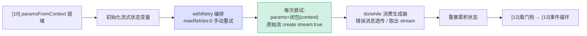

# [11] 流式状态初始化、withRetry 与发起请求

> `[10]` 准备好 `paramsFromContext` 后，这一段（`claude.ts:2137-2244`）做三件事：
> 1. 初始化一大批**流式累积状态**变量（usage、costUSD、contentBlocks……）。
> 2. 用 **`withRetry`** 包裹"创建客户端 + 发请求"，自己掌控重试。
> 3. 拿到流后，重置状态，准备进入 `[13]` 的事件大循环。

---

## 一、流式状态变量初始化（2137-2151）

```typescript
const newMessages: AssistantMessage[] = []
let ttftMs = 0
let partialMessage: BetaMessage | undefined
const contentBlocks: (BetaContentBlock | ConnectorTextBlock)[] = []
const textDeltas = new Map<number, string[]>()
let usage: NonNullableUsage = EMPTY_USAGE
let costUSD = 0
let stopReason: BetaStopReason | null = null
let didFallBackToNonStreaming = false
let fallbackMessage: AssistantMessage | undefined
let maxOutputTokens = 0
let responseHeaders: globalThis.Headers | undefined
let research: unknown
let isFastModeRequest = isFastMode
let isAdvisorInProgress = false
```

这些是**整个流处理的可变状态**，声明在 try 之前，以便 `[13]` 事件循环累积、`[15]` 错误处理读取、`[16]` finally/收尾使用。

| 变量 | 作用 | 在哪累积 |
|---|---|---|
| `newMessages` | 本次产出的所有 assistant 消息 | `[13]` content_block_stop |
| `ttftMs` | 首 token 时间（Time To First Token） | `[13]` message_start |
| `partialMessage` | message_start 的骨架消息 | `[13]` |
| `contentBlocks` | 按 index 累积的内容块 | `[13]` content_block_* |
| `textDeltas` | 文本增量缓冲（O(n) join 优化） | `[13]` text_delta |
| `usage` / `costUSD` | token 用量与成本 | `[13]` message_delta |
| `stopReason` | 停止原因 | `[13]` message_delta |
| `didFallBackToNonStreaming` / `fallbackMessage` | 降级标志与降级消息 | `[15]` |
| `responseHeaders` | 响应头（配额/网关检测） | `[14]` |
| `isFastModeRequest` | 实际 fast mode 状态（重试中可变） | `[11]` retry 回调 |
| `isAdvisorInProgress` | advisor 是否进行中（中断打点用） | `[13]` |

> `textDeltas` 用 `Map<index, string[]>` 而非直接 `+=` 字符串，是为了 O(n) 的最终 join 而非 O(n²) 的反复拼接——细节见 `[13]`。

---

## 二、withRetry 编排（2153-2222）

```typescript
queryCheckpoint('query_client_creation_start')
const generator = withRetry(
  () => getAnthropicClient({
    maxRetries: 0,               // ★ 禁用 SDK 自动重试，改用手动实现
    model: options.model,
    fetchOverride: options.fetchOverride,
    source: options.querySource,
  }),
  async (anthropic, attempt, context) => {
    // ↑ 每次尝试都会跑这个回调
    attemptNumber = attempt
    isFastModeRequest = context.fastMode ?? false
    start = Date.now()
    attemptStartTimes.push(start)
    queryCheckpoint('query_client_creation_end')

    const params = paramsFromContext(context)        // ← [10] 闭包，按本次 context 生成
    captureAPIRequest(params, options.querySource)   // 为 bug 报告捕获请求
    maxOutputTokens = params.max_tokens

    queryCheckpoint('query_api_request_sent')
    if (!options.agentId) headlessProfilerCheckpoint('api_request_sent')

    clientRequestId =
      getAPIProvider() === 'firstParty' && isFirstPartyAnthropicBaseUrl()
        ? randomUUID() : undefined

    const result = await anthropic.beta.messages
      .create({ ...params, stream: true }, {
        signal,
        ...(clientRequestId && { headers: { [CLIENT_REQUEST_ID_HEADER]: clientRequestId } }),
      })
      .withResponse()
    queryCheckpoint('query_response_headers_received')
    streamRequestId = result.request_id
    streamResponse = result.response
    return result.data
  },
  {
    model: options.model,
    fallbackModel: options.fallbackModel,
    thinkingConfig,
    ...(isFastModeEnabled() ? { fastMode: isFastMode } : false),
    signal,
    querySource: options.querySource,
  },
)
```

### 2.1 withRetry 的三个参数

| 参数 | 作用 |
|---|---|
| `getClient` 工厂 | 创建/缓存 Anthropic 客户端（带 `maxRetries: 0`） |
| `attempt` 回调 | 每次尝试执行：生成参数 → 发请求 → 返回流 |
| 配置 | model/fallbackModel/thinking/fastMode/signal/querySource |

### 2.2 ⭐ 为什么 `maxRetries: 0`

注释：*禁用 SDK 自动重试，改用手动实现*。SDK 自带重试，但 Claude Code 要**自己掌控重试逻辑**——它要做的远不止简单重发：连续 529 预算、模型降级（FallbackTriggeredError）、上下文超限调小 maxTokens、fast mode 冷却……这些都需要 `withRetry` 在每次尝试间根据错误调整 `retryContext`，再用 `[10]` 的闭包重新生成参数。SDK 的傻瓜重试满足不了，所以关掉它。

### 2.3 每次尝试回调做的事

1. 记录 attempt 号、本次是否 fast mode、起始时间。
2. **`paramsFromContext(context)`**：用本次 context（可能是降级后的 model）生成参数——这正是 `[10]` 闭包"会被多次调用"的原因。
3. `captureAPIRequest`：留存请求供 bug 报告。
4. 一串 `queryCheckpoint`：精细的性能埋点（client_creation → api_request_sent → response_headers_received）。

### 2.4 clientRequestId：关联超时日志

```typescript
clientRequestId = (firstParty && 官方 URL) ? randomUUID() : undefined
```

注释：*生成并跟踪客户端 request ID，使超时（不会返回服务端 request ID）仍然能与服务端日志关联*。超时场景下服务端 request ID 拿不到，所以客户端**自己生成一个**塞进请求头 `CLIENT_REQUEST_ID_HEADER`，事后能凭它在服务端日志里找到这次请求。仅限第一方官方 URL（第三方 provider 不记录它）。

### 2.5 ⭐ 用原始 Stream，不用 BetaMessageStream

```typescript
const result = await anthropic.beta.messages.create({ ...params, stream: true }, {...}).withResponse()
```

注释：*使用原始流而不是 BetaMessageStream，避免 O(n²) 的部分 JSON 解析。BetaMessageStream 会在每个 input_json_delta 上调用 partialParse()，而我们并不需要它——tool 输入的累积由我们自己处理*。

- `BetaMessageStream`（SDK 高级封装）会在每个增量上重新 partial-parse 整个 JSON → O(n²)。
- 工具输入 Claude Code 自己累积（`[13]` 的 `contentBlock.input += delta.partial_json`），不需要 SDK 边解析边给。
- 所以用 `.create(...).withResponse()` 拿**原始 Stream** + Response 对象（`result.data` / `result.response`）。

### 2.6 `.withResponse()` 拿到什么

```typescript
streamRequestId = result.request_id   // 服务端 request ID
streamResponse = result.response       // Response 对象（配额头 + 资源释放）
return result.data                     // 原始事件流
```

`streamResponse` 就是 `[11]/[16]` 资源释放、`[14]` 配额头提取的来源。

---

## 三、消费 withRetry 生成器（2224-2244）

```typescript
let e
do {
  e = await generator.next()
  // yield API 错误消息（流有 'controller' 属性，错误消息没有）
  if (!('controller' in e.value)) {
    yield e.value
  }
} while (!e.done)
stream = e.value as Stream<BetaRawMessageStreamEvent>

// 重置状态（重试后从干净状态开始累积）
newMessages.length = 0
ttftMs = 0
partialMessage = undefined
contentBlocks.length = 0
textDeltas.clear()
usage = EMPTY_USAGE
stopReason = null
isAdvisorInProgress = false
```

### 3.1 边重试边透传错误消息

`withRetry` 本身是个**生成器**：重试过程中它可能 `yield` 出"中间态的 API 错误消息"（给用户看的提示）。这里 `do...while` 逐个取出：

- **是错误消息**（没有 `controller` 属性）→ `yield` 给上层显示。
- **是流对象本身**（有 `controller` 属性）→ 不 yield，留作 `stream`。

用 `'controller' in e.value` 区分"流"和"错误消息"——流是可迭代对象带 controller，错误消息是普通对象。

### 3.2 拿到流后重置累积状态

重试可能已经部分累积过状态（上次尝试失败前），所以**拿到最终的流之后**把所有累积变量清零，保证 `[13]` 从干净状态开始。

---

## 四、本段在生命周期中的位置



---

## 五、关键行号书签

| 内容 | 位置 |
|---|---|
| 流式状态变量初始化 | `claude.ts:2137-2151` |
| `withRetry` 调用 | `claude.ts:2155` |
| `getAnthropicClient({ maxRetries: 0 })` | `claude.ts:2157-2162` |
| 每次尝试回调 | `claude.ts:2163` |
| `paramsFromContext(context)` | `claude.ts:2174` |
| `clientRequestId` 生成 | `claude.ts:2190-2193` |
| 原始流 `.create(stream:true).withResponse()` | `claude.ts:2198-2208` |
| `streamRequestId` / `streamResponse` | `claude.ts:2210-2211` |
| do/while 消费生成器 | `claude.ts:2225-2233` |
| 重置累积状态 | `claude.ts:2236-2243` |

---

## 速记口诀

- **状态先声明**：usage/cost/contentBlocks/textDeltas... 在 try 外声明，供事件循环累积、错误处理与 finally 共享。
- **maxRetries:0**：关掉 SDK 重试，自己用 withRetry 掌控（529 预算 / 降级 / 调 maxTokens / fast 冷却）。
- **clientRequestId**：超时拿不到服务端 ID，客户端自造一个塞头里，事后能对上服务端日志。
- **原始流不用 BetaMessageStream**：避免每个 delta O(n²) partialParse，工具输入自己累积。
- **生成器消费**：用 `'controller' in value` 区分"错误消息(透传)"与"流(留用)"，拿到流后重置状态。
