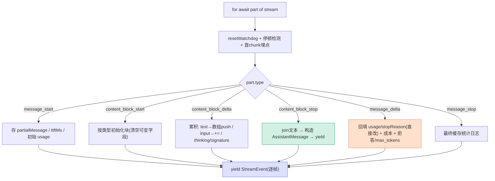

# [13] 流事件处理大循环（核心）

> 这是整个 queryModel 的**心脏**（`claude.ts:2322-2775`）：一个 `for await (const part of stream)` 循环，把 Anthropic 服务端推来的**原始 SSE 事件**逐个翻译成 Claude Code 的内部消息。`[0]` 说的"三类 yield"绝大多数在这里产出。

---

## 一、SSE 事件的总体结构

Anthropic 流式响应是一串有序事件，一次完整回复的事件序列大致是：

```
message_start                          ← 消息骨架（含初始 usage）
  content_block_start  (index 0)       ← 第 0 块开始（text/thinking/tool_use...）
    content_block_delta (index 0) ×N   ← 第 0 块的增量
  content_block_stop   (index 0)       ← 第 0 块完成 → 产出一条 AssistantMessage
  content_block_start  (index 1)
    content_block_delta (index 1) ×N
  content_block_stop   (index 1)
  ...
message_delta                          ← 最终 usage + stop_reason
message_stop                           ← 结束
```

循环的工作就是：**按 index 累积每个块的增量，块结束时产出完整消息，最后回填用量和停止原因**。

---

## 二、每个 chunk 的开场动作（2322-2362）

```typescript
for await (const part of stream) {
  resetStreamIdleTimer()                 // ← 重置看门狗（[12]）
  try { _apiRawSink?.(part) } catch {}   // 原始事件旁路（调试/录制）
  const now = Date.now()

  // 停顿检测（被动）
  if (lastEventTime !== null) {
    const timeSinceLastEvent = now - lastEventTime
    if (timeSinceLastEvent > STALL_THRESHOLD_MS) {   // 30s
      stallCount++; totalStallTime += timeSinceLastEvent
      logForDebugging(`Streaming stall detected: ...`, { level: 'warn' })
      logEvent('tengu_streaming_stall', { ... })
    }
  }
  lastEventTime = now

  if (isFirstChunk) {
    queryCheckpoint('query_first_chunk_received')
    if (!options.agentId) headlessProfilerCheckpoint('first_chunk')
    endQueryProfile()
    isFirstChunk = false
  }
  switch (part.type) { ... }
}
```

| 动作 | 说明 |
|---|---|
| `resetStreamIdleTimer()` | 收到数据就重置 `[12]` 的空闲倒计时 |
| **停顿检测** | 与看门狗不同：被动回看与上个事件的间隔，>30s 记一次 stall（**只记录不杀流**，见 `[12]` 对比表） |
| 首 chunk 埋点 | `query_first_chunk_received` + `endQueryProfile()`，标记 TTFB 结束 |

---

## 三、message_start（2365-2412）

```typescript
case 'message_start': {
  partialMessage = part.message       // 保存消息骨架
  ttftMs = Date.now() - start          // 首 token 时间
  usage = updateUsage(usage, part.message?.usage)
  // [Hapii][Cache] 大量缓存命中率日志（input/cacheRead/cacheCreate/hitRate）
  if (process.env.USER_TYPE === 'ant' && 'research' in part.message) {
    research = part.message.research   // 内部 research 字段
  }
  break
}
```

- 存下 `partialMessage`（后续每个 content_block_stop 都基于它构造消息）。
- 算出 `ttftMs`（Time To First Token）。
- 初始 `usage`（这里通常只有 input/cache 数据；output 在 message_delta 才有）。
- 本 fork 加了详尽的 **`[Hapii][Cache]` 缓存统计日志**：命中率、cache read/create、并解释"前缀太短/缓存关闭"等无缓存原因——是学习缓存行为的好窗口。

---

## 四、content_block_start：开块（2413-2473）

按块类型初始化 `contentBlocks[part.index]`，并把可变字段清空以便自己累积：

```typescript
case 'content_block_start':
  switch (part.content_block.type) {
    case 'tool_use':
      contentBlocks[part.index] = { ...part.content_block, input: '' }  // input 累积成字符串
      break
    case 'server_tool_use':
      contentBlocks[part.index] = { ...part.content_block, input: '' }
      if (part.content_block.name === 'advisor') {
        isAdvisorInProgress = true                    // advisor 开始 → 打点
        logEvent('tengu_advisor_tool_call', { ... })
      }
      break
    case 'text':
      textDeltas.set(part.index, [])                  // 文本用数组缓冲
      contentBlocks[part.index] = { ...part.content_block, text: '' }
      break
    case 'thinking':
      contentBlocks[part.index] = { ...part.content_block, thinking: '', signature: '' }
      break
    default:
      contentBlocks[part.index] = { ...part.content_block }
      if (part.content_block.type === 'advisor_tool_result') {
        isAdvisorInProgress = false                   // advisor 结果 → 结束
      }
      break
  }
  break
```

### ⭐ 为什么 `{ ...part.content_block }` 复制

注释吐槽 SDK "别扭"：*sdk 会一边工作一边修改 text 块的内容。我们希望这些块是不可变的，以便自己累积状态*。所以**复制一份**，把 `text`/`input`/`thinking` 清空，由 Claude Code 自己用 delta 累积，不受 SDK 内部改动影响。

`isAdvisorInProgress` 在 advisor server_tool_use 开始时置 true、结果到达时置 false——用于 `[15]` 用户中断时判断是否中断了 advisor 并打点。

---

## 五、content_block_delta：累积增量（2474-2592）

先处理 connector_text（feature gated），再按 `delta.type` 分发：

```typescript
case 'content_block_delta': {
  const contentBlock = contentBlocks[part.index]
  if (!contentBlock) { logEvent('tengu_streaming_error', ...); throw new RangeError('Content block not found') }

  if (feature('CONNECTOR_TEXT') && delta.type === 'connector_text_delta') {
    contentBlock.connector_text += delta.connector_text
  } else {
    switch (delta.type) {
      case 'citations_delta':  break  // TODO
      case 'input_json_delta':
        // 校验是 tool_use/server_tool_use 且 input 是 string，否则 throw
        contentBlock.input += delta.partial_json     // ★ 工具输入字符串累积
        break
      case 'text_delta':
        textDeltas.get(part.index)?.push(delta.text)  // ★ push 进数组，不 +=
        break
      case 'signature_delta':
        contentBlock.signature = delta.signature      // thinking/connector 签名
        break
      case 'thinking_delta':
        contentBlock.thinking += delta.thinking
        break
    }
  }
  break
}
```

### 5.1 ⭐ textDeltas 的 O(n) join 优化

文本增量**不直接 `+=`**，而是 `push` 进 `textDeltas.get(index)` 数组，到 content_block_stop 才 `join('')`。

| 做法 | 复杂度 | 原因 |
|---|---|---|
| `text += delta`（直觉） | **O(n²)** | 字符串不可变，每次 += 复制整串 |
| `array.push(delta)` + 最后 `join` | **O(n)** | 只在末尾追加，一次性拼 |

长回复成千上万个 delta，这个优化避免二次方级的字符串复制。注意：**工具输入 `input` 仍用 `+=`**（JSON 通常较短，且需边累积边校验类型），文本才用数组缓冲。

### 5.2 严格的类型校验

每种 delta 都校验 `contentBlock.type` 匹配（如 text_delta 必须落在 text 块上），不匹配就 `logEvent('tengu_streaming_error')` + throw。这是对**流损坏/协议错乱**的防御——宁可明确报错也不静默写错块。

---

## 六、content_block_stop：产出完整消息（2593-2645）

```typescript
case 'content_block_stop': {
  const contentBlock = contentBlocks[part.index]
  if (!contentBlock) throw new RangeError('Content block not found')
  if (!partialMessage) throw new Error('Message not found')

  // 把累积的 text deltas 合并（O(n) join）
  const deltas = textDeltas.get(part.index)
  if (deltas) { contentBlock.text = deltas.join(''); textDeltas.delete(part.index) }

  const m: AssistantMessage = {
    message: {
      ...partialMessage,
      usage: partialMessage.usage ?? { ...EMPTY_USAGE },
      content: normalizeContentFromAPI([contentBlock], tools, options.agentId),
    },
    requestId: streamRequestId ?? undefined,
    type: 'assistant',
    uuid: randomUUID(),
    timestamp: new Date().toISOString(),
    ...(USER_TYPE === 'ant' && research !== undefined && { research }),
    ...(advisorModel && { advisorModel }),
  }
  newMessages.push(m)
  yield m                                  // ★ 产出一条 AssistantMessage
  break
}
```

- 块结束 → 把文本数组 join 成最终 text。
- 用 `partialMessage` 骨架 + 这一个内容块，`normalizeContentFromAPI` 转回内部格式，构造一条 `AssistantMessage`。
- 推进 `newMessages` 并 `yield`——这是 `[0]` 三类 yield 里的 **AssistantMessage**，上层据此渲染/存档。
- **每个内容块产出一条独立消息**（一段 text 一条、一个 tool_use 一条），而不是等整条回复结束。

---

## 七、message_delta：回填用量与停止（2646-2729）

```typescript
case 'message_delta': {
  usage = updateUsage(usage, part.usage)
  if (USER_TYPE === 'ant' && 'research' in part) {
    research = part.research
    for (const msg of newMessages) msg.research = research   // 回写到已 yield 的消息
  }
  stopReason = part.delta.stop_reason

  const lastMsg = newMessages.at(-1)
  if (lastMsg) {
    lastMsg.message.usage = usage             // ★ 直接属性修改
    lastMsg.message.stop_reason = stopReason
  }

  // 成本累加
  const costUSDForPart = calculateUSDCost(resolvedModel, usage)   // ← 用 [2] 的 resolvedModel
  costUSD += addToTotalSessionCost(costUSDForPart, usage, options.model)

  // 拒答 / max_tokens / 上下文超限
  const refusalMessage = getErrorMessageIfRefusal(part.delta.stop_reason, options.model)
  if (refusalMessage) yield refusalMessage
  if (stopReason === 'max_tokens') { logEvent('tengu_max_tokens_reached', ...); yield createAssistantAPIErrorMessage({ ... }) }
  if (stopReason === 'model_context_window_exceeded') { ...; yield createAssistantAPIErrorMessage({ ... }) }
  break
}
```

### 7.1 为什么要回填到"已 yield 的消息"

消息是在 **content_block_stop** 时基于 `partialMessage` 创建的，而 `partialMessage` 来自 **message_start**（那时 `output_tokens: 0`、`stop_reason: null`）。真正的最终 usage 和 stop_reason 在 **message_delta** 才到——但消息**早就 yield 出去了**。所以这里要把最终值**回写**到最后一条已产出的消息上。

### 7.2 ⭐ 直接属性修改，不要对象替换

注释强调：

> *使用直接属性修改，而不是对象替换。transcript 写入队列持有 message.message 的引用，并以 100ms 的 flush 间隔懒序列化。对象替换（`{...lastMsg.message, usage}`）会让排队中的引用脱钩；直接修改能确保 transcript 拿到最终值。*

transcript（会话记录）队列**持有的是引用**，懒序列化。若用 `lastMsg.message = {...}` 替换对象，队列里的旧引用就指向不到新值了；`lastMsg.message.usage = usage` 原地改，引用始终有效。**引用语义的陷阱**。

### 7.3 三种停止原因处理

| stop_reason | 处理 |
|---|---|
| 拒答（refusal） | `getErrorMessageIfRefusal` → yield 错误消息 |
| `max_tokens` | 打点 + yield "超出输出上限"错误（提示设 `CLAUDE_CODE_MAX_OUTPUT_TOKENS`） |
| `model_context_window_exceeded` | 打点 + yield 错误（**复用 max_tokens 的恢复路径**——都是"被截断，请从上次继续"） |

成本计算用 `resolvedModel`（`[2]`），印证那里"算钱必须用真实模型"的结论。

---

## 八、message_stop（2730-2767）

```typescript
case 'message_stop': {
  // 计算最终缓存命中率，打印 [Hapii][Cache] FINAL CACHE SUMMARY
  // 仅日志，无状态变更
  break
}
```

只做**最终缓存统计日志**（总 input、命中率、首请求写缓存提示等）。本 fork 的学习增强，纯可观测性。

---

## 九、每个 chunk 末尾：yield StreamEvent（2770-2775）

```typescript
yield {
  type: 'stream_event',
  event: part,
  ...(part.type === 'message_start' ? { ttftMs } : undefined),
}
```

**switch 之后、循环每轮末尾**，无条件把原始事件包成 `StreamEvent` yield 出去——这是 `[0]` 三类 yield 里的 **StreamEvent**（逐帧信号，驱动实时 UI）。message_start 时额外附带 `ttftMs`。

所以同一段内容，上层会**两次**收到信息：逐 chunk 的 StreamEvent（实时渲染）+ 块结束的 AssistantMessage（结构化结果）——正是 `[0]` "逐帧 vs 完整片段"的类比。

---

## 十、事件流转全景



---

## 十一、关键行号书签

| 内容 | 位置 |
|---|---|
| `for await` 循环 + 重置看门狗 | `claude.ts:2322-2323` |
| 停顿检测（stall） | `claude.ts:2330-2351` |
| 首 chunk 埋点 | `claude.ts:2354-2362` |
| message_start | `claude.ts:2365-2412` |
| content_block_start（各类型） | `claude.ts:2413-2473` |
| content_block_delta（各 delta） | `claude.ts:2474-2592` |
| input_json 累积 / text push | `claude.ts:2533 / 2547` |
| content_block_stop（产出消息） | `claude.ts:2593-2645` |
| textDeltas join | `claude.ts:2619-2623` |
| message_delta（回填/成本/停止） | `claude.ts:2646-2729` |
| 直接属性修改注释 | `claude.ts:2671-2680` |
| message_stop（缓存统计） | `claude.ts:2730-2767` |
| yield StreamEvent | `claude.ts:2770-2774` |

---

## 速记口诀

- **六类事件**：start(骨架) → block_start(开块) → block_delta(累积) → block_stop(产出消息) → message_delta(回填用量/停止) → message_stop(缓存日志)。
- **两次给上层**：每块结束 yield AssistantMessage（完整），每 chunk yield StreamEvent（逐帧）。
- **文本 O(n)**：text_delta push 进数组、最后 join；工具 input 才 `+=`。
- **复制再累积**：block_start 复制 SDK 块并清空可变字段，自己掌控累积。
- **回填用直接改**：message_delta 的最终 usage/stop_reason 原地改属性，别替换对象（transcript 持引用）。
- **算钱用 resolvedModel**：成本计算用 [2] 解析的真实模型。
