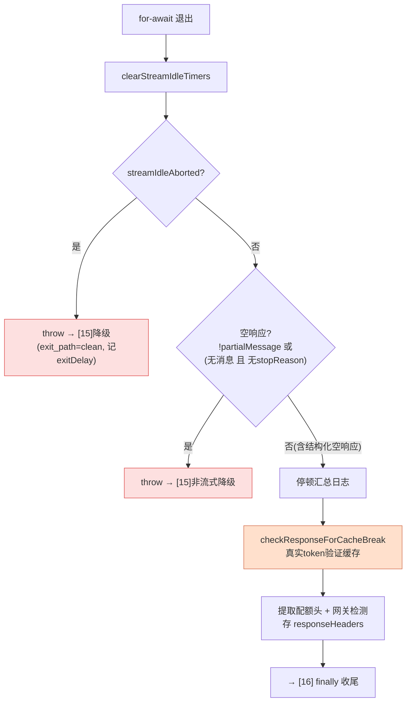

# [14] 流结束后的校验与配额提取

> `[13]` 的 `for await` 循环正常退出后，并不能直接认为"成功了"。这一段（`claude.ts:2776-2882`）做一系列**事后校验**：看门狗是不是开过火？流是不是空响应？缓存有没有被打破？配额还剩多少？这些检查决定是"顺利收尾"还是"throw 出去交给 `[15]` 降级"。

---

## 一、清理看门狗（2776-2777）

```typescript
// 流循环已退出，清理空闲超时看门狗
clearStreamIdleTimers()
```

循环退出第一件事就是停掉 `[12]` 的定时器——流都结束了，看门狗没必要再倒计时（否则会误开火 + 泄漏定时器）。

---

## 二、看门狗 abort → 转成可降级的 throw（2779-2806）

```typescript
if (streamIdleAborted) {
  const exitDelayMs = streamWatchdogFiredAt !== null
    ? Math.round(performance.now() - streamWatchdogFiredAt) : -1
  logForDiagnosticsNoPII('info', 'cli_stream_loop_exited_after_watchdog_clean')
  logEvent('tengu_stream_loop_exited_after_watchdog', {
    request_id, exit_delay_ms: exitDelayMs, exit_path: 'clean', model,
  })
  streamWatchdogFiredAt = null    // 防止 catch 里重复 emit
  throw new Error('Stream idle timeout - no chunks received')
}
```

### 2.1 为什么循环"干净退出"还要 throw

`[12]` 的看门狗超时回调调了 `releaseStreamResources()` 取消流，导致 `for await` **正常退出**（不是抛错退出）。但语义上这是个**失败**——流卡死被强杀了。所以这里检测 `streamIdleAborted` 标志，**主动 throw** 一个 Error，把"看似正常的退出"转回"错误"，好让 `[15]` 的 catch 接住并走非流式降级。

### 2.2 exitDelayMs：看门狗有效性遥测

呼应 `[12]`：用 `streamWatchdogFiredAt` 算出"从看门狗开火到循环退出"的延迟。

| exitDelayMs | 含义 |
|---|---|
| 0-10ms | abort 立即生效，看门狗工作正常 |
| 远超 1000ms | 是别的东西唤醒了循环，而非 abort |

`exit_path: 'clean'` 标记这是"干净退出"路径（对应 `[15]` catch 里的 `exit_path: 'error'`）。`streamWatchdogFiredAt = null` 是**防重复打点**——避免接下来 catch 块又记一次。

---

## 三、空响应检测 → 非流式降级（2808-2834）

```typescript
if (!partialMessage || (newMessages.length === 0 && !stopReason)) {
  logForDebugging(!partialMessage
    ? 'Stream completed without receiving message_start event - triggering non-streaming fallback'
    : 'Stream completed with message_start but no content blocks completed - triggering non-streaming fallback',
    { level: 'error' })
  logEvent('tengu_stream_no_events', { model, request_id })
  throw new Error('Stream ended without receiving any events')
}
```

### 3.1 两种代理失败模式

某些**网关/代理**会返回 200，但流内容是坏的。注释列了两种：

| 模式 | 判定 | 含义 |
|---|---|---|
| **完全无事件** | `!partialMessage` | 代理返回 200，但响应体根本不是 SSE（没收到 message_start） |
| **部分事件** | `newMessages.length === 0 && !stopReason` | 收到 message_start，但流在任何 content_block_stop 和带 stop_reason 的 message_delta 之前就断了 |

两种都 throw `'Stream ended without receiving any events'` → `[15]` 非流式降级。

注释补充：`BetaMessageStream` 的 `_endRequest()` 内置了第一项检查，但**原始 Stream（`[11]` 选用）没有**——所以这里手动补上，否则生成器会**静默不返回任何 assistant 消息**，在 `-p` 模式下导致 "Execution error"。

### 3.2 ⭐ 为什么要检查 `stopReason` 避免误报

注释强调：

> *必须检查 stopReason 以避免误报。例如使用结构化输出（--json-schema）时，模型会在第 1 轮调用 StructuredOutput 工具，然后在第 2 轮以 end_turn 回应且没有内容块。这是合法的空响应，不是不完整的流。*

结构化输出场景：第 2 轮可能**合法地**没有内容块（`newMessages.length === 0`），但**有 `stopReason`（end_turn）**。所以判定加了 `&& !stopReason`——**有停止原因 = 流正常结束了**，哪怕没内容块也不算失败。漏了这个条件会把合法空响应误判成代理故障。

---

## 四、停顿汇总日志（2836-2850）

```typescript
if (stallCount > 0) {
  logForDebugging(`Streaming completed with ${stallCount} stall(s), total stall time: ...`, { level: 'warn' })
  logEvent('tengu_streaming_stall_summary', { stall_count, total_stall_time_ms, model, request_id })
}
```

把 `[13]` 累积的停顿次数/总时长汇总上报。注意：**停顿不影响成功**——流虽然慢但完整收到了，只是记一笔供分析连接质量。

---

## 五、缓存打破验证（2852-2862）

```typescript
if (feature('PROMPT_CACHE_BREAK_DETECTION')) {
  void checkResponseForCacheBreak(
    options.querySource,
    usage.cache_read_input_tokens,
    usage.cache_creation_input_tokens,
    messages,
    options.agentId,
    streamRequestId,
  )
}
```

呼应 `[9]` 的 `recordPromptState`：那里记录了"预期的缓存状态"，这里用**真实响应的 token**（`cache_read` / `cache_creation`）来**验证缓存是否真的命中**。

| 预期 vs 实际 | 结论 |
|---|---|
| 预期命中，但 `cache_read=0` | 缓存**被打破了**——上报，便于定位是哪个因素变了 |
| 预期命中，`cache_read>0` | 缓存正常工作 |

`recordPromptState`（事前快照）+ `checkResponseForCacheBreak`（事后验证）构成完整的**缓存可观测性闭环**。`void` 表示触发即忘，不阻塞。

---

## 六、配额状态与网关检测（2864-2882）

```typescript
const resp = streamResponse as Response | undefined   // [11] 设置的
if (resp) {
  extractQuotaStatusFromHeaders(resp.headers)         // 提取配额/限流状态
  if (getAPIProvider() === 'bedrock') {
    updateProviderBuckets('bedrock', bedrockAdapter.parseHeaders(resp.headers))  // Bedrock 自己的限流桶
  }
  responseHeaders = resp.headers                       // 存起来供成功日志（[16]）网关检测
}
```

- `extractQuotaStatusFromHeaders`：从响应头读出**配额/限流状态**（剩余额度、是否超量等），更新本地状态——驱动 UI 提示和限流退避。Anthropic 适配在其内部完成。
- **Bedrock 特判**：走同一客户端路径但有自己的限流头，用 `bedrockAdapter.parseHeaders` 解析后 `updateProviderBuckets` 覆盖到自己的 bucket。
- `responseHeaders` 存入外层变量，供 `[16]` 的 `logAPISuccessAndDuration` 做**网关检测**（识别请求经过了什么中间网关）。

---

## 七、本段决策流



---

## 八、关键行号书签

| 内容 | 位置 |
|---|---|
| `clearStreamIdleTimers` | `claude.ts:2777` |
| 看门狗 abort → throw | `claude.ts:2781-2806` |
| exitDelayMs 计算 | `claude.ts:2785-2788` |
| 空响应检测 → throw | `claude.ts:2820-2834` |
| 两种失败模式注释 | `claude.ts:2808-2819` |
| 结构化输出 stopReason 例外 | `claude.ts:2817-2819` |
| 停顿汇总 | `claude.ts:2837-2850` |
| `checkResponseForCacheBreak` | `claude.ts:2853-2862` |
| 配额头提取 + Bedrock | `claude.ts:2868-2882` |

---

## 速记口诀

- **正常退出 ≠ 成功**：先一连串校验才算数。
- **看门狗 abort 要补 throw**：杀流导致循环"干净退出"，主动 throw 转回错误交给 [15]，并记 exitDelay 证明 abort 有效。
- **两种空响应**：无 message_start / 有骨架无内容块 → 都降级；但**有 stopReason 的空响应是合法的**（结构化输出），别误报。
- **缓存验证闭环**：[9] recordPromptState 事前 + 本段 checkResponseForCacheBreak 事后（看真实 cache_read token）。
- **配额头**：提取限流状态 + Bedrock 自己的桶 + 存 responseHeaders 供 [16] 网关检测。
