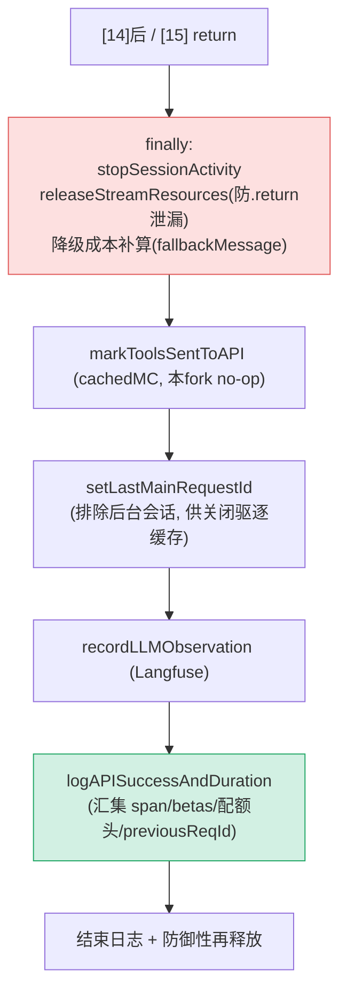

# [16] finally 资源释放与收尾

> 走到这里，请求要么成功收完流（`[14]` 后），要么在 `[15]` 已 return。这一段（`claude.ts:3291-3403`）是 queryModel 的**收尾**：`finally` 保证资源释放与降级成本结算，之后做缓存维护、Langfuse 观测、成功日志。它把 `[0]` 的**内存防漏**和**闭包防 pin** 两条暗线收口。

---

## 一、finally 块（3291-3318）

```typescript
} finally {
  stopSessionActivity('api_call')

  // 必须放在 finally：生成器可能被 .return() 提前终止
  // （消费者跳出 for-await，或 query.ts 遇到中止），try/finally 之后的代码永不执行。
  releaseStreamResources()

  // 非流式降级的成本：流式路径在 message_delta 里就跟踪了成本；
  // 降级路径是先 push 再 yield，因此跟踪必须放在这里，才能在 .return() 中存活。
  if (fallbackMessage) {
    const fallbackUsage = fallbackMessage.message.usage as BetaMessageDeltaUsage
    usage = updateUsage(EMPTY_USAGE, fallbackUsage)
    stopReason = fallbackMessage.message.stop_reason as BetaStopReason
    const fallbackCost = calculateUSDCost(resolvedModel, fallbackUsage)  // ← resolvedModel([2])
    costUSD += addToTotalSessionCost(fallbackCost, fallbackUsage, options.model)
  }
}
```

### 1.1 ⭐ 为什么释放资源必须在 finally

这是 `[0]` 内存防漏暗线的核心收口。注释：

> *如果生成器被提前通过 `.return()` 终止（例如消费者跳出 for-await-of，或 query.ts 遇到中止），try/finally 之后的代码永远不会执行。不这样做的话，Response 对象的本地 TLS/socket 缓冲区会一直泄漏，直到生成器本身被 GC 回收（GH #32920）。*

生成器的特殊性：消费者 `break` 出 `for await`，或调 `.return()`，会让生成器**在 yield 处直接终止**——函数体后续代码（finally 之外的）**不执行**。只有 `finally` 保证一定跑。所以 `releaseStreamResources()` 放 finally 是**唯一可靠**的释放点。

### 1.2 ⭐ 为什么降级成本必须在 finally 算

注释点破流式与降级两条路径的成本跟踪**时机不同**：

| 路径 | 成本何时算 | 原因 |
|---|---|---|
| 流式（正常） | `[13]` message_delta 处理器里（yield 之前） | 那时还在循环内，安全 |
| 非流式降级 | **finally 里**（本段） | 降级是"先 push 再 yield m"，若消费者在那个 yield 处 `.return()`，yield 之后的代码不执行 |

降级消息（`fallbackMessage`）是在 `[15]` "先 push 到 newMessages 再 yield" 的——如果成本跟踪写在 yield 之后，一旦 `.return()` 就丢了。放 finally 才能**在提前终止中存活**。同样用 `resolvedModel`（`[2]`）算钱。

### 1.3 stopSessionActivity

```typescript
stopSessionActivity('api_call')
```

与 `[12]` 的 `startSessionActivity('api_call')` 成对，标记 API 调用结束。

---

## 二、cachedMC：标记工具已发送（3320-3323）

```typescript
if (feature('CACHED_MICROCOMPACT') && cachedMCEnabled) {
  markToolsSentToAPIState()
}
```

呼应 `[5]`：cached microcompact 启用时，把"已注册的工具标记为已发送给 API"，使它们**具备被（缓存编辑）删除的资格**。本 fork 中 `cachedMCEnabled` 恒为 false（`[5]` 1.4），所以这段实际不执行。

---

## 三、记录主会话最后 request ID（3325-3336）

```typescript
if (
  streamRequestId &&
  !getAgentContext() &&
  (options.querySource.startsWith('repl_main_thread') || options.querySource === 'sdk')
) {
  setLastMainRequestId(streamRequestId)
}
```

### 用途：关闭时驱逐缓存

记录主会话链的最后一个 request ID，**以便关闭时向推理层发送缓存驱逐提示**（告诉服务端"这条链结束了，可以释放它的 KV 缓存"）。

### ⭐ 为什么排除后台会话

注释：

> *排除后台会话（Ctrl+B）——它们共享 repl_main_thread querySource，但运行在 agent 上下文里——它们是独立的会话链，当前台会话 clear 时不应驱逐它们的缓存。*

后台会话也用 `repl_main_thread` 这个 querySource，但它跑在 **agent 上下文**里（`getAgentContext()` 非空）。它们是**独立的链**——若把它们的 request ID 当成"主会话最后 ID"，那前台 `/clear` 时会误驱逐后台会话的缓存。所以加 `!getAgentContext()` 把后台排除。

| querySource | getAgentContext() | 记为主会话最后 ID？ |
|---|---|---|
| repl_main_thread（前台） | 空 | ✅ |
| repl_main_thread（Ctrl+B 后台） | 非空 | ❌ 排除 |
| sdk | 空 | ✅ |
| 其他（agent/compact...) | — | ❌ |

---

## 四、Langfuse 观测（3338-3360）

```typescript
// 预算标量，避免 .then() 闭包 pin 住整个 messagesForAPI 数组
const logMessageCount = messagesForAPI.length
const logMessageTokens = tokenCountFromLastAPIResponse(messagesForAPI)

recordLLMObservation(options.langfuseTrace ?? null, {
  model: resolvedModel,
  provider: getAPIProvider(),
  input: convertMessagesToLangfuse(messagesForAPI, systemPrompt),
  output: convertOutputToLangfuse(newMessages),
  usage: { input_tokens, output_tokens, cache_creation_input_tokens, cache_read_input_tokens },
  startTime: new Date(startIncludingRetries),
  endTime: new Date(),
  completionStartTime: ttftMs > 0 ? new Date(start + ttftMs) : undefined,
  tools: convertToolsToLangfuse(toolSchemas),
  thinking: langfuseThinking,        // ← [10] 捕获的
})
```

向 **Langfuse**（LLM 可观测性平台）上报本次调用的完整观测：输入/输出消息、用量、起止时间、首 token 时间、工具、thinking 配置。未配置 Langfuse 时为 no-op。`langfuseThinking` 来自 `[10]` 的标量预算块。

注意开头又一次出现**预算标量防 pin**（`[0]` 暗线）——把 `logMessageCount`/`logMessageTokens` 先算成原始值。

---

## 五、成功日志（3362-3395）

```typescript
void options.getToolPermissionContext().then(permissionContext => {
  logAPISuccessAndDuration({
    model: newMessages[0]?.message.model ?? partialMessage?.model ?? options.model,
    preNormalizedModel: options.model,
    usage, start, startIncludingRetries, attempt: attemptNumber,
    messageCount: logMessageCount, messageTokens: logMessageTokens,
    requestId: streamRequestId ?? null, stopReason, ttftMs, didFallBackToNonStreaming,
    querySource: options.querySource, headers: responseHeaders,  // ← [14] 存的，网关检测
    costUSD, permissionMode: permissionContext.mode,
    newMessages,                  // beta tracing 时才在 logging.ts 提取
    llmSpan,                       // ← [9] 的 span，结束追踪
    globalCacheStrategy,           // ← [5]
    requestSetupMs: start - startIncludingRetries,
    attemptStartTimes, fastMode: isFastModeRequest,
    previousRequestId,             // ← [2] 串链
    betas: lastRequestBetas,       // ← [10] 实际发送的 betas
  })
})
```

异步打**成功 + 耗时日志**，汇集了贯穿全函数的各路信息：

| 字段 | 来源 |
|---|---|
| `headers: responseHeaders` | `[14]` 配额头（网关检测） |
| `llmSpan` | `[9]` 追踪 span（在此结束） |
| `globalCacheStrategy` | `[5]` 缓存策略 |
| `previousRequestId` | `[2]` 请求链 |
| `betas: lastRequestBetas` | `[10]` 实际发送的 beta |
| `requestSetupMs` | `start - startIncludingRetries`（含重试的建立耗时） |

模型字段用 `newMessages[0]?.message.model ?? partialMessage?.model ?? options.model` 三级兜底——优先用响应里的真实模型。这里同样用 `getToolPermissionContext().then()` 异步取权限上下文，靠前面的标量预算避免 pin。

---

## 六、防御性结尾（3397-3402）

```typescript
logForDebugging(`------------ queryModel 结束 --------- model=... stopReason=... usage.in=... out=...`, { level: 'info' })
releaseStreamResources()    // 防御性：正常完成也释放一次（finally 已执行则 no-op）
```

打结束日志，再 `releaseStreamResources()` 一次。注释：*正常完成时也释放一次（如果 finally 已执行则为 no-op）*。多释放无害（函数内有空值守卫），但**漏释放有害**——所以宁可多调一次。至此 queryModel 全部结束。

---

## 七、收尾全景



---

## 八、关键行号书签

| 内容 | 位置 |
|---|---|
| finally 开始 | `claude.ts:3291` |
| `stopSessionActivity` | `claude.ts:3292` |
| `releaseStreamResources`（finally 内） | `claude.ts:3298` |
| 降级成本补算 | `claude.ts:3303-3317` |
| `markToolsSentToAPIState` | `claude.ts:3321-3323` |
| `setLastMainRequestId`（排除后台） | `claude.ts:3329-3336` |
| 预算标量 | `claude.ts:3340-3341` |
| `recordLLMObservation`（Langfuse） | `claude.ts:3344-3360` |
| `logAPISuccessAndDuration` | `claude.ts:3362-3395` |
| 结束日志 + 防御性释放 | `claude.ts:3398-3402` |

---

## 速记口诀

- **finally 是唯一可靠释放点**：生成器被 `.return()` 提前终止时只有 finally 跑，否则 Response 的 TLS/socket 缓冲泄漏（GH #32920）。
- **降级成本放 finally**：流式成本在 message_delta 算；降级"先 push 再 yield"，成本必须在 finally 才能在 `.return()` 中存活。
- **lastMainRequestId 排除后台会话**：后台共享 repl_main_thread 但有 agent 上下文，前台 /clear 不该驱逐它的缓存。
- **收尾汇集全程信息**：成功日志把 span([9])、betas([10])、配额头([14])、previousRequestId([2])、缓存策略([5]) 一网打尽。
- **再次预算标量防 pin**：`.then()` 只捕获标量，别 pin 住 messagesForAPI。
- **防御性再释放一次**：多调无害（有守卫），漏调有害。
