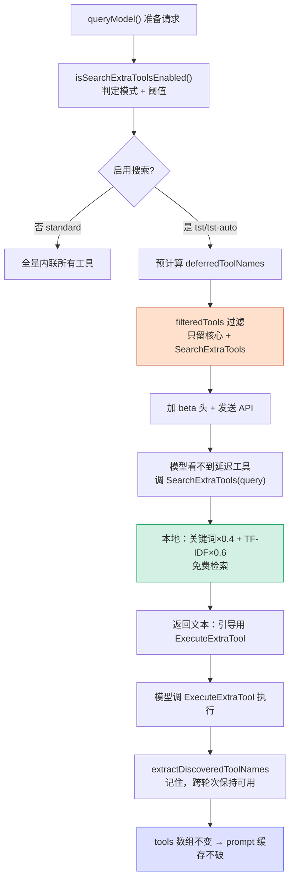

# 工具搜索（SearchExtraTools）深度学习

> 本文聚焦 `queryModel()` 在真正调用 Anthropic API **之前**的一段"工具处理"逻辑。它解决一个核心矛盾：**工具越来越多（尤其几十个 MCP 工具），但不是每次请求都值得把它们全发给模型**。这套机制叫 **SearchExtraTools（工具搜索 / 工具延迟加载）**，目标是 **省 token + 保住 prompt 缓存**。
>
> 涉及三个文件：
> - `src/services/api/claude.ts`（决策与过滤，约 1417–1480 行）
> - `src/utils/searchExtraTools.ts`（模式判定、阈值计算、跨轮次发现）
> - `src/services/searchExtraTools/toolIndex.ts`（TF-IDF 索引与检索）
> - `packages/builtin-tools/src/tools/SearchExtraToolsTool/SearchExtraToolsTool.ts`（工具本体）

---

## 一、为什么请求前要"处理工具"

### 1.1 问题：工具定义很贵

每个工具发给 Claude API 时，都要携带 **名称 + 描述 + 输入参数 JSON Schema**。单个工具定义通常 **几百到上千 token**。

当你接入多个 MCP 服务器（Gmail、Google Calendar、Google Drive……），延迟工具轻松达到 40+ 个：

| 维度 | 全量内联的代价 |
|---|---|
| **上下文窗口** | 40 工具 × ~500 token ≈ **20000 token**，对话还没开始就被占掉 |
| **每轮计费** | 工具定义算 input token，**每一轮请求都重复付费** |
| **模型分心** | 40 个工具里 38 个与当前任务无关，干扰决策质量 |

### 1.2 解决方案：核心工具常驻，其余按需发现

代码把工具分两类（定义在 `src/constants/tools.ts` 的 `CORE_TOOLS`）：

| 类别 | 数量 | 处理方式 |
|---|---|---|
| **核心工具** CORE_TOOLS | ~30 个 | 永远内联，每次请求都带完整 schema |
| **延迟工具** Deferred | 其余全部 + 所有 MCP 工具 | 默认不发，模型看不见，需用 `SearchExtraTools` 搜出来 |

`isDeferredTool(tool)` 的判定规则极简：**不在 `CORE_TOOLS` 白名单里 = 延迟工具**。

> **类比**：图书馆书架上只摆常用书（核心工具），其余几万册放书库（延迟工具）。`SearchExtraTools` 是检索终端——输关键词，它告诉你"书在 X 区"，再用 `ExecuteExtraTool` 去取。

---

## 二、claude.ts 中的决策与过滤逐段拆解

完整逻辑位于 `queryModel()` 内，约 `claude.ts:1417–1480`。

### 2.1 第 ① 步：决定要不要启用（1417）

```typescript
let useSearchExtraTools = await isSearchExtraToolsEnabled(
  options.model,
  tools,
  options.getToolPermissionContext,
  options.agents,
  'query',
)
```

这是**最终确定性检查**。内部调 `getSearchExtraToolsMode()` 得到三种模式之一（见第三章），并做三道门：
1. `SearchExtraTools` 工具本身是否可用（可能被 `disallowedTools` 禁用）
2. 当前模式（`tst` / `tst-auto` / `standard`）
3. `tst-auto` 模式下，延迟工具总量是否**超过阈值**

### 2.2 第 ② 步：预计算延迟工具名单（1427–1431）

```typescript
const deferredToolNames = new Set<string>()
if (useSearchExtraTools) {
  for (const t of tools) {
    if (isDeferredTool(t)) deferredToolNames.add(t.name)
  }
}
```

**性能动机（关键）**：`isDeferredTool` 每次调用要查 2 次 GrowthBook（特性开关系统）。这里一次性算好、缓存进 `Set`，避免后面 `filter` 里反复查询。

### 2.3 第 ③ 步：没必要就关掉（1436–1445）

```typescript
if (
  useSearchExtraTools &&
  deferredToolNames.size === 0 &&
  !options.hasPendingMcpServers
) {
  useSearchExtraTools = false
}
```

如果根本没有延迟工具（全是核心工具），且没有 MCP 服务器还在连接中 → 搜索毫无意义，直接关。

> `hasPendingMcpServers` 的存在很重要：MCP 服务器异步握手，工具列表可能还没到。这种情况下**保留**搜索能力，等服务器连上后模型还能发现新工具。

### 2.4 第 ④ 步：核心过滤动作（1452–1467）

```typescript
let filteredTools: Tools
if (useSearchExtraTools) {
  filteredTools = tools.filter(tool => {
    // 非延迟工具（核心工具）始终包含
    if (!deferredToolNames.has(tool.name)) return true
    // SearchExtraToolsTool 始终包含（以便它能发现更多工具）
    if (toolMatchesName(tool, SEARCH_EXTRA_TOOLS_TOOL_NAME)) return true
    // 其他延迟工具全部排除 —— 改用 ExecuteExtraTool
    return false
  })
} else {
  // 关闭搜索：剔除 SearchExtraTools 本身，其余全部内联
  filteredTools = tools.filter(
    t => !toolMatchesName(t, SEARCH_EXTRA_TOOLS_TOOL_NAME),
  )
}
```

这是整段的**核心动作**：从发给 API 的 `tools` 数组里剔除所有未发现的延迟工具，只留 **核心工具 + `SearchExtraTools`**。

<Callout>
**保护 prompt 缓存的精髓**：注释明确写道"保持 tools 数组稳定可以跨轮次保留 prompt 缓存"。Anthropic 的 prompt 缓存按**前缀精确匹配**，tools 数组的 JSON 一变，缓存就失效、要重新付全价。所以**已发现的工具绝不被塞回 tools 数组**（那样会让 JSON 膨胀），而是通过 `ExecuteExtraTool` 在运行时从全局注册表里查出来执行。
</Callout>

### 2.5 第 ⑤ 步：加 beta 头（1473–1479）

```typescript
const toolSearchHeader = useSearchExtraTools ? getToolSearchBetaHeader() : null
if (toolSearchHeader && getAPIProvider() !== 'bedrock') {
  if (!betas.includes(toolSearchHeader)) {
    betas.push(toolSearchHeader)
  }
}
```

给请求加 beta 标记（bedrock 除外——AWS 网关不认这个头）。

### 2.6 第 ⑥ 步：确认 API tools 数组（1559–1562）

```typescript
if (useSearchExtraTools) {
  logForDebugging(
    `Dynamic tool loading: 0/${deferredToolNames.size} deferred tools in API tools array (all via ExecuteExtraTool)`,
  )
}
```

日志确认：**API tools 数组里延迟工具数永远是 0**，全部走 `ExecuteExtraTool`。

---

## 三、三种工具搜索模式

模式由 `getSearchExtraToolsMode()`（`searchExtraTools.ts:169`）根据环境变量 `ENABLE_SEARCH_EXTRA_TOOLS` 决定。

### 3.1 全景对照

| 模式 | 非核心工具怎么处理 | 触发它的值 |
|---|---|---|
| **`tst`** | 全部延迟，只发核心 + SearchExtraTools | `true`、`auto:0`、不设置（默认） |
| **`tst-auto`** | 按 token 量动态决定，超阈值才延迟 | `auto`、`auto:1`~`auto:99` |
| **`standard`** | 全部内联，禁用搜索 | `false`、`auto:100`、`CLAUDE_CODE_DISABLE_EXPERIMENTAL_BETAS=1` |

### 3.2 `tst` —— "永远懒加载"（默认）

`tst` = **T**ool **S**earch **T**ool。不管装了多少工具，非核心工具一律延迟。这是 Claude Code 的默认行为（注释：`default: always defer non-core tools`）。

### 3.3 `tst-auto` —— "够多了才懒加载"

先用 token 计数 API 算一遍所有延迟工具总大小（`checkAutoThreshold`），只有大到值得省才开启延迟：

```
延迟工具总 token >= 上下文窗口 × N%   →  启用 tst（延迟）
否则                                  →  退回全量内联
```

`N` 就是 `auto:N` 的数字，默认 **10%**。例如 200k 窗口 + `auto:10`，阈值 = 20000 token：
- 延迟工具 25000 token → 超过 → 走延迟
- 延迟工具 8000 token → 没超 → 全量内联（搜索那点开销不划算）

> **为什么需要它**：搜索本身有成本（占工具位、跑检索、多一轮往返）。工具就两三个时，全量内联反而更简单更快。`tst-auto` 是自适应折中。

### 3.4 `standard` —— "别给我搞那套"

完全关闭工具搜索，所有工具全量内联。适合工具不多、想简单直接，或调试时绕过搜索定位问题。

### 3.5 `auto:0` 与 `auto:100` 为何是特例

代码故意提前拦截这两个边界值：

```typescript
if (autoPercent === 0) return 'tst'        // 阈值 0%，任何工具量都"超过" = 始终启用
if (autoPercent === 100) return 'standard' // 阈值 100%，永远"达不到" = 关闭
if (isAutoSearchExtraToolsMode(value)) return 'tst-auto'
```

与其让 `tst-auto` 分支去算一个必然的结果，不如直接折叠成确定的模式——更快、语义也更清晰。

### 3.6 完整决策流程

```
getSearchExtraToolsMode()
│
├─ CLAUDE_CODE_DISABLE_EXPERIMENTAL_BETAS=1?  ─→ standard
├─ 值 = auto:0?                               ─→ tst
├─ 值 = auto:100?                             ─→ standard
├─ 值 = auto / auto:1~99?                     ─→ tst-auto
├─ 值 = true?                                 ─→ tst
├─ 值 = false?                                ─→ standard
└─ 未设置（默认）                             ─→ tst
```

---

## 四、SearchExtraTools 检索器：三条处理路径

工具本体在 `SearchExtraToolsTool.ts` 的 `call()`（约 349 行），根据 `query` 格式分三路。

### 4.1 路径一：`select:` 前缀 —— 直接选定（不搜索）

```
query = "select:WebFetch,WebSearch"
```

模型**已经知道**工具名（例如压缩后从历史里看到过），直接点名。代码只做名称匹配，把工具标记为"已发现/已解锁"，**不跑任何检索算法**。支持逗号分隔多选。

特殊处理：若名称已是核心工具（不在延迟集合但在完整工具集），仍返回它并标记为 `already_loaded`——"选择"它是无害 no-op，让模型无需重试即可继续。

### 4.2 路径二：`discover:` 前缀 —— 纯探查（只看不解锁）

```
query = "discover:calendar"
```

返回匹配工具的 **名称 + 描述 + schema 文本**，但**不真正解锁**。用于模型想"先看看有什么"而不承诺调用。

### 4.3 路径三：普通关键词 —— 混合检索（主力路径）

```
query = "send an email"
```

**并行**跑两套独立算法，再加权融合：

```typescript
const [keywordMatches, index] = await Promise.all([
  searchToolsWithKeywords(query, deferredTools, tools, max_results), // 算法 A
  getToolIndex(deferredTools),                                       // 构建/取缓存索引
])
const tfIdfResults = searchTools(query, index, max_results)          // 算法 B

// 融合：关键词 × 0.4 + TF-IDF × 0.6
mergedScores = keyword * KEYWORD_WEIGHT + tfidf * TFIDF_WEIGHT
```

---

## 五、两套检索算法详解

### 5.1 算法 A：关键词搜索（`searchToolsWithKeywords`）

基于**字面匹配 + 人工权重**，很工程化：

| 匹配位置 | 得分 | 说明 |
|---|---|---|
| 工具名精确部分（MCP） | **12** | `mcp__Gmail__send` 命中 "gmail" |
| 工具名精确部分（普通） | 10 | |
| 工具名部分包含 | 5~6 | |
| `searchHint` 命中 | **4** | 人工精选的能力短语，信号强 |
| 描述命中（词边界） | 2 | |

还支持 `+` 前缀强制必需词（`+slack send` = 必须含 slack）。擅长**精确命中服务器名 / 动词**。

### 5.2 算法 B：TF-IDF 语义搜索（`toolIndex.ts` 的 `searchTools`）

经典信息检索，把每个工具变成**向量**算余弦相似度：

```
1. 工具字段加权：名称 × 3.0、searchHint × 2.5、描述 × 1.0
   → 分词、加权得到 tf 向量（TOOL_FIELD_WEIGHT）
2. computeIdf：稀有词权重高（出现在所有工具里的词没区分度）
3. cosineSimilarity：查询向量 vs 每个工具向量，算夹角余弦
4. 分数 >= 0.10（SEARCH_EXTRA_TOOLS_DISPLAY_MIN_SCORE）才入选
```

擅长**语义 / 模糊匹配**——搜 "schedule a meeting"，即使工具名没这几个词，描述相关也能命中。

两个特殊处理：
- **CJK（中日韩）**：中文 bigram 至少匹配 2 个才算（`CJK_MIN_BIGRAM_MATCHES`），避免单字误命中
- **全名直接命中**：查询包含完整规范化工具名，分数直接拉到 0.75

### 5.3 为什么要双算法融合

关键词搜索**精确但脆**（没字面词就 0 分），TF-IDF **宽容但模糊**。`0.4 / 0.6` 加权让二者互补：精确命中排前面，语义相关的也不漏。

### 5.4 索引缓存

`getToolIndex()` 以"延迟工具名排序拼接"为缓存键（`cachedToolNames`）。工具列表不变就**直接返回缓存索引，不重建**——MCP 服务器连接/断开导致工具变化时才失效重建。

---

## 六、返回结果：引导模型用 ExecuteExtraTool

`mapToolResultToToolResultBlockParam`（约 540 行）把结果转成给模型看的**文本**，而非塞工具 schema。它区分两种情况：

| 情况 | 返回文本（要点） |
|---|---|
| 命中**已是核心工具** | "…已作为核心工具加载——请**直接调用**，不要用 ExecuteExtraTool" |
| 命中**延迟工具** | "找到 N 个延迟工具：X, Y。请使用 **ExecuteExtraTool** 调用" |
| 无匹配但有 MCP 在连 | "部分 MCP 服务器仍在连接中：…，请稍后再次搜索" |

这就是为什么模型搜完后下一步是调 `ExecuteExtraTool`，而不是工具突然出现在工具列表里。

---

## 七、跨轮次工具发现与压缩

### 7.1 extractDiscoveredToolNames（searchExtraTools.ts:487）

模型搜到工具后，后续每一轮怎么"记得"它可用？靠 `extractDiscoveredToolNames` 扫描消息历史，从中重建已发现工具集合。它识别三种来源：

| 来源 | 说明 |
|---|---|
| **压缩边界** `compact_boundary` | 携带 `preCompactDiscoveredTools` 快照（压缩会删历史，必须把发现集存进边界标记） |
| **deferred_tools_delta 附件** | 声明模型应视为可用的工具（`addedNames`） |
| **tool_result 文本** | 从 `SearchExtraTools` 输出 "Found N deferred tool(s): …" 解析工具名 |

### 7.2 与 claude.ts 过滤器的配合

`claude.ts` 第 ④ 步过滤时，会保留这些"已发现"工具的 schema。这样模型跨轮次始终能调用它们，**同时 tools 数组的稳定结构不被破坏**（已发现工具不膨胀 JSON）。

---

## 八、⭐ token 消耗精算

这是整套设计的核心：**搜索算法本地跑（免费），只有工具调用往返产生少量 token**。

### 8.1 消耗 token 的部分（走 API，要钱）

| 环节 | token 类型 | 大小 |
|---|---|---|
| 模型生成 tool_use（query 字符串） | output | 极小，~20 token |
| 工具结果回传（引导文本） | input（下一轮） | 小，~50–150 token |
| `SearchExtraTools` 自身 schema | input（每轮常驻） | 中，作为核心工具常驻 |

### 8.2 **不**消耗 API token 的部分（本地计算，免费）

```typescript
searchToolsWithKeywords()  // 本地 JS 字符串匹配
searchTools() / TF-IDF     // 本地向量计算
getToolIndex()             // 本地构建索引（有缓存）
```

TF-IDF 构建时调每个工具的 `tool.prompt()` 拿描述，但那是**读本地工具定义**，不是 API 调用。

### 8.3 算总账：为什么划算

假设 40 个延迟工具，每个 ~500 token：

```
不用搜索（standard）：
  每轮付 40 × 500 = 20000 input token
  × 整个对话 N 轮 = 20000N token

用搜索（tst）：
  常驻 SearchExtraTools schema ~300 token/轮
  一次搜索往返 ~200 token（一次性）
  发现 2 个工具后用 ExecuteExtraTool 调用
  → 总共可能就 1000–2000 token
```

**省下的远多于花掉的**——只要延迟工具足够多。这也正是 `tst-auto` 存在的意义：工具少时搜索那点开销不值，不如全量内联。

---

## 九、完整调用链串联



### 完整案例：用户说"帮我发封邮件"（已接 Gmail MCP）

| 步骤 | 发生什么 | token |
|---|---|---|
| 1 | claude.ts 过滤工具 → 只发 30 核心 + SearchExtraTools（Gmail 15 工具隐身） | 省 ~7500 |
| 2 | 模型看不到 Gmail 工具，调 `SearchExtraTools("send email")` | ~20 out |
| 3 | 本地跑关键词 + TF-IDF 检索 | **免费** |
| 4 | 返回："找到 mcp__Gmail__create_draft，请用 ExecuteExtraTool" | ~80 in |
| 5 | 模型调 `ExecuteExtraTool` 执行该工具 | 正常 |
| 6 | `extractDiscoveredToolNames` 记住它，后续轮次保持可用 | — |
| 7 | 全程 tools 数组不变，prompt 缓存命中 | 省全价 |

---

## 十、关键行号书签

| 内容 | 位置 |
|---|---|
| `isSearchExtraToolsEnabled` 调用 | `claude.ts:1417` |
| 预计算 deferredToolNames | `claude.ts:1427` |
| 没必要就关闭 | `claude.ts:1436` |
| 核心过滤 filteredTools | `claude.ts:1452` |
| beta 头 | `claude.ts:1473` |
| `getSearchExtraToolsMode` | `searchExtraTools.ts:169` |
| `isSearchExtraToolsEnabled`（确定性检查） | `searchExtraTools.ts:294` |
| `checkAutoThreshold`（阈值计算） | `searchExtraTools.ts:671` |
| `extractDiscoveredToolNames`（跨轮发现） | `searchExtraTools.ts:487` |
| `buildToolIndex` / `searchTools`（TF-IDF） | `toolIndex.ts:80 / 159` |
| `SearchExtraToolsTool.call`（三路分发） | `SearchExtraToolsTool.ts:349` |
| `searchToolsWithKeywords`（关键词算法） | `SearchExtraToolsTool.ts:208` |
| 结果引导 ExecuteExtraTool | `SearchExtraToolsTool.ts:540` |
| `CORE_TOOLS` 白名单 | `constants/tools.ts:137` |

---

## 十一、相关文档交叉引用

| 文档 | 与本文的关系 |
|---|---|
| `query.mdx` | 上层 query() 引擎，本文是其 API 传输层的工具处理细节 |
| `[4]api-layer-summary` | claude.ts API 层全貌，本文是其中"工具过滤"的展开 |
| `[6]tool-system-summary` | 工具系统总览，含 ExecuteExtraTool / SearchExtraToolsTool 工具卡 |
| `[10]mcp-protocol-summary` | MCP 工具来源，正是延迟工具的主力 |

---

## 速记口诀

- **三种模式**：`tst`（铁定懒加载）· `tst-auto`（看 token 量）· `standard`（铁定全量）
- **核心动作**：过滤 tools 数组，只留核心 + SearchExtraTools，保住 prompt 缓存
- **检索器三路**：`select:` 直选 · `discover:` 探查 · 关键词混合检索
- **双算法融合**：关键词 0.4（精确）+ TF-IDF 0.6（语义）
- **token**：搜索算法**本地免费**，只有调用往返付少量 token，省下的远多于花掉的
