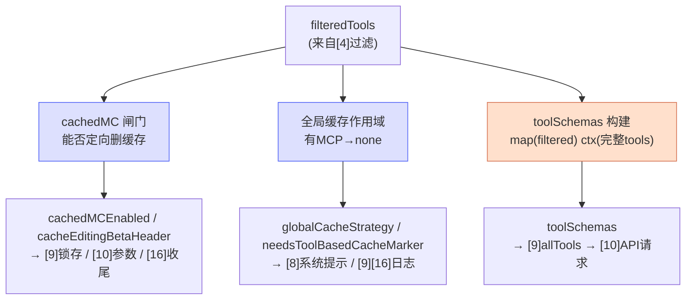

# [5] cachedMicrocompact 闸门、全局缓存与工具 schema 构建

> 接在工具过滤（`[4]`）之后，这一段（`claude.ts:1480-1563`）做三件与**缓存**和**工具定义**有关的准备：
> 1. **cached microcompact 闸门**：判断本次能否使用"服务端定向删缓存"的高级能力。
> 2. **全局缓存作用域**：决定缓存按"系统提示"还是"完全不共享"来分桶。
> 3. **工具 schema 构建**：把工具异步转成 API 要的 JSON Schema。
>
> 三段都服务于 `[0]` 提到的"缓存保护"暗线。

---

## 一、cached microcompact 闸门（1480-1519）

### 1.1 代码骨架

```typescript
let cachedMCEnabled = false
let cacheEditingBetaHeader = ''
if (feature('CACHED_MICROCOMPACT')) {
  const { isCachedMicrocompactEnabled, isModelSupportedForCacheEditing, getCachedMCConfig }
    = await import('../compact/cachedMicrocompact.js')
  const betas = await import('src/constants/betas.js')
  cacheEditingBetaHeader = betas.CACHE_EDITING_BETA_HEADER

  const featureEnabled = isCachedMicrocompactEnabled()
  const modelSupported = isModelSupportedForCacheEditing(options.model)
  const headerAvailable = !!cacheEditingBetaHeader        // 本 fork 里常量是 ''
  cachedMCEnabled = featureEnabled && modelSupported && headerAvailable
  // ... 日志
}
```

### 1.2 ⭐ 两种"缓存"完全不是一回事

代码注释画了一张关键的对照表，务必分清：

| 能力 | 字段 | 面向 | 状态 |
|---|---|---|---|
| **Prompt caching**（提示缓存） | `cache_control` 断点 | 所有用户 | 公开 API，正常工作 |
| **Cache editing**（缓存编辑） | `cache_reference` / `cache_edits` / `delete_tool_result` | ant 内部 | 服务端 beta，header **未公开** |

- 你平时享受的"**缓存命中省钱**"是**前者**——公开的，谁都能用（`addCacheBreakpoints` 在 `[10]` 里加断点）。
- `CACHED_MICROCOMPACT` 用的是**后者**——不只是读写缓存，而是能从服务端 KV cache 里**定向删除某条 `tool_result`**。这是更强的能力，属于**未公开 beta**。

> **类比**：prompt caching 像"把整段前缀拍个快照下次复用"；cache editing 像"能伸手进那个快照里，精准抠掉其中某一块再补上"——后者危险得多，所以是内部 beta。

### 1.3 三个 `&&` 条件

```typescript
cachedMCEnabled = featureEnabled && modelSupported && headerAvailable
```

| 条件 | 含义 |
|---|---|
| `featureEnabled` | `isCachedMicrocompactEnabled()`：运行时配置开着 |
| `modelSupported` | `isModelSupportedForCacheEditing(model)`：模型支持缓存编辑 |
| `headerAvailable` | `!!cacheEditingBetaHeader`：beta 头常量非空 |

### 1.4 本 fork 的现实：headerAvailable 永远为假

注释点破了一个反编译版的真相：

> *在本 fork 中 `CACHE_EDITING_BETA_HEADER` 常量是 `''`（上游尚未发布真实值）。如果没有它，请求体里的 `cache_reference` 和 `cache_edits` 会触发 API 400："tool_result.cache_reference: Extra inputs are not permitted"。*

所以 `headerAvailable = !!''  = false`，**`cachedMCEnabled` 在本 fork 实际恒为 `false`**。这段逻辑保留是为了与上游对齐结构，但实际不会激活。理解这点能避免你在调试时困惑"为什么 cachedMC 从不生效"。

### 1.5 为什么用动态 `await import`

```typescript
const { ... } = await import('../compact/cachedMicrocompact.js')
const betas = await import('src/constants/betas.js')
```

注释说明：在此异步上下文计算一次，**避免在顶层 import** ant 专属的 `CACHE_EDITING_BETA_HEADER` 常量。动态导入把这些"内部/可能不存在"的依赖延迟到真正需要时才加载，且只在 `feature('CACHED_MICROCOMPACT')` 为真时触发。

`cachedMCEnabled` 和 `cacheEditingBetaHeader` 之后会被 `paramsFromContext` 闭包捕获使用（`[10]`），并影响 beta 头锁存（`[9]`）和收尾的 `markToolsSentToAPIState()`（`[16]`）。

---

## 二、全局缓存作用域（1521-1539）

### 2.1 代码

```typescript
const useGlobalCacheFeature = shouldUseGlobalCacheScope()
// MCP 工具是每用户独立的——属于动态工具段——无法做全局缓存。
const needsToolBasedCacheMarker =
  useGlobalCacheFeature && filteredTools.some(t => t.isMcp === true)

// 全局缓存启用时，确保 prompt_caching_scope beta 头存在
if (useGlobalCacheFeature && !betas.includes(PROMPT_CACHING_SCOPE_BETA_HEADER)) {
  betas.push(PROMPT_CACHING_SCOPE_BETA_HEADER)
}

const globalCacheStrategy: GlobalCacheStrategy = useGlobalCacheFeature
  ? needsToolBasedCacheMarker
    ? 'none'
    : 'system_prompt'
  : 'none'
```

### 2.2 全局缓存 vs 普通缓存

普通 prompt 缓存是**按用户/会话**分桶的——你的缓存只有你能命中。**全局缓存作用域**（global cache scope）则尝试让**系统提示这类所有用户都一样的部分**跨用户共享缓存，进一步省钱。

### 2.3 ⭐ 为什么 MCP 工具会"毒化"全局缓存

```typescript
const needsToolBasedCacheMarker =
  useGlobalCacheFeature && filteredTools.some(t => t.isMcp === true)
```

注释一针见血：

> *MCP 工具是每用户独立的——属于动态工具段——无法做全局缓存。*

全局缓存的前提是"这段内容**所有用户都一样**"。但 MCP 工具是**每个用户各自接入的**（你的 Gmail、他的 Jira……），完全个性化。一旦请求里含 MCP 工具，这个请求的前缀就**不可能全局共享**了。

`needsToolBasedCacheMarker` 就是"**检测到了 MCP 工具，需要退化处理**"的标志。

### 2.4 三种 globalCacheStrategy

| useGlobalCacheFeature | needsToolBasedCacheMarker | strategy | 含义 |
|---|---|---|---|
| 关 | — | `'none'` | 不用全局缓存 |
| 开 | false（无 MCP 工具） | `'system_prompt'` | 系统提示走全局缓存 |
| 开 | true（有 MCP 工具） | `'none'` | 有 MCP，退回不做全局缓存 |

这个 `globalCacheStrategy` 后面只用于**日志/遥测**（`recordPromptState`、`logAPISuccessAndDuration`，见 `[9][16]`），以及影响 `buildSystemPromptBlocks` 是否跳过系统提示的全局缓存（`skipGlobalCacheForSystemPrompt: needsToolBasedCacheMarker`，见 `[8]`）。

> 简记：**有 MCP 工具 → 全局缓存降级为 none**；没有 → 系统提示可以全局共享。

---

## 三、工具 schema 构建（1541-1563）

### 3.1 代码

```typescript
const toolSchemas = await Promise.all(
  filteredTools.map(tool =>
    toolToAPISchema(tool, {
      getToolPermissionContext: options.getToolPermissionContext,
      tools,                       // ← 注意：传完整 tools，不是 filteredTools
      agents: options.agents,
      allowedAgentTypes: options.allowedAgentTypes,
      model: options.model,
    }),
  ),
)

if (useSearchExtraTools) {
  logForDebugging(
    `Dynamic tool loading: 0/${deferredToolNames.size} deferred tools in API tools array (all via ExecuteExtraTool)`,
  )
}
queryCheckpoint('query_tool_schema_build_end')
```

### 3.2 在做什么

把 **`filteredTools`**（已剔除延迟工具，只剩核心 + SearchExtraTools，见 `[4]`）里的每个工具，调 `toolToAPISchema` 转成 Anthropic API 要的 `{ name, description, input_schema }` 结构。用 `Promise.all` **并行**转换（每个工具的 schema 生成可能是异步的，比如要算权限上下文）。

### 3.3 ⭐ 关键细节：map 的是 filteredTools，但参数里传 tools

```typescript
filteredTools.map(tool => toolToAPISchema(tool, { ..., tools, ... }))
//  ↑ 遍历过滤后的                                    ↑ 但上下文给完整的
```

注释解释了这个"不一致"是故意的：

> *传给 `toolToAPISchema` 的是完整的 `tools` 列表（而非 filteredTools），这样 `SearchExtraToolsTool` 的 prompt 能列出所有可用的 MCP 工具。过滤只影响真正发送给 API 的工具集合，不影响模型在工具描述里看到的内容。*

拆开理解：

| 用途 | 用哪个列表 | 为什么 |
|---|---|---|
| **遍历谁生成 schema** | `filteredTools` | 只有这些工具的 schema 真正进 API 请求（省 token、保缓存） |
| **schema 生成时的上下文 `tools`** | 完整 `tools` | `SearchExtraToolsTool` 的描述需要"知道全部延迟工具有哪些"，才能在 prompt 里告诉模型"你可以搜这些" |

> **类比**：菜单上只印**今天供应的菜**（filteredTools），但服务员脑子里得知道**整个菜库**（tools），这样你问"有没有甜点"时他能答"有，需要的话我去后厨拿"（SearchExtraTools）。

### 3.4 日志：延迟工具恒为 0

```
Dynamic tool loading: 0/${deferredToolNames.size} deferred tools in API tools array
```

再次确认 `[4]` 的核心结论：**API tools 数组里延迟工具数永远是 0**，全部走 `ExecuteExtraTool`。这条日志是运行时的"自证"。

### 3.5 计时检查点

`queryCheckpoint('query_tool_schema_build_start')`（在 `[3]` 开头）到 `query_tool_schema_build_end`（这里）框住了**整个工具准备阶段**的耗时——包括 `[3]`~`[5]` 的 advisor 解析、工具过滤、schema 构建。这是性能剖析（queryProfiler）的一个区段。

---

## 四、三段如何协同



---

## 五、关键行号书签

| 内容 | 位置 |
|---|---|
| `feature('CACHED_MICROCOMPACT')` 闸门 | `claude.ts:1485` |
| 公开 vs 内部缓存对照注释 | `claude.ts:1486-1499` |
| `cachedMCEnabled` 三条件 | `claude.ts:1514` |
| `shouldUseGlobalCacheScope` | `claude.ts:1521` |
| `needsToolBasedCacheMarker`（MCP 检测） | `claude.ts:1523` |
| `globalCacheStrategy` | `claude.ts:1535-1539` |
| `toolToAPISchema` + Promise.all | `claude.ts:1545-1555` |
| 完整 tools 作为上下文的注释 | `claude.ts:1541-1544` |
| `query_tool_schema_build_end` | `claude.ts:1563` |

---

## 速记口诀

- **两种缓存**：prompt caching（公开、省钱、cache_control）≠ cache editing（内部 beta、定向删 KV、本 fork 恒关）。
- **MCP 毒化全局缓存**：MCP 工具每用户独立 → `needsToolBasedCacheMarker` → strategy 退回 `none`。
- **schema 构建的不一致是故意的**：遍历 `filteredTools` 生成、但上下文传完整 `tools`，让 SearchExtraTools 能列出全部延迟工具。
- **延迟工具进 API 恒为 0**：日志自证，全走 ExecuteExtraTool。
