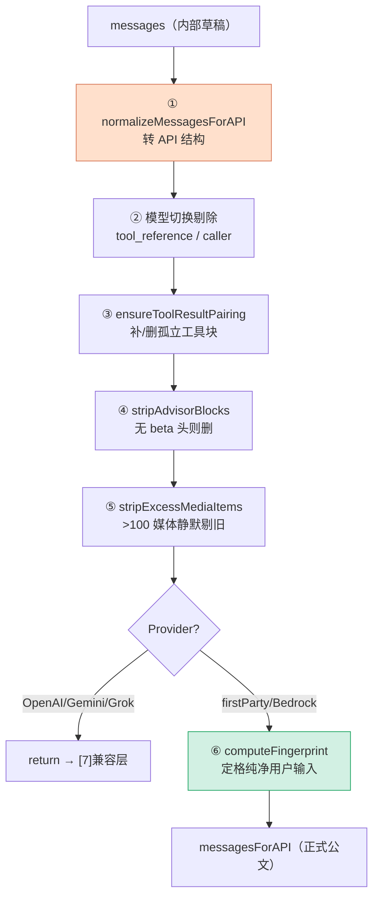

# [6] 消息归一化、后处理与指纹

> 工具准备好后（`[5]`），轮到**消息**。这一段（`claude.ts:1565-1672`）把上层传入的 `messages` 反复"清洗"成 API 真正能接受的 `messagesForAPI`。核心目标只有一个：**别让 API 报 400**——尤其是在模型切换、会话恢复、媒体超量这些边缘场景下。
>
> ⚠️ 顺序提示：本段中间（媒体剔除之后、after_normalize 日志之前）插着 **Provider 分流**（`[7]`，`claude.ts:1621-1662`）。本文按"消息处理"主题连续讲，把那段分流单独留给 `[7]`。

---

## 一、为什么需要"归一化"

上层的 `messages` 数组是 Claude Code **内部格式**，里面混着各种东西：内部元数据、UI 专用字段、不同来源（远端/teleport/恢复）拼接的历史、跨模型遗留的字段……而 Anthropic API 只接受**严格规范**的消息结构。

> **类比**：`messages` 是你随手记的草稿（有涂改、有便利贴、有别人加的批注），`messagesForAPI` 是要寄出去的正式公文——寄之前必须誊清、去掉所有不该出现的东西，否则邮局（API）直接退回（400）。

---

## 二、第 ① 道：normalizeMessagesForAPI（1567-1573）

```typescript
logEvent('tengu_api_before_normalize', { preNormalizedMessageCount: messages.length })

queryCheckpoint('query_message_normalization_start')
let messagesForAPI = normalizeMessagesForAPI(messages, filteredTools)
queryCheckpoint('query_message_normalization_end')
```

- 主归一化：把内部消息类型转成 API 的 `user`/`assistant` 消息结构，规整内容块。
- 传入 `filteredTools` 让归一化知道当前有效工具集。
- 前后各一个 `logEvent`/`queryCheckpoint`，框出归一化耗时并记录消息数变化。
- 之后 `messagesForAPI` 用 `let` 声明，因为下面还要被多道清洗**反复重写**。

---

## 三、第 ② 道：模型切换的工具搜索字段剔除（1575-1601）

```typescript
if (!useSearchExtraTools) {
  messagesForAPI = messagesForAPI.map(msg => {
    switch (msg.type) {
      case 'user':
        return stripToolReferenceBlocksFromUserMessage(msg)   // 剔除 tool_reference 块
      case 'assistant':
        return stripCallerFieldFromAssistantMessage(msg)      // 剔除 'caller' 字段
      default:
        return msg
    }
  })
}
```

### 3.1 解决的问题：对话中途换模型

注释解释了这道清洗为何不能只靠 `normalizeMessagesForAPI`：

- `normalizeMessagesForAPI` 用的是 `isSearchExtraToolsEnabledNoModelCheck()`——**不带模型检查**的版本。因为它被约 20 处调用（分析、反馈、分享等），很多没有模型上下文，给它加 `model` 参数是大重构。
- **这里**用的是带模型支持检查的 `isSearchExtraToolsEnabled()`（即 `useSearchExtraTools`）。

为什么重要？**对话中途切换模型**（例如 Sonnet → Haiku）时，历史消息里可能残留上一个模型产生的**工具搜索专用字段**（`tool_reference` 块、`caller` 字段）。如果新模型不支持工具搜索，带着这些字段发请求会**导致 400**。所以当 `!useSearchExtraTools` 时，把它们全部剔掉。

| 消息类型 | 剔除什么 | 函数 |
|---|---|---|
| user | tool_result 内容里的 `tool_reference` 块 | `stripToolReferenceBlocksFromUserMessage` |
| assistant | tool_use 块里的 `caller` 字段 | `stripCallerFieldFromAssistantMessage` |

注释补充：assistant 的 tool 输入已被 `normalizeMessagesForAPI` 归一化过，所以这里**只需移除 `caller`**，不必再次归一化输入。

---

## 四、第 ③ 道：修复 tool_use/tool_result 配对（1603-1606）

```typescript
// 修复恢复远端/teleport 会话时可能出现的 tool_use/tool_result 配对错位。
messagesForAPI = ensureToolResultPairing(messagesForAPI)
```

### 4.1 API 的硬约束

Anthropic API 要求 **每个 `tool_use` 必须有对应的 `tool_result`**，反之亦然——它们必须**成对出现**。破坏这个配对会 400。

### 4.2 哪里会破坏配对

会话**恢复（resume）/远端/teleport** 场景：历史可能在某次工具调用中间被截断、或拼接了不完整的片段，导致：

| 错位 | `ensureToolResultPairing` 的修复 |
|---|---|
| **孤立 tool_use**（有调用无结果） | 插入一条**合成的 error tool_result** 补齐 |
| **孤立 tool_result**（有结果无调用） | **剔除**这个引用了不存在 tool_use 的结果 |

> 这是典型的**防御性修复**：与其相信恢复来的历史一定完整，不如主动补全/裁剪，保证发出去的一定是合法配对。

---

## 五、第 ④ 道：剔除 advisor 块（1608-1611）

```typescript
if (!betas.includes(ADVISOR_BETA_HEADER)) {
  messagesForAPI = stripAdvisorBlocks(messagesForAPI)
}
```

与 `[3]` 呼应：advisor 产生的块只有在带 `ADVISOR_BETA_HEADER` 时 API 才认识。如果这次请求**没带**该 beta 头（advisor 功能关闭），历史里残留的 advisor 块就会被拒——所以**没带头就把块删掉**。

> 注意 `[3]` 里"只要 advisor 启用就无条件加 beta 头"正是为了让这道删除**尽量少触发**——能解析就别删。两段是一对。

---

## 六、第 ⑤ 道：剔除超量媒体（1613-1619）

```typescript
// API 会拒绝超过 100 个媒体项的请求，但返回的错误信息晦涩难懂。
messagesForAPI = stripExcessMediaItems(messagesForAPI, API_MAX_MEDIA_PER_REQUEST)
```

- API 单次请求**最多 100 个媒体项**（图片等），超了会 400，且错误信息**很难懂**。
- 在 Cowork/CCD 里一旦报这个错**很难恢复**。
- 所以**静默剔除最旧的媒体项**，保持在限制内——宁可悄悄丢几张老图，也不让整个请求挂掉。

> 这是"**优雅降级**"而非"报错中断"：用户体验优先。

---

## 七、（此处插入 Provider 分流 → 见 [7]）

媒体剔除之后，代码检查 `getAPIProvider()`，若是 OpenAI/Gemini/Grok 就**提前 `return`**，交给对应兼容层。详见 `[7]provider-routing`。**只有第一方（Anthropic）/Bedrock 路径**才会继续往下走到下面的指纹计算。

---

## 八、第 ⑥ 道：归因指纹（1664-1672）

```typescript
logEvent('tengu_api_after_normalize', { postNormalizedMessageCount: messagesForAPI.length })

// 从第一条 user 消息计算指纹用于归因。
// 必须在注入合成消息（例如延迟工具名）之前进行，使指纹反映真实的用户输入。
const fingerprint = computeFingerprintFromMessages(messagesForAPI)
```

### 8.1 指纹是什么

`fingerprint` 是从**第一条 user 消息**算出的一个哈希，用于**归因（attribution）**——后面会通过 `getAttributionHeader(fingerprint)` 拼进 system prompt 前缀（见 `[8]`），让请求可被关联到原始用户输入。

### 8.2 ⭐ 时机很关键："注入合成消息之前"

注释强调指纹**必须在注入合成消息之前**算：

- 后面会往 `messagesForAPI` 里追加**合成消息**（如 `<available-deferred-tools>` 注入，见 `[8]`）。
- 如果指纹在那之后算，就会把"系统注入的内容"也算进去，**污染**了"真实用户输入"的归因。
- 所以在所有清洗完成、但任何注入开始前，**抢在这个时间点**定格指纹。

```
normalize → strip → pairing → strip advisor → strip media
   → [provider 分流] → after_normalize 日志
   → ★ 此刻算 fingerprint（纯净的用户输入）★
   → 之后才注入合成消息（[8]）
```

`tengu_api_after_normalize` 与开头的 `tengu_api_before_normalize`（第二节）成对，记录归一化前后的消息数变化。

---

## 九、六道清洗全景



每一道都在回答"**这种情况下不洗会怎样**"：

| 道 | 不洗的后果 |
|---|---|
| ① 归一化 | 内部结构 API 不认 |
| ② 模型切换剔除 | 换模型后残留字段 → 400 |
| ③ 配对修复 | 恢复会话工具块错位 → 400 |
| ④ advisor 剔除 | 无 beta 头带 advisor 块 → 400 |
| ⑤ 媒体剔除 | >100 媒体 → 难懂的 400，难恢复 |
| ⑥ 指纹 | 时机错了 → 归因被合成消息污染 |

---

## 十、关键行号书签

| 内容 | 位置 |
|---|---|
| `tengu_api_before_normalize` | `claude.ts:1567` |
| `normalizeMessagesForAPI` | `claude.ts:1572` |
| 模型切换剔除（tool_reference/caller） | `claude.ts:1588-1601` |
| `ensureToolResultPairing` | `claude.ts:1606` |
| `stripAdvisorBlocks` | `claude.ts:1609-1611` |
| `stripExcessMediaItems` | `claude.ts:1616-1619` |
| `tengu_api_after_normalize` | `claude.ts:1665` |
| `computeFingerprintFromMessages` | `claude.ts:1672` |

---

## 速记口诀

- **六道清洗**：归一化 → 模型切换剔除 → 配对修复 → advisor 剔除 → 媒体剔除 →（分流）→ 指纹。
- **主题**：全部为了**防 400**，尤其在换模型 / 恢复会话 / 媒体超量这些边缘场景。
- **配对硬约束**：tool_use 与 tool_result 必须成对，孤立的补合成 error / 删掉。
- **指纹抢时机**：在注入合成消息**之前**算，保证归因反映纯净用户输入。
