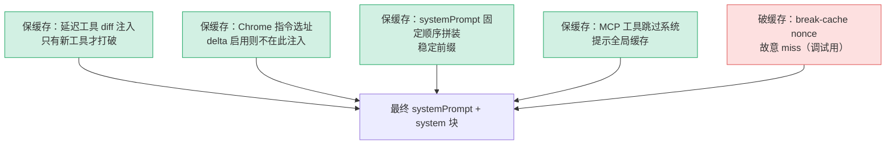

# [8] 延迟工具注入、System Prompt 组装与 break-cache

> 指纹定格后（`[6]`），queryModel 开始**真正拼装要发出去的 system prompt 和消息尾巴**（`claude.ts:1674-1762`）。这一段做四件事：
> 1. 把"会话中途新连上的延迟工具"用合成消息**公告**给模型。
> 2. 决定 Chrome 工具搜索指令注入到哪里。
> 3. 把归因头 + CLI 前缀 + 业务系统提示**拼成最终 systemPrompt**。
> 4. 处理 **break-cache**（强制缓存未命中）并构建带缓存断点的 `system` 块。
>
> 贯穿这四件事的主线还是 `[0]` 的**缓存保护**暗线——每一处注入都得小心"会不会打破 prompt 缓存"。

---

## 一、延迟工具公告注入（1674-1704）

### 1.1 代码

```typescript
if (useSearchExtraTools && !isDeferredToolsDeltaEnabled()) {
  const deferredToolList = tools
    .filter(t => deferredToolNames.has(t.name))
    .map(formatDeferredToolLine)
    .sort()
    .join('\n')

  if (deferredToolList) {
    const currentTools = new Set(deferredToolList.split('\n'))
    const hasNewTools = [...currentTools].some(t => !lastAnnouncedDeferredTools.has(t))

    if (hasNewTools) {
      lastAnnouncedDeferredTools.clear()
      for (const t of currentTools) lastAnnouncedDeferredTools.add(t)

      messagesForAPI = [
        ...messagesForAPI,
        createUserMessage({
          content: `<system-reminder>\n<available-deferred-tools>\n${deferredToolList}\n</available-deferred-tools>\nIMPORTANT: ... SearchExtraTools ... ExecuteExtraTool ...`,
          isMeta: true,
        }),
      ]
    }
  }
}
```

### 1.2 解决的问题：会话中途冒出新工具

回顾 `[4]`：延迟工具不进 tools 数组，模型"看不见"它们，要靠 `SearchExtraTools` 搜出来。但模型怎么**知道有哪些**延迟工具可搜？答案就是这条 `<available-deferred-tools>` 合成消息——它把当前所有延迟工具名列给模型，并叮嘱"用 SearchExtraTools 发现 → 用 ExecuteExtraTool 调用"。

典型触发场景：**MCP 服务器会话中途才连上**（异步握手），新工具突然可用。

### 1.3 ⭐ 为什么只在"有新工具"时注入

这是本段最关键的缓存优化。注释：

> *把当前的延迟工具与之前已公告过的工具做 diff。仅当出现新工具时才重新注入。*

`lastAnnouncedDeferredTools` 是个**模块级 Set**，记着"上次已经公告过哪些工具"。每次只比对差异：

| 情况 | 动作 | 对缓存的影响 |
|---|---|---|
| 工具集没变（`hasNewTools=false`） | **不注入** | 消息历史不变 → 缓存命中 |
| 有新工具连上 | 注入新公告 + 更新 Set | 历史变了 → 这次缓存未命中（不可避免） |

如果**每次请求都注入**当前完整列表，那么哪怕工具没变，这条消息每轮都"新增"在历史里——会**反复打破缓存**。diff 注入保证只在真有变化时才付那一次缓存代价。

### 1.4 两个细节

- `.sort()`：工具列表排序后再 join，保证**顺序稳定**——同一组工具不会因排列不同被误判成"有新工具"。
- `isMeta: true`：标记这是**系统注入的元消息**，不是真实用户输入（呼应 `[6]` 指纹要在注入前算）。
- `!isDeferredToolsDeltaEnabled()`：如果启用了更先进的 **delta 附件**机制（`deferred_tools_delta`），延迟工具改走持久化附件公告（不会在工具池变化时打破缓存），就**不用**这种临时前置注入了。这里是"旧方案"的兜底路径。

---

## 二、Chrome 工具搜索指令的注入时机（1706-1727）

```typescript
const hasChromeTools = filteredTools.some(t =>
  isToolFromMcpServer(t.name, CLAUDE_IN_CHROME_MCP_SERVER_NAME),
)
const injectChromeHere =
  useSearchExtraTools && hasChromeTools && !isMcpInstructionsDeltaEnabled()
```

Chrome（claude-for-chrome）工具需要一段专门的使用指令。`injectChromeHere` 决定它**注入到哪**：

- 若启用了 `mcp_instructions_delta`（delta 附件），Chrome 指令改放在那里（attachments.ts），**不在这里注入**——注释说明：*每次请求都追加到 system prompt 会在 chrome 延迟连接时打破 prompt 缓存*。
- 否则（旧路径）就在下面拼 systemPrompt 时把 `CHROME_SEARCH_EXTRA_TOOLS_INSTRUCTIONS` 加进去。

> 又一次"避免打破缓存"的选址决策——与延迟工具注入同样的考量。

---

## 三、System Prompt 拼装（1716-1727）

```typescript
// filter(Boolean) 会把空字符串过滤掉
systemPrompt = asSystemPrompt(
  [
    getAttributionHeader(fingerprint),                              // 归因头
    getCLISyspromptPrefix({                                         // CLI 前缀
      isNonInteractive: options.isNonInteractiveSession,
      hasAppendSystemPrompt: options.hasAppendSystemPrompt,
    }),
    ...systemPrompt,                                                // 原业务系统提示
    ...(advisorModel ? [ADVISOR_TOOL_INSTRUCTIONS] : []),          // advisor 指令（[3]）
    ...(injectChromeHere ? [CHROME_SEARCH_EXTRA_TOOLS_INSTRUCTIONS] : []), // chrome 指令
  ].filter(Boolean),
)
```

这里把 `systemPrompt` **重新赋值**为一个拼好的数组，顺序很关键（缓存按前缀匹配，越靠前越稳定越好）：

| 顺序 | 块 | 来源 |
|---|---|---|
| 1 | 归因头 `getAttributionHeader(fingerprint)` | `[6]` 算的指纹 |
| 2 | CLI 系统提示前缀 | 取决于是否交互式/是否追加提示 |
| 3 | 原始业务 systemPrompt（展开） | 上层传入 |
| 4 | advisor 工具指令（条件） | `[3]` 的 advisorModel |
| 5 | chrome 指令（条件） | 本段 injectChromeHere |

`.filter(Boolean)`：把空字符串/falsy 块剔掉，避免空块污染。

> **类比**：像组装一封正式信函——抬头（归因）、固定开场白（CLI 前缀）、正文（业务提示）、附加说明（advisor/chrome），按固定顺序排好。

---

## 四、break-cache nonce（1729-1755）

```typescript
{
  const onceMarker = getBreakCacheMarkerPath()
  const alwaysFlag = getBreakCacheAlwaysPath()
  const shouldBreak = existsSync(onceMarker) || existsSync(alwaysFlag)
  if (shouldBreak) {
    const nonce = randomUUID()
    systemPrompt = asSystemPrompt([
      ...systemPrompt,
      `<!-- cache-break nonce: ${nonce} -->`,
    ])
    // 只删一次性标记；always 标记保留到 /break-cache off
    if (existsSync(onceMarker)) {
      try { unlinkSync(onceMarker) } catch { /* 尽力而为 */ }
    }
  }
}
```

### 4.1 用途：故意打破缓存

这是**反向操作**——前面都在努力**保住**缓存，这里却**故意打破**。用于调试：怀疑缓存导致行为异常时，用户可以 `/break-cache` 强制下一次（或之后每次）请求**重新走全价、不命中缓存**。

### 4.2 怎么打破

往 system prompt 末尾**追加一个唯一的 UUID 注释**：

```
<!-- cache-break nonce: 3f2a...c9 -->
```

每次 nonce 都不同 → system prompt 前缀哈希改变 → 服务端缓存键变化 → **强制 miss**。

### 4.3 两种模式

| 标记文件 | 行为 | 清除 |
|---|---|---|
| `onceMarker`（一次性） | 打破一次 | 用完**立即 `unlinkSync` 删除**，下次恢复正常 |
| `alwaysFlag`（持续） | 每次都打破 | **保留**，直到执行 `/break-cache off` |

用文件存在性（`existsSync`）作为开关，是为了**跨进程/跨命令**通信（`/break-cache` 命令写文件，queryModel 读文件）。

---

## 五、构建 system 块与 prompt caching（1755-1762）

```typescript
logAPIPrefix(systemPrompt)   // 打日志便于识别

const enablePromptCaching =
  options.enablePromptCaching ?? getPromptCachingEnabled(options.model)
const system = buildSystemPromptBlocks(systemPrompt, enablePromptCaching, {
  skipGlobalCacheForSystemPrompt: needsToolBasedCacheMarker,   // [5] 的 MCP 检测
  querySource: options.querySource,
})
const useBetas = betas.length > 0
```

- `enablePromptCaching`：选项覆盖优先，否则按模型默认。
- `buildSystemPromptBlocks`：把字符串数组转成 API 的 `system` 块结构，并在合适位置插入 **`cache_control` 断点**（公开的 prompt caching，见 `[5]` 第 1.2 节的对照）。
- `skipGlobalCacheForSystemPrompt: needsToolBasedCacheMarker`：呼应 `[5]`——**有 MCP 工具就别给系统提示做全局缓存**（因为 MCP 每用户独立，全局共享会出错）。
- `useBetas`：betas 数组非空才在请求里带 `betas` 字段（`[10]` 用）。

至此 `system` 块成型，等待 `[10]` 的 `paramsFromContext` 组进最终请求。

---

## 六、整段的"缓存视角"总览

这一段是缓存暗线最密集的地方，正反两面都有：



| 主题 | 体现 |
|---|---|
| **保缓存** | 延迟工具 diff 注入、Chrome 指令延后、systemPrompt 顺序固定、MCP 跳过全局缓存 |
| **故意破缓存** | break-cache nonce（仅调试，文件开关控制） |

---

## 七、关键行号书签

| 内容 | 位置 |
|---|---|
| 延迟工具 diff 注入 | `claude.ts:1676-1704` |
| `lastAnnouncedDeferredTools`（模块级 Set） | `claude.ts:1688` |
| `<available-deferred-tools>` 合成消息 | `claude.ts:1698` |
| Chrome 指令注入判定 | `claude.ts:1709-1713` |
| systemPrompt 拼装 | `claude.ts:1716-1727` |
| `getAttributionHeader(fingerprint)` | `claude.ts:1718` |
| break-cache nonce | `claude.ts:1733-1752` |
| `buildSystemPromptBlocks` | `claude.ts:1759-1762` |

---

## 速记口诀

- **延迟工具 diff 注入**：只有"出现新工具"才追加 `<available-deferred-tools>`，否则不动历史 → 保缓存。
- **Chrome 指令选址**：delta 附件启用就别在 system prompt 注入，避免 chrome 延迟连接打破缓存。
- **systemPrompt 顺序固定**：归因头 → CLI 前缀 → 业务提示 → advisor → chrome，前缀越稳越好。
- **break-cache 反着来**：故意加 UUID nonce 强制 miss，once 用完即删 / always 留到关。
- **system 块**：buildSystemPromptBlocks 插 cache_control 断点，MCP 工具时跳过系统提示全局缓存。
