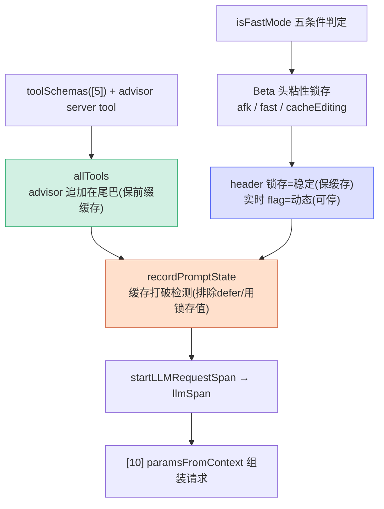

# [9] allTools 组装、Fast Mode、Beta 头粘性锁存与缓存打破检测

> 这一段（`claude.ts:1768-1871`）是请求体真正成型前的最后一批准备，主题高度集中在 `[0]` 的**缓存保护**暗线上。核心是一个反复出现的模式：**beta 头"粘性锁存"**——一旦某个 beta 头在本 session 发出过，剩余时间里就一直发，**绝不中途增删**，因为那会改变服务端缓存键、打破多达 5-7 万 token 的缓存。

---

## 一、allTools：工具数组 + advisor server tool（1768-1779）

```typescript
const extraToolSchemas = [...(options.extraToolSchemas ?? [])]
if (advisorModel) {
  // 按 API 约定，server tool 必须在 tools 数组里。追加在 toolSchemas 之后，
  // 这样切换 /advisor 只会让后面那段小尾巴变化，不影响已缓存的前缀。
  extraToolSchemas.push({
    type: 'advisor_20260301',
    name: 'advisor',
    model: advisorModel,
  } as unknown as BetaToolUnion)
}
const allTools = [...toolSchemas, ...extraToolSchemas]
```

- `toolSchemas` 是 `[5]` 构建的客户端工具 schema。
- 若 `[3]` 解析出了 `advisorModel`，就把 **advisor server tool** 作为一项追加进 `extraToolSchemas`。
- `allTools = toolSchemas + extraToolSchemas`，这是最终发给 API 的完整工具列表。

### ⭐ 为什么 advisor 追加在"尾巴"

注释点破了缓存考量：

> *追加在 toolSchemas 之后，这样切换 `/advisor` 只会让后面那段小尾巴发生变化，不会影响已缓存的前缀。*

缓存按**前缀**匹配。把易变的 advisor 放在工具数组**末尾**，用户开关 advisor 时只动尾部，前面那一长串稳定的核心工具 schema 仍能命中缓存。**把变化挤到末尾**是贯穿整个 queryModel 的缓存策略。

---

## 二、Fast Mode 判定（1781-1786）

```typescript
const isFastMode =
  isFastModeEnabled() &&
  isFastModeAvailable() &&
  !isFastModeCooldown() &&
  isFastModeSupportedByModel(options.model) &&
  !!options.fastMode
```

Fast mode（`/fast`）用 Opus 但输出更快。五个 `&&` 条件全过才算激活：

| 条件 | 含义 |
|---|---|
| `isFastModeEnabled()` | 全局功能开着 |
| `isFastModeAvailable()` | 当前可用 |
| `!isFastModeCooldown()` | 不在冷却期 |
| `isFastModeSupportedByModel(model)` | 模型支持 |
| `!!options.fastMode` | 本次调用请求了它 |

---

## 三、⭐ Beta 头粘性锁存（1788-1825）

这是本节的核心机制。先看注释：

> *动态 beta 头的粘性锁存。每个头一旦首次发送，在 session 剩余时间里都会持续发送，这样会话中途切换不会改变服务端缓存键，避免打破约 5-7 万 token 的缓存。锁存可通过 `clearBetaHeaderLatches()` 在 `/clear` 和 `/compact` 时清除。*

### 3.1 问题：动态 beta 头会抖动缓存键

像 AFK mode、fast mode、cache editing 这些 beta 头是**动态**的——用户可能中途开启 auto mode、切 fast mode。如果 beta 头跟着实时状态变，那么：

```
请求1：betas = [A, B]        ← 缓存键 K1
（用户开了 fast mode）
请求2：betas = [A, B, FAST]  ← 缓存键 K2 ≠ K1 → 缓存全失效！
```

服务端缓存键包含 beta 头集合，**头一变缓存就废**。

### 3.2 解法：锁存（latch）

"锁存"= **一旦置位就不再回落**。代码为每个动态头维护一个 session 级锁存状态：

```typescript
let afkHeaderLatched = getAfkModeHeaderLatched() === true
if (feature('TRANSCRIPT_CLASSIFIER')) {
  if (!afkHeaderLatched && isAgenticQuery && shouldIncludeFirstPartyOnlyBetas()
      && (autoModeStateModule?.isAutoModeActive() ?? false)) {
    afkHeaderLatched = true
    setAfkModeHeaderLatched(true)     // 持久化锁存
  }
}

let fastModeHeaderLatched = getFastModeHeaderLatched() === true
if (!fastModeHeaderLatched && isFastMode) {
  fastModeHeaderLatched = true
  setFastModeHeaderLatched(true)
}

let cacheEditingHeaderLatched = getCacheEditingHeaderLatched() === true
if (feature('CACHED_MICROCOMPACT')) {
  if (!cacheEditingHeaderLatched && cachedMCEnabled
      && getAPIProvider() === 'firstParty'
      && options.querySource === 'repl_main_thread') {
    cacheEditingHeaderLatched = true
    setCacheEditingHeaderLatched(true)
  }
}
```

三个头同一套模式：**"还没锁 && 现在该开"→ 锁上**。锁上之后即使条件不再成立，头也继续发（实际的 push 在 `[10]` 的 `paramsFromContext` 里，依据这些 latched 布尔）。

| 锁存变量 | 何时首次锁上 |
|---|---|
| `afkHeaderLatched` | agentic 查询 + auto mode 激活 |
| `fastModeHeaderLatched` | fast mode 激活 |
| `cacheEditingHeaderLatched` | cachedMC 启用 + firstParty + 主线程 |

### 3.3 ⭐ 关键区分：header 锁存 vs 实时 flag

注释里反复出现一个精妙的二分（在 `[10]` 也会再现）：

> *Fast mode：header 锁存在 session 级别稳定（缓存安全），但 `speed='fast'` 保持动态，使冷却仍能抑制实际的 fast-mode 请求，而不改变缓存键。*

| 维度 | 行为 | 目的 |
|---|---|---|
| **beta header**（如 `FAST_MODE_BETA_HEADER`） | **锁存、稳定** | 不抖动缓存键 |
| **实际效果 flag**（如 `speed='fast'`、`useCachedMC`） | **实时、动态** | 冷却/功能关闭时能真正停掉行为 |

也就是说：**头一直发（缓存安全），但行为可随时停（功能可控）**。两者解耦，鱼与熊掌兼得。

### 3.4 锁存何时清除

`clearBetaHeaderLatches()` 在 `/clear` 和 `/compact` 时调用——因为这两个操作本来就会**重建上下文**（缓存本来就要重算），此时正好把锁存归零、重新开始。

---

## 四、effort 解析（1827）

```typescript
const effort = resolveAppliedEffort(options.model, options.effortValue)
```

解析"努力程度"（effort）参数，决定模型投入的算力档位。它会在 `[10]` 的 `configureEffortParams` 里组进 `output_config`，也参与下面的缓存打破检测。

---

## 五、recordPromptState：缓存打破检测（1829-1854）

```typescript
if (feature('PROMPT_CACHE_BREAK_DETECTION')) {
  // 把 defer_loading 工具从哈希中排除——API 会把它们从 prompt 中剥离
  const toolsForCacheDetection = allTools.filter(
    t => !('defer_loading' in t && t.defer_loading),
  )
  recordPromptState({
    system,
    toolSchemas: toolsForCacheDetection,
    querySource: options.querySource,
    model: options.model,
    agentId: options.agentId,
    fastMode: fastModeHeaderLatched,       // ← 传锁存值，不是实时值
    globalCacheStrategy,
    betas,
    autoModeActive: afkHeaderLatched,      // ← 锁存值
    isUsingOverage: currentLimits.isUsingOverage ?? false,
    cachedMCEnabled: cacheEditingHeaderLatched,  // ← 锁存值
    effortValue: effort,
    extraBodyParams: getExtraBodyParams(),
  })
}
```

### 5.1 用途

`recordPromptState` 记录"**所有可能影响服务端缓存键的因素**"的快照。下一次请求时再比对，如果发现某个因素变了，就能**诊断出"缓存被打破"**并定位原因（见 `[14]` 的 `checkResponseForCacheBreak` 用响应 token 验证）。这是一个**可观测性**工具，帮开发者发现意外的缓存失效。

### 5.2 两个要点

- **排除 defer_loading 工具**：注释说 *API 会把它们从 prompt 中剥离，所以根本不影响实际缓存键*。如果把它们算进哈希，工具被发现/MCP 重连时会出现**误报**的 "tool schemas changed"。
- **传锁存值而非实时值**：`fastMode: fastModeHeaderLatched`、`autoModeActive: afkHeaderLatched`、`cachedMCEnabled: cacheEditingHeaderLatched`——注释强调 *使 break 检测反映我们实际发送的内容，而不是用户切换后的状态*。检测必须基于"真正发出去的 beta 头"，正好印证第三节的锁存设计。

---

## 六、llmSpan：请求追踪（1856-1871）

```typescript
const newContext: LLMRequestNewContext | undefined = isBetaTracingEnabled()
  ? {
      systemPrompt: systemPrompt.join('\n\n'),
      querySource: options.querySource,
      tools: jsonStringify(allTools),
    }
  : undefined

const llmSpan = startLLMRequestSpan(
  options.model,
  newContext,
  messagesForAPI,
  isFastMode,
)
```

- `newContext`：仅在 beta tracing 启用时构建，携带系统提示/工具/来源的快照，用于详细追踪。
- `startLLMRequestSpan`：开启一个**追踪 span**，捕获它以便后续（成功 `[16]` 或失败 `[15]`）传给 `endLLMRequestSpan`。注释提到这样**多个请求并行时，响应能匹配到正确的请求**——span 是关联请求与响应的句柄。

---

## 七、整段串联



---

## 八、关键行号书签

| 内容 | 位置 |
|---|---|
| `extraToolSchemas` + advisor 追加 | `claude.ts:1768-1778` |
| advisor 追加尾巴的缓存注释 | `claude.ts:1770-1772` |
| `allTools` 合成 | `claude.ts:1779` |
| `isFastMode` 五条件 | `claude.ts:1781-1786` |
| 粘性锁存总注释 | `claude.ts:1788-1794` |
| `afkHeaderLatched` | `claude.ts:1795-1806` |
| `fastModeHeaderLatched` | `claude.ts:1808-1812` |
| `cacheEditingHeaderLatched` | `claude.ts:1814-1825` |
| `resolveAppliedEffort` | `claude.ts:1827` |
| `recordPromptState`（排除 defer_loading） | `claude.ts:1829-1854` |
| `startLLMRequestSpan` | `claude.ts:1866-1871` |

---

## 速记口诀

- **advisor 进尾巴**：易变的放工具数组末尾，开关 advisor 只动尾部、前缀缓存仍命中。
- **粘性锁存**：beta 头一旦发就一直发（session 内），不中途增删 → 不打破 5-7 万 token 缓存；`/clear` `/compact` 时清零。
- **锁存 vs 实时**：header 锁存=稳定保缓存；speed/useCachedMC 实时=冷却/关闭时真能停。两者解耦。
- **缓存检测**：recordPromptState 排除 defer_loading（API 会剥离）、用锁存值（反映真实发送），避免误报。
- **llmSpan**：并行请求靠 span 把响应匹配回正确的请求。
