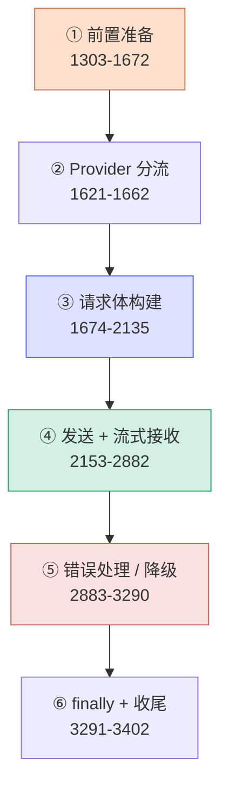

# [0] queryModel 方法总览

> `queryModel()` 是 `src/services/api/claude.ts` 里最长、最核心的一个函数（约 **2100 行**，`claude.ts:1303-3403`）。它是 Claude Code 调用大模型的**最底层传输函数**——上层把消息、系统提示、工具都准备好后，由它负责"真正把请求发出去、把流式响应收回来、出错了怎么降级/重试"。
>
> 本系列文档把这 2100 行按**代码从上到下的执行顺序**切成 16 个小节（`[0]`~`[16]`），每节单独一个文件深入讲解。本文是**总索引 + 阶段地图**，先建立全局认知，再逐节深入。

---

## 一、它在调用链里的位置

`queryModel` 不是最外层入口，它被两个"包装函数"调用：

```
QueryEngine / query.ts （对话回合循环）
        │
        ▼
queryModelWithStreaming()      ← claude.ts:1022  流式入口（REPL 用）
queryModelWithoutStreaming()   ← claude.ts:963   非流式入口（compact/分析等用）
        │  两者都 yield* 委托给
        ▼
queryModel()                   ← claude.ts:1303  ★本系列的主角
        │  真正调用
        ▼
anthropic.beta.messages.create({ ...params, stream: true })
```

| 层 | 职责 | 文件 |
|---|---|---|
| `query.ts` | 一个 user 回合内的"发请求 → 跑工具 → 再发请求"循环 | `src/query.ts` |
| `queryModelWith(out)Streaming` | 薄包装，做日志和 abort 早退判断 | `claude.ts:963 / 1022` |
| **`queryModel`** | **构建请求体 + 发送 + 流式解析 + 错误降级** | `claude.ts:1303` |
| Anthropic SDK | HTTP/SSE 传输 | `@anthropic-ai/sdk` |

> 一句话定位：**`queryModel` = "把一次 LLM 请求从参数变成消息流"的全过程**。它上面是"对话逻辑"，下面是"网络传输"。

---

## 二、方法签名拆解

```typescript
async function* queryModel(
  messages: Message[],          // 完整对话历史（已在上层组装好）
  systemPrompt: SystemPrompt,   // 系统提示（字符串数组）
  thinkingConfig: ThinkingConfig, // 思考预算配置
  tools: Tools,                 // 全量工具列表（含延迟工具）
  signal: AbortSignal,          // 用户中止信号（ESC 键）
  options: Options,             // 模型、querySource、回调等一大包配置
): AsyncGenerator<
  StreamEvent | AssistantMessage | SystemAPIErrorMessage,  // ← yield 的三类值
  void
>
```

### 2.1 为什么是 `async function*`（异步生成器）

返回 `AsyncGenerator` 而不是 `Promise`，是因为**流式响应本质是"边到边吐"**：

- 模型每生成一段 token，就 `yield` 一次，UI 立刻渲染——用户看到逐字打字效果。
- 调用方用 `for await (const x of queryModel(...))` 消费，**不必等整条回复生成完**。
- 生成器天然支持**提前终止**：消费者跳出 `for await`（或调 `.return()`），`queryModel` 内部的 `finally` 会触发资源清理（见 `[16]`）。

### 2.2 yield 出去的三类值（关键）

消费方会收到三种东西，必须分别处理：

| 类型 | 含义 | 何时 yield |
|---|---|---|
| **`StreamEvent`** | 原始 SSE 事件（`{ type: 'stream_event', event }`） | 每个 chunk 都吐一次，驱动实时 UI（`claude.ts:2770`） |
| **`AssistantMessage`** | 累积好的完整内容块（一段 text / 一个 tool_use / 一段 thinking） | `content_block_stop` 时（`claude.ts:2643`） |
| **`SystemAPIErrorMessage`** | API 错误（限流、超 max_tokens、拒答等） | 出错或异常停止时 |

> **类比**：StreamEvent 像电视的"逐帧信号"，AssistantMessage 像"录好的完整片段"。同一段内容会既有逐帧信号、又在结束时给一个完整片段——上层据此既能实时渲染，又能拿到结构化结果存档。

---

## 三、⭐ 从上到下的阶段地图

把 2100 行按执行顺序分成 **6 大阶段**，每个阶段又细分为本系列的小节文件：



### 阶段 ① 前置准备（1303-1672）

请求发出去**之前**的所有计算。

| 小节文件 | 内容 | 行号 |
|---|---|---|
| `[1]off-switch` | Opus 应急容量关闭开关 | 1324-1342 |
| `[2]previous-request-id` | previousRequestId 推导 + bedrock 模型解析 | 1347-1354 |
| `[3]betas-and-advisor` | isAgenticQuery、betas 合并、advisor 模型解析 | 1356-1406 |
| `[4]search-tools`（已存在） | 工具延迟加载 / 过滤 | 1408-1561 |
| `[5]cache-and-tool-schemas` | cachedMC 闸门、全局缓存、toolSchemas 构建 | 1480-1563 |
| `[6]message-normalization` | 消息归一化、后处理、指纹 | 1565-1672 |

### 阶段 ② Provider 分流（1621-1662）

| 小节文件 | 内容 | 行号 |
|---|---|---|
| `[7]provider-routing` | OpenAI / Gemini / Grok 兼容层提前 return | 1621-1662 |

### 阶段 ③ 请求体构建（1674-2135）

把所有材料拼成最终 API 请求参数。

| 小节文件 | 内容 | 行号 |
|---|---|---|
| `[8]system-prompt-and-cache-break` | 延迟工具注入、system prompt 组装、break-cache nonce | 1674-1762 |
| `[9]beta-latching` | beta 头粘性锁存、缓存打破检测、llmSpan | 1781-1871 |
| `[10]params-from-context` | paramsFromContext 闭包（thinking/temperature/cache breakpoints） | 1906-2135 |

### 阶段 ④ 发送 + 流式接收（2153-2882）

| 小节文件 | 内容 | 行号 |
|---|---|---|
| `[11]send-request` | withRetry、客户端创建、发起流式请求 | 2137-2233 |
| `[12]stream-watchdog` | 空闲超时看门狗 + stall 检测 | 2245-2305 |
| `[13]stream-events` | 流事件处理大循环（核心） | 2307-2775 |
| `[14]post-stream-validation` | 流后校验、空响应降级判定、配额头 | 2776-2882 |

### 阶段 ⑤ 错误处理 / 降级（2883-3290）

| 小节文件 | 内容 | 行号 |
|---|---|---|
| `[15]error-fallback` | 流式错误→非流式降级、404 降级、外层 catch | 2883-3290 |

### 阶段 ⑥ finally + 收尾（3291-3402）

| 小节文件 | 内容 | 行号 |
|---|---|---|
| `[16]finally-and-teardown` | 资源释放、降级成本、langfuse、成功日志 | 3291-3402 |

---

## 四、贯穿全程的几条"暗线"

读 queryModel 时有几个反复出现的主题，理解它们能让 16 个小节串起来：

### 4.1 暗线 A：Prompt 缓存保护

Anthropic 的 prompt 缓存按**前缀精确匹配**，请求体里任何"早出现"的东西一变，缓存就失效、要重新付全价（一次对话可能涉及 5-7 万 token）。所以 queryModel 里有大量代码专门为"**别让缓存键抖动**"服务：

- 工具数组保持稳定（`[4]`）
- beta 头一旦发送就**粘性锁存**，会话中途切换不改缓存键（`[9]`）
- defer_loading 工具从缓存检测哈希里排除（`[9]`）
- 全局缓存作用域（`[5]`）

### 4.2 暗线 B：内存泄漏防护

`Response` 对象持有 V8 堆外的 TLS/socket 缓冲区（GH #32920）。queryModel 反复强调 `releaseStreamResources()` 必须在 `finally` 里调用，因为生成器可能被 `.return()` 提前终止（`[11]` `[16]`）。

### 4.3 暗线 C：多层降级

一次请求失败有多条退路，层层兜底（`[15]`）：

```
流式请求
 ├─ 用户 ESC          → 直接抛 APIUserAbortError
 ├─ SDK 超时          → APIConnectionTimeoutError
 ├─ 空闲看门狗触发     → throw → 非流式降级
 ├─ 流中途出错        → 非流式降级（除非 flag 禁用）
 ├─ 404 流端点        → 非流式降级
 └─ withRetry 耗尽    → FallbackTriggeredError → 上抛给 query.ts 切模型
```

### 4.4 暗线 D：闭包捕获与性能

`paramsFromContext` 是个会被多次调用的闭包（日志、重试各调一次），代码刻意把**标量预算出来**传给 `.then()`，避免闭包 pin 住整个 `messagesForAPI`/`system`/`allTools`（`[10]` `[16]`）。

---

## 五、阅读建议

1. **先读本文**建立全局阶段地图。
2. **新手路线**：`[1]→[3]→[6]→[10]→[11]→[13]` 走主干（off-switch、betas、归一化、参数构建、发送、流处理），能完整理解一次正常请求的生命周期。
3. **进阶路线**：补 `[4][5][8][9]`（缓存与工具）、`[12][14][15][16]`（健壮性与降级）。
4. 每个小节文档结尾都有**行号书签**和**速记口诀**，便于回查。

---

## 六、关键行号书签

| 内容 | 位置 |
|---|---|
| `queryModel` 函数定义 | `claude.ts:1303` |
| 流式入口 `queryModelWithStreaming` | `claude.ts:1022` |
| 非流式入口 `queryModelWithoutStreaming` | `claude.ts:963` |
| Provider 分流（OpenAI/Gemini/Grok） | `claude.ts:1624 / 1639 / 1652` |
| `paramsFromContext` 闭包 | `claude.ts:1906` |
| 发起流式请求 `.create({stream:true})` | `claude.ts:2198` |
| 流事件大循环 `for await (part of stream)` | `claude.ts:2322` |
| 流式错误 catch | `claude.ts:2883` |
| 外层 catch（404/FallbackTriggered） | `claude.ts:3080` |
| finally（资源释放） | `claude.ts:3291` |
| 函数结束 | `claude.ts:3403` |

---

## 速记口诀

- **一句话**：queryModel = 把一次 LLM 请求从参数变成消息流的全过程。
- **三类 yield**：StreamEvent（逐帧）· AssistantMessage（完整块）· SystemAPIErrorMessage（错误）。
- **六阶段**：前置准备 → Provider 分流 → 请求构建 → 发送/流接收 → 错误降级 → finally 收尾。
- **四暗线**：缓存保护 · 内存防漏 · 多层降级 · 闭包防 pin。
