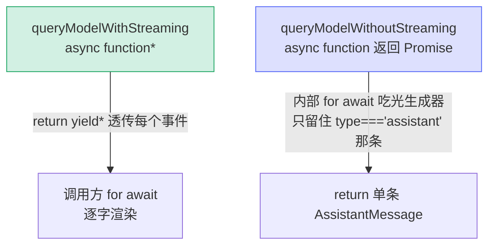

# [0] queryModel 包装层总览

> `queryModel()`（`claude.ts:1303`）已经在隔壁 `queryModel/` 系列里逐段讲过了。但你在 `query.ts` 或 `QueryEngine` 里**永远不会看到 `queryModel(...)` 这个调用**——它被刻意藏在两个入口函数后面。本系列讲的就是这层"门面"：两个包装入口、它们共享的 VCR 录放层、以及一圈支撑性的 helper 函数。

---

## 一、为什么需要"包装层"

`queryModel` 是个 `async function*`（异步生成器），直接用它有三个麻烦：

1. **流式 vs 非流式**：REPL 要逐字渲染（消费每个 yield），但 compact / extract_memories 等辅助查询只想要"最终那条 assistant 消息"，不关心中间事件。
2. **测试录放（VCR）**：CI 里不能真的打 Anthropic API，需要一层透明的"录一次、之后回放 fixture"机制。
3. **统一日志 + abort 兜底**：每次调用都要打开始/结束日志；用户中途 ESC 时要抛出可识别的 `APIUserAbortError` 而不是通用错误。

把这些横切关注点塞进 `queryModel` 本体会让它更臃肿，所以拆成了薄包装。

```
QueryEngine / query.ts
        │
        ├─ 要逐字流？ ──▶ queryModelWithStreaming()      claude.ts:1022
        │                      │
        └─ 只要结果？ ──▶ queryModelWithoutStreaming()   claude.ts:963
                               │
            两者都 ▶ withStreamingVCR(messages, () => queryModel(...))   vcr.ts:352
                               │
                               ▼
                         queryModel()      claude.ts:1303（本系列不重复讲）
```

> 一句话定位：**包装层 = "流式/非流式选择 + VCR 录放 + 日志/abort 兜底"三件横切事务的归处**。它上面是对话逻辑，下面是 `queryModel` 这台 2100 行的传输引擎。

> 🔗 **交叉引用**：下游那台 2100 行的传输引擎 `queryModel` 本体（请求构建 / 发送 / 流式解析 / 错误降级，6 大阶段 16 小节）拆在姊妹系列 [`queryModel/`](../../queryModel/[0]overview/overview.mdx) 里。本系列只讲它的外圈包装与周边 helper。

---

## 二、本系列覆盖的代码

| 小节 | 函数 / 主题 | 位置 |
|---|---|---|
| `[1]streaming-wrapper` | `queryModelWithStreaming` | `claude.ts:1022-1054` |
| `[2]nonstreaming-wrapper` | `queryModelWithoutStreaming` | `claude.ts:963-1020` |
| `[3]vcr-layer` | `withStreamingVCR` + `withVCR` / `shouldUseVCR` / 脱水水合 | `vcr.ts:26-383` |
| `[4]nonstreaming-fallback-engine` | `executeNonStreamingRequest` + `getNonstreamingFallbackTimeoutMs` | `claude.ts:1079-1196` |
| `[5]helpers` | `shouldDeferLspTool` / `getPreviousRequestIdFromMessages` / `stripExcessMediaItems` | `claude.ts:1060-1292` |

> 注意 `[4]` 的 `executeNonStreamingRequest` **不是入口包装**，而是 `queryModel` 里 `[15]error-fallback` 一节调用的"非流式降级引擎"——流式请求失败后改用它重发。放在本系列是因为它和两个入口一样属于"queryModel 的外圈"，理解它能补全降级闭环。

---

## 三、两个入口的差异（核心对照）

两个入口的函数体几乎一样——都只是 `withStreamingVCR(messages, () => queryModel(...))`——差别全在**怎么消费这个生成器**。



| 维度 | `queryModelWithStreaming` | `queryModelWithoutStreaming` |
|---|---|---|
| 函数形态 | `async function*`（生成器） | `async function`（返回 Promise） |
| 返回 | 逐个 yield StreamEvent / AssistantMessage / Error | 单条 `AssistantMessage` |
| 谁在消费生成器 | **调用方**（`for await`） | **自己内部** `for await` 吃光 |
| 典型场景 | REPL 主线程、子 agent 实时输出 | compact、extract_memories、queryHaiku 等辅助查询 |
| abort 处理 | 透传，由调用方处理 | 自己判断 `signal.aborted` → 抛 `APIUserAbortError` |
| 为什么 | UI 要逐字打字效果 | 调用方只关心最终结构化结果 |

> **关键细节**：非流式入口必须**把生成器消费到底**（哪怕只要最后一条），因为 `queryModel` 把成功日志 `logAPISuccessAndDuration` 放在所有 yield **之后**。提前 break 会漏掉日志和收尾。详见 `[2]`。

---

## 四、贯穿包装层的几条"暗线"

### 4.1 暗线 A：生成器消费的完整性

非流式入口的注释明确写着"继续消费生成器，确保 `logAPISuccessAndDuration` 会被调用"。生成器的 `finally`（资源释放、成本统计、langfuse）只有在迭代真正走完或被 `.return()` 时才触发——所以"吃光"不是浪费，是正确性要求（`[2]` `[3]`）。

### 4.2 暗线 B：VCR 对生产环境零开销

`withStreamingVCR` 第一行就是 `if (!shouldUseVCR()) return yield* f()`——非测试环境直接透传，**没有任何 buffer、哈希、文件 IO**。只有 `NODE_ENV==='test'` 或内部用户显式 `FORCE_VCR=1` 才进入录放逻辑（`[3]`）。

### 4.3 暗线 C：fixture 的"脱水/水合"

VCR 要让同一段对话在不同机器、不同 cwd、不同 UUID 下都命中同一个 fixture 文件，所以哈希前要把路径、UUID、时间戳、耗时、成本统统替换成占位符（`dehydrateValue`），回放时再换回真实值（`hydrateValue`）。否则 CI 永远命不中缓存（`[3]`）。

### 4.4 暗线 D：非流式降级的有界超时

`executeNonStreamingRequest` 用 `getNonstreamingFallbackTimeoutMs()` 给每次尝试套一个超时（远端会话 120s / 否则 300s），目的是让"卡死的后端"得到干净的 `APIConnectionTimeoutError`，而不是一直挂到容器被 SIGKILL（`[4]`）。

---

## 五、Options —— 穿过包装层的"参数大包"

两个入口、`queryModel`、降级引擎都共用同一个 `options: Options` 配置对象（`claude.ts:771-961`，约 30 个字段）。它不是本系列的主角，但每节都会引用其中几个字段，先建立印象：

| 字段族 | 代表字段 | 用途 |
|---|---|---|
| 模型选择 | `model` / `fallbackModel` / `advisorModel` | 主模型、529 降级模型、顾问模型 |
| 来源标识 | `querySource` | 遥测、缓存 TTL、agentic 判定、重试策略 |
| 缓存控制 | `enablePromptCaching` / `skipCacheWrite` | prompt 缓存开关与断点位置 |
| 推理控制 | `effortValue` / `temperatureOverride` / `fastMode` | 思考力度、温度、快速模式 |
| 回调 | `onStreamingFallback` / `addNotification` | 降级通知、TUI 横幅 |
| 可观测 | `langfuseTrace` / `queryTracking` / `agentId` | trace span、调用链归因 |

> 完整字段注释见 `claude.ts:771-961`。本系列只在用到时点名。

---

## 六、关键行号书签

| 内容 | 位置 |
|---|---|
| `queryModelWithoutStreaming` 定义 | `claude.ts:963` |
| `queryModelWithStreaming` 定义 | `claude.ts:1022` |
| `shouldDeferLspTool` | `claude.ts:1060` |
| `getNonstreamingFallbackTimeoutMs` | `claude.ts:1079` |
| `executeNonStreamingRequest` | `claude.ts:1090` |
| `getPreviousRequestIdFromMessages` | `claude.ts:1205` |
| `stripExcessMediaItems` | `claude.ts:1233` |
| `Options` 类型 | `claude.ts:771-961` |
| `withStreamingVCR` | `vcr.ts:352` |
| `withVCR` | `vcr.ts:91` |
| `shouldUseVCR` | `vcr.ts:26` |

---

## 速记口诀

- **一句话**：包装层 = 流式/非流式选择 + VCR 录放 + 日志/abort 兜底，三件横切事务的归处。
- **两个入口同体异消费**：函数体都是 `withStreamingVCR(() => queryModel(...))`，差别在生成器是"调用方消费"还是"自己吃光"。
- **非流式必须吃光生成器**：成功日志和 finally 收尾在所有 yield 之后。
- **VCR 生产零开销**：`shouldUseVCR()` 为假就直接透传。
- **脱水水合**：fixture 哈希前把路径/UUID/时间戳换占位符，跨机命中。
- **降级有界超时**：`executeNonStreamingRequest` 给每次尝试套 120s/300s，卡死后端干净超时。
