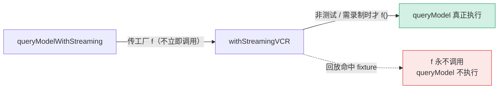

# [1] 流式入口 `queryModelWithStreaming`

> 这是 REPL "逐字打字"效果的源头。`query.ts` 的回合循环里，主线程查询和子 agent 的实时输出都从这里进入传输层。函数体短到只有两行实质代码，但每一处写法都有讲究。

---

## 一、完整代码

```typescript
export async function* queryModelWithStreaming({
  messages,
  systemPrompt,
  thinkingConfig,
  tools,
  signal,
  options,
}: {
  messages: Message[]
  systemPrompt: SystemPrompt
  thinkingConfig: ThinkingConfig
  tools: Tools
  signal: AbortSignal
  options: Options
}): AsyncGenerator<
  StreamEvent | AssistantMessage | SystemAPIErrorMessage,
  void
> {
  logForDebugging(
    `-------------- queryModelWithStreaming 开始 ----------- model=${options.model} messages=${messages.length} tools=${tools.length} source=${options.querySource}`,
    { level: 'info' },
  )
  return yield* withStreamingVCR(messages, async function* () {
    yield* queryModel(
      messages,
      systemPrompt,
      thinkingConfig,
      tools,
      signal,
      options,
    )
  })
}
```

就这些。一条开始日志 + 一行 `return yield*`。

---

## 二、签名：`async function*` 与三类 yield

入口本身也是**异步生成器**，因为它要把 `queryModel` 逐个 yield 的事件原封不动传出去：

| yield 类型 | 含义 | 谁来用 |
|---|---|---|
| `StreamEvent` | 原始 SSE 事件（逐帧信号） | UI 实时渲染 |
| `AssistantMessage` | 累积好的完整内容块 | 存档 / 解析 tool_use |
| `SystemAPIErrorMessage` | API 错误（限流、拒答等） | 错误展示 / 降级 |

返回类型第二个泛型参数是 `void`——生成器的 `return` 值不携带信息，所有有用数据都通过 `yield` 流出。调用方写 `for await (const ev of queryModelWithStreaming(...))` 消费。

> 对照 `[0]` 的总览：三类 yield 的定义和 `queryModel` 完全一致，因为这一层**什么都不改、只透传**。

---

## 三、`return yield* withStreamingVCR(...)` 逐字拆解

这一行密度很高，拆成三个语法点：

### 3.1 `yield*`（委托生成器）

`yield*` 把"迭代另一个生成器"这件事整个委托出去：`withStreamingVCR(...)` 每 yield 一个值，当前函数就替它 yield 一个同样的值，直到内层结束。等价于手写：

```typescript
for await (const ev of withStreamingVCR(messages, gen)) {
  yield ev
}
```

但 `yield*` 更短、且能正确转发 `return` 值和 `.throw()`/`.return()` 信号——生成器的提前终止（调用方 break）能穿透到内层，触发 `queryModel` 的 `finally` 清理。

### 3.2 `return yield*`（把委托结果当返回值）

`yield*` 表达式本身会"求值为"内层生成器的 `return` 值。这里内层返回 `void`，所以 `return` 没有实际数据意义。写成 `return yield*` 是一种**惯用法**，表达"委托完这个生成器，本函数也就结束了，后面没有别的事"。

> 等价于 `yield* ...; return`。用 `return yield*` 只是更紧凑地声明"这是最后一件事"。

### 3.3 箭头里的 `async function* () { yield* queryModel(...) }`

为什么不直接 `withStreamingVCR(messages, queryModel(...))`？因为 `withStreamingVCR` 的第二个参数签名是**一个生成器工厂**，不是生成器本身：

```typescript
withStreamingVCR(
  messages: Message[],
  f: () => AsyncGenerator<StreamEvent | AssistantMessage | SystemAPIErrorMessage, void>,
)
```

传**工厂函数 `f`** 而不是**已经启动的生成器**，是为了让 VCR **决定要不要真的调用它**：

- 回放命中 fixture 时，`withStreamingVCR` 根本不会调用 `f()`——`queryModel` 一次都不执行，更不会发网络请求。
- 只有需要"录制"或非测试透传时，才调用 `f()` 真正启动 `queryModel`。

如果直接传 `queryModel(...)`，那它**已经被调用、生成器已创建**，懒加载就失效了。包一层箭头生成器工厂，才能把"是否执行"的决定权交给 VCR 层（详见 `[3]`）。



---

## 四、它没做什么（和非流式入口的对照）

流式入口的"克制"恰恰是重点。对比 `[2]` 的非流式入口：

| 行为 | 流式入口 | 非流式入口 |
|---|---|---|
| 消费生成器 | ❌ 不消费，透传给调用方 | ✅ 自己 `for await` 吃光 |
| abort 特殊处理 | ❌ 不管，透传 | ✅ 判断 `signal.aborted` 抛 `APIUserAbortError` |
| "no assistant message" 兜底 | ❌ 没有 | ✅ 有 |
| 结束日志的丰富度 | 只有开始日志 | 开始 + 三种结束日志（正常/aborted/无消息） |

为什么流式入口这么"懒"？因为**它把控制权交给了调用方**。调用方（`query.ts` / REPL）在 `for await` 循环里自己处理 abort、自己决定何时 break、自己累积消息。流式入口只需保证"事件能逐个流出来"。

> **类比**：流式入口像一根**透明水管**——水（事件）从 `queryModel` 那头进来，原样从这头流出，水管本身不蓄水、不过滤。非流式入口则像一个**接水的桶**——自己把水接满，最后把桶递出去。

---

## 五、abort 信号去哪了

注意 `signal: AbortSignal` 被原样传给了内层 `queryModel`，但流式入口**自己不检查 `signal.aborted`**。这是合理的分工：

- `queryModel` 内部会把 `signal` 传给 Anthropic SDK，用户 ESC 时 SDK 直接抛 `APIUserAbortError`，沿生成器冒泡出来。
- 调用方在 `for await` 里捕获这个错误，或调用方主动 break/`.return()`，都会触发内层 `finally`。

所以流式路径的 abort 是**靠异常和生成器终止天然传播**的，不需要入口层显式判断。非流式入口之所以要显式判断，是因为它"吃光生成器后发现一条 assistant 都没有"时，需要区分"是被中止了"还是"真的出了别的错"（详见 `[2]`）。

---

## 六、关键行号书签

| 内容 | 位置 |
|---|---|
| `queryModelWithStreaming` 定义 | `claude.ts:1022` |
| 开始日志 `logForDebugging` | `claude.ts:1040` |
| `return yield* withStreamingVCR(...)` | `claude.ts:1044` |
| 箭头生成器工厂内 `yield* queryModel(...)` | `claude.ts:1045-1052` |
| `withStreamingVCR` 定义 | `vcr.ts:352` |

---

## 速记口诀

- **身份**：REPL 逐字打字的源头，流式查询的入口。
- **两行而已**：开始日志 + `return yield* withStreamingVCR(() => queryModel(...))`。
- **透明水管**：不消费、不蓄水、不过滤，事件原样流给调用方。
- **传工厂不传生成器**：让 VCR 决定 `queryModel` 要不要真的执行（回放命中就不执行）。
- **abort 靠传播**：`signal` 透传给 `queryModel`，异常/生成器终止天然冒泡，入口层不显式判断。
- **`return yield*`**：惯用法，等价 `yield*; return`，声明"委托完即结束"。
