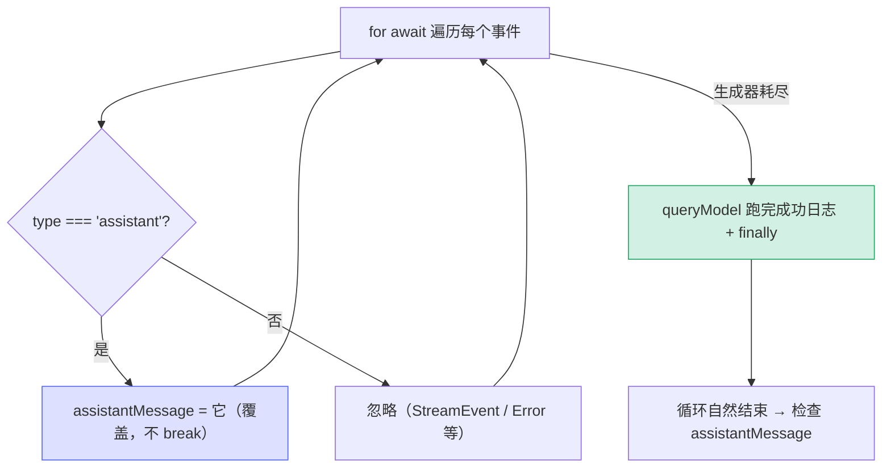

# [2] 非流式入口 `queryModelWithoutStreaming`

> 不是所有调用方都想要"逐字流"。compact（上下文压缩）、extract_memories（记忆提取）、queryHaiku（小模型辅助）等场景只关心**最终那条 assistant 消息**，中间的逐帧事件对它们是噪音。这个入口把流式生成器"收敛"成一个 `Promise<AssistantMessage>`。

---

## 一、完整代码

```typescript
export async function queryModelWithoutStreaming({
  messages,
  systemPrompt,
  thinkingConfig,
  tools,
  signal,
  options,
}: {
  messages: Message[]
  systemPrompt: SystemPrompt
  thinkingConfig: ThinkingConfig
  tools: Tools
  signal: AbortSignal
  options: Options
}): Promise<AssistantMessage> {
  logForDebugging(
    `-------------- queryModelWithoutStreaming 开始 ----------- messages=${messages.length} model=${options.model} tools=${tools.length} source=${options.querySource}`,
    { level: 'info' },
  )
  // 存下 assistant 消息，但继续消费生成器，确保 logAPISuccessAndDuration
  // 会被调用（它在所有 yield 之后发生）
  let assistantMessage: AssistantMessage | undefined
  for await (const message of withStreamingVCR(messages, async function* () {
    yield* queryModel(
      messages, systemPrompt, thinkingConfig, tools, signal, options,
    )
  })) {
    if (message.type === 'assistant') {
      assistantMessage = message as AssistantMessage
    }
  }
  if (!assistantMessage) {
    // 如果 signal 已中止，抛出 APIUserAbortError 而非通用错误
    if (signal.aborted) {
      logForDebugging(`------------ queryModelWithoutStreaming 结束 (aborted) ---------`, { level: 'warn' })
      throw new APIUserAbortError()
    }
    logForDebugging(`------------ queryModelWithoutStreaming 结束 (no_assistant_message) ---------`, { level: 'error' })
    throw new Error('No assistant message found')
  }
  logForDebugging(`------------ queryModelWithoutStreaming 结束 --------- model=${options.model}`, { level: 'info' })
  return assistantMessage
}
```

与流式入口共用同样的内核——`withStreamingVCR(messages, () => queryModel(...))`——但这里**自己把生成器消费掉**，不再把事件透传出去。

---

## 二、返回类型对照流式入口

| | 流式入口 `[1]` | 非流式入口（本节） |
|---|---|---|
| 函数 | `async function*` | `async function` |
| 返回 | `AsyncGenerator<…, void>` | `Promise<AssistantMessage>` |
| 谁消费生成器 | 调用方 | **自己** |
| 给调用方的东西 | 一串事件流 | **一条**最终消息 |

> 形象地说：流式入口把"半成品的水流"递出去；非流式入口在屋里把水接满，最后递出"一桶成品"。

---

## 三、⭐ 为什么必须"吃光"生成器

最容易被误改的就是这个 `for await` 循环。直觉上你可能想"拿到 assistant 消息就 `break`"——但代码故意不这么做，注释也写明了原因：

```typescript
// 存下 assistant 消息，但继续消费生成器，确保 logAPISuccessAndDuration
// 会被调用（它在所有 yield 之后发生）
let assistantMessage: AssistantMessage | undefined
for await (const message of ...) {
  if (message.type === 'assistant') {
    assistantMessage = message as AssistantMessage   // 只记录，不 break
  }
}
```

### 3.1 关键事实：成功日志在所有 yield 之后

`queryModel` 的结构是"yield 完所有事件 → 调 `logAPISuccessAndDuration` → finally 收尾"。`logAPISuccessAndDuration` 记录请求耗时、token 用量、成本等关键遥测。如果消费方在拿到 assistant 消息后**提前 break**：

- `for await` 提前退出会触发生成器的 `.return()`，跳进 `finally`——**但 `finally` 之前那段成功日志代码被跳过了**。
- 结果：这次成功的请求没有被正确记录耗时/成本，遥测出现黑洞。

所以"赋值但不 break、把循环走完"是**正确性约束**，不是冗余。

### 3.2 为什么用"最后一条 assistant"

循环里每遇到 `type==='assistant'` 就**覆盖** `assistantMessage`。正常一次查询通常只产生一条 assistant 消息，但写成"保留最后一条"更稳健——即便上游某天 yield 多条（如内容块分段聚合），也总能拿到最完整/最终的那条。



---

## 四、no-assistant-message 的双分支兜底

循环结束后若 `assistantMessage` 仍是 `undefined`，说明这次查询**一条 assistant 都没产出**。这时要区分两种截然不同的原因：

```typescript
if (!assistantMessage) {
  if (signal.aborted) {
    // 分支 A：用户主动中止
    throw new APIUserAbortError()
  }
  // 分支 B：真的出了别的错
  throw new Error('No assistant message found')
}
```

| 分支 | 条件 | 抛出 | 日志级别 | 含义 |
|---|---|---|---|---|
| A | `signal.aborted` 为真 | `APIUserAbortError` | `warn` | 用户 ESC / 调用方取消，**不是 bug** |
| B | 否则 | `Error('No assistant message found')` | `error` | 异常状态，需要排查 |

### 为什么要专门判断 aborted

如果不判断，所有"无消息"情况都抛通用 `Error`，调用方就无法区分"用户取消了"和"系统坏了"。而 `APIUserAbortError` 是一个**可被上层识别并优雅处理**的专用错误——`query.ts` 看到它就知道"这是正常取消，安静收尾即可，别报错给用户"。

> **对照流式入口**：`[1]` 不需要这套判断，因为它把 abort 异常直接透传给调用方，由调用方在 `for await` 外层 catch。非流式入口"吞掉"了生成器，所以必须自己把 abort 语义重新表达成一个错误抛出去。

---

## 五、三种结束日志

非流式入口有**三条**结束日志，分别对应三种出口，日志级别精心区分：

| 出口 | 日志文案 | level |
|---|---|---|
| 正常返回 | `结束 --------- model=...` | `info` |
| 用户中止 | `结束 (aborted)` | `warn` |
| 无消息异常 | `结束 (no_assistant_message)` | `error` |

加上开头一条 `开始` 日志（`info`），一次调用在日志里有清晰的"开始 → 某种结束"配对，便于在 debug 日志里定位每次辅助查询的生命周期和结局。

---

## 六、谁在用这个入口

非流式入口的典型调用方都是"辅助查询"——它们不面向终端逐字渲染，只要一个结构化结果：

| 调用方 | 用途 |
|---|---|
| compact | 把长对话压缩成摘要，只要那段摘要文本 |
| extract_memories | 从对话提取记忆条目 |
| `queryHaiku` / `queryWithModel` | 小模型/指定模型的一次性问答（`claude.ts:3796 / 3855`） |
| 各类 side_question | 标题生成、命令建议等后台查询 |

这些场景在**穷鬼模式**下可能被整体跳过（见 `poorMode`），因为它们额外消耗 token。

---

## 七、关键行号书签

| 内容 | 位置 |
|---|---|
| `queryModelWithoutStreaming` 定义 | `claude.ts:963` |
| 开始日志 | `claude.ts:978` |
| "吃光生成器"注释 | `claude.ts:982-983` |
| `for await` 消费循环 | `claude.ts:985-998` |
| no-assistant 兜底 + aborted 分支 | `claude.ts:999-1014` |
| 正常返回 | `claude.ts:1015-1019` |

---

## 速记口诀

- **身份**：辅助查询（compact / extract_memories / queryHaiku）的入口，返回 `Promise<AssistantMessage>`。
- **接水成桶**：内部 `for await` 吃光生成器，只留最后一条 assistant 消息。
- **绝不提前 break**：成功日志 `logAPISuccessAndDuration` 在所有 yield 之后，break 会丢遥测。
- **双分支兜底**：无消息时，`signal.aborted` → `APIUserAbortError`（warn）；否则 → 通用 Error（error）。
- **三条结束日志**：正常 info / aborted warn / no_assistant_message error，出口一目了然。
- **对照 [1]**：流式透传 abort，非流式必须把 abort 重新表达成错误抛出。
