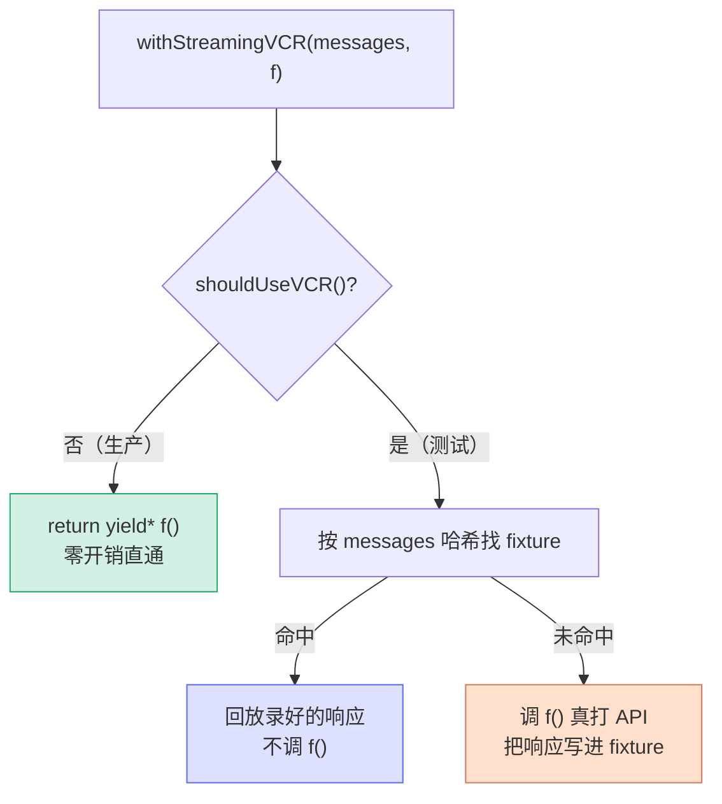

# [3] VCR 录放层 `withStreamingVCR`

> 两个入口（`[1]` `[2]`）的函数体里都有这一行：`withStreamingVCR(messages, () => queryModel(...))`。它不在 `claude.ts` 而在 `src/services/vcr.ts`。VCR 取自磁带录像机的缩写——**第一次跑真实请求时把响应"录"进 fixture 文件，之后的测试直接"放"录像，不再打网络**。

---

## 一、VCR 模式解决什么问题

单元/集成测试里调真实 Anthropic API 有三宗罪：**慢、要花钱、不确定**（同样输入每次输出还不一样）。VCR 模式的思路：

1. **录制（record）**：第一次运行，真的调 API，把请求+响应序列化进 `fixtures/*.json`。
2. **回放（replay）**：之后运行，用请求的哈希找到 fixture，直接返回录好的响应——不碰网络。
3. **CI 守门**：CI 里如果 fixture 缺失且没开 `VCR_RECORD`，直接报错"fixture missing，请本地录制后提交"。



---

## 二、`shouldUseVCR()` —— 三态判定与生产零开销

```typescript
function shouldUseVCR(): boolean {
  if (process.env.NODE_ENV === 'test') {
    return true
  }
  if (process.env.USER_TYPE === 'ant' && isEnvTruthy(process.env.FORCE_VCR)) {
    return true
  }
  return false
}
```

| 触发条件 | 谁会命中 |
|---|---|
| `NODE_ENV === 'test'` | 所有自动化测试 |
| `USER_TYPE === 'ant'` 且 `FORCE_VCR` 真值 | 内部用户手动录制 fixture 时 |
| 其它 | **生产 / 普通用户 → 返回 false** |

这是 `[0]` 提到的**暗线 B**：生产环境 `shouldUseVCR()` 返回 `false`，`withStreamingVCR` 第一行就直接透传，**不产生任何 buffer、哈希、文件 IO**。VCR 的所有开销只存在于测试。

---

## 三、`withStreamingVCR` —— 流式录放

```typescript
export async function* withStreamingVCR(
  messages: Message[],
  f: () => AsyncGenerator<StreamEvent | AssistantMessage | SystemAPIErrorMessage, void>,
): AsyncGenerator<StreamEvent | AssistantMessage | SystemAPIErrorMessage, void> {
  if (!shouldUseVCR()) {
    return yield* f()            // ① 生产：直通
  }

  const buffer: (StreamEvent | AssistantMessage | SystemAPIErrorMessage)[] = []

  const cachedBuffer = await withVCR(messages, async () => {
    for await (const message of f()) {   // ② 把整条流灌进 buffer
      buffer.push(message)
    }
    return buffer
  })

  if (cachedBuffer.length > 0) {
    yield* cachedBuffer          // ③ 命中缓存：回放录像
    return
  }

  yield* buffer                  // ④ 刚录的：回放刚录进 buffer 的
}
```

### 逐段理解

- **①** 非测试直通，对照 `[1]`：这就是为什么入口要传"工厂函数 `f`"而不是已启动的生成器——这里要么不调 `f`，要么在受控时机调。
- **②** 测试模式下，流式生成器**不能边到边回放**（要先有完整录像才能算哈希、写文件），所以先用 `for await` 把 `f()` 的全部事件**收进 `buffer`**。这一步把"流"暂时变成"数组"。
- **③④** `withVCR` 要么返回**命中的缓存数组**（`cachedBuffer.length > 0`），要么返回**刚录的 `buffer` 本身**。两种情况都用 `yield*` 把数组重新"流式"地吐出去，对上层完全透明。

> **流 → 数组 → 流** 的往返是流式 VCR 的本质：录像必须是完整的数组才能哈希和持久化，但对入口和调用方，进出都还是生成器。

---

## 四、`withVCR` —— fixture 命中、读写、计费

`withStreamingVCR` 把脏活都委托给 `withVCR`（`vcr.ts:91`）。它做四件事：

### 4.1 算 fixture 文件名（按消息内容哈希）

```typescript
const messagesForAPI = normalizeMessagesForAPI(
  messages.filter(_ => !(_.type === 'user' && _.isMeta)),   // 过滤掉 meta 用户消息
)
const dehydratedInput = mapMessages(
  messagesForAPI.map(_ => _.message.content),
  dehydrateValue,                                            // ★ 脱水
)
const filename = join(
  process.env.CLAUDE_CODE_TEST_FIXTURES_ROOT ?? getCwd(),
  `fixtures/${dehydratedInput
    .map(_ => createHash('sha1').update(jsonStringify(_)).digest('hex').slice(0, 6))
    .join('-')}.json`,
)
```

文件名是**每条消息内容各取 sha1 前 6 位、用 `-` 拼起来**。这样输入消息一变，文件名就变，自然定位到不同 fixture。注意哈希前先 `dehydrateValue`（见第五节），这是跨机命中的关键。

### 4.2 命中缓存：水合 + 计费

```typescript
const cached = jsonParse(await readFile(filename, 'utf8')) as { output: (...)[] }
cached.output.forEach(addCachedCostToTotalSessionCost)        // 把缓存响应的成本计回会话
return cached.output.map((message, index) =>
  mapMessage(message, hydrateValue, index, randomUUID()),     // ★ 水合 + 发新 UUID
)
```

- **水合**：把 fixture 里的占位符换回当前机器的真实值（`hydrateValue`）。
- **发新 UUID**：每条回放消息分配一个新 `randomUUID()`，模拟真实响应每次都带新 ID。
- **计费**：即使是回放，也把录好的 token 成本累加进会话总成本——让测试里的成本统计逻辑也能被验证。

### 4.3 未命中 + CI 守门

```typescript
if (env.isCI && !isEnvTruthy(process.env.VCR_RECORD)) {
  throw new Error(`Anthropic API fixture missing: ${filename}. Re-run tests with VCR_RECORD=1, then commit the result. ...`)
}
```

CI 里**绝不允许临时真打 API**。fixture 缺了就报错，提示开发者本地用 `VCR_RECORD=1` 录好再提交。

### 4.4 录制：跑 `f()` + 写 fixture

```typescript
const results = await f()              // 真打 API
await mkdir(dirname(filename), { recursive: true })
await writeFile(filename, jsonStringify({
  input: dehydratedInput,
  output: results.map((m, i) => mapMessage(m, dehydrateValue, i)),   // ★ 写入前也脱水
}, null, 2))
return results
```

写文件时 input 和 output 都**脱水后**存——这样 fixture 文件本身不含机器特定路径/UUID，可以安全提交到仓库、跨机复用。

---

## 五、⭐ 核心难点：脱水（dehydrate）与水合（hydrate）

这是整个 VCR 最精巧的部分，也是 `[0]` 暗线 C。

### 5.1 问题：为什么不能直接哈希原始消息

系统提示和消息里嵌着**机器/运行特定的易变值**：当前工作目录 `cwd`、配置目录、消息 UUID、时间戳、耗时、成本……同一段对话在两台机器（或同一台机器两次运行）上，这些值都不同。若直接哈希，**每次哈希都不一样，fixture 永远命不中**，CI 里只会不停报"fixture missing"。

### 5.2 `dehydrateValue`：把易变值换成占位符

```typescript
s.replace(/num_files="\d+"/g, 'num_files="[NUM]"')
 .replace(/duration_ms="\d+"/g, 'duration_ms="[DURATION]"')
 .replace(/cost_usd="\d+"/g, 'cost_usd="[COST]"')
 .replaceAll(configHome, '[CONFIG_HOME]')
 .replaceAll(cwd, '[CWD]')
 .replace(/Available commands:.+/, 'Available commands: [COMMANDS]')
// …Windows 上还处理正斜杠变体、JSON 转义的双反斜杠…
// 最后把 [CWD]\foo\bar 里的反斜杠统一成正斜杠，跨平台一致
```

| 易变值 | 占位符 |
|---|---|
| 文件数 / 耗时 / 成本 | `[NUM]` `[DURATION]` `[COST]` |
| 配置目录 / 工作目录 | `[CONFIG_HOME]` `[CWD]` |
| 可用命令列表 | `[COMMANDS]` |
| "Files modified by user: …" 整行 | 直接折叠成固定串 |

Windows 还要额外处理三种路径形态：正斜杠变体、JSON 里转义的 `\\`、以及占位符后路径分隔符统一成 `/`——否则 Win 和 Unix 的 fixture 哈希对不上。

### 5.3 `hydrateValue`：回放时换回真实值

```typescript
s.replaceAll('[NUM]', '1')
 .replaceAll('[DURATION]', '100')
 .replaceAll('[CONFIG_HOME]', getClaudeConfigHomeDir())
 .replaceAll('[CWD]', getCwd())
```

水合是脱水的逆操作（部分）：路径占位符换回**当前机器**的真实路径；`[NUM]`/`[DURATION]` 换成无害的固定值（`1`/`100`，反正测试不关心具体数字）。

> **对称性**：脱水让"不同机器的相同对话"产出**相同哈希** → 命中同一个 fixture；水合让"回放的响应"看起来像是在**当前机器**上真实产生的。一进一出，缓存就能跨机复用。

---

## 六、`withFixture` —— 通用 fixture 辅助

`withVCR` 是给"流式消息数组"定制的；还有一个泛型版 `withFixture<T>`（`vcr.ts:42`）给任意数据用（如 token 计数 `withTokenCountVCR`）：

```typescript
async function withFixture<T>(input, fixtureName, f): Promise<T> {
  if (!shouldUseVCR()) return await f()
  const hash = createHash('sha1').update(jsonStringify(input)).digest('hex').slice(0, 12)
  const filename = `fixtures/${fixtureName}-${hash}.json`
  // try 读缓存 → 命中返回；ENOENT → CI 守门 / 录制写文件
}
```

同样的"哈希输入 → 读缓存 → 命中即返回 / 未命中则录制"骨架，只是不带消息特有的脱水/水合和计费逻辑。

---

## 七、关键行号书签

| 内容 | 位置 |
|---|---|
| `shouldUseVCR` | `vcr.ts:26` |
| `withFixture`（泛型） | `vcr.ts:42` |
| `withVCR`（消息数组） | `vcr.ts:91` |
| `addCachedCostToTotalSessionCost` | `vcr.ts:166` |
| `dehydrateValue`（脱水） | `vcr.ts:~290` |
| `hydrateValue`（水合） | `vcr.ts:341` |
| `withStreamingVCR`（流式） | `vcr.ts:352` |
| `withTokenCountVCR` | `vcr.ts:385` |

---

## 速记口诀

- **VCR = 录像机**：第一次真打 API 录进 fixture，之后回放，不碰网络。
- **生产零开销**：`shouldUseVCR()` 仅在 `NODE_ENV=test` 或内部 `FORCE_VCR` 时为真，否则第一行直通。
- **流 → 数组 → 流**：流式录放先把生成器灌进 buffer 才能哈希/持久化，回放再 `yield*` 成流。
- **脱水/水合是关键**：哈希前把 cwd/UUID/时间戳/成本换占位符（dehydrate），回放再换回真实值（hydrate），否则跨机永远命不中。
- **CI 守门**：fixture 缺失且无 `VCR_RECORD` → 直接报错，逼你本地录好再提交。
- **回放也计费**：缓存响应的 token 成本照样累加进会话，让成本逻辑可测。
