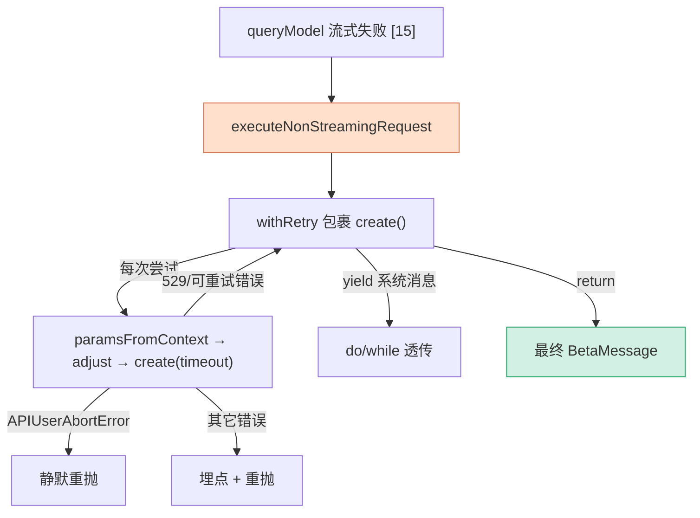

# [4] 非流式降级引擎 `executeNonStreamingRequest`

> 这是本系列里**唯一不是"入口包装"**的函数。它属于 `queryModel` 的降级路径：流式请求挂了之后（`queryModel` 的 `[15]error-fallback`），与其直接把错误抛给用户，不如**换一种姿势再试一次**——关掉流式、用一次性的非流式请求重发。这个函数就是那条退路的执行引擎。

---

## 一、它在降级链里的位置

回顾 `queryModel` 总览（`queryModel/[0]overview`）的"多层降级"暗线：

```
流式请求
 ├─ 用户 ESC          → 直接抛 APIUserAbortError
 ├─ 流中途出错        → ★ 改走 executeNonStreamingRequest（非流式重发）
 ├─ 404 流端点        → ★ 同上
 └─ withRetry 耗尽    → FallbackTriggeredError → 上抛给 query.ts 切模型
```

带 ★ 的两条退路都落到本函数。它把"非流式请求 + 重试 + 超时 + 埋点"打包成一个可复用的异步生成器，`queryModel` 的两处降级点共用它，避免重复代码。

> 它 `yield` 的是 `SystemAPIErrorMessage`（重试过程中的系统消息），`return` 的是最终的 `BetaMessage`（成功响应）。调用方（`queryModel`）迭代它、透传系统消息、拿到最终 BetaMessage 再转成 AssistantMessage。

---

## 二、`getNonstreamingFallbackTimeoutMs()` —— 有界超时

降级时每次尝试都要套一个超时，值由这个函数决定：

```typescript
function getNonstreamingFallbackTimeoutMs(): number {
  const override = parseInt(process.env.API_TIMEOUT_MS || '', 10)
  if (override) return override
  return isEnvTruthy(process.env.CLAUDE_CODE_REMOTE) ? 120_000 : 300_000
}
```

| 场景 | 超时 | 原因 |
|---|---|---|
| 设了 `API_TIMEOUT_MS` | 取该值 | 让慢后端和流式路径共享同一上限 |
| 远端会话（`CLAUDE_CODE_REMOTE`） | **120s** | 低于 CCR 容器约 5 分钟的空闲杀死阈值 |
| 普通本地 | **300s** | 覆盖慢后端，又不逼近 API 的 10 分钟非流式上限 |

### 为什么远端要更短

注释点明了关键权衡：远端会话跑在 CCR 容器里，容器有个约 **5 分钟空闲就 SIGKILL** 的阈值。如果降级请求卡住，必须在容器被杀**之前**主动超时——这样能拿到一个**干净的 `APIConnectionTimeoutError`**（可记录、可继续降级），而不是整个进程被 SIGKILL（什么诊断信息都留不下）。120s 远低于 5 分钟，留足了余量。

> 这是 `[0]` 暗线 D：**有界超时把"无声卡死"变成"可观测的超时错误"**。

---

## 三、`executeNonStreamingRequest` 的六个参数

函数签名很长，因为它把"可变的部分"都做成了回调，自己只管编排：

```typescript
export async function* executeNonStreamingRequest(
  clientOptions: { model; fetchOverride?; source },
  retryOptions: { model; fallbackModel?; thinkingConfig; fastMode?; signal; initialConsecutive529Errors?; querySource? },
  paramsFromContext: (context: RetryContext) => BetaMessageStreamParams,
  onAttempt: (attempt, start, maxOutputTokens) => void,
  captureRequest: (params: BetaMessageStreamParams) => void,
  originatingRequestId?: string | null,
): AsyncGenerator<SystemAPIErrorMessage, BetaMessage>
```

| 参数 | 角色 |
|---|---|
| `clientOptions` | 创建 Anthropic 客户端要的料：模型、`fetchOverride`（dump 调试）、`source`（来源标识） |
| `retryOptions` | 喂给 `withRetry` 的策略：主/降级模型、思考配置、fastMode、signal、初始 529 计数、querySource |
| `paramsFromContext` | **闭包**：根据每次重试的 `context` 算出这次的请求体（thinking、temperature、缓存断点等）。来自 `queryModel` 的 `[10]params-from-context` |
| `onAttempt` | 每次尝试开始时的回调（记录开始时间、本次 max_tokens），用于日志/计时 |
| `captureRequest` | 捕获本次请求体（dump prompts 调试用） |
| `originatingRequestId` | **这次降级正在拯救的那个失败流式请求的 request ID**，用于埋点漏斗关联 |

> 把 `paramsFromContext` 等做成回调而非内联，是因为请求体的构建逻辑（`[10]`）很重、且流式/非流式要复用同一套；引擎只负责"什么时候调它、调几次、出错怎么记"。

---

## 四、核心：包裹 `withRetry`

函数体的主干是用 `withRetry` 把"创建客户端 + 发请求"包起来，让它带自动重试和 529 降级能力：

```typescript
const generator = withRetry(
  () => getAnthropicClient({
    maxRetries: 0,                 // ★ SDK 自身不重试，重试全交给 withRetry
    model: clientOptions.model,
    fetchOverride: clientOptions.fetchOverride,
    source: clientOptions.source,
  }),
  async (anthropic, attempt, context) => {
    const start = Date.now()
    const retryParams = paramsFromContext(context)   // 算这次的请求体
    captureRequest(retryParams)                      // dump 调试
    onAttempt(attempt, start, retryParams.max_tokens)

    const adjustedParams = adjustParamsForNonStreaming(retryParams, MAX_NON_STREAMING_TOKENS)

    try {
      return await anthropic.beta.messages.create(
        { ...adjustedParams, model: normalizeModelStringForAPI(adjustedParams.model) },
        { signal: retryOptions.signal, timeout: fallbackTimeoutMs },   // ★ 有界超时
      )
    } catch (err) {
      if (err instanceof APIUserAbortError) throw err   // ★ 用户中止：静默直抛
      // 否则埋点 + 重抛
      logForDiagnosticsNoPII('error', 'cli_nonstreaming_fallback_error')
      logEvent('tengu_nonstreaming_fallback_error', { model, error, attempt, timeout_ms, request_id })
      throw err
    }
  },
  { model, fallbackModel, thinkingConfig, ...(isFastModeEnabled() && { fastMode }), signal, initialConsecutive529Errors, querySource },
)
```

### 4.1 `maxRetries: 0` 的分工

SDK 客户端创建时显式关掉自带重试（`maxRetries: 0`），把重试权**完全交给 `withRetry`**。否则会出现"SDK 重试 ×3 套在 withRetry 重试 ×N 里"的嵌套重试，次数失控、计费/日志也乱。

### 4.2 `adjustParamsForNonStreaming`

流式请求体不能原样用于非流式——非流式有更严的 `max_tokens` 上限（`MAX_NON_STREAMING_TOKENS`）。这一步把请求体调整到非流式约束内（必要时压缩 max_tokens）。

### 4.3 有界超时落地

`create()` 的第二个参数 `{ signal, timeout: fallbackTimeoutMs }` 把第二节算出的超时真正套上去。`signal` 透传用户的 abort 信号，`timeout` 是上面的 120s/300s。

---

## 五、错误处理的两条岔路

`catch` 块刻意区分两类错误：

| 错误 | 处理 | 为什么 |
|---|---|---|
| `APIUserAbortError`（用户 ESC） | **直接重抛，不记日志** | 这不是故障，是正常取消，记日志只会污染遥测 |
| 其它（含超时） | 埋点后重抛 | 需要统计"降级也失败了"的情况 |

### `originatingRequestId` 的漏斗关联

埋点 `tengu_nonstreaming_fallback_error` 里带上了 `request_id: originatingRequestId`——也就是**最初那个失败的流式请求的 ID**。这让分析时能把"流式失败 → 触发降级 → 降级也失败"串成一条完整漏斗，回答"降级到底救回来多少、又有多少二次失败"。

### 两种诊断信号的对照

注释特别说明，这个埋点是用来**区分两种卡死方式**的：

- **降级一直卡到容器被 SIGKILL**（无任何事件）——说明超时没起作用 / 设得太长。
- **降级命中了有界超时**（有本事件）——说明超时机制正常工作，干净地放弃了。

有没有这条 `tengu_nonstreaming_fallback_error`，本身就是一个诊断维度。

---

## 六、收尾：迭代生成器、透传系统消息、返回 BetaMessage

```typescript
let e
do {
  e = await generator.next()
  if (!e.done && e.value.type === 'system') {
    yield e.value          // 重试过程中的系统消息（如 529 提示）透传给上层
  }
} while (!e.done)

return e.value as BetaMessage   // 生成器 done 时，value 是最终成功的 BetaMessage
```

`withRetry` 返回的也是个生成器：重试期间它 `yield` 系统消息（让 UI 显示"正在重试…"之类），最终成功时以 `return` 给出 `BetaMessage`。这个 `do/while` 把系统消息逐条透传出去、并在结束时取出最终 BetaMessage 作为本函数的返回值。



---

## 七、关键行号书签

| 内容 | 位置 |
|---|---|
| `getNonstreamingFallbackTimeoutMs` | `claude.ts:1079` |
| `executeNonStreamingRequest` 定义 | `claude.ts:1090` |
| `withRetry` 包裹 + `maxRetries: 0` | `claude.ts:1119-1126` |
| `adjustParamsForNonStreaming` | `claude.ts:1133` |
| `create()` + 有界超时 | `claude.ts:1139-1148` |
| `APIUserAbortError` 静默直抛 | `claude.ts:1151` |
| `tengu_nonstreaming_fallback_error` 埋点 | `claude.ts:1157-1168` |
| `do/while` 透传 + 返回 BetaMessage | `claude.ts:1183-1195` |

---

## 速记口诀

- **身份**：流式失败后的"非流式重发引擎"，被 `queryModel` 的 `[15]error-fallback` 调用。
- **有界超时**：远端 120s（避开 CCR ~5min SIGKILL）/ 本地 300s（不碰 API 10min 上限），把卡死变成干净超时。
- **回调编排**：`paramsFromContext`/`onAttempt`/`captureRequest` 都做成回调，引擎只管"何时调、调几次、错了怎么记"。
- **`maxRetries: 0`**：SDK 不重试，重试全交 `withRetry`，避免嵌套重试。
- **错误两岔**：用户中止静默直抛；其它埋点 `tengu_nonstreaming_fallback_error` 再抛。
- **漏斗关联**：埋点带 `originatingRequestId`（原失败流式请求 ID），串起"流式失败→降级→二次失败"全链。
- **收尾**：`do/while` 透传系统消息，生成器 done 时取出最终 `BetaMessage` 返回。
