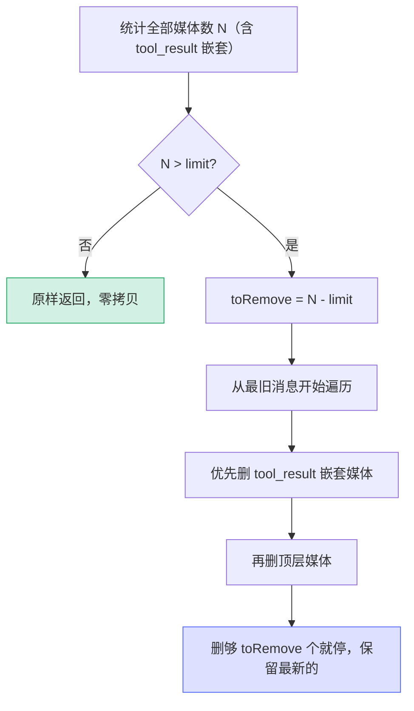

# [5] 周边 helper：LSP 延迟 / requestId 回溯 / 媒体裁剪

> 在两个入口和 `queryModel` 之间，`claude.ts` 还夹着三个不起眼但被频繁调用的 helper。它们都是**纯逻辑**（没有网络、没有副作用），但各自承担一个明确职责。本节一次讲清。

---

## 一、`shouldDeferLspTool` —— LSP 工具的延迟加载判定

```typescript
function shouldDeferLspTool(tool: Tool): boolean {
  if (!('isLsp' in tool) || !tool.isLsp) {
    return false
  }
  const status = getInitializationStatus()
  // pending 或 not-started 时延迟
  return status.status === 'pending' || status.status === 'not-started'
}
```

### 1.1 它解决什么

LSP（Language Server Protocol）工具依赖一个**异步初始化**的语言服务器。服务器还没起来时，把 LSP 工具完整塞进 API 请求是没意义的——模型可能调用一个此刻还不能工作的工具。于是这些工具先以 `defer_loading: true` 出现（延迟工具），等初始化完成再"转正"。

### 1.2 两道判断

| 判断 | 含义 |
|---|---|
| `!('isLsp' in tool) \|\| !tool.isLsp` | 不是 LSP 工具 → 不延迟（直接 `false`） |
| `status === 'pending' \|\| 'not-started'` | 是 LSP 工具且初始化**未完成** → 延迟 |

只有"是 LSP 工具"**且**"初始化还没好"两个条件同时成立才返回 `true`。一旦 LSP 初始化进入 `ready`（或其它已完成状态），这个函数对同一个工具就返回 `false`，工具随即作为常规工具进入请求。

> 它和 `queryModel` 的 `[4]search-tools` / `[8]system-prompt-and-cache-break` 一节配合：延迟工具不进 schema、从缓存检测哈希里排除，等就绪后再注入——既保护 prompt 缓存键稳定，又不让模型调用"半成品"工具。

---

## 二、`getPreviousRequestIdFromMessages` —— 反向找上一条 requestId

```typescript
function getPreviousRequestIdFromMessages(messages: Message[]): string | undefined {
  for (let i = messages.length - 1; i >= 0; i--) {
    const msg = messages[i]!
    if (msg.type === 'assistant' && msg.requestId) {
      return msg.requestId as string
    }
  }
  return undefined
}
```

### 2.1 用途：把连续请求串起来

每次 API 响应都带一个 `requestId`。把"上一次的 requestId"附到"这一次的请求"上，Anthropic 后端就能把同一会话的连续请求**关联**起来，用于：

- **缓存命中率分析**：连续请求共享前缀，关联后能算出缓存到底省了多少。
- **增量 token 跟踪**：每轮新增多少 token，需要知道"上一轮是谁"。

### 2.2 为什么从消息数组推导，而不是读全局 state

注释点明了设计动机——**从 `messages` 反向扫描，而不是从一个全局变量取**：

| 好处 | 解释 |
|---|---|
| 各查询链独立 | 主线程、子 agent、队友各自有自己的消息数组 → 各自追踪自己的请求链，互不串味 |
| 回滚/撤销自然生效 | 用户撤销几条消息后，数组变短，反向扫描自然找到"撤销后"的那条 requestId，无需手动维护全局值 |

> 全局可变状态在并发的多 agent 场景下极易串台。"从不可变的输入数组里现算"是更健壮的做法——**数据在哪，真相就在哪**。

---

## 三、`stripExcessMediaItems` —— 媒体项裁剪（先删最旧）

```typescript
export function stripExcessMediaItems(
  messages: (UserMessage | AssistantMessage)[],
  limit: number,
): (UserMessage | AssistantMessage)[] {
  // 1) 数一共有多少媒体项（图片 + 文档），含 tool_result 里嵌套的
  let toRemove = 0
  for (const msg of messages) { /* 累加 isMedia 命中 */ }
  toRemove -= limit
  if (toRemove <= 0) return messages          // 没超限：原样返回

  // 2) 从最旧开始删，删够 toRemove 个就停
  return messages.map(msg => { /* 优先删 tool_result 嵌套媒体，再删顶层媒体 */ })
}
```

### 3.1 解决什么

图片和文档在上下文里**特别占 token**。一段长对话如果塞了几十张截图，很容易把上下文撑爆。`stripExcessMediaItems` 给媒体项设一个上限 `limit`，超了就裁。

### 3.2 两个类型守卫

```typescript
function isMedia(block): block is BetaImageBlockParam | BetaRequestDocumentBlock {
  return block.type === 'image' || block.type === 'document'
}
function isToolResult(block): block is BetaToolResultBlockParam {
  return block.type === 'tool_result'
}
```

媒体不只出现在消息顶层，还会嵌在 `tool_result` 的 `content` 里（比如一个截图工具返回的图片）。所以计数和裁剪都要**下钻一层**到 tool_result 内部。

### 3.3 "先删最旧"的策略



裁剪**保留最新的媒体**——因为最近的截图/文档通常和当前任务最相关，最旧的往往已经聊过去了。`toRemove` 是个递减计数器，删够数量立即停手，不会误伤新媒体。

### 3.4 不可变与短路优化

- **没超限就原样返回**（`if (toRemove <= 0) return messages`）：绝大多数对话不会超限，这条早退避免任何拷贝。
- **`map` 里逐 block 判断**：只有真正需要删的 block 才重建对象（`{ ...block, content: filtered }`），其余 block 原样保留引用——尽量少制造新对象。
- 末尾用 `before === toRemove` 判断"这条消息有没有被改过"，没改过就返回原 `msg` 引用，进一步减少不必要的对象创建。

---

## 四、三个 helper 的共性

| helper | 输入 | 输出 | 副作用 | 关键设计 |
|---|---|---|---|---|
| `shouldDeferLspTool` | 单个 tool | bool | 无 | 两道与门，未就绪才延迟 |
| `getPreviousRequestIdFromMessages` | messages | requestId? | 无 | 从输入数组现算，不读全局 |
| `stripExcessMediaItems` | messages + limit | messages | 无 | 先删最旧、超限才动、尽量不拷贝 |

三者都是**纯函数**：给定输入必得相同输出，没有网络/IO/全局可变状态。这让它们好测、好复用，也是 `[3]` 的 VCR 测试能稳定的前提之一——纯逻辑天然确定性，不需要 mock。

---

## 五、关键行号书签

| 内容 | 位置 |
|---|---|
| `shouldDeferLspTool` | `claude.ts:1060` |
| `getPreviousRequestIdFromMessages` | `claude.ts:1205` |
| `isMedia` / `isToolResult` 类型守卫 | `claude.ts:1217-1227` |
| `stripExcessMediaItems` | `claude.ts:1233` |
| `lastAnnouncedDeferredTools`（模块级 Set，延迟工具注入去重） | `claude.ts:1301` |

---

## 速记口诀

- **`shouldDeferLspTool`**：是 LSP 工具 + 初始化未完成（pending/not-started）才延迟，否则不延迟。
- **`getPreviousRequestIdFromMessages`**：反向扫描找上一条 assistant 的 requestId，做缓存/增量关联；从消息数组现算，各查询链独立、回滚自然生效。
- **`stripExcessMediaItems`**：图片/文档超 `limit` 才裁，先删最旧、保留最新；下钻 tool_result 嵌套；不超限零拷贝。
- **三者皆纯函数**：无副作用、确定性，好测好复用。
