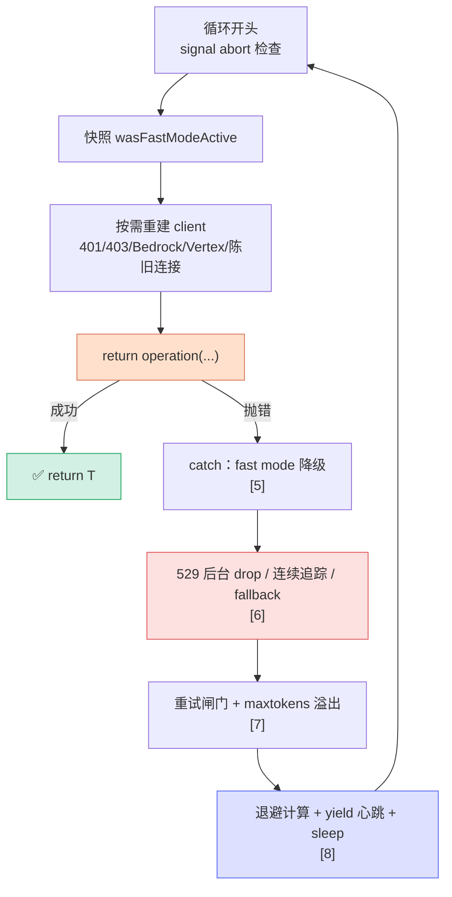

# [0] withRetry 方法总览

> `withRetry()` 是 `src/services/api/withRetry.ts` 里的核心生成器（约 **350 行**，`withRetry.ts:168-514`）。它不发请求、也不解析流——它**包住**「发一次请求」这个动作，专门回答三个问题：**失败了要不要重试？怎么退避？怎么在长等待里不让宿主把会话判 idle？**
>
> 本系列把整份文件按**代码自上而下的执行顺序**切成 11 个小节（`[0]`~`[10]`）：脚手架（常量 / 类型 / 错误类）→ 生成器主体（循环前置 → 单次尝试 → catch 各分支）→ 辅助函数（判定 / 延迟）。本文是**总索引 + 阶段地图**，先建立全局认知，再逐节深入。

---

## 一、它在调用链里的位置

`withRetry` 被 `queryModel`（见姊妹系列 `queryModel/[11]send-request`）直接包裹调用：把「发一次流式请求」打包成 `operation` 闭包传进来，由 `withRetry` 负责重试编排。

```
queryModel()                       ← claude.ts  组装请求体
        │  把"发一次请求"包成 operation 闭包
        ▼
withRetry(getClient, operation, options)   ← withRetry.ts:168  ★本系列主角
        │  循环里调用
        ▼
operation(client, attempt, context)        ← 真正 anthropic.beta.messages.create(...)
```

| 层 | 职责 | 文件 |
|---|---|---|
| `queryModel` | 构建请求体 + 流式解析 + 错误降级 | `claude.ts:1303` |
| **`withRetry`** | **重试编排 / 退避 / 认证刷新 / fallback / 心跳** | `withRetry.ts:168` |
| `operation` 闭包 | 真正发一次请求、收一次流 | 由 `queryModel` 传入 |

> 一句话定位：**`withRetry` = "把一次可能失败的请求变成一次最终成功（或明确放弃）的请求"的全过程**。它上面是「一次请求怎么发」，它自己管「失败了怎么办」。

---

## 二、方法签名拆解

```typescript
export async function* withRetry<T>(
  getClient: () => Promise<Anthropic>,          // 惰性建 / 重建 client（认证错误后换新）
  operation: (                                   // 真正发请求的闭包
    client: Anthropic,
    attempt: number,
    context: RetryContext,                        // 把降级状态（maxTokens/fastMode）回传给 operation
  ) => Promise<T>,
  options: RetryOptions,                          // model / fallbackModel / signal / querySource ...
): AsyncGenerator<SystemAPIErrorMessage, T>       // ← yield 错误/心跳消息，return 成功结果 T
```

### 2.1 为什么是 `async function*`（异步生成器）

返回 `AsyncGenerator<SystemAPIErrorMessage, T>` 而不是 `Promise<T>`，关键在于**重试等待期间也要对外"说话"**：

- 每次决定重试前，`yield` 一条 `SystemAPIErrorMessage`（"API 过载，{N} 毫秒后重试…"），UI 据此渲染倒计时。
- persistent（无人值守）模式下，长睡眠被切成 30 秒一块，**每块都 yield 一次心跳**——经 `QueryEngine` 输出到 stdout，让宿主环境看到活动、不把 session 判为 idle。
- 成功时用 `return operation(...)` 的结果作为生成器的**返回值** `T`，调用方 `for-await` 拿到。

> **类比**：`withRetry` 像快递柜的"取件机器人"——取件失败时它不是默默重试，而是每隔一会儿在屏幕上打一行"第 3 次尝试，请稍候"（yield），取到了才把包裹递出来（return）。

### 2.2 yield 与 return 的区别（关键）

| 通道 | 类型 | 含义 |
|---|---|---|
| **`yield`** | `SystemAPIErrorMessage` | "即将重试，等 N 毫秒" 的系统消息 / persistent 心跳 |
| **`return`** | `T` | `operation` 成功的结果（生成器正常结束） |
| **`throw`** | `CannotRetryError` / `FallbackTriggeredError` / `APIUserAbortError` | 放弃重试 / 触发模型降级 / 用户中止 |

---

## 三、⭐ for 循环 - 终止模型

`withRetry` 的骨架是一个**带上界的 for 循环**，每轮是一次「尝试」：

```typescript
for (let attempt = 1; attempt <= maxRetries + 1; attempt++) {
  if (options.signal?.aborted) throw new APIUserAbortError()
  try {
    // …（按需重建 client、刷新 token）
    return await operation(client, attempt, retryContext)   // ← happy path：成功即结束
  } catch (error) {
    // …（fast mode 降级 / 529 追踪 / 闸门 / 退避 / yield+sleep）
    // 要么 continue（调参后立即重试，不计退避）
    // 要么 throw（不可重试）
    // 要么走到末尾 await sleep → 自然进入下一轮
  }
}
throw new CannotRetryError(lastError, retryContext)          // ← 循环耗尽兜底
```

- **`maxRetries + 1`**：首次尝试不算"重试"，所以上界是 `maxRetries + 1`。
- **`continue` vs 落底 sleep**：`continue` 用于「已调整状态、应立刻再试」的场景（关 fast mode、调 `maxTokens`），**不走退避**；普通可重试错误走到 catch 末尾，`yield + sleep` 后由 for 自然进入下一轮。
- **persistent 模式**：把 `attempt` 夹在 `maxRetries`，让 for 循环**永不终止**，退避改用独立的 `persistentAttempt` 计数器。

---

## 四、三类退出

| 退出方式 | 触发条件 | 上层后果 |
|---|---|---|
| ✅ `return T` | `operation` 成功 | 正常拿到响应 |
| ❌ `throw CannotRetryError` | 重试耗尽 / 不可重试错误 / 后台 source 的 529 / external 重复 529 | `queryModel` 把它当作最终失败 |
| 🔀 `throw FallbackTriggeredError` | 连续 529 达 `MAX_529_RETRIES` 且配了 `fallbackModel` | 上抛给 `query.ts`，**切换到 fallback 模型重发** |

> **为什么 fallback 要用 throw 而非内部切换**：`withRetry` 只持有一个 `model`，模型切换涉及 thinking 签名、prompt 缓存键、消息历史等，必须回到更上层（`query.ts`）统一处理。`withRetry` 只负责"识别该降级了"并抛出信号。

---

## 五、贯穿全文的五条暗线

读 `withRetry` 时有五个反复出现的主题，理解它们能把 11 个小节串起来：

### 5.1 暗线 A：容量错误（429 / 529）

最核心的一条。429（限流）/ 529（过载）的处理散布在多节：**前台/后台 source 区分**（`[1]`）、**连续 529 追踪与模型 fallback**（`[6]`）、**退避计算**（`[8]`）、**`shouldRetry` 的订阅门槛**（`[10]`）、**persistent 豁免**（`[2]` `[7]`）。

### 5.2 暗线 B：认证刷新（401 / 403 / Bedrock / Vertex）

重试前若发现是认证问题，不能用同一个坏 client 重试——要**强制刷 token / 清缓存 / 换 client**：`handleOAuth401Error`、`clearAwsCredentialsCache`、`clearGcpCredentialsCache`、`getClient()` 重建（`[4]` `[10]`）。

### 5.3 暗线 C：Fast mode 降级

Fast mode 命中 429/529 时有两条路：**短 retry-after** → sleep 后用同模型名重试（保 prompt 缓存）；**长 retry-after** → 冷却切到标准速度模型。还有 API 直接拒绝 fast mode 参数的永久关闭路径（`[5]`）。

### 5.4 暗线 D：Persistent（无人值守）模式

`CLAUDE_CODE_UNATTENDED_RETRY`（仅 ant）：429/529 **无限重试** + 5 分钟封顶的指数退避 + 把长睡眠切成 30 秒块**周期 yield 心跳**防 idle。它会绕过订阅门槛、改变多个分支的行为（`[2]` `[7]` `[8]`）。

### 5.5 暗线 E：Prompt 缓存 / 状态副本

重试沿用**同一个模型名**（fast mode 短重试尤其强调），避免缓存键抖动；降级状态（`maxTokensOverride` / `fastMode`）写进 `retryContext` **就地传递**给下一次 `operation`（`[2]` `[7]`）。

---

## 六、⭐ 单次 attempt 阶段地图

把一次 `attempt` 的执行流画成地图，作为 `[3]`~`[8]` 的索引：



| 阶段 | 小节 | 行号 |
|---|---|---|
| 脚手架：常量 + 前台 529 白名单 | `[1]constants-sources` | 50-88 |
| 脚手架：persistent 配置 + 类型 + 错误类 | `[2]persistent-types` | 90-166 |
| 循环前置：签名 + 计数器 | `[3]loop-setup` | 168-187 |
| 单次尝试前半 + happy path | `[4]attempt-client` | 188-251 |
| catch：Fast mode 降级三分支 | `[5]fastmode-fallback` | 252-311 |
| 529 追踪与模型 fallback | `[6]529-fallback` | 313-362 |
| 重试闸门 + maxtokens 溢出 | `[7]retry-gate` | 364-424 |
| 退避计算 + 心跳 yield | `[8]delay-yield` | 426-514 |
| 辅助：延迟与判定函数 | `[9]retry-helpers` | 516-542, 591-614, 795-814 |
| 辅助：shouldRetry 全表 + 认证识别 | `[10]should-retry` | 544-589, 616-789 |

---

## 七、关键行号书签

| 内容 | 位置 |
|---|---|
| `withRetry` 函数定义 | `withRetry.ts:168` |
| `for` 循环（`attempt <= maxRetries+1`） | `withRetry.ts:187` |
| happy path `return operation(...)` | `withRetry.ts:251` |
| `catch` 入口 | `withRetry.ts:252` |
| Fast mode 429/529 降级 | `withRetry.ts:265` |
| 后台 529 drop | `withRetry.ts:315` |
| 连续 529 → `FallbackTriggeredError` | `withRetry.ts:332-348` |
| 重试耗尽闸门 | `withRetry.ts:367` |
| `shouldRetry` 闸门 | `withRetry.ts:376` |
| 退避 + yield + sleep | `withRetry.ts:458-509` |
| 循环耗尽末尾 throw | `withRetry.ts:513` |
| `shouldRetry` 函数 | `withRetry.ts:689` |
| `getRetryDelay`（指数退避） | `withRetry.ts:527` |

---

## 速记口诀

- **一句话**：withRetry = 把一次可能失败的请求，变成一次最终成功或明确放弃的请求。
- **两通道**：yield（重试倒计时 / 心跳）· return（成功结果 T）。
- **三退出**：return T · CannotRetryError（放弃）· FallbackTriggeredError（切模型）。
- **五暗线**：容量错误 · 认证刷新 · Fast mode 降级 · Persistent 无限重试 · 缓存/状态副本。
- **catch 五步**：fast mode → 529 → 闸门 → 退避 → yield+sleep。
