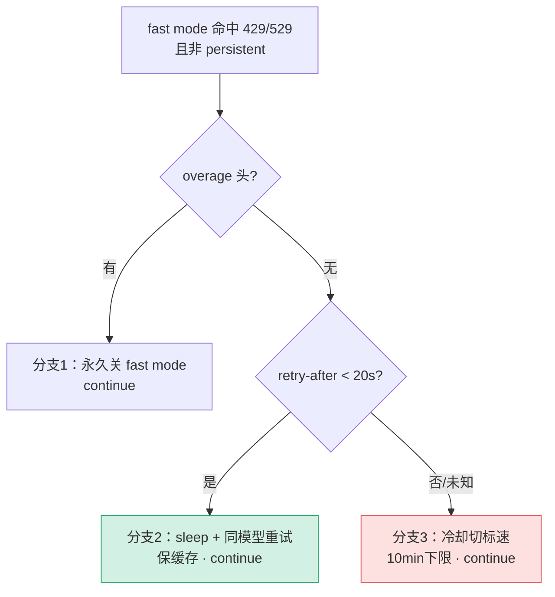

# [5] catch 入口与 Fast mode 降级三分支

> `operation` 抛错后进入 `catch`。本节是 catch 的**第一段**：先记错误、打日志，然后处理 **Fast mode 专属的降级逻辑**——这是暗线 C 的主战场（`withRetry.ts:252-311`）。

---

## 一、catch 入口

```typescript
} catch (error) {
  lastError = error
  logForDebugging(
    `API error (attempt ${attempt}/${maxRetries + 1}): ${
      error instanceof APIError ? `${error.status} ${error.message}` : errorMessage(error)
    }`,
    { level: 'error' },
  )
```

两件事：把 `error` 存进 `lastError`（供下一轮的 client 重建判断、循环耗尽兜底），再打一条 debug 日志（APIError 显示 `status + message`，其他显示通用错误消息）。

---

## 二、⭐ Fast mode 命中 429/529 的降级三分支

```typescript
if (
  wasFastModeActive &&
  !isPersistentRetryEnabled() &&
  error instanceof APIError &&
  (error.status === 429 || is529Error(error))
) {
  // … 三分支
}
```

进入条件：**这次请求是 fast mode 发的**（`wasFastModeActive`，见 `[4]` 的快照）+ **非 persistent** + 429/529。

> **为什么 persistent 跳过**（源码注释）：persistent 模式想要的是分块 keep-alive 路径（`[8]`），而不是 fast mode 的缓存保护。而且 fast mode 的短重试分支用 `continue` 会绕过 attempt 夹断逻辑，导致 for 循环提前终止——所以 persistent 必须跳过整个 fast mode 块。

### 分支 1：overage 不可用 → 永久关闭

```typescript
const overageReason = error.headers?.get('anthropic-ratelimit-unified-overage-disabled-reason')
if (overageReason !== null && overageReason !== undefined) {
  handleFastModeOverageRejection(overageReason)
  retryContext.fastMode = false
  continue
}
```

如果 429 明确是因为 **extra usage（overage）不可用**（响应头带原因），fast mode 没法继续——`handleFastModeOverageRejection` 永久禁用 + 写 `retryContext.fastMode = false` + `continue` 立即用标准速度重试。

### 分支 2：短 retry-after → 同模型 sleep 重试（保缓存）

```typescript
const retryAfterMs = getRetryAfterMs(error)
if (retryAfterMs !== null && retryAfterMs < SHORT_RETRY_THRESHOLD_MS) {
  // 短 retry-after：等待并在 fast mode 仍激活的情况下重试，
  // 以保留 prompt 缓存（重试时使用同一个模型名）。
  await sleep(retryAfterMs, options.signal, { abortError })
  continue
}
```

`SHORT_RETRY_THRESHOLD_MS = 20 秒`。retry-after 短（< 20s），值得等——**不切模型**，sleep 后用同一个 fast mode 模型名重试。

> **暗线 E（缓存）在这里**：fast mode 和标准速度是**不同模型名**，切换会让 prompt 缓存键变化、缓存失效。等待短就忍一下用同模型，保住缓存。

### 分支 3：长/未知 retry-after → 冷却切标准速度

```typescript
const cooldownMs = Math.max(
  retryAfterMs ?? DEFAULT_FAST_MODE_FALLBACK_HOLD_MS,
  MIN_COOLDOWN_MS,
)
const cooldownReason: CooldownReason = is529Error(error) ? 'overloaded' : 'rate_limit'
triggerFastModeCooldown(Date.now() + cooldownMs, cooldownReason)
if (isFastModeEnabled()) {
  retryContext.fastMode = false
}
continue
```

retry-after 长或未知：不值得用 fast mode 死等——进入**冷却**（切到标准速度模型）。

| 常量 | 值 | 作用 |
|---|---|---|
| `DEFAULT_FAST_MODE_FALLBACK_HOLD_MS` | 30 分钟 | retry-after 未知时的默认冷却时长 |
| `MIN_COOLDOWN_MS` | 10 分钟 | 冷却下限，防止来回切换抖动 |

`cooldownReason` 按 529（`overloaded`）/ 429（`rate_limit`）区分，供 fast mode 模块记录。`continue` 后下一轮就用标准速度模型。

---

## 三、分支 4：API 拒绝 fast mode 参数 → 永久关闭

```typescript
if (wasFastModeActive && isFastModeNotEnabledError(error)) {
  handleFastModeRejectedByAPI()
  retryContext.fastMode = false
  continue
}
```

与前三分支并列的第四种情况：API 返回 400 "Fast mode is not enabled"（例如 org 根本没启用 fast mode）。这不是容量问题，而是**配置问题**——`handleFastModeRejectedByAPI` 永久禁用，标准速度重试。

> `isFastModeNotEnabledError` 靠字符串匹配错误消息判断（见 `[9]`），源码标了 TODO：将来 API 加专用响应头后改用头判断，字符串匹配太脆。

---

## 四、三分支决策图



---

## 速记口诀

- **进入条件**：wasFastModeActive + 非 persistent + 429/529。
- **分支1 overage 不可用** → 永久关 fast mode。
- **分支2 短 retry-after(<20s)** → sleep + 同模型重试（保缓存）。
- **分支3 长/未知 retry-after** → 冷却切标速（下限 10min 防抖动）。
- **分支4 API 拒绝 fast mode 参数** → 永久关（配置问题，非容量）。
- **四分支都 continue**：不走退避，立即用调整后状态重试。
- **persistent 全跳过**：它要 keep-alive 分块路径，且短重试 continue 会破坏 attempt 夹断。
